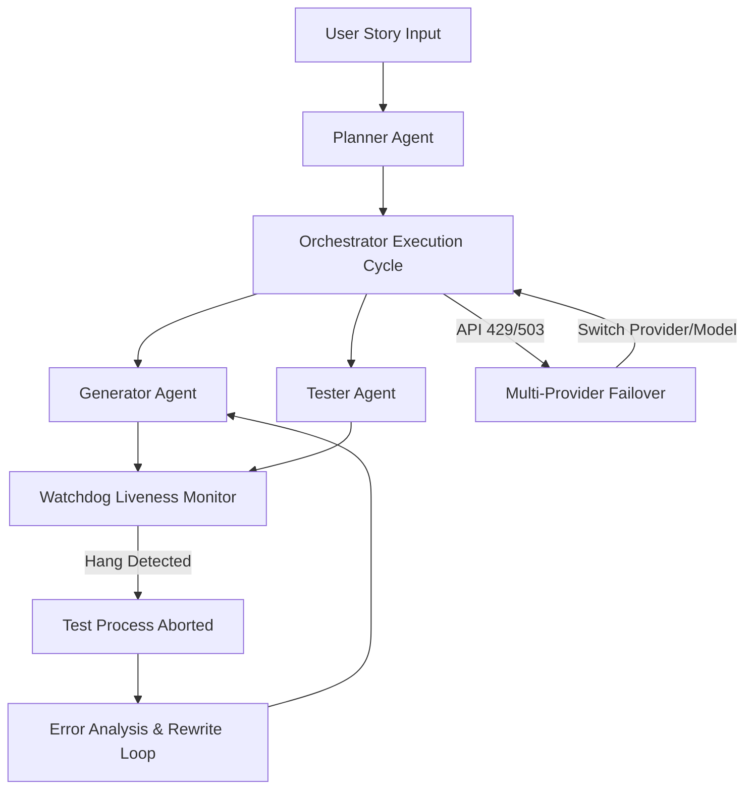

# Proposal: Path to Level 4 Autonomy for Noctifab

This proposal outlines the architectural changes, implementation details, and design specifications required to transition `noctifab` from a Level 2/3 interactive assistant to a **Level 4 Autonomous Software Factory (Dark Factory)**. 

---

## 1. Executive Summary

A Level 4 autonomous system operates completely hands-off. It must be capable of recovering from network failures, rate limits, infrastructure outages, and code bugs (like infinite test loops) without halting or requiring human intervention. 

During our attempt to implement **US-005 (Graceful Shutdown)**, `noctifab` faced two catastrophic failures that highlighted the limits of its current autonomy level:
1. **Infrastructure Block**: The orchestrator was completely paralyzed for an hour due to a Gemini API 429 quota exhaustion caused by a silent model upgrade.
2. **Execution Block**: The generated code introduced a classic concurrency bug (a `KeyboardInterrupt` raised inside a background thread did not propagate to the main loop). This caused the unit test runner to hang in an infinite loop, blocking the orchestrator validation step indefinitely.

This document proposes a multi-phased solution to transition `noctifab` past local process constraints:
* **The Orchestrator Infrastructure (Level 4)**: Resiliency upgrades for failover, liveness monitoring, and interactive control.
* **The Code Generation & Verification Layer (Level 4)**: Concurrency prompts, smoke-testing, and automated recovery from hung test runs.
* **Self-Sustaining & Self-Evolving Engine (Level 5)**: Environmental self-healing, closed-loop telemetry feedback, flaky test stabilization, security gates, and metaprogramming-driven self-evolution.



---

## 2. Part I: Resilient Orchestrator Infrastructure

To survive network errors and API limitations, the `noctifab` daemon must transition from a rigid sequence of HTTP requests to a state machine capable of failover and live interruption.

### A. Multi-Provider Failover & Quota Budgeting
Currently, `noctifab` is hardcoded to a single provider and model. If that model returns a 429 or 503, the daemon halts.

#### Proposal
Introduce a **model fallback chain** configured in `.noctifab/config.yaml` that spans different providers (Google, OpenAI, Anthropic) and keeps track of a local daily token/cost budget.

```yaml
# Proposed config.yaml LLM Resiliency Schema
llm:
  provider: gemini
  model: gemini-3.5-flash
  budget:
    max_daily_usd: 10.00
    track_usage: true
  failover:
    enabled: true
    backends:
      - provider: gemini
        model: gemini-2.5-flash
      - provider: anthropic
        model: claude-3-5-haiku-latest
      - provider: openai
        model: gpt-4o-mini
```

#### Implementation in Go (`pkg/infrastructure/llm/failover_client.go`)
Refactor the client `Complete` call to automatically catch transient errors (429, 503, 500) and step down the backend chain:

```go
type FailoverClient struct {
    backends []BackendConfig
    db       BudgetTracker
}

func (fc *FailoverClient) Complete(ctx context.Context, prompt string) (*domain.LLMResponse, error) {
    for _, backend := range fc.backends {
        if fc.db.IsBudgetExceeded(backend.Provider) {
            continue
        }
        
        client := fc.getClientFor(backend)
        resp, err := client.Call(ctx, backend.Model, prompt)
        if err == nil {
            fc.db.RecordUsage(backend.Provider, resp.TokenUsage)
            return resp, nil
        }
        
        var httpErr *httpError
        if errors.As(err, &httpErr) {
            if httpErr.StatusCode == 429 || httpErr.StatusCode == 503 {
                log.Warnf("Backend %s/%s failed with HTTP %d. Falling back...", backend.Provider, backend.Model, httpErr.StatusCode)
                continue
            }
        }
        return nil, err // Return immediate error for code syntax/fatal failures
    }
    return nil, fmt.Errorf("all LLM backends exhausted or daily budget exceeded")
}
```

---

### B. Watchdog Liveness Monitor (Hang & Loop Detection)
When a verification test enters an infinite loop, the orchestrator hangs forever because it executes `exec.CommandContext` without a strict timeout, or has a timeout that is too long (causing huge delays).

#### Proposal
Implement an active **Watchdog Liveness Monitor** for all subprocess executions (such as running tests or compiling). The Watchdog monitors:
1. **Wall-clock time limits** (e.g., maximum 30 seconds for test runs).
2. **Stdout/Stderr idle timeouts** (if no output is generated for 10 seconds, assume a deadlock/hang).
3. **Resource exhaustion** (if memory or CPU spikes uncontrollably).

#### Implementation in Go (`pkg/infrastructure/sandbox/watchdog.go`)
```go
type Watchdog struct {
    MaxDuration time.Duration
    IdleTimeout time.Duration
}

func (w *Watchdog) RunCommand(ctx context.Context, cmd *exec.Cmd) ([]byte, error) {
    var output bytes.Buffer
    cmd.Stdout = io.MultiWriter(cmd.Stdout, &output)
    cmd.Stderr = io.MultiWriter(cmd.Stderr, &output)
    
    // Set up process group to allow killing all child processes (threads/subprocesses)
    cmd.SysProcAttr = &syscall.SysProcAttr{Setpgid: true}

    if err := cmd.Start(); err != nil {
        return nil, err
    }

    done := make(chan error, 1)
    go func() {
        done <- cmd.Wait()
    }()

    timer := time.NewTimer(w.MaxDuration)
    defer timer.Stop()

    for {
        select {
        case err := <-done:
            return output.Bytes(), err
        case <-timer.C:
            // Force kill process group on timeout
            _ = syscall.Kill(-cmd.Process.Pid, syscall.SIGKILL)
            return output.Bytes(), fmt.Errorf("command execution timed out after %s", w.MaxDuration)
        case <-ctx.Done():
            _ = syscall.Kill(-cmd.Process.Pid, syscall.SIGKILL)
            return output.Bytes(), ctx.Err()
        }
    }
}
```

---

### C. Non-Blocking Command Channel Polling during Backoff Sleeps
When an LLM client falls back to sleeping (e.g., because all backends are rate-limited), the daemon must remain active and responsive to command-line interventions.

#### Proposal
Replace blocking `time.Sleep` calls with a select-based wait that polls the command channel (`command_channel.go`).

```go
func (d *Daemon) SleepWithInterrupt(duration time.Duration) error {
    timer := time.NewTimer(duration)
    defer timer.Stop()

    for {
        select {
        case <-timer.C:
            return nil
        case cmd := <-d.cmdChan:
            if cmd.Type == "abort" {
                return ErrStoryCanceled
            }
            if cmd.Type == "switch-model" {
                d.UpdateActiveModel(cmd.Payload)
                return ErrModelSwitched
            }
        case <-d.ctx.Done():
            return d.ctx.Err()
        }
    }
}
```

---

## 3. Part II: Robust Code Generation & Verification Layer

To prevent the LLM from generating code that passes basic unit tests but deadlocks or leaks resources at runtime, we must enhance the prompt instructions and the testing validation boundaries.

### A. Strict Concurrency Patterns in Generator Prompts
When agents spawn background threads or executors, they frequently forget how Python handles signal interrupts and thread boundaries.

#### Proposal
Add strict prompt invariants (in `pkg/infrastructure/llm/client.go`) that instruct the LLM on how to safely implement threads and background tasks:

> [!IMPORTANT]
> **CONCURRENCY & THREADING INVARIANTS**:
> 1. If executing a task function inside a background thread, you **must** capture any raised exceptions (including `BaseException` classes like `KeyboardInterrupt` or `SystemExit`) and propagate them back to the main thread:
>    ```python
>    exc_info = []
>    def run_thread():
>        try:
>            task()
>        except BaseException as e:
>            exc_info.append(e)
>    ```
> 2. The main loop **must** join or check the thread status frequently (e.g., in a loop with a small timeout `t.join(0.1)`) and check if an exception was captured. If so, immediately re-raise it in the main thread to terminate the main loop:
>    ```python
>    if exc_info:
>        raise exc_info[0]
>    ```
> 3. Ensure all background threads are set to daemon threads (`t.daemon = True`) before calling `t.start()`, so that they do not prevent the process from terminating in the event of an abrupt shutdown or test exit.

---

### B. Automated Self-Correction for Hanging Test Suites
If the Watchdog Liveness Monitor aborts a test run because of a hang, a Level 4 agent must not simply mark the task as failed. It must attempt to diagnose and resolve the hang.

#### Proposal
When a task fails with a `command execution timed out` error:
1. Capture the exact line of code that was executing or the last output generated before the timeout.
2. Formulate a diagnostic prompt highlighting the hang:
   
   ```
   The test suite hung and was forcefully terminated after 30 seconds.
   This usually indicates an infinite loop, an unjoined non-daemon thread, 
   or a blocking operation (like wait() or sleep()) that is never unblocked.
   
   Last stdout output before timeout:
   [Thread-14 (run_task): KeyboardInterrupt raised but thread did not propagate]
   
   Review your implementation in frontpunch/worker.py. Ensure all spawned 
   threads are daemonized, exceptions are propagated, and blocking calls 
   have reasonable timeouts.
   ```
3. Pass this back to the Generator Agent to trigger a rewrite.

---

## 4. Part III: Level 5 - Self-Sustaining & Self-Evolving Software Factory

To achieve the ultimate level of autonomy (Level 5), `noctifab` must survive environment drift, verify its own work in staging/canary deployments, eliminate flaky tests, automatically patch security flaws, and have the ability to evolve its own implementation.

### A. Self-Healing Environment & Dynamic Dependency Resolution
Currently, if the host or sandbox environment lacks a dependency (e.g. `go`, `cargo`, `pytest`), the task fails, requiring a human to repair the dependencies on the server.
* **Proposal**: The orchestrator intercepts stdout/stderr error signatures (such as `executable file not found` or package import failures). It dispatches a specialized bootstrap manager to securely install the missing toolchains or runtime libraries under defined sandbox permissions.

### B. Production Deployment & Closed-Loop Telemetry Analysis
Local test verification (unit/integration) is insufficient to guarantee live correctness.
* **Proposal**: Upon passing local test validation, the orchestrator deploys the branch to a staging/canary container. It triggers a suite of synthetic transactions while monitoring live telemetry (e.g. Prometheus metrics, OpenTelemetry logs, and Sentry error tracking). If any anomaly or error spike occurs within a 5-minute window, it triggers an automated rollback, extracts the logs, and feeds them back to the Generator Agent for repair.

### C. Flaky Test Elimination & Auto-Stabilization
Flaky tests are a classic bottleneck in automated software factories.
* **Proposal**: If the 3x Test Validator consensus detects inconsistent results (e.g. 2 passes, 1 failure), it enters isolation mode. It runs the test suite under race detection and resource constraints (`go test -race`). The Generator Agent is tasked with refactoring the code to replace brittle operations (like `time.Sleep`) with deterministic polling or mock interfaces, ensuring 100% deterministic test execution.

### D. Self-Evolution & Bootstrap (Metaprogramming)
A Level 5 agent must be capable of patching its own orchestration engine.
* **Proposal**: When a bug or feature request for `noctifab` itself is scheduled, the orchestrator sets up an isolated workspace, compiles the updated Go binary, runs the complete integration suite, and performs a graceful stateful hot-reload (handing over the active task database to the new binary) before terminating the old process.

### E. Autogenous Security & Vulnerability Auditing
To prevent security leaks in a fully hands-off pipeline:
* **Proposal**: The validator integrates SAST scanners (`gosec`, `bandit`, `cargo audit`) into the execution pipeline. If vulnerabilities or insecure transitive dependencies are found, the merge is blocked, and the Generator Agent is dispatched with the security report to rewrite the code or upgrade the dependency.

### F. Zero-Clarification Intent Disambiguation
Rather than pausing execution when a specification has minor ambiguities:
* **Proposal**: The engine analyzes the Git history, previous issues, and surrounding code symbols to determine the most probable implementation path. It logs the design choice in the task state and proceeds. Operator interaction is reserved exclusively as a last resort for high-risk structural decisions.

---

## 5. Implementation Roadmap

```
Phase 1: Resilience    [Failover, Budgeting, Command Interruption]
Phase 2: Liveness      [Watchdog Process Monitor, Idle Output Timeouts]
Phase 3: Prompt Guard  [Concurrency Constraints, Thread safety templates]
Phase 4: Self-Repair   [Hang analysis, Auto-diagnose and Rewrite Loops]
Phase 5: Self-Healing  [Environment repair, APM monitoring, Canary validation]
Phase 6: Self-Evolution [Self-patching compiler loop, Hot-reloading daemon, SAST]
```

- **Phase 1 (Resilience)**: Focuses on network and API boundaries. Replaces the hardcoded `normalizeModel` with a dynamic failover chain and interruptible sleeps.
- **Phase 2 (Liveness)**: Connects the Watchdog to sandbox executions. Ensures hanging test suites are terminated within 30 seconds rather than blocking the developer indefinitely.
- **Phase 3 (Prompt Guard)**: Systematically upgrades prompt instructions to address python concurrency edge cases.
- **Phase 4 (Self-Repair)**: Connects hang events back to the LLM as structured error feedback, enabling the agent to auto-repair deadlocks and race conditions.
- **Phase 5 (Self-Healing & Telemetry)**: Connects environment repair tools and staging APM monitoring feedback loops to automatically repair environment failures and production regressions.
- **Phase 6 (Self-Evolution & Security Audits)**: Implements the self-compiling hot-reload loop for the `noctifab` binary itself and integrates automated security validation gates.
