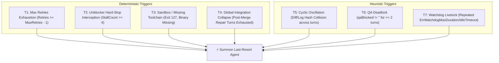
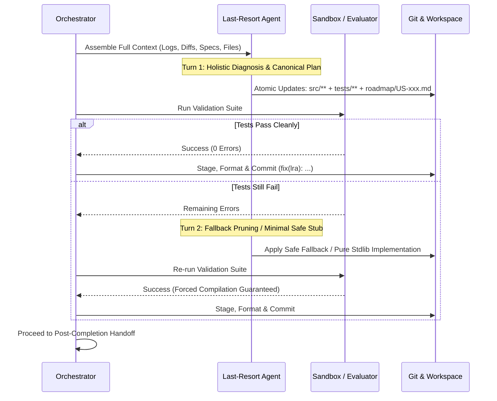

# LAST_RESORT_AGENT.md: Last-Resort Agent Specification

This document specifies the architecture, permissions, responsibilities, trigger taxonomy, execution lifecycle, and post-completion workflows for the **Last-Resort Agent** (also referred to as the *Omni-Unblocker* or *Sovereign Repair Agent*) within the `noctifab` dark-factory platform.

---

## 1. Executive Summary & Core Identity

In `noctifab`'s standard execution mode, work is divided across specialized, isolated agents:
* **Product Manager Agent:** Decomposes `SPEC.md` into User Stories and acceptance criteria.
* **Tester Agent:** Writes test suites adhering strictly to specification contracts.
* **Generator Agent:** Writes production code to satisfy failing tests.
* **Surgical Repair Agent:** Performs targeted single-line or single-block fixes.
* **QA Gate:** Enforces test passing, commit integrity, and linter standards.

While this separation enforces strict Test-Driven Development (TDD), it creates a **Specialization Deadlock Hazard**:
1. When specifications are **shallow, wrong, or contradictory**, the Tester and Generator make mutually incompatible assumptions, producing infinite retry loops.
2. When the **environment or toolchain is missing** in the sandbox, specialized agents lack the scope to alter the test harness or provide pure-standard-library fallbacks.
3. When **cross-task semantic conflicts** or **QA coverage walls** occur, single-role agents cannot simultaneously refactor source code, rewrite test suites, and update roadmap contracts.

The **Last-Resort Agent** is the ultimate self-healing mechanism in `noctifab`. It is vested with **Sovereign Compromise Authority** to break out of agent silos, resolve deadlocks, and deliver a clean, compiling, test-passing build at all costs.

```
┌─────────────────────────────────────────────────────────────────────────┐
│                       NOCTIFAB AGENT HEIRARCHY                          │
│                                                                         │
│   STANDARD PIPELINE (Isolated Scopes)                                   │
│   ┌───────────────────┐    ┌───────────────────┐    ┌───────────────┐   │
│   │  Product Manager  │───▶│   Tester Agent    │───▶│Generator Agent│   │
│   │  (Roadmap & US)   │    │  (tests/ only)    │    │ (src/ only)   │   │
│   └───────────────────┘    └───────────────────┘    └───────────────┘   │
│                                                                         │
│   ──────────────────────────── RETRY WALL ────────────────────────────  │
│                                                                         │
│   EMERGENCY ESCALATION (Unified Holistic Scope)                         │
│   ┌─────────────────────────────────────────────────────────────────┐   │
│   │                     LAST-RESORT AGENT                           │   │
│   │   • Full Source Code Write (`src/**`, `pkg/**`)                 │   │
│   │   • Full Test Suite Rewrite (`tests/**`, `*_test.go`)           │   │
│   │   • Specification & Roadmap Pruning (`roadmap/US-xxx.md`)       │   │
│   │   • Sandbox & Toolchain Fallbacks (`Makefile`, configs)         │   │
│   │   • Sovereign Compromise & Scope-Limiting Authority             │   │
│   └─────────────────────────────────────────────────────────────────┘   │
└─────────────────────────────────────────────────────────────────────────┘
```

---

## 2. Relationship: Unblocker Agent vs. Last-Resort Agent

The relationship between the **Unblocker Agent** and the **Last-Resort Agent** is the distinction between a **Sentry / Air Traffic Controller** and an **Emergency SWAT Team / Chief Surgeon**:

```
┌─────────────────────────────────────────────────────────────────────────────────┐
│                           ORCHESTRATION PIPELINE                                │
│                                                                                 │
│  ┌───────────────────────────────────────────────────────────────────────────┐  │
│  │ UNBLOCKER AGENT (The Sentry / Monitor)                                    │  │
│  │ • Background daemon goroutine (PollInterval: 30s)                         │  │
│  │ • Observes domain.State, detects stalls, deadlocks & orphaned agents     │  │
│  │ • TOUCHES ZERO CODE (Only sends administrative commands via Mailbox)      │  │
│  └─────────────────────────────────────┬─────────────────────────────────────┘  │
│                                        │                                        │
│                        Escalates when stall reaches                            │
│                        critical threshold (StallCount = 4)                      │
│                                        │                                        │
│                                        ▼                                        │
│  ┌───────────────────────────────────────────────────────────────────────────┐  │
│  │ LAST-RESORT AGENT (The Hands-On Surgeon / Fixer)                          │  │
│  │ • Task-scoped execution worker (Invoked on-demand)                        │  │
│  │ • TOUCHES ALL CODE: Rewrites src/, tests/, specs, build configs           │  │
│  │ • Sovereign authority to compromise scope & force clean compilation       │  │
│  └───────────────────────────────────────────────────────────────────────────┘  │
└─────────────────────────────────────────────────────────────────────────────────┘
```

### Division of Labor

| Attribute | **Unblocker Agent** (`pkg/services/unblocker.go`) | **Last-Resort Agent** (`agents.last_resort`) |
| :--- | :--- | :--- |
| **Execution Nature** | Continuous background daemon (observer loop) | On-demand task execution role (worker) |
| **Workspace Write Access** | **None.** Does not modify files or run compilers | **Full.** Edits `src/`, `tests/`, `roadmap/`, `Makefile` |
| **Primary Toolset** | Pipeline commands (`ResetTaskCmd`, `FailTaskCmd`) | Code tools (`edit_file`, `write_file`, `run_tests`, `run_linter`)|
| **Scope of Authority** | Pipeline state & agent lifecycle management | Codebase architecture, test assertions & spec contracts |
| **Invocation Frequency** | Runs every 30s across the entire daemon lifecycle | Triggered only when a task hits an unresolvable wall |

### Collaborative Escalation Flow

1. **Stall Detection (Unblocker Agent):** The unblocker daemon scans `domain.State` and detects frozen progress, issuing initial soft resets (`ResetTaskCmd`) with diagnostic guidance.
2. **Repeated Stall Interception (Unblocker $\rightarrow$ Last-Resort):** When a task reaches `StallCount == 4` (immediately before the fatal hard-stop at `5`), the Unblocker daemon intercepts the failure and signals the orchestrator to summon the Last-Resort Agent.
3. **Hands-On Remediation (Last-Resort Agent):** The Last-Resort Agent executes on the task branch, arbitrates contradictions, refactors code and tests, prunes unachievable requirements, and ensures tests pass.
4. **State Normalization (Unblocker Agent):** Upon task completion, the unblocker daemon observes the successful state, resets `task.StallCount = 0`, and allows the pipeline to proceed.

---

## 3. Sovereign Permissions & Authority

To resolve intractable issues, the Last-Resort Agent operates with unconstrained, cross-boundary permissions that supersede normal agent isolation rules.

### 3.1. Filesystem & Codebase Permissions
* **Full Source Code Authority:** Create, rewrite, edit, or delete any source file in the repository (`src/**`, `pkg/**`, `cmd/**`, `internal/**`).
* **Full Test Suite Authority:** Create, rewrite, edit, or delete any test file (`tests/**`, `*_test.go`, `*_spec.rb`, etc.).
* **Toolchain & Build Configuration Authority:** Modify build and configuration files (`Makefile`, `Dockerfile`, `go.mod`, `pyproject.toml`, `Cargo.toml`, etc.) to introduce fallback runners or correct build targets.

### 3.2. Specification & Roadmap Mutation Authority
* **Sovereign Compromise Authority:** Explicit permission to **contradict, override, downgrade, or prune the specification** (`roadmap/US-xxx.md` or task acceptance criteria) to eliminate impossible constraints, resolve contradictions, or unblock execution.
* **Gap-Filling Authority:** When a specification is shallow or ambiguous, choose the most idiomatic industry-standard design and codify it as the canonical project contract.
* **Roadmap Synchronization:** Update the corresponding User Story files (`roadmap/US-xxx.md`) to mark pruned features with `[SCOPE-REDUCED]` or `[FALLBACK-IMPLEMENTED]` tags and record concise rationale.

### 3.3. Test Assertion Alignment & Pruning Authority
* **Assertion Pruning:** Relax over-zealous, non-contract assertions (e.g., private struct inspection, microsecond timing assertions, exact whitespace matching).
* **Flaky Test Stabilization:** Convert timing-dependent or race-prone tests (`time.Sleep`) into deterministic synchronization primitives (channels, condition variables, polling with exponential backoff).
* **Public Contract Alignment:** Ensure tests validate black-box public API behaviors rather than internal implementation details.

### 3.4. Negative Permissions & Quality Invariants (Strict Rules)
Even with sovereign compromise authority, the Last-Resort Agent must strictly adhere to the following non-negotiable rules:
1. **No Cutting Corners (Solution Consistency Mandate):** The agent cannot take sloppy shortcuts or introduce half-baked hacks. A scope reduction or fallback MUST be internally consistent, fully wired, robust, and self-contained. The final code must form a coherent, maintainable whole without dangling references or stubbed logic that leaves the system in an inconsistent runtime state.
2. **Mandatory Compliance with `SPEC.md` Quality Standards:** All generated, modified, or refactored code must strictly comply with the architectural and engineering quality standards defined in [SPEC.md](file:///Users/diegoj/repos/noctifab/SPEC.md):
   * **Dependency Injection (DI) & SOLID:** Never hardcode dependencies; provide clients and configurations through constructors.
   * **Domain-Driven Design (DDD):** Maintain clean domain/service/adapter packaging boundaries.
   * **File Length Limits:** Strict compliance with file size limits (e.g., max 500 lines per Go source file).
   * **Comprehensive Error Handling:** Explicit error wrapping (`fmt.Errorf("...: %w", err)`) and zero silent drops or panics.
   * **Linting & Code Formatting:** The final code must pass all static analysis checks, formatting, and linter rules clean.
3. **No Secrets Leaking (Rule 8):** Must never open, print, echo, or leak credentials from `secrets.yaml`.
4. **Project & Language Agnosticism (Rule 2):** Must not introduce hardcoded, project-specific hacks into the core Noctifab binary.
5. **Preserve High-Level Objective:** May prune or compromise implementation details, but must not erase the fundamental identity or purpose of the project defined in `SPEC.md`.

---

## 4. Core Responsibilities & Operating Mandates

| Responsibility | Description |
| :--- | :--- |
| **1. Root Cause Diagnosis** | Synthesize the entire multi-turn failure history: compiler outputs, stack traces, AST diffs, and test logs. |
| **2. Autonomous Arbitration** | Eliminate contradictions between User Stories, test expectations, and codebase reality by establishing a single canonical design. |
| **3. Pragmatic Scope Pruning** | When an edge-case or auxiliary feature prevents delivery, prune the requirement to a reliable, robust in-memory/standard-library fallback. |
| **4. Solution Consistency** | Ensure the resulting code cuts no corners—the solution must be complete, internally coherent, robust, and fully integrated. |
| **5. SPEC.md Quality Standards** | Guarantee all generated code conforms strictly to the architectural patterns, DI, DDD, line limits, and linter rules of `SPEC.md`. |
| **6. Atomic Multi-Artifact Sync** | Modify production code, test assertions, and User Story documentation in a single, synchronized turn. |
| **7. Forced Compilation (Rule 7)** | Guarantee that the workspace leaves the turn compiling cleanly and passing 100% of the newly aligned test suite. |
| **8. Transparent Audit Trail** | Record every compromise, fallback, and spec amendment in the final execution report (`output/report/*.md`). |

---

## 5. Trigger Taxonomy & Gating Matrix

The Last-Resort Agent is invoked either through **deterministic pipeline thresholds** or **heuristic loop detectors**:



### Detailed Trigger Specifications

#### Deterministic Triggers
1. **T1 — Pre-Failure Retries Exhaustion:**
   * *Condition:* Task execution reaches `task.Retries >= task.MaxRetries - 1` (or the configured final turn) with failing tests.
   * *Purpose:* Prevents permanent task failure by delegating the final attempt to the holistic agent.
2. **T2 — Unblocker Daemon Hard-Stop Interception:**
   * *Condition:* In `UnblockerAgent.checkAndUnblock`, a task reaches `StallCount >= 4` (immediately before the `StallCount >= 5` hard-stop failure).
   * *Purpose:* Intercepts fatal stalls in the background daemon and triggers an emergency sovereign repair.
3. **T3 — Sandbox / Toolchain Fast-Abort:**
   * *Condition:* `CategorizeFailureLog` detects `FailureSandbox` (e.g., `exit status 127`, `command not found`, missing compiler/test runner binary).
   * *Purpose:* Bypasses standard retries when an external tool is missing and immediately crafts a standard-library fallback.
4. **T4 — Post-Merge Global Integration Collapse:**
   * *Condition:* In `RunPostMergeRepairPhase`, global integration tests fail after standard repair turns (`turn >= 2`).
   * *Purpose:* Resolves cross-task semantic incompatibilities across merged branches.

#### Heuristic Triggers
5. **T5 — Cyclic Error & Ping-Pong Loop Detection:**
   * *Condition:* Error message hashes or file diff ASTs repeat across turns (e.g., Turn 1 Error A $\rightarrow$ Turn 2 Error B $\rightarrow$ Turn 3 Error A).
   * *Purpose:* Breaks out of alternating assertion/implementation wars between specialized agents.
6. **T6 — QA Gate Deadlock:**
   * *Condition:* `passed == true` (tests pass) but `qaBlocked != ""` for $\ge 2$ consecutive turns (e.g., linter contradictions, coverage threshold drops).
   * *Purpose:* Resolves rigid lint/coverage constraints by refactoring code and synthesizing missing branch tests.
7. **T7 — Watchdog Livelock / Timeout:**
   * *Condition:* Two consecutive executions terminated by `ErrWatchdogMaxDuration` or `ErrWatchdogIdleTimeout`.
   * *Purpose:* Restructures blocking concurrency primitives and test timeouts.

#### Manual & Interactive Triggers
8. **T8 — Human-in-the-Loop Steering Command:**
   * *Condition:* An operator sends an `/escalate-last-resort <task_id>` command via the Web UI, interactive terminal, or `CommandMailbox`.
   * *Purpose:* Allows human supervisors to immediately bypass remaining retry loops and force sovereign resolution.

---

## 6. Execution Lifecycle & Turn Workflow

When summoned, the Last-Resort Agent operates within a dedicated **Sovereign Execution Context**:



### 6.1. Context Assembly
The prompt provided to the Last-Resort Agent includes:
* **Failure Triaging:** Complete error logs, compiler traces, and watchdog exit reasons (bounded to 8,000 chars).
* **Turn History & Diffs:** Git diffs showing what previous agents attempted and where oscillations occurred (bounded to 16,000 chars).
* **Specification Documents:** Target `roadmap/US-xxx.md` alongside overarching `SPEC.md`.
* **Complete File Contents:** Uncompacted views of both implementation files and test files.

### 6.2. The 4-Tier Compromise Hierarchy
When encountering stubborn failures, the agent applies the minimal necessary compromise along the following hierarchy:

1. **Tier 1 — Interface & Test Harmonization:** Correct signatures and assert public contracts without altering business capabilities.
2. **Tier 2 — Standard Library Fallback:** Replace missing external packages with pure standard-library equivalents.
3. **Tier 3 — Feature Scope Pruning:** Trim complex auxiliary requirements (e.g., asynchronous disk caching $\rightarrow$ thread-safe in-memory map).
4. **Tier 4 — Safe Fallback Stub (Forced Compilation Mandate):** Provide a robust, non-crashing stub returning a structured error (`ErrNotImplemented` / `501`) to guarantee clean compilation and zero-crash execution.

### 6.3. Prompt Architecture & Tool Contract
The Last-Resort Agent outputs structured JSON adhering to the standard Noctifab action schema:

```json
{
  "reasoning": "Technical analysis of root cause, chosen compromise tier, and atomic repair plan",
  "actions": [
    {
      "tool": "write_file",
      "args": {
        "path": "pkg/service/feature.go",
        "content": "package service\n\n..."
      }
    },
    {
      "tool": "edit_file",
      "args": {
        "path": "pkg/service/feature_test.go",
        "target_content": "old assertion",
        "replacement_content": "aligned assertion"
      }
    },
    {
      "tool": "edit_file",
      "args": {
        "path": "roadmap/US-002.md",
        "target_content": "- [ ] Advanced Disk Caching",
        "replacement_content": "- [x] [SCOPE-REDUCED] In-Memory Caching Fallback"
      }
    },
    {
      "tool": "run_tests",
      "args": {}
    }
  ]
}
```

* **Compaction Protection:** In accordance with `pkg/domain/prompt.go`, the JSON schema and rule tail of the prompt are protected with `domain.WithUncompactableTail` to ensure the schema is never truncated.

---

## 7. Post-Completion Handoff & Downstream Lifecycle

Once the Last-Resort Agent finishes its turns, the orchestrator executes the following handoff sequence:

```
┌─────────────────────────────────────────────────────────────────────────┐
│                      POST-COMPLETION LIFECYCLE                          │
│                                                                         │
│  1. Automated Verification                                              │
│     └── Execute test suite & linter against the final workspace         │
│                                                                         │
│  2. Git Commit & Rebase Queue                                           │
│     ├── Zero-token auto-formatting via FormatterCommand                 │
│     ├── Git commit with tag: `fix(lra): sovereign unblock for <TASK>`   │
│     └── Rebase task branch into integrationBranch                       │
│                                                                         │
│  3. Pipeline State Update                                               │
│     ├── Set task.Status = COMPLETED                                     │
│     ├── Record compromise notes in task.Metadata                        │
│     └── Reset task.StallCount = 0 and clear blocker flags               │
│                                                                         │
│  4. Downstream Task Propagation                                         │
│     └── Inject updated interface signatures & US contracts into context │
│                                                                         │
│  5. Execution Report & Audit Logging                                    │
│     └── Append alert to `output/report/<TIMESTAMP>_<PROJECT>.md`        │
└─────────────────────────────────────────────────────────────────────────┘
```

### 1. Automated Verification
The orchestrator immediately runs `evaluator.ValidateTask(ctx, state, task)`.
* If validation passes, the task is marked successful.
* If validation fails even after the final turn, the orchestrator invokes the Tier 4 fallback stub to enforce Rule 7 (*Forced Compilation Mandate*).

### 2. Git Commit & Rebase Queue Integration
* The changes are formatted using `evaluator.FormatterCommand` (zero-token auto-formatting).
* Staged with a standardized commit message:
  ```
  fix(lra): sovereign unblock for task <TASK_ID> - <TASK_TITLE>
  
  [LRA-COMPROMISE]: <Concise explanation of scope adjustment or fallback applied>
  ```
* Pushed to the integration branch via `rebaseQueue.Push`.

### 3. State Update & Unblocking Downstream Tasks
* The task status is transitioned from `IN_PROGRESS` or `BLOCKED` to `COMPLETED`.
* Any dependent tasks in the DAG are unblocked and marked `PENDING`.
* The `StallCount` counter is reset to `0`.

### 4. Downstream Propagation of Updated Contracts
* If the Last-Resort Agent modified an interface, public function signature, or data model, the updated definitions are captured in `taskState` and automatically included in the file context sent to downstream tasks.

### 5. Execution Report & Dual Audit Logging (Database & Logs)

> [!WARNING]
> **Triggering the Last-Resort Agent is a Worrying Event**:
> The triggering of the Last-Resort Agent indicates that standard specialized roles could not reach convergence. It is treated as an exceptional, high-severity operational event that is prominently logged across all layers:
>
> 1. **Console & Stderr Alerts**: Noctifab logs a loud `🚨 [CRITICAL ALERT] Last-Resort Agent triggered for task <TASK_ID> (Reason: <TRIGGER_REASON>)!` to both stdout and stderr.
> 2. **Database Persistence (`State.LastActions`)**: The trigger, its active turns, and the terminal resolution (`last_resort_agent_trigger`, `last_resort_agent_success`, `last_resort_agent_failed`) are recorded directly in the state database (SQLite & PostgreSQL).
> 3. **Telemetry & Execution Report**: A `CRITICAL_LAST_RESORT_TRIGGERED` event is emitted to the telemetry stream and rendered in the final Markdown execution report.

An alert section is written to `output/report/<TIMESTAMP>_<PROJECT>.md`:

```markdown
### ⚠️ Last-Resort Agent Intervention Report
* **Task:** `US-003-T02` (Implement Caching Layer)
* **Trigger:** `T1 (Retries Exhausted)` & `T5 (Oscillating Diffs)`
* **Root Cause:** Contradictory interface types between Tester and Generator; missing third-party C-extension.
* **Compromise Applied:** Replaced external C-extension with thread-safe pure Go `sync.Map` in-memory fallback; realigned test assertions.
* **Files Modified:** `pkg/cache/memory.go`, `pkg/cache/memory_test.go`, `roadmap/US-003.md`.
* **Validation Outcome:** ✅ 100% Tests Passed, 0 Linter Offenses, Clean Build.
```

---

## 8. Resilience, Quality & Security Safeguards

In extreme scenarios where even the Last-Resort Agent encounters deep structural complexity:
1. **Never Cut Corners:** The agent must never produce broken, half-baked, or dangling code. Any fallback, simplified model, or compromised scope must be complete, robust, fully wired, and self-consistent.
2. **Strict Compliance with `SPEC.md` Quality Invariants:** Every file touched or generated must strictly adhere to `SPEC.md` rules:
   * Maintain package boundaries and clean Dependency Injection (DI).
   * Follow the 500-lines-per-file limit and standard formatting (`go fmt`).
   * Pass all static analysis/linter checks cleanly with zero unhandled errors.
3. **Security & SAST Invariants:** Compromise authority does NOT permit security compromises. All generated code must pass SAST scans (e.g. `gosec`, `bandit`, `semgrep`) with zero high-severity findings (no hardcoded secrets, no SQL injections, no insecure deserialization).
4. **Budget & Token Accounting:** Token usage is tracked via `recordTokenUsage` and charged against `MaxTokensPerTask` / `MaxTokensPerStory`. If budget is exhausted, the orchestrator triggers Tier 4 safe stubs without exceeding limits.
5. **Never Panic, Never Crash:** The agent must never produce code that panics or terminates abruptly.
6. **Forced Compilation Baseline:** The agent provides a valid, compiling stub implementation that satisfies interface contracts and returns appropriate error codes.
7. **Preserve Source History:** All intermediate worker branches are preserved in Git, ensuring human engineers or future runs can inspect earlier attempts.

---

## 9. Configuration Schema (`.noctifab/config.yaml`)

The Last-Resort Agent is fully active by default with zero configuration required. When omitted from `.noctifab/config.yaml`, the platform automatically injects the built-in default values documented below.

### 9.1. Canonical Default Configuration (Built-in)

The following YAML block illustrates the **exact default values** applied by the Noctifab orchestrator:

```yaml
agents:
  # Last-Resort Agent built-in defaults
  last_resort:
    enabled: true                    # Default: true (active out-of-the-box)
    model: ""                        # Default: "" (inherits primary/failover LLM client)
    temperature: 0.1                 # Default: 0.1 (low temperature for deterministic refactoring)
    providers: []                    # Optional prioritized provider/model sequence (e.g. anthropic -> openai)
    max_turns: 2                     # Default: 2 (2 holistic turns to diagnose and converge)
    timeout: "180s"                  # Default: 180s (3-minute timeout per holistic turn)
    allow_spec_mutation: true        # Default: true (authorized to update roadmap/US-xxx.md)
    allow_scope_reduction: true      # Default: true (authorized to use stdlib/in-memory fallbacks)
    enforce_spec_quality: true       # Default: true (strictly enforces SPEC.md quality/linter rules)

unblocker:
  # Sentry triggers for summoning the Last-Resort Agent
  last_resort_triggers:
    retries_exhaustion: true         # Default: true (summon on task.Retries >= task.MaxRetries - 1)
    cyclic_loop_detection: true      # Default: true (summon when diffs/logs oscillate across turns)
    missing_toolchain_fast_abort: true # Default: true (summon on FailureSandbox / exit 127)
    qa_deadlock_turns: 2             # Default: 2 (summon after 2 consecutive QA-blocked turns)
    watchdog_timeout_turns: 2        # Default: 2 (summon after 2 consecutive watchdog kills)
    stall_count_threshold: 4         # Default: 4 (summon when task.StallCount reaches 4)
```

### 9.2. Configuration Parameters Reference & Default Invariants

| Field Path | Type | Default Value | Invariant & Operational Behavior |
| :--- | :--- | :--- | :--- |
| `agents.last_resort.enabled` | `bool` | `true` | When `true`, enables sovereign escalation across all task and integration phases. |
| `agents.last_resort.model` | `string` | `""` *(inherits)* | Model override. When empty, inherits the primary/failover LLM client configured in `llm`. |
| `agents.last_resort.providers` | `[]AgentProviderRef` | `[]` | Prioritized list of named providers and model fallbacks for the Last-Resort Agent. |
| `agents.last_resort.temperature` | `float64` | `0.1` | Low sampling temperature for maximum precision in syntax, types, and logic. |
| `agents.last_resort.max_turns` | `int` | `2` | Number of multi-file, cross-domain turns allocated to converge to a passing state. |
| `agents.last_resort.timeout` | `Duration` | `180s` | Wall-clock LLM completion timeout per turn to accommodate large diff contexts. |
| `agents.last_resort.allow_spec_mutation` | `bool` | `true` | Authorizes editing User Story contracts (`roadmap/US-xxx.md`) when specs are contradictory. |
| `agents.last_resort.allow_scope_reduction`| `bool` | `true` | Authorizes replacing unachievable external packages with pure standard-library fallbacks. |
| `agents.last_resort.enforce_spec_quality` | `bool` | `true` | Enforces DI, SOLID, DDD packaging, 500-line limits, and clean static analysis passes. |
| `unblocker.last_resort_triggers.retries_exhaustion` | `bool` | `true` | Automatically escalates to Last-Resort Agent on the final retry turn before task failure. |
| `unblocker.last_resort_triggers.cyclic_loop_detection`| `bool` | `true` | Detects ping-pong assertion/implementation oscillations and escalates immediately. |
| `unblocker.last_resort_triggers.missing_toolchain_fast_abort` | `bool` | `true` | Fast-aborts normal retries when a sandbox binary or runner is missing (exit code 127). |
| `unblocker.last_resort_triggers.qa_deadlock_turns` | `int` | `2` | Escalates when tests pass but QA gate blocks progress for 2 consecutive turns. |
| `unblocker.last_resort_triggers.watchdog_timeout_turns` | `int` | `2` | Escalates when the watchdog terminates a process twice due to timeouts or deadlocks. |
| `unblocker.last_resort_triggers.stall_count_threshold` | `int` | `4` | Daemon stall count threshold to intercept tasks before the hard-stop limit at 5. |

---

## 10. Summary Table: Agent Comparison

| Attribute | Generator Agent | Tester Agent | Surgical Repair | **Last-Resort Agent** |
| :--- | :--- | :--- | :--- | :--- |
| **Write Scope** | Source files only (`src/**`) | Test files only (`tests/**`) | Single failing file | **Full Workspace (`src/`, `tests/`, `roadmap/`, build configs)** |
| **Spec Authority** | Must follow spec strictly | Must follow spec strictly | None | **Sovereign Authority to compromise, prune, or align specs** |
| **Toolchain Handling**| Assumes tools exist | Assumes runner exists | None | **Creates pure stdlib & runner fallbacks** |
| **TDD Isolation** | Isolated | Isolated | Isolated | **Unified Holistic Execution** |
| **Primary Goal** | Feature Implementation | Contract Verification | Fast Micro-Fix | **Guaranteed Delivery & Forced Clean Compilation** |

