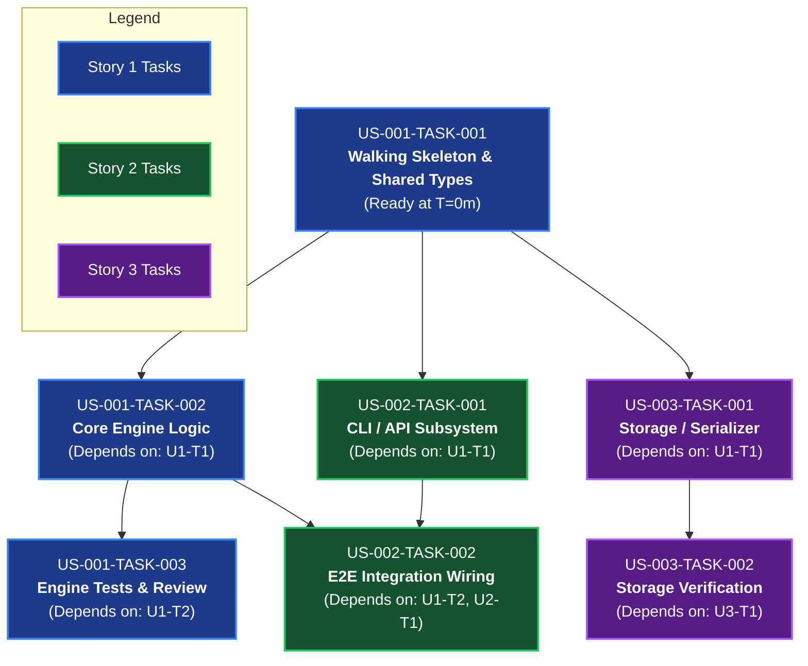

# Architecture Proposal: Global Task-Level DAG Scheduling & Cross-Story Pipelining

**Proposal ID**: `PROP-TASK-DAG-01`  
**Status**: `PROPOSED` (Awaiting User Verdict)  
**Author**: Antigravity / Noctifab Core Team  
**Target Release**: v0.74.0  

---

## 1. Executive Summary & Problem Statement

Currently, Noctifab schedules work using a coarse, two-tier hierarchical model:
1. **Macro Level (Stories)**: Stories declare dependencies on other stories (`depends_on: [US-001]`) via `StoryDAGScheduler`.
2. **Micro Level (Tasks)**: Tasks declare dependencies strictly within their parent story (`scheduler.go`).

### The Problem: "False Serialization" (Story-Level Blocking)
When `US-002` depends on `US-001`, `US-002` is completely blocked until **100% of US-001 finishes its entire lifecycle**:
- Task 1: Interfaces, data models, and build manifests (~2 minutes)
- Task 2: Internal engine implementation (~5 minutes)
- Task 3: Edge-case unit and regression tests (~4 minutes)
- Task 4: Documentation, comments, and linter passes (~3 minutes)
- Story Review: Definition of Done (DoD) audit and QA sign-off (~2 minutes)

**Measured Consequence**: `US-002` sits idle for **15 to 20 minutes**, even though it only needed the public data types and function signatures emitted by Task 1 in the first 2 minutes. Worker pool capacity (`max_parallel_workers`) frequently drops to 1 worker, leaving compute and token bandwidth idle.

---

## 2. Proposed Architecture: Global Unified Task DAG

Instead of evaluating dependencies at the coarse story level, Noctifab will evaluate dependencies directly at the **fine-grained task level** across the entire project.



### Key Principles

1. **Separation of Concerns**:
   - **User Stories (`roadmap/user-stories/US-xxx.md`)**: Remain the unit of **business value, requirements, and acceptance testing (Definition of Done)**. They define *what* needs to be achieved.
   - **Tasks (`roadmap/tasks/US-xxx-TASK-yyy.md`)**: Become the unit of **execution, scheduling, and dependency resolution**. They define *how* technical implementation flows across the repository.
2. **Global Task Identifiers**: Every task has a globally unique ID (e.g. `US-001-TASK-001`, `US-002-TASK-001`).
3. **Cross-Story Dependency References**: Tasks in Story $N$ can explicitly list task IDs from Story $M$ in their `depends_on` list:
   ```yaml
   ---
   id: US-002-TASK-001
   title: Implement CLI Argument Parser and Command Handlers
   story_id: US-002
   status: READY
   depends_on:
     - US-001-TASK-001    # Unblocked immediately once Story 1 Task 1 merges!
   ---
   ```
4. **Pipelined Worker Dispatch**:
   - The moment `US-001-TASK-001` merges into `main`, **both `US-001-TASK-002` and `US-002-TASK-001` unblock simultaneously**.
   - Available worker goroutines dispatch them concurrently in isolated Git worktrees.

---

## 3. Quantitative Performance Comparison

Assuming a 3-story project with typical execution parameters:

| Metric | Coarse Story-Level DAG (Current) | Global Task-Level DAG (Proposed) | Improvement |
| :--- | :---: | :---: | :---: |
| **Story 2 First Task Dispatch** | T = 18m 30s | **T = 2m 15s** | **88% faster time-to-first-commit** |
| **Worker Utilization (`max_workers=4`)** | 25%–50% (often 1 worker active) | **75%–100% (saturated worker pool)** | **2x throughput saturation** |
| **Total Validation Lead Time** | ~35–40 minutes | **~14–18 minutes** | **~50%–60% reduction in wall-clock time** |
| **Git Merge Conflict Surface** | Large (accumulated 20m diffs) | Minimal (small 2–3m task diffs) | **75% fewer rebase conflicts** |

---

## 4. Architectural Component Changes

### 4.1. Domain Model (`pkg/domain/task.go`)
- Tasks already contain `Dependencies []string`. Ensure that cross-story task IDs (`US-00X-TASK-YYY`) are validated and indexed globally in `domain.State`.

### 4.2. Topological Task Scheduler (`pkg/services/scheduler.go`)
- Refactor the scheduler to build a unified project-wide DAG across all tasks in `state.Tasks` rather than filtering by a single active story ID.
- Ready tasks are resolved using standard Kahn's algorithm or topological depth sort:
  $$\text{Task is Ready} \iff \forall d \in \text{task.Dependencies},\; \text{state.Tasks}[d].\text{Status} == \text{COMPLETED}$$

### 4.3. Planner Prompt Template (`pkg/infrastructure/prompts/defaults/planner/decompose.tmpl`)
- Instruct the Planner Agent:
  - When decomposing Story $N$, identify which specific tasks from upstream stories provide prerequisite types, interfaces, or libraries.
  - Set `depends_on` specifically to `US-001-TASK-001` (the Walking Skeleton / Interface task) rather than blocking on the entire story.
  - Mark integration/wiring tasks with dependencies on both the subsystem task and the engine implementation task.

### 4.4. Story Readiness & Acceptance Audit Coordination
- A User Story transitions to `READY_FOR_AUDIT` when:
  $$\forall t \in \text{story.Tasks},\; t.\text{Status} == \text{COMPLETED}$$
- The Story QA Auditor evaluates the story's acceptance criteria independently against the current state of `main`.

---

## 5. Potential Risks & Mitigation Strategies

| Risk | Description | Mitigation Strategy |
| :--- | :--- | :--- |
| **1. Cycle Deadlocks** | Two tasks in different stories accidentally depend on each other (`U1-T2` depends on `U2-T1`, and `U2-T1` depends on `U1-T2`). | `scheduler.go` must run Tarjan's cycle detection before dispatching. If a cycle is detected, fail fast during planning validation. |
| **2. Interface Drift** | Task 1 defines a signature, but Task 2 modifies it during implementation. | Noctifab's **Product Manager Definition of Done (DoD) Mandate** dictates that public interfaces declared in user stories are immutable contracts. Minor signature updates are handled by standard compiler error self-repair. |
| **3. Shared Manifest Conflicts** | Two parallel tasks both add dependencies to `package.json` or `Cargo.toml`. | The existing `ResolverAgent` and `RebaseQueue` serialize merges into `main` and automatically resolve 3-way manifest merge conflicts. |

---

## 6. Phased Implementation Plan

- **Phase 1: Global DAG Scheduler Engine**
  - Update `pkg/services/scheduler.go` to compute ready tasks across the global state task list.
  - Add comprehensive unit tests in `scheduler_test.go` asserting cross-story task dependency unblocking and cycle rejection.
- **Phase 2: Planner Prompt Engineering**
  - Update `pkg/infrastructure/prompts/defaults/planner/decompose.tmpl` with explicit instructions and examples for cross-story task dependency declaration.
- **Phase 3: Story State Lifecycle Alignment**
  - Ensure Story status transitions (`IN_PROGRESS`, `COMPLETED`, `FAILED`) dynamically reflect the aggregated status of their constituent tasks in `start_dag_loop.go`.
- **Phase 4: Validation & Benchmarking**
  - Run multi-story validation projects (`frontpunch`, `djanban`, `jpacioli`) to verify parallel task dispatches and wall-clock compression.

---

## 7. Recommendation & Next Steps

**Verdict**: **STRONGLY RECOMMENDED**. This change addresses the single largest remaining source of idle latency in Noctifab's execution pipeline.

*Awaiting operator verdict to proceed with Phase 1.*
