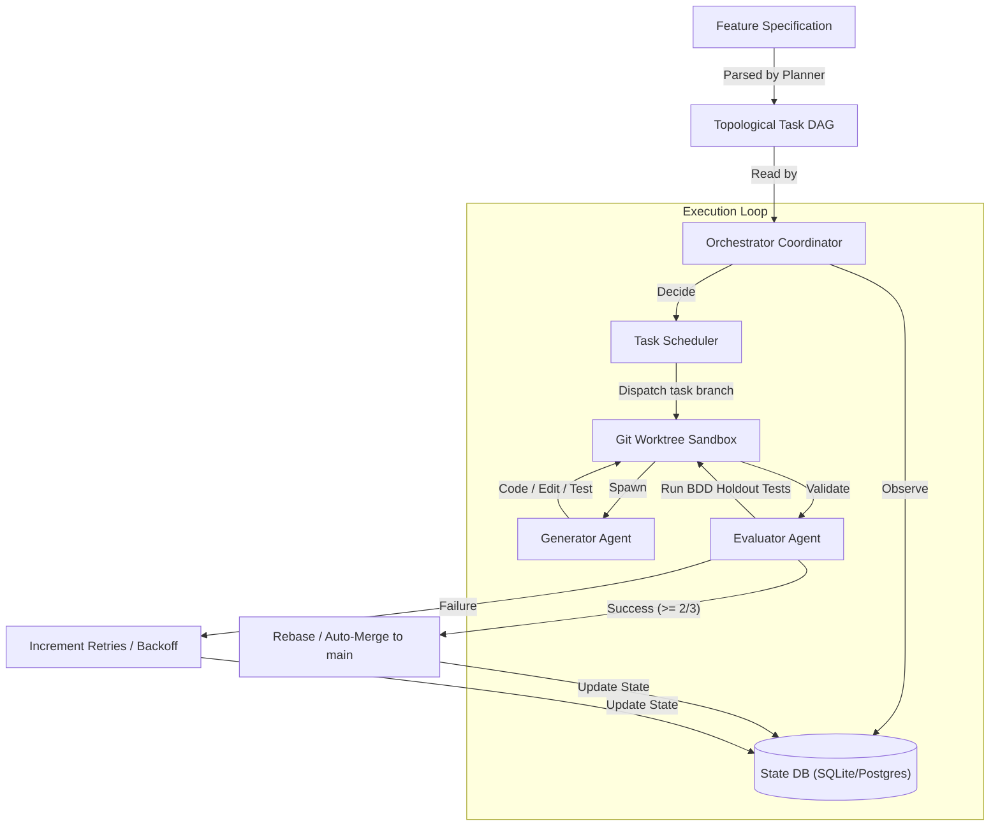

# noctifab

[](https://github.com/diegojromerolopez/noctifab/actions)
[](https://github.com/diegojromerolopez/noctifab)
[](https://noctifab.readthedocs.io/en/latest/?badge=latest)
[](https://noctifab.readthedocs.io)
[](/LICENSE)
[](https://github.com/diegojromerolopez/noctifab)

`noctifab` is an autonomous, long-running agentic harness that operates without human intervention to resolve issues, verify builds, run tests, and manage software project lifecycles. 

Designed as a **Dark Factory Platform** for GitHub and GitLab, it is compiled as a single Go binary and runs as a single-node autonomous loop engine to replace manual developer execution bottlenecks.

---

## Autonomy Matrix

The platform classifies development automation into distinct levels. `noctifab` is built to run at **Level 3** and **Level 4** autonomy:

| Level | Name | Platform Behavior |
| :--- | :--- | :--- |
| **Level 1** | Autocomplete | AI suggests code inline. Human drives the editor and makes all decisions. |
| **Level 2** | Interactive Assistant | AI generates entire files/functions. Human reviews every single change in the editor. |
| **Level 3** | Spec-Driven (Gated) | AI generates code autonomously from specifications. Holdout scenarios gate quality. Human clicks merge. |
| **Level 3.5** | Selective Auto-Merge | Same as Level 3, but low-risk modules merge automatically. Human can block. |
| **Level 4** | Full Dark Factory | Specs go in, tested code comes out fully merged. Human reviews only exceptions. |

---

## Core Pillars

1. **Stateless Agent, Stateful Orchestrator**: The AI agents have no memory of previous runs or actions. Instead, the orchestrator compiles and tracks system state (tasks, file indices, action logs, and clarifications) in a local database (SQLite/PostgreSQL) and feeds it to the agent at each step.
2. **Topological Task Scheduling**: Decomposes complex feature specifications into a Directed Acyclic Graph (DAG) of task models, running independent tasks concurrently.
3. **Behavior-Driven Quality Gates**: Employs BDD holdout scenario validation with majority voting to ensure that generated code is safe and completely regression-free before merging.
4. **Sandboxed Action Isolation**: Safely edits files and runs test commands inside host path jails or isolated Docker containers.

---

## Architecture: The Software Dark Factory Loop

To understand how `noctifab` works as a "dark factory" (an automated software development environment operating without human intervention), it helps to view the system as a **stateful orchestrator** controlling **stateless, role-segregated agent workers**.



### The Orchestrator Loop (Observe -> Decide -> Validate -> Execute -> Save)
The core engine runs a continuous polling event loop that drives all development tasks:
1. **Observe (State Sync)**: The orchestrator scans the filesystem to index files, build metadata, and check the task database. It ensures a consistent, up-to-date representation of the workspace.
2. **Decide (Task Scheduling)**: It analyzes the Directed Acyclic Graph (DAG) of tasks. Ready tasks (those whose dependencies have succeeded) are selected and dispatched concurrently up to the configured limit.
3. **Execute (Agent Dispatch)**: For each ready task, the orchestrator:
   - Spawns a dedicated git worktree/sandbox environment.
   - Dispatches a specialized **Generator Agent** to write code, edit files, and self-correct based on compiler and test feedback.
4. **Validate (Quality Gate Evaluation)**: Post-generation, the orchestrator spawns a distinct **Evaluator Agent** inside an isolated sandbox to run BDD holdout tests. These tests are hidden from the Generator to ensure generalized code correctness.
5. **Save & Integrate (Rebase/Merge & State Update)**:
   - If tests pass (requiring a majority vote, e.g., 2/3 passing runs), the branch is pushed, a Pull Request is automatically created and merged into `main`, and the task is updated to `SUCCESS`.
   - If tests fail, the task is marked as `PENDING` to be retried (or `FAILED` if retry limit is reached).
   - In all cases, the ephemeral worktree is pruned to maintain a clean workspace.

### Autonomous Agent Roles
To prevent "evaluation gaming" (where code generators approve their own buggy code), `noctifab` partitions cognitive execution into three isolated, specialized agent roles:
1. **Planner Agent**: Decomposes a raw feature specification (Markdown/text file) into a topological task graph (DAG). Uses a reasoning-focused model configuration.
2. **Generator Agent**: Sandbox-restricted worker executing in a task-specific Git branch. Writes/edits code and runs local unit tests. Low temperature setting for deterministic code generation.
3. **Evaluator Agent**: Post-generation verification worker locked strictly to the holdout tests path (`tests/holdout`). It executes testing scenarios and returns objective validation metrics, preventing code gaming.

---

## Quick Start

### Installation

Clone the repository and compile the CLI using the provided `Makefile`:

```bash
git clone https://github.com/diegojromerolopez/noctifab.git
cd noctifab
make build
```

This compiles the binary to `./dist/noctifab`.

### Setup and Running

```bash
# 1. Initialize the noctifab workspace configurations
./dist/noctifab init

# 2. Validate configurations
./dist/noctifab validate

# 3. Plan a task DAG from a feature specification
./dist/noctifab plan --input ./examples/markdown-to-html/spec.md

# 4. Start the background daemon and interactive REPL
./dist/noctifab start

# Alternatively, run planning and execution end-to-end for a single story specification
./dist/noctifab start-one --input ./examples/markdown-to-html/spec.md
```

---

## Command Reference

- **`init`**: Initializes workspace folder structure (`.noctifab/`), SQLite DB, default config, and security permission profiles.
- **`validate`**: Checks configuration files, databases, and sandbox settings.
- **`plan`**: Invokes the LLM Planner model to decompose a specification into task dependencies.
- **`start`**: Spawns the background daemon process (`noctifab serve`) and launches a foreground interactive REPL loop to accept operator orders (e.g. `start roadmap/US-0001.md`) and display clarification prompts.
- **`start-one`**: Plans and executes a single specification end-to-end, running task workers and holdout validation in a blocking loop until complete, then exits.
- **`stop`**: Gracefully stops the background daemon process and saves state.
- **`clean`**: Resets all noctifab state (wipes the database, removes PID and log files).
- **`maintenance`**: Cleans up completed branches, orphaned worktrees, and runs database schema migrations.

---

## Target Scenarios & Examples

`noctifab` contains pre-configured example targets in the `examples/` folder to validate autonomous software implementation capabilities:
- **`url-shortener`**: An API server that generates short URLs, tracks analytics, and redirects clients.
- **`todo-cli`**: A command-line checklist manager with file persistence.
- **`weather-api`**: A service caching weather data and querying external providers.
- **`markdown-to-html`**: A utility that parses markdown files and generates styled HTML.
- **`task-scheduler`**: An in-memory scheduler executing functions at scheduled time intervals.
- **`frontpunch`**: A task worker demonstration featuring SOLID patterns and Sidekiq-compatible components.

---

## Collaboration & Coding Standards

We welcome contributions! To maintain a highly clean and context-friendly repository, all code changes must adhere to the following directives:

1. **The 500-Line Limit**: No Go source code file (`.go`) may exceed **500 physical lines** (including comments and blank lines). Smaller, logically focused files prevent LLM context pollution.
2. **Dependency Injection**: Provide all clients, database connection objects, and configurations through struct constructors. Global state is strictly prohibited.
3. **100% Test Coverage**: Every package must be accompanied by unit tests (`_test.go` files). Ensure the test suite passes before submitting:
   ```bash
   go test -v ./...
   ```
4. **Code Quality and Lints**: Ensure that the code is formatted using `go fmt` and passes static analysis lints:
   ```bash
   docker run -t --rm -v $(pwd):/app -w /app golangci/golangci-lint:v2.12.2 golangci-lint run
   ```

---

## License

This project is licensed under the MIT License - see the [LICENSE](/LICENSE) file for details.
