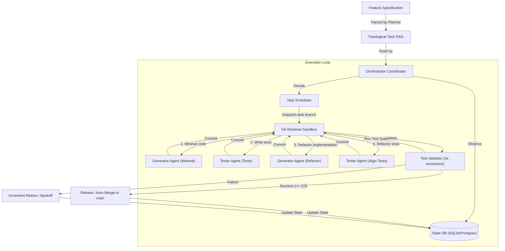

# noctifab

[](https://github.com/diegojromerolopez/noctifab/actions)
[](https://github.com/diegojromerolopez/noctifab)
[](https://noctifab.readthedocs.io/en/latest/?badge=latest)
[](https://noctifab.readthedocs.io)
[](/LICENSE)
[](https://github.com/diegojromerolopez/noctifab)

`noctifab` is an autonomous, long-running agentic harness that operates without human intervention to resolve issues, verify builds, run tests, and manage software project lifecycles. 

Designed as a **Dark Factory Platform** for GitHub and GitLab, it is compiled as a single Go binary and runs as a single-node autonomous loop engine to replace manual developer execution bottlenecks.

---

## Autonomy Matrix

The platform classifies development automation into distinct levels. `noctifab` is built to run at **Level 3** and **Level 4** autonomy:

| Level | Name | Platform Behavior |
| :--- | :--- | :--- |
| **Level 1** | Autocomplete | AI suggests code inline. Human drives the editor and makes all decisions. |
| **Level 2** | Interactive Assistant | AI generates entire files/functions. Human reviews every single change in the editor. |
| **Level 3** | Spec-Driven (Gated) | AI generates code autonomously from specifications. Continuous test suites gate quality. Human clicks merge. |
| **Level 3.5** | Selective Auto-Merge | Same as Level 3, but low-risk modules merge automatically. Human can block. |
| **Level 4** | Full Dark Factory | Specs go in, tested code comes out fully merged. Human reviews only exceptions. |

### Configuring Autonomy Level

The autonomy level is controlled by the VCS `pull_request` and `ci` settings in `.noctifab/config.yaml`:

| Level | `pull_request` settings | `ci` settings |
|---|---|---|
| **Level 3** | `auto_create: true`, `auto_merge: false` | _(optional)_ |
| **Level 3.5** | `auto_create: true`, `auto_merge: true` | `auto_fix: true` |
| **Level 4** | `auto_create: true`, `auto_merge: true`, `auto_rebase: true` | `auto_fix: true`, `max_retries: 3` |

---

## Core Pillars

1. **Stateless Agent, Stateful Orchestrator**: The AI agents have no memory of previous runs or actions. Instead, the orchestrator compiles and tracks system state (tasks, file indices, action logs, and clarifications) in a local database (SQLite/PostgreSQL) and feeds it to the agent at each step.
2. **Topological Task Scheduling**: Decomposes complex feature specifications into a Directed Acyclic Graph (DAG) of task models, running independent tasks concurrently.
3. **Test-Driven Quality Gates**: Employs a multi-stage sequential execution cycle between the generator and test-writer agents. The Test Validator executes the test suite 3 times, requiring a majority vote consensus (at least 2/3 passing runs) to approve changes, preventing regression and flaky builds.
4. **Sandboxed Action Isolation**: Safely edits files and runs test commands inside host path jails or isolated Docker containers, restricted by role-based authorization profiles.

---

## Architecture: The Software Dark Factory Loop

To understand how `noctifab` works as a "dark factory" (an automated software development environment operating without human intervention), it helps to view the system as a **stateful orchestrator** controlling **stateless, role-segregated agent workers**.



### The Orchestrator Loop (Observe -> Decide -> Validate -> Execute -> Save)
The core engine runs a continuous polling event loop that drives all development tasks:
1. **Observe (State Sync)**: The orchestrator scans the filesystem to index files, build metadata, and check the task database. It ensures a consistent, up-to-date representation of the workspace. During startup, it automatically executes database migrations inside transactions.
2. **Decide (Task Scheduling)**: It analyzes the Directed Acyclic Graph (DAG) of tasks. Ready tasks (those whose dependencies have succeeded) are selected and dispatched concurrently up to the configured limit.
3. **Execute (Agent Dispatch)**: For each ready task, the orchestrator sets up an ephemeral git worktree/sandbox environment and executes a multi-stage, sequential coordination flow:
   - **Initial Flow (Retries = 0)**:
     1. *Minimal Implementation*: Dispatches the **Generator Agent** to implement the bare-minimum logic for the task.
     2. *Test Writing*: Dispatches the **Tester Agent** to write unit and integration tests verifying the minimal implementation based on the task specification.
     3. *Refactoring & Implementation*: Dispatches the **Generator Agent** to refactor and expand the code to pass the written tests (the agent is provided with the test files as context).
     4. *Test Alignment*: Dispatches the **Tester Agent** to refine, clean, and align the test suite to match the final implementation structure.
   - **Retry Flow (Retries > 0)**:
     1. *Fix Implementation*: Dispatches the **Generator Agent** to address validation failures and refactor the code.
     2. *Fix Tests*: Dispatches the **Tester Agent** to fix or refactor tests to align with the updated code.
4. **Validate (Quality Gate Evaluation)**: Post-generation, the orchestrator runs the project's test suite inside the sandbox. To guard against flaky tests, the **Test Validator** runs the suite 3 times, requiring a majority vote consensus (e.g., at least 2/3 passing runs) to succeed.
5. **Save & Integrate (Rebase/Merge & State Update)**:
   - If tests pass, the branch is pushed, a Pull Request is created and automatically merged using the rebase queue, and the task is updated to `SUCCESS`.
   - If tests fail, the task is marked as `PENDING` to be retried (or `FAILED` if retry limit is reached).
   - In all cases, the ephemeral worktree is pruned to maintain a clean workspace.

### Autonomous Agent Roles & Relationship
To prevent "evaluation gaming" (where code generators approve their own buggy code), `noctifab` partitions cognitive execution into three isolated, specialized agent roles:
1. **Planner Agent**: Decomposes a raw feature specification (Markdown/text file) into a topological task graph (DAG). Uses a reasoning-focused model configuration.
2. **Tester Agent**: Dedicated test-writing agent that writes and refactors unit, integration, and end-to-end tests based on the task description and specification.
3. **Generator Agent**: Sandbox-restricted worker executing in a task-specific Git branch. Writes/edits code to satisfy the written tests. Low temperature setting for deterministic code generation.

**Inter-Agent Relationship**: The Generator Agent and Tester Agent are coordinated sequentially by the orchestrator. The Generator Agent implements the functionality, while the Tester Agent writes the tests. By keeping these roles separate and preventing the Generator from writing its own test suite from scratch without verification, `noctifab` ensures that tests act as an objective quality gate. If the Generator Agent discovers a bug in the test definitions, it can request test modifications using the orchestrator's inter-agent communication channel (`request_test_fix`).


---

## Quick Start

### Installation

Clone the repository and compile the CLI using the provided `Makefile`:

```bash
git clone https://github.com/diegojromerolopez/noctifab.git
cd noctifab
make build
```

This compiles the binary to `./dist/noctifab`.

### Setup and Running

```bash
# 1. Initialize the noctifab workspace configurations
./dist/noctifab init

# 2. Validate configurations
./dist/noctifab validate

# 3. Start the background daemon and interactive REPL
./dist/noctifab start

# Alternatively, run planning and execution end-to-end for a single story specification
./dist/noctifab start-one --input ./examples/markdown-to-html/spec.md
```

---

## Command Reference

- **`init`**: Initializes workspace folder structure (`.noctifab/`), SQLite DB, default config, and security permission profiles.
- **`validate`**: Checks configuration files, databases, and sandbox settings.

- **`start`**: Spawns the background daemon process (`noctifab serve`) and launches a foreground interactive REPL loop to accept operator orders (e.g. `start roadmap/US-0001.md`) and display clarification prompts.
- **`start-one`**: Plans and executes a single specification end-to-end, running task workers and test validation in a blocking loop until complete, then exits.
- **`stop`**: Gracefully stops the background daemon process and saves state.
- **`clean`**: Resets all noctifab state (wipes the database, removes PID and log files). Use `--dry-run` to preview, `--yes` / `-y` to skip confirmation.
- **`maintenance`**: Cleans up completed branches, orphaned worktrees, and runs database schema migrations.

---

## Secrets Management

Credentials such as API keys and VCS tokens must **not** be stored as literal values in `config.yaml`. Use the `secret:` reference syntax to load them from a gitignored `secrets.yaml` file instead:

```yaml
# .noctifab/secrets.yaml  (gitignored — never commit)
GEMINI_API_KEY: "AIzaSy..."
GITHUB_TOKEN:   "github_pat_..."
```

```yaml
# .noctifab/config.yaml  (safe to commit)
llm:
  api_key: "secret:GEMINI_API_KEY"
vcs:
  token:   "secret:GITHUB_TOKEN"
```

`noctifab init` automatically adds `secrets.yaml` to `.noctifab/.gitignore`. For full details, supported fields, CI/CD patterns, and the security checklist see **[docs/secrets.md](docs/secrets.md)**.

---

## Security & Permission Profiles

To ensure secure and controlled agent execution, `noctifab` employs a profile-based Role-Based Access Control (RBAC) and security sandboxing system. 

Every active agent role (such as `orchestrator`, `planner`, `generator`, or `tester`) is constrained by a security profile YAML file located in `.noctifab/profiles/<profile_name>.yaml`. If no profile is explicitly defined for a role in `config.yaml`, the orchestrator looks for a profile matching the role name (e.g., `generator.yaml`), falling back to `default.yaml` if not found.

### Security Sandbox Policies

1. **Tool Whitelisting (`allowed_tools`)**: Restricts the exact tools an agent is authorized to invoke (e.g., `read_file`, `write_file`, `edit_file`, `run_tests`). By default, dangerous system commands and Git mutation actions (`git_checkout`, `git_commit`, `git_push`, `docker_action`) are strictly reserved for the privileged `orchestrator` profile.
2. **Command Whitelisting (`allowed_commands`)**: Restricts which shell execution binaries are allowed to run under the `run_tests` tool. For example, `tester` and `generator` profiles are restricted to language-specific runtimes (e.g., `go`, `npm`, `pytest`, `make`, `python`), preventing command injection or host shell execution escapes.
3. **Path Jail Protection**: The validator dynamically enforces path checks preventing directory traversal attacks. Any file read or write tool parameters that resolve outside the workspace root path trigger an automatic sandbox boundary violation.
4. **Target Path Exclusion**: Agents are forbidden from reading, writing, or accessing sensitive testing framework directories (specifically `tests/holdout` and `holdout` directories) to prevent gaming the evaluation process.
5. **Branch Protection**: Direct git checkouts, commits, or pushes on protected base branches (like `main` or `master`) are rejected by the Policy Validator.
6. **Network Outbound Policies**: Profiles restrict internet access to control data exfiltration. Default configurations allow connections only to the configured LLM API provider endpoint (`allow_ai_provider: true`) and block all other external outbound internet traffic (`allow_external: false`).

### Example Profile (`.noctifab/profiles/generator.yaml`)

```yaml
permissions:
  allowed_tools:
    - "read_file"
    - "write_file"
    - "edit_file"
    - "list_directory"
    - "find_files"
    - "grep_search"
    - "run_tests"
    - "noop"
  allowed_commands:
    - "go"
    - "npm"
    - "pytest"
    - "make"
  network:
    allow_ai_provider: true
    allow_external: false
```

---

## LLM Providers

`noctifab` supports multiple LLM providers via a pluggable `llm.ProviderClient` interface. The active provider, model, and API key are set in `.noctifab/config.yaml`.

### Resilience Features

All providers benefit from the same resilience layer automatically:

* **Automatic retry with backoff** – transient errors (HTTP 5xx, network timeouts) are retried up to 3 times with exponential back-off.
* **Rate-limit awareness (HTTP 429)** – when a `429 Too Many Requests` response is received, `noctifab` warns the user, parses the provider's `retryDelay` field from the response body, and sleeps for exactly that duration before retrying.
* **Automatic model fallback** – if the chosen model is unavailable, `noctifab` first queries the provider for its live model list and falls back to the next smaller model in the static hierarchy below. The fallback continues down the chain until a working model is found or all options are exhausted.

### Provider Configuration Reference

#### Google Gemini

```yaml
# .noctifab/config.yaml
llm:
  provider: gemini
  model: gemini-2.5-pro          # fallback chain: → gemini-2.5-flash
  api_key: "secret:GEMINI_API_KEY"
```

```yaml
# .noctifab/secrets.yaml
GEMINI_API_KEY: "AIzaSy..."
```

#### OpenAI

```yaml
llm:
  provider: openai
  model: gpt-4o                  # fallback chain: → gpt-4o-mini
  api_key: "secret:OPENAI_API_KEY"
```

```yaml
OPENAI_API_KEY: "sk-..."
```

#### Anthropic (Claude)

```yaml
llm:
  provider: anthropic
  model: claude-3-5-sonnet-latest  # fallback chain: → claude-3-5-haiku-latest
  api_key: "secret:ANTHROPIC_API_KEY"
```

```yaml
ANTHROPIC_API_KEY: "sk-ant-..."
```

#### Mistral AI

```yaml
llm:
  provider: mistral
  model: mistral-large-latest    # fallback chain: → mistral-medium-latest → mistral-small-latest → open-mistral-7b
  api_key: "secret:MISTRAL_API_KEY"
```

```yaml
MISTRAL_API_KEY: "..."
```

#### DeepSeek

```yaml
llm:
  provider: deepseek
  model: deepseek-coder          # fallback chain: → deepseek-chat
  api_key: "secret:DEEPSEEK_API_KEY"
```

```yaml
DEEPSEEK_API_KEY: "..."
```

#### Hermes (Nous Research via Hugging Face)

```yaml
llm:
  provider: hermes
  model: hermes-3-llama-3.1-405b  # fallback chain: → hermes-3-llama-3.1-70b → hermes-3-llama-3.1-8b
  api_key: "secret:HUGGINGFACE_API_KEY"
```

```yaml
HUGGINGFACE_API_KEY: "hf_..."
```

#### Ollama (local / self-hosted)

```yaml
llm:
  provider: ollama
  model: llama3.1                # any model pulled locally via `ollama pull`
  url: "http://localhost:11434"  # optional: override if running on a different host/port
  api_key: ""                    # not required for local Ollama instances
```

### Model Fallback Chains

| Provider | Model priority (high → low) |
|---|---|
| **Gemini** | `gemini-2.5-pro` → `gemini-2.5-flash` |
| **OpenAI** | `gpt-4o` → `gpt-4o-mini` |
| **Anthropic** | `claude-3-5-sonnet-latest` → `claude-3-5-haiku-latest` |
| **Mistral** | `mistral-large-latest` → `mistral-medium-latest` → `mistral-small-latest` → `open-mistral-7b` |
| **DeepSeek** | `deepseek-coder` → `deepseek-chat` |
| **Hermes** | `hermes-3-llama-3.1-405b` → `hermes-3-llama-3.1-70b` → `hermes-3-llama-3.1-8b` |
| **Ollama** | Queries the local `/api/tags` endpoint live; uses whatever models are pulled |


## Pull Request & CI Configuration

In addition to the core LLM and VCS settings, `noctifab` supports automated PR management and CI pipeline integration:

```yaml
vcs:
  pull_request:
    auto_create: true    # Automatically create a PR from the task branch
    auto_merge: true     # Automatically merge the PR when CI checks pass
    auto_rebase: true    # Automatically rebase on base branch updates
    draft: false         # Create the PR as a draft
    assignees:           # GitHub usernames to auto-assign
      - "user1"
    labels:              # Labels to auto-apply to the PR
      - "autonomous"
  ci:
    auto_fix: true       # Automatically fix CI pipeline failures
    max_retries: 3       # Max CI fix attempts before giving up
```

For a full reference of all available settings and CLI flags, see the [SPEC.md](SPEC.md) and [docs/cli_usage.md](docs/cli_usage.md).

### Dependency Auto-Install

Set `sandbox.auto_install_deps: true` to automatically detect and install missing toolchain dependencies (e.g., `golangci-lint`, `pytest`, `cargo`). Configure supported package managers via `sandbox.package_managers`.

## Security & Self-Evolution

### SAST Security Gates

Static Application Security Testing (SAST) can be configured to run against generated code before PR creation:

```yaml
sast:
  enabled: true
  scanners: ["gosec"]       # "gosec" for Go, "bandit" for Python
  fail_on_severity: "high"  # Block on high, medium, or low severity
```

If SAST is enabled and a scanner finds issues meeting the severity threshold, the PR is blocked and the agent must fix them. See [SPEC.md](SPEC.md) for details.

### Hot-Reload

Noctifab can hot-reload its binary with zero downtime via a handoff file + health check protocol. See [SPEC.md §3.10](SPEC.md) for details.

### Intent Disambiguation

When the agent asks a clarification question, Noctifab can attempt to auto-answer it by analyzing git history, workspace files, and feature context — without blocking on human input. If the LLM's inferred answer is valid, the clarification is resolved automatically. Otherwise, the standard human clarification timeout applies.

## Target Scenarios & Examples

`noctifab` contains pre-configured example targets in the `examples/` folder to validate autonomous software implementation capabilities:
- **`url-shortener`**: An API server that generates short URLs, tracks analytics, and redirects clients.
- **`todo-cli`**: A command-line checklist manager with file persistence.
- **`weather-api`**: A service caching weather data and querying external providers.
- **`markdown-to-html`**: A utility that parses markdown files and generates styled HTML.
- **`task-scheduler`**: An in-memory scheduler executing functions at scheduled time intervals.
- **`frontpunch`**: A task worker demonstration featuring SOLID patterns and Sidekiq-compatible components.

---

## E2E Autonomy Validation

The `validation/` directory contains fully containerized, isolated end-to-end integration checks that run `noctifab` autonomously against real project specs — with **zero human intervention** — and verify that the correct source files are produced and all tests pass.

### Available Validation Projects

| Project | Language | User Story | What is Checked |
| :--- | :--- | :--- | :--- |
| **`frontpunch`** | Python | `US-001.md` | `frontpunch/worker.py` created/modified and test suite passes |
| **`todo-cli`** | Python | `US-001.md` | `todo.py` created/modified and test suite passes |
| **`wc`** | Rust | `US-002.md` | `Cargo.toml` + `src/main.rs` created/modified and test suite passes |

The `wc` project replicates the UNIX `wc` utility in Rust, enforcing SOLID/DDD architecture, `#![deny(unsafe_code)]`, and $O(1)$ streaming memory usage.

### Running Validation

Set your API key, then run via Make:

```bash
export GEMINI_API_KEY="your-actual-api-key"

# Run the default (frontpunch) validation
make validate

# Run a specific validation project
make validate PROJECT=todo-cli
make validate PROJECT=wc
make validate PROJECT=frontpunch
```

See [`validation/README.md`](validation/README.md) for full setup and credential details.

## Collaboration & Coding Standards

We welcome contributions! To maintain a highly clean and context-friendly repository, all code changes must adhere to the following directives:

1. **The 500-Line Limit**: No Go source code file (`.go`) may exceed **500 physical lines** (including comments and blank lines). Smaller, logically focused files prevent LLM context pollution.
2. **Dependency Injection**: Provide all clients, database connection objects, and configurations through struct constructors. Global state is strictly prohibited.
3. **100% Test Coverage**: Every package must be accompanied by unit tests (`_test.go` files). Ensure the test suite passes before submitting:
   ```bash
   go test -v ./pkg/... ./tests
   ```
4. **Code Quality and Lints**: Ensure that the code is formatted using `go fmt` and passes static analysis lints:
   ```bash
   docker run -t --rm -v $(pwd):/app -w /app golangci/golangci-lint:v2.12.2 golangci-lint run
   ```

---

## License

This project is licensed under the MIT License - see the [LICENSE](/LICENSE) file for details.
