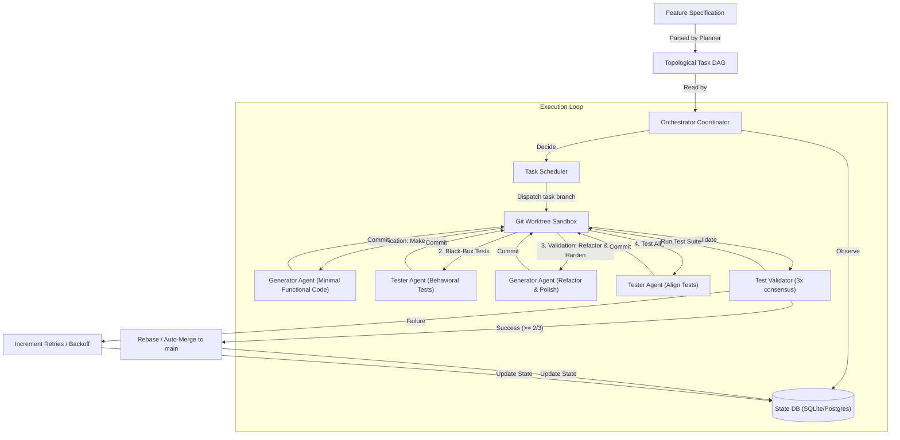
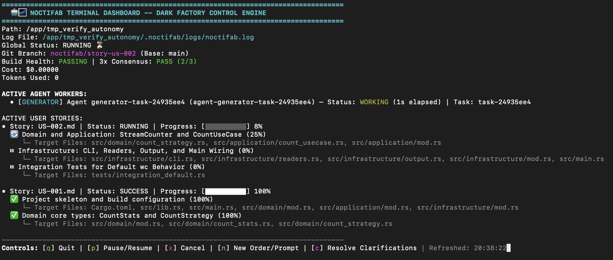

# 🤖🌌 noctifab

[](https://github.com/diegojromerolopez/noctifab/actions)
[](https://github.com/diegojromerolopez/noctifab)
[](https://noctifab.readthedocs.io/en/latest/?badge=latest)
[](https://noctifab.readthedocs.io)
[](/LICENSE)
[](https://github.com/diegojromerolopez/noctifab)

`noctifab` is an autonomous, long-running agentic harness that operates without human intervention to resolve issues, verify builds, run tests, and manage software project lifecycles. 

Designed as a **Dark Factory Platform** for GitHub and GitLab, it is compiled as a single Go binary and runs as a single-node autonomous loop engine to replace manual developer execution bottlenecks.

---

## ⚡ 1-Line Quickstart Installer

Install `noctifab` instantly on macOS or Linux:

```bash
curl -sSL https://raw.githubusercontent.com/diegojromerolopez/noctifab/main/scripts/install.sh | sh
```

Initialize a project workspace (creates `.noctifab/config.yaml`, `.noctifab/secrets.yaml`, and `SPEC.md` template):

```bash
noctifab init [my-project-dir]
```

Launch the dark factory loop in any project with a `SPEC.md` (add `-i` for interactive TUI dashboard):

```bash
noctifab start [my-project-dir] -i
```

---

## Autonomy Matrix

The platform classifies development automation into distinct levels. `noctifab` is built to run at **Level 3** and **Level 4** autonomy:

| Level | Name | Platform Behavior |
| :--- | :--- | :--- |
| **Level 1** | Autocomplete | AI suggests code inline. Human drives the editor and makes all decisions. |
| **Level 2** | Interactive Assistant | AI generates entire files/functions. Human reviews every single change in the editor. |
| **Level 3** | Spec-Driven (Gated) | AI generates code autonomously from specifications. Continuous test suites gate quality. Human clicks merge. |
| **Level 3.5** | Selective Auto-Merge | Same as Level 3, but low-risk modules merge automatically. Human can block. |
| **Level 4** | Full Dark Factory | Specs go in, tested code comes out fully merged. Human reviews only exceptions. |

### Configuring Autonomy Level

The autonomy level is controlled by the VCS `pull_request` and `ci` settings in `.noctifab/config.yaml`:

| Level | `pull_request` settings | `ci` settings |
|---|---|---|
| **Level 3** | `auto_create: true`, `auto_merge: false` | _(optional)_ |
| **Level 3.5** | `auto_create: true`, `auto_merge: true` | `auto_fix: true` |
| **Level 4** | `auto_create: true`, `auto_merge: true`, `auto_rebase: true` | `auto_fix: true`, `max_retries: 3` |

---

## Core Pillars

1. **Stateless Agent, Stateful Orchestrator**: The AI agents have no memory of previous runs or actions. Instead, the orchestrator compiles and tracks system state (tasks, file indices, action logs, and clarifications) in a local database (SQLite/PostgreSQL) and feeds it to the agent at each step.
2. **Topological Task Scheduling**: Decomposes complex feature specifications into a Directed Acyclic Graph (DAG) of task models, running independent tasks concurrently.
3. **Verification First, Validation Second**: Decouples execution into two distinct lifecycle stages: *Verification* (achieving a minimal working solution that compiles and passes basic functional checks) and *Validation* (leveraging black-box test safety rails to iteratively refactor, optimize, and harden code to full specification compliance).
4. **Test-Driven Quality Gates**: Employs a multi-stage sequential execution cycle between the generator and test-writer agents. The Test Validator executes the test suite 3 times, requiring a majority vote consensus (at least 2/3 passing runs) to approve changes, preventing regression and flaky builds.
5. **Sandboxed Action Isolation**: Safely edits files and runs test commands inside host path jails or isolated Docker containers, restricted by role-based authorization profiles.

---

## Architecture: The Software Dark Factory Loop

To understand how `noctifab` works as a "dark factory" (an automated software development environment operating without human intervention), it helps to view the system as a **stateful orchestrator** controlling **stateless, role-segregated agent workers**.



### The Verification vs. Validation Principle

`noctifab` structures development around two complementary phases:
- **Verification Stage ("Make It Work First")**: The Generator Agent focuses on functional correctness. It builds the simplest working implementation that compiles, links, and satisfies basic sanity checks. The goal is to reach a green baseline quickly without getting stalled by over-engineering or premature optimization.
- **Validation Stage ("Make It Clean & Robust Under Test Safety Nets")**: Once tests are written (asserting public contracts, API signatures, and CLI outputs—*never* private implementation details), the agent leverages these tests as a safety net. It iteratively refactors, cleans up, and hardens the code against edge cases and specification requirements.

### The Orchestrator Loop (Observe -> Decide -> Validate -> Execute -> Save)
The core engine runs a continuous polling event loop that drives all development tasks:
1. **Observe (State Sync)**: The orchestrator scans the filesystem to index files, build metadata, and check the task database. It ensures a consistent, up-to-date representation of the workspace. During startup, it automatically executes database migrations inside transactions.
2. **Decide (Task Scheduling)**: It analyzes the Directed Acyclic Graph (DAG) of tasks. Ready tasks (those whose dependencies have succeeded) are selected and dispatched concurrently up to the configured limit.
3. **Execute (Agent Dispatch)**: For each ready task, the orchestrator sets up an ephemeral git worktree/sandbox environment and executes a multi-stage, sequential coordination flow:
   - **Initial Flow (Retries = 0)**:
     1. *Verification (Minimal Functional Code)*: Dispatches the **Generator Agent** to implement the bare-minimum logic required for the task to compile and run.
     2. *Black-Box Test Writing*: Dispatches the **Tester Agent** to write unit and integration tests verifying observable behaviors, return contracts, and CLI/API outputs.
     3. *Validation (Refactoring & Hardening)*: Dispatches the **Generator Agent** to refactor, optimize, and expand the implementation under the safety net of the passing tests.
     4. *Test Alignment*: Dispatches the **Tester Agent** to refine, clean, and align the test suite to match the final implementation structure.

   - **Retry Flow (Retries > 0)**:
     1. *Fix Implementation*: Dispatches the **Generator Agent** to address validation failures and refactor the code.
     2. *Fix Tests*: Dispatches the **Tester Agent** to fix or refactor tests to align with the updated code.
4. **Validate (Quality Gate Evaluation)**: Post-generation, the orchestrator runs the project's test suite inside the sandbox. To guard against flaky tests, the **Test Validator** runs the suite 3 times, requiring a majority vote consensus (e.g., at least 2/3 passing runs) to succeed.
5. **Save & Integrate (Rebase/Merge & State Update)**:
   - If tests pass, the branch is pushed, a Pull Request is created and automatically merged using the rebase queue, and the task is updated to `SUCCESS`.
   - If tests fail, the task is marked as `PENDING` to be retried (or `FAILED` if retry limit is reached).
   - In all cases, the ephemeral worktree is pruned to maintain a clean workspace.

---

## Self-Healing, Dynamic Prompts & Self-Correcting Resiliency

`noctifab` is designed with robust self-healing and dynamic prompt adaptation mechanisms at both the agent and orchestrator levels to maximize autonomous progress, self-correct errors, and prevent execution stalls:

1. **Dynamic Prompt Enhancement & Unblocker Log Injection**: When a task freezes or stalls, the `UnblockerAgent` extracts live execution logs, scrubs sensitive credentials (`log_tailer.go`), and diagnoses the stall:
   - **0-Token Fast-Path Regex Pre-Filter (`unblocker_fastpath.go`)**: Pre-filters routine CLI hangs (interactive `y/n` prompts, port binding collisions, test watch spinners) in **< 5ms** with **0 LLM token overhead**.
   - **10x Progressive Log Window Escalation**: Scales diagnostic scope dynamically based on stall count (Level 1: 50 lines $\rightarrow$ Level 2: 500 lines $\rightarrow$ Level 3: 5,000 lines, capped at 3 escalations before failing task).
   - **Stall Recovery Directives (`[STALL RECOVERY DIRECTIVE]`)**: Attaches recovery directives to task state upon reset and injects `[STALL RECOVERY DIRECTIVE]` into `Generator` and `Tester` prompts on retry attempts to prevent repeating the hanging command.
2. **Legacy Codebase Characterization & Stabilization Prompts**: When `noctifab` runs in a workspace containing existing code, `scanLegacyFiles` detects pre-existing source files and dynamically injects a `LEGACY CODEBASE STABILIZATION & REFACTORING MANDATE` into the Product Manager prompt. The PM automatically generates `roadmap/US-001.md` titled `"Legacy Codebase Characterization & Stabilization"`, requiring unit/integration characterization tests before refactoring or feature additions. Planner, Generator, and Tester prompts dynamically adapt with characterization testing and surgical refactoring (`edit_file`, `apply_patch`) directives.
3. **Pre-Flight LLM Provider Capability Caching (`providerCapabilityCache`)**: Dynamically learns provider model parameter rejections (`temperature`, `max_tokens`, `response_format` for reasoning models like OpenAI O-series) upon the first HTTP 400 rejection. Caches capabilities per model in a thread-safe cache and automatically omits unsupported parameters on subsequent calls without error roundtrips.
4. **Intra-Turn Iterative Self-Healing**: Generator and Tester agents execute in a multi-turn feedback loop (up to **5 turns** per task). If verification tools like `run_tests` or `run_linter` fail, the orchestrator appends compiler, syntax, or test failure outputs directly back into the prompt context. The agent receives this output as direct feedback to repair the code dynamically in the next turn before finalizing its work.
5. **Watchdog Self-Repair (Inter-Turn)**: If a completed task fails the final verification gate, the orchestrator intercepts the failure and invokes a dedicated `WatchdogRepair` handler across three repair contexts:
   - **Timeout**: Fixes infinite loops, deadlock hangs, and thread leaks.
   - **Compile**: Solves syntax issues, missing imports, and compile failures.
   - **Test Logic**: Fixes assertion value mismatches and incorrect test expectations.
   The handler attempts up to **3 consecutive repairs** automatically.
6. **Dynamic Model Fallback Engine (Zero-Stall Resilience)**: If the configured LLM returns an error (rate limits HTTP 429, authentication/quota failure HTTP 401/402, or server error HTTP 5xx), `noctifab` automatically queries the provider's API endpoint (`GET /models` or `/v1/models`) **live** to discover accessible models. It applies custom provider-specific capacity ranking algorithms (`parse<Provider>Model`) to select and transparently fall back to the next highest-capacity model from that provider without interrupting dark factory execution.
7. **Parallel Prompt Compaction Engine (`context.compaction`)**: Compresses HTTP prompt payloads using `simple_english` (active voice, simplified vocabulary) or `caveman` (telegraphic Markdown compaction) modes. Parallelizes line block compaction across worker goroutines for inputs $> 20$ KB to reduce latency and token usage by 25%+ while preserving code blocks, JSON schemas, file paths, and technical invariants.
8. **Automatic Tool Formatting & Makefile Tab Normalization**: Dynamically converts space-indented recipe lines in `Makefile` and `*.mk` files into tab-indented (`\t`) lines during `write_file` and `edit_file` execution, maintaining build tool syntax invariants automatically.
9. **Safety Circuit Breakers**:
   - **`max_actions`**: Root config value (default: `100`) that sets a ceiling on the total task execution loops. If the system exceeds this limit, the orchestrator aborts the story to protect the LLM token budget from infinite loops.
   - **`max_user_stories`**: Ceiling on Product Manager roadmap story generation (default: `5`).
   - **`max_duration`**: Story-level wall-clock timeout.
   - **`timeout_seconds`**: Configurable execution time limit for test runs (default: 5m), preventing premature timeouts on large project test suites.

---

## ⚡ Dark Factory Acceleration Engine (5x–10x Speedup)

`noctifab` incorporates an end-to-end pipelined acceleration engine delivering **5x–10x faster dark factory throughput**:

1. **Parallel DAG Task Worker Pools**: Executes independent tasks concurrently (`scheduler.max_parallel_workers > 1`), assigning each task an isolated Git worktree (`.noctifab/worktrees/task-<id>`) and merging completed worker branches asynchronously via a serialized rebase queue (`pkg/usecase/rebase_queue.go`).
2. **Tiered LLM Provider Routing**: Directs deep reasoning models to spec decomposition and planning (`product_manager`, `planner`), while routing implementation and test workers (`generators`, `testers`) to high-throughput, low-latency coding models.
3. **Parallel 3x Majority-Vote Test Validation**: Dispatches 3 test validation runs concurrently using Go goroutines, reducing verification latency from ~15s to ~3s.
4. **Unified Diff Multi-File Patching (`apply_patch`)**: Enables agents to apply multi-file unified diff patches (`diff -u` / Git format) in a single turn with fuzzy matching and sandbox security validation.
5. **Spec-Level Deterministic Mock Clocks**: Enforces mock clock invariants (`Store(clock=FakeClock())`) at the Product Manager specification layer (`US-xxx.md`), ensuring time-dependent tests pass deterministically on the first attempt.
6. **Aggressive Suffix-Only Prompt Pruning**: Truncates prompt history on retries to preserve LLM KV cache prefixes while providing exact failure tracebacks.
7. **Speculative Next-Task Prefetching**: Prefetches file contexts for candidate downstream tasks while current task verification executes in parallel.

### Autonomous Agent Roles & Relationship
To prevent "evaluation gaming" (where code generators approve their own buggy code), `noctifab` partitions cognitive execution into three isolated, specialized agent roles:
1. **Planner Agent**: Decomposes a raw feature specification (Markdown/text file) into a topological task graph (DAG). Uses a reasoning-focused model configuration.
2. **Tester Agent**: Dedicated test-writing agent that writes and refactors unit, integration, and end-to-end tests based on the task description and specification.
3. **Generator Agent**: Sandbox-restricted worker executing in a task-specific Git branch. Writes/edits code to satisfy the written tests. Low temperature setting for deterministic code generation.

**Inter-Agent Relationship**: The Generator Agent and Tester Agent are coordinated sequentially by the orchestrator. The Generator Agent implements the functionality, while the Tester Agent writes the tests. By keeping these roles separate and preventing the Generator from writing its own test suite from scratch without verification, `noctifab` ensures that tests act as an objective quality gate. If the Generator Agent discovers a bug in the test definitions, it can request test modifications using the orchestrator's inter-agent communication channel (`request_test_fix`).

### Agent Architecture Modes & Team Configuration (`agents:`)

`noctifab` supports unified configuration for its implemented roles under the **`agents:`** section in `.noctifab/config.yaml`. QA is retained as an experimental capability and is disabled by default.

```yaml
agents:
  architecture: "code_first" # Options: code_first (cfv), single_pass (spe), breadth_first (bfg)

  orchestrator:
    number: 1      # Task orchestration & state sync (default: 1)
    iterations: 2

  product_manager:
    number: 1      # Spec hardening & user story generation (default: 1)
    iterations: 2

  planner:
    number: 1      # Task DAG decomposition (default: 1)
    iterations: 2

  generators:
    number: 3      # Number of parallel Generator agents (default: 3)
    iterations: 5  # Maximum LLM repair turns per task (default: 5)

  testers:
    number: 2      # Number of parallel Tester agents (default: 2)
    iterations: 3  # Maximum LLM turns per task (default: 3)

  qa:
    enabled: false # Experimental; no QA runtime is active in Phase 0
    iterations: 1

  unblocker:
    number: 1      # Autonomous pipeline stall detection & task re-dispatch (default: 1)
    iterations: 2
```

1. **`code_first` (`cfv`)** (Default): Generator implements code first, followed by independent Tester verification turns.
2. **`single_pass` (`spe`)**: Fast-path execution where a single Generator Agent pass co-generates implementation code and tests in one turn.
3. **`breadth_first` (`bfg`)**: Iterative ~80% happy-path generation across all user stories first, followed by benevolent judges refining edge cases and enforcing zero regressions.
4. **Explicit Quality Tasks**: Architecture, security, performance, documentation, and infrastructure concerns are ordinary planner tasks verified by deterministic validators. They are not separate agent roles.

---

## Quick Start

### Installation

Clone the repository and compile the CLI using the provided `Makefile`:

```bash
git clone https://github.com/diegojromerolopez/noctifab.git
cd noctifab
make build
```

This compiles the binary to `./dist/noctifab`.

### Setup and Running

```bash
# 1. Initialize the noctifab workspace configurations
./dist/noctifab init

# 2. Validate configurations
./dist/noctifab validate

# 3. Start planning and autonomous execution for a target directory
./dist/noctifab start ./my-project
```

---

## Interactive Mode

`noctifab` provides an interactive REPL shell allowing operators to issue commands, enqueue feature story specifications, monitor dark factory execution in real time, and resolve clarification prompts on the fly.



To launch the interactive session:

```bash
noctifab start
```

Key features of Interactive Mode:
- **Story Dispatching**: Enqueue individual user stories (`start roadmap/US-0001.md`) or an entire folder of specifications (`start roadmap/`).
- **Real-Time Monitoring**: Observe autonomous DAG task progress, generator/tester execution turns, and quality gate results.
- **Clarification Resolution**: Answer disambiguation questions raised by Planner/Generator agents to unblock autonomous execution.

---

## Command Reference

- **`init`**: Initializes workspace folder structure (`.noctifab/`), SQLite DB, default config, and security permission profiles.
- **`validate`**: Checks configuration files, databases, and sandbox settings.
- **`start`**: Plans and executes a software specification end-to-end for a target directory (defaults to current directory `.`). Ensures `SPEC.md` and `.noctifab` configuration are initialized. Auto-generates `roadmap/` from `SPEC.md` if no user stories exist, and executes all user stories sequentially.
- **`stop`**: Gracefully stops the background daemon process and saves state.
- **`clean`**: Resets all noctifab state (wipes the database, removes PID and log files). Use `--dry-run` to preview, `--yes` / `-y` to skip confirmation.
- **`maintenance`**: Cleans up completed branches, orphaned worktrees, and runs database schema migrations.

---

## Secrets Management

Credentials such as API keys and VCS tokens must **not** be stored as literal values in `config.yaml`. Use the `secret:` reference syntax to load them from a gitignored `secrets.yaml` file instead:

```yaml
# .noctifab/secrets.yaml  (gitignored — never commit)
GEMINI_API_KEY: "AIzaSy..."
GITHUB_TOKEN:   "github_pat_..."
```

```yaml
# .noctifab/config.yaml  (safe to commit)
llm:
  api_key: "secret:GEMINI_API_KEY"
vcs:
  token:   "secret:GITHUB_TOKEN"
```

`noctifab init` automatically adds `secrets.yaml` to `.noctifab/.gitignore`. For full details, supported fields, CI/CD patterns, and the security checklist see **[docs/secrets.md](docs/secrets.md)**.

### Supported LLM Providers & API Keys

`noctifab` supports all major cloud and open-weights LLM providers with automatic model hierarchy fallback. Provide your API key via `secrets.yaml` or environment variables:

| Provider | `provider` Key | Environment Variable(s) | Base URL |
|---|---|---|---|
| **OpenAI** | `openai` | `OPENAI_API_KEY` | `https://api.openai.com/v1` |
| **Anthropic** | `anthropic` | `ANTHROPIC_API_KEY` | `https://api.anthropic.com/v1` |
| **Gemini** | `gemini` | `GEMINI_API_KEY` | `https://generativelanguage.googleapis.com/v1beta` |
| **OpenCode** | `opencode` | `OPENCODE_API_KEY` | `https://opencode.ai/api/v1` |
| **Kimi (Moonshot AI)** | `kimi`, `moonshot` | `KIMI_API_KEY`, `MOONSHOT_API_KEY` | `https://api.moonshot.ai/v1` |
| **Groq** | `groq` | `GROQ_API_KEY` | `https://api.groq.com/openai/v1` |
| **OpenRouter** | `openrouter` | `OPENROUTER_API_KEY` | `https://openrouter.ai/api/v1` |
| **Qwen (DashScope)** | `qwen`, `dashscope` | `DASHSCOPE_API_KEY`, `QWEN_API_KEY` | `https://dashscope.aliyuncs.com/compatible-mode/v1` |
| **Together AI** | `together` | `TOGETHER_API_KEY` | `https://api.together.xyz/v1` |
| **Meta (Llama)** | `llama`, `meta` | `LLAMA_API_KEY`, `META_API_KEY` | `https://api.together.xyz/v1` |
| **HuggingFace** | `huggingface` | `HUGGINGFACE_API_KEY` | `https://api-inference.huggingface.co/v1` |
| **Mistral** | `mistral` | `MISTRAL_API_KEY` | `https://api.mistral.ai/v1` |
| **DeepSeek** | `deepseek` | `DEEPSEEK_API_KEY` | `https://api.deepseek.com/v1` |
| **Nous Hermes** | `hermes` | `HERMES_API_KEY` | `https://api.together.xyz/v1` |
| **Ollama (Local)** | `ollama` | `OLLAMA_API_KEY` *(optional)* | `https://ollama.com/v1` |
| **xAI (Grok)** | `xai`, `grok` | `XAI_API_KEY`, `GROK_API_KEY` | `https://api.x.ai/v1` |
| **Perplexity AI** | `perplexity` | `PERPLEXITY_API_KEY` | `https://api.perplexity.ai` |
| **Fireworks AI** | `fireworks` | `FIREWORKS_API_KEY` | `https://api.fireworks.ai/inference/v1` |
| **SambaNova** | `sambanova` | `SAMBANOVA_API_KEY` | `https://api.sambanova.ai/v1` |
| **Cohere** | `cohere` | `COHERE_API_KEY`, `CO_API_KEY` | `https://api.cohere.com/v2` |

---

## Security & Permission Profiles

To ensure secure and controlled agent execution, `noctifab` employs a profile-based Role-Based Access Control (RBAC) and security sandboxing system.

Every active agent role (such as `orchestrator`, `planner`, `generator`, or `tester`) is constrained by a security profile. These profiles are defined under the `profiles:` section inside `.noctifab/config.yaml`. If no profile is explicitly defined for a role, the orchestrator automatically uses its built-in default profile configuration.

### Security Sandbox Policies

1. **Tool Whitelisting (`allowed_tools`)**: Restricts the exact tools an agent is authorized to invoke (e.g., `read_file`, `write_file`, `edit_file`, `run_tests`, `run_linter`). By default, dangerous system commands and Git mutation actions (`git_checkout`, `git_commit`, `git_push`, `docker_action`) are strictly reserved for the privileged `orchestrator` profile.
2. **Command Whitelisting (`allowed_commands`)**: Restricts which shell execution binaries are allowed to run under sandbox execution. For example, `tester` and `generator` profiles are restricted to language-specific runtimes (e.g., `go`, `npm`, `pytest`, `make`, `python`), preventing command injection or host shell execution escapes.
3. **Path Jail Protection**: The validator dynamically enforces path checks preventing directory traversal attacks. Any file read or write tool parameters that resolve outside the workspace root path trigger an automatic sandbox boundary violation.
4. **Target Path Exclusion**: Agents are forbidden from reading, writing, or accessing sensitive testing framework directories (specifically `tests/holdout` and `holdout` directories) to prevent gaming the evaluation process.
5. **Branch Protection**: Direct git checkouts, commits, or pushes on protected base branches (like `main` or `master`) are rejected by the Policy Validator.

### Example Profiles Configuration in `.noctifab/config.yaml`

```yaml
profiles:
  generator:
    allowed_tools:
      - "read_file"
      - "write_file"
      - "edit_file"
      - "list_directory"
      - "find_files"
      - "grep_search"
      - "run_tests"
      - "run_linter"
      - "noop"
```

### Context Slicing & AST Indexing (`context.mode`)

Control how workspace source files are formatted into LLM prompt contexts to optimize speed and token consumption:

* **`full`** (default): Sends complete source file contents. Maximum context, best for small projects.
* **`diff_window`**: Extracts modified git diff lines and error stack traces (+/- 15 context lines), cutting token usage by ~80%.
* **`tree_sitter`**: Uses universal AST parsing to extract function signatures, struct/class definitions, and symbol maps.

```yaml
context:
  mode: "full"            # Options: "full" (default), "diff_window", "tree_sitter"
  diff_window_lines: 15   # Surrounding context lines for diff_window mode
```

### Workspace Inspection Caching (`workspace_cache.enabled`)

Optimize multi-turn agent turns by deduplicating read-only filesystem reads (`list_directory`, `read_file`, `find_files`, `grep_search`) and diagnostic test/linter runs during an agent's execution loop (top-level key `workspace_cache:`, with backward-compatible fallback for `agents.workspace_cache`):

```yaml
workspace_cache:
  enabled: true        # In-memory caching of workspace filesystem reads until a file write occurs (default: true)
```

---

---

## LLM Multi-Provider Prioritization & Per-Agent Routing

`noctifab` supports declaring a named registry of LLM providers (`llm.providers`), setting a global failover priority list (`llm.priority`), and overriding provider priority chains per agent role (`roles.<agent>.providers`).

### 🌟 Multi-Model Peer Review (Generate with Model A, Test with Model B, Audit with Model C)

Assigning specialized AI models to different execution phases is an essential best practice for autonomous development:
1. **Eliminate Confirmation Bias:** If the same model writes code, writes unit tests, and reviews its own PR, it will repeat its own logical blind spots. Multi-model routing creates an independent peer-review pipeline.
2. **Model Specialization:** Use fast syntax models for code generation, reasoning heavyweights for test design, and premier analytical models for code review and security audits.

```yaml
config_version: "2.0"

# 1. Named LLM Provider Registry & Global Failover
llm:
  priority:
    - "deepseek-coder"
    - "openai-primary"
    - "anthropic-reviewer"

  providers:
    - name: "deepseek-coder"
      provider: "deepseek"
      api_keys: "DEEPSEEK_API_KEY"
      model: "deepseek-coder"

    - name: "openai-primary"
      provider: "openai"
      api_keys: "OPENAI_API_KEY"
      model: "gpt-4o"

    - name: "anthropic-reviewer"
      provider: "anthropic"
      api_keys: "ANTHROPIC_API_KEY"
      model: "claude-3-5-sonnet-latest"

# 2. Assign Specialized Models per Agent Phase directly inside agents:
agents:
  generators:
    number: 4
    iterations: 5
    providers:
      - name: "deepseek-coder"
      - name: "openai-primary"

  testers:
    number: 2
    iterations: 3
    providers:
      - name: "openai-primary"
      - name: "anthropic-reviewer"

  qa:
    enabled: false
    iterations: 1
    providers:
      - name: "anthropic-reviewer"
      - name: "openai-primary"
```

> [!TIP]
> **Dynamic Version-Agnostic Mode:** You can omit specific model version strings (`model: ""`) from both providers and roles! `noctifab` will query each provider's `/models` API endpoint at runtime, automatically route to the highest-capacity flagship model for that provider (e.g. `openai` $\rightarrow$ flagship, `anthropic` $\rightarrow$ flagship, `deepseek` $\rightarrow$ flagship coder), and step down through lower model tiers if rate limits occur.

---

## LLM Providers

`noctifab` supports multiple LLM providers via a pluggable `llm.ProviderClient` interface. The active provider, model, and API key are set in `.noctifab/config.yaml`.

### Resilience Features

All providers benefit from the same resilience layer automatically:

* **Automatic retry with backoff** – transient errors (HTTP 5xx, network timeouts) are retried up to 3 times with exponential back-off.
* **Rate-limit awareness (HTTP 429)** – when a `429 Too Many Requests` response is received, `noctifab` warns the user, parses the provider's `retryDelay` field from the response body, and sleeps for exactly that duration before retrying.
* **Automatic model fallback** – if the chosen model is unavailable, `noctifab` first queries the provider for its live model list and falls back to the next smaller model in the static hierarchy below. The fallback continues down the chain until a working model is found or all options are exhausted.

### Provider Configuration Reference

#### Google Gemini

```yaml
# .noctifab/config.yaml
llm:
  provider: gemini
  model: gemini-2.5-pro          # fallback chain: → gemini-2.5-flash
  api_key: "secret:GEMINI_API_KEY"
  max_timeout: 60s               # Overall request hard timeout
  idle_timeout: 15s              # Socket stream inactivity timeout before failover
  streaming: true                # Enable HTTP SSE token streaming (default: true)
```

```yaml
# .noctifab/secrets.yaml
GEMINI_API_KEY: "AIzaSy..."
```

#### OpenAI

```yaml
llm:
  provider: openai
  model: gpt-4o                  # fallback chain: → gpt-4o-mini
  api_key: "secret:OPENAI_API_KEY"
```

```yaml
OPENAI_API_KEY: "sk-..."
```

#### Anthropic (Claude)

```yaml
llm:
  provider: anthropic
  model: claude-3-5-sonnet-latest  # fallback chain: → claude-3-5-haiku-latest
  api_key: "secret:ANTHROPIC_API_KEY"
```

```yaml
ANTHROPIC_API_KEY: "sk-ant-..."
```

#### Mistral AI

```yaml
llm:
  provider: mistral
  model: mistral-large-latest    # fallback chain: → mistral-medium-latest → mistral-small-latest → open-mistral-7b
  api_key: "secret:MISTRAL_API_KEY"
```

```yaml
MISTRAL_API_KEY: "..."
```

#### DeepSeek

```yaml
llm:
  provider: deepseek
  model: deepseek-coder          # fallback chain: → deepseek-chat
  api_key: "secret:DEEPSEEK_API_KEY"
```

```yaml
DEEPSEEK_API_KEY: "..."
```

#### Hermes (Nous Research via Hugging Face)

```yaml
llm:
  provider: hermes
  model: hermes-3-llama-3.1-405b  # fallback chain: → hermes-3-llama-3.1-70b → hermes-3-llama-3.1-8b
  api_key: "secret:HUGGINGFACE_API_KEY"
```

```yaml
HUGGINGFACE_API_KEY: "hf_..."
```

#### Ollama (local / self-hosted)

```yaml
llm:
  provider: ollama
  model: llama3.1                # any model pulled locally via `ollama pull`
  url: "http://localhost:11434"  # optional: override if running on a different host/port
  api_key: ""                    # not required for local Ollama instances
```

### Model Fallback Chains

| Provider | Model priority (high → low) |
|---|---|
| **Gemini** | `gemini-2.5-pro` → `gemini-2.5-flash` |
| **OpenAI** | `gpt-4o` → `gpt-4o-mini` |
| **Anthropic** | `claude-3-5-sonnet-latest` → `claude-3-5-haiku-latest` |
| **Mistral** | `mistral-large-latest` → `mistral-medium-latest` → `mistral-small-latest` → `open-mistral-7b` |
| **DeepSeek** | `deepseek-coder` → `deepseek-chat` |
| **Hermes** | `hermes-3-llama-3.1-405b` → `hermes-3-llama-3.1-70b` → `hermes-3-llama-3.1-8b` |
| **Ollama** | Queries the local `/api/tags` endpoint live; uses whatever models are pulled |


## Pull Request & CI Configuration

In addition to the core LLM and VCS settings, `noctifab` supports automated PR management and CI pipeline integration:

```yaml
vcs:
  pull_request:
    auto_create: true    # Automatically create a PR from the task branch
    auto_merge: true     # Automatically merge the PR when CI checks pass
    auto_rebase: true    # Automatically rebase on base branch updates
    draft: false         # Create the PR as a draft
    assignees:           # GitHub usernames to auto-assign
      - "user1"
    labels:              # Labels to auto-apply to the PR
      - "autonomous"
  ci:
    auto_fix: true       # Automatically fix CI pipeline failures
    max_retries: 3       # Max CI fix attempts before giving up
```

For a full reference of all available settings and CLI flags, see the [SPEC.md](SPEC.md) and [docs/cli_usage.md](docs/cli_usage.md).

### Dependency Auto-Install

Set `sandbox.auto_install_deps: true` to automatically detect and install missing toolchain dependencies (e.g., `golangci-lint`, `pytest`, `cargo`). Configure supported package managers via `sandbox.package_managers`.

## Security & Self-Evolution

### SAST Security Gates

Static Application Security Testing (SAST) can be configured to run against generated code before PR creation:

```yaml
sast:
  enabled: true
  scanners: ["gosec"]       # "gosec" for Go, "bandit" for Python
  fail_on_severity: "high"  # Block on high, medium, or low severity
```

If SAST is enabled and a scanner finds issues meeting the severity threshold, the PR is blocked and the agent must fix them. See [SPEC.md](SPEC.md) for details.

### Hot-Reload

Noctifab can hot-reload its binary with zero downtime via a handoff file + health check protocol. See [SPEC.md §3.10](SPEC.md) for details.

### Intent Disambiguation

When the agent asks a clarification question, Noctifab can attempt to auto-answer it by analyzing git history, workspace files, and feature context — without blocking on human input. If the LLM's inferred answer is valid, the clarification is resolved automatically. Otherwise, the standard human clarification timeout applies.

## Target Scenarios & Examples

`noctifab` contains pre-configured example targets in the `examples/` folder to validate autonomous software implementation capabilities:
- **`url-shortener`**: An API server that generates short URLs, tracks analytics, and redirects clients.
- **`todo-cli`**: A command-line checklist manager with file persistence.
- **`weather-api`**: A service caching weather data and querying external providers.
- **`markdown-to-html`**: A utility that parses markdown files and generates styled HTML.
- **`task-scheduler`**: An in-memory scheduler executing functions at scheduled time intervals.
- **`frontpunch`**: A task worker demonstration featuring SOLID patterns and Sidekiq-compatible components.

---

## E2E Autonomy Validation

The `validation/` directory contains fully containerized, isolated end-to-end integration checks that run `noctifab` autonomously against real project specs — with **zero human intervention** — and verify that the correct source files are produced and all tests pass.

See [`validation/README.md`](validation/README.md) for the full project list, the tier-based effectiveness classification, setup, and credential details.

### Near-Instantaneous Iterations (Speedup Measures)
To optimize validation container runs for near-instantaneous development feedback loops, the platform includes:
- **Warm Compiler Caching:** Persistent mounts for Go modules/build caches and Cargo registries directly from the host.
- **Heuristic Context Preloading:** Bypasses context-gathering LLM calls for existing repository files, speeding up task initialization.
- **Zero-Delay Task Handoff:** Skips the polling delay sleep interval once a task completes, immediately scheduling the next task.


### Available Validation Projects

| Project | Language | User Story | What is Checked |
| :--- | :--- | :--- | :--- |
| **`frontpunch`** | Python | `SPEC.md` | `frontpunch/worker.py` created/modified and test suite passes |
| **`todo-cli`** | Go | `US-001.md` | `cmd/todo/main.go` (or `main.go`) created/modified and test suite passes |
| **`wc`** | Rust | `US-002.md` | `Cargo.toml` + `src/main.rs` created/modified and test suite passes |
| **`calculator`** | Ruby | `SPEC.md` | `calculator.rb` (or under `lib/`) created/modified and test suite passes |
| **`echo`** | Go | `SPEC.md` | `cmd/echo/main.go` (or `main.go`) created/modified and test suite passes |
| **`fortune`** | C | `SPEC.md` | `main.c` (or `Makefile`) created/modified and test suite passes |
| **`t4`** | C | `SPEC.md` | `Makefile` + `docker-compose.yml` + `src/t4.c` created/modified and test suite passes |
| **`pyedis`** | Python | `SPEC.md` | `app/main.py` + `pyproject.toml` created/modified and test suite passes |
| **`notebook`** | TypeScript | `SPEC.md` | `src/index.ts` + `package.json` + `docker-compose.yml` created/modified and test suite passes |

The `wc` project replicates the UNIX `wc` utility in Rust, enforcing SOLID/DDD architecture, `#![deny(unsafe_code)]`, and $O(1)$ streaming memory usage.

### Running Validation

Set your API key, then run via Make:

```bash
export GEMINI_API_KEY="your-actual-api-key"

# Run the default (frontpunch) validation
make validate

# Run a specific validation project
make validate PROJECT=todo-cli
make validate PROJECT=wc
make validate PROJECT=frontpunch
```

See [`validation/README.md`](validation/README.md) for full setup and credential details.

## Collaboration & Coding Standards

We welcome contributions! To maintain a highly clean and context-friendly repository, all code changes must adhere to the following directives:

1. **The 500-Line Limit**: No Go source code file (`.go`) may exceed **500 physical lines** (including comments and blank lines). Smaller, logically focused files prevent LLM context pollution.
2. **Dependency Injection**: Provide all clients, database connection objects, and configurations through struct constructors. Global state is strictly prohibited.
3. **100% Test Coverage**: Every package must be accompanied by unit tests (`_test.go` files). Ensure the test suite passes before submitting:
   ```bash
   go test -v ./pkg/... ./tests
   ```
4. **Code Quality and Lints**: Ensure that the code is formatted using `go fmt` and passes static analysis lints:
   ```bash
   docker run -t --rm -v $(pwd):/app -w /app golangci/golangci-lint:v2.12.2 golangci-lint run
   ```

---

## License

This project is licensed under the MIT License - see the [LICENSE](/LICENSE) file for details.
