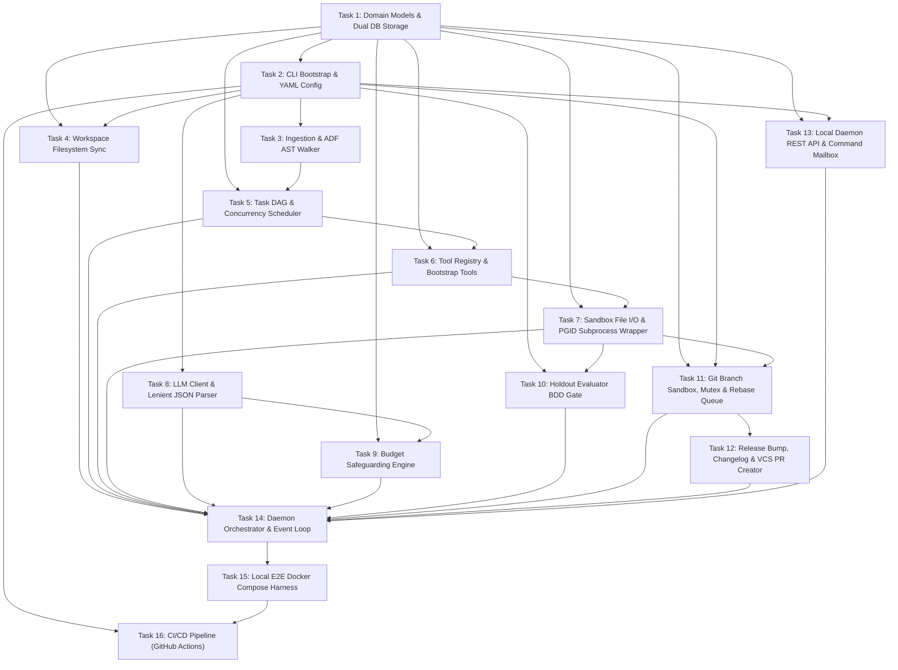

# noctifab MVP + E2E Implementation Roadmap (ROADMAP_MVP.md)

This document outlines the sequential phases and detailed implementation tasks required to build the `noctifab` Minimum Viable Product (MVP) and the End-to-End (E2E) testing framework.

All Go development must adhere strictly to the guidelines defined in [AGENTS.md](AGENTS.md) and [SPEC.md](SPEC.md), particularly the **500-lines-per-file limit**, the use of **Dependency Injection (DI)**, and **100% unit test coverage**.

---

## MVP Scope & Prioritization Guidelines

To guarantee the success of the Minimum Viable Product, implementation tasks are divided into **Mandatory Core (M)** and **Optional/Simplified (O)**. The absolute priority of the noctifab MVP is the **loop-validation cycle** (Observe -> Decide -> Validate -> Execute -> Save). Other secondary features may be stubbed or simplified to maintain focus on loop verification:

*   **Mandatory Core (M)**:
    - **Topological Task Scheduling & Execution**: Constructing the task DAG, file locks registry, and dispatching tasks up to concurrency limits.
    - **Loop-Validation Cycle**: Running sandboxed execution processes, executing holdout BDD scenario tests, counting majority votes, and applying auto-rollback git commands on validation failure.
    - **Resilient State Persistence**: Relational database CRUD mappings for state, tasks, actions, and version tracking.
    - **LLM Completion & Parser**: Deterministic JSON extraction, brace-counting, and type coercion.
    - **Offline E2E Validation**: The Docker Compose testing harness verifying loop integration scenarios completely offline.
*   **Optional/Simplified (O) - Stubbing Allowed**:
    - **Agent Profile Permissions**: Profiles (`default.yaml`, etc.) can be merged into a single permissive model, bypassing complex runtime policy checks.
    - **External Jira ADF Parser**: Remote Jira ingestion can fallback to plain text description parsing, prioritizing the local Markdown spec file reader as the mandatory path.
    - **OpenTelemetry Context Propagation**: OTel tracing SDK setup and propagation across process bounds can be omitted or stubbed using standard logging.
    - **Budget Safeguarding**: Daily USD limits and token consumption checks can use simple mock structures or be bypassed initially.

---

## Roadmap Overview



---

## Detailed Task Checklist

### Task 1: Domain Models & Dual Database Storage Persistence (SQLite & PostgreSQL) `[MANDATORY CORE]`
* **Dependencies**: None
* **Description**: Define the core domain models in clean, distinct Go files under `pkg/domain/` to stay within the 500-lines-per-file limit. Implement the `StateRepository` interface for two storage providers: SQLite (for local runs) and PostgreSQL (for team coordination). Schema DDLs must be embedded in the binary via `go:embed`. Write transactions must run within transactional boundaries.
  * *Performance Optimization (SQLite)*: Enable WAL mode (`_journal_mode=WAL`), set busy timeout (`_busy_timeout=5000`), and serialize write transactions with a global `sync.Mutex` and `MaxOpenConns = 1`.
  * *Performance Optimization (PostgreSQL)*: Use connection pooling with standard configurations (`MaxOpenConns` and `MaxIdleConns`), running operations under standard serial isolation where needed.
* **Definition of Done**:
  - Domain structs defined in `state.go`, `task.go`, `action.go`, `error.go`, and `clarification.go`.
  - SQLite (`sqlite_repository.go`) and PostgreSQL (`postgres_repository.go`) repositories fully implement `StateRepository`.
  - Embedded SQL migrations execute automatically on startup.
  - 100% unit tests cover repository operations (concurrent reads/writes, transaction rollbacks, version mismatches).
* **Acceptance Criteria**:
  1. Go domain models map exactly to relational database schema tables.
  2. Database connections are short-lived and released immediately. They are never kept open during slow outbound LLM or VCS API requests.
* **E2E Test Cases**:
  * *Scenario: Dual-Database Target Validation*
    * **Given** separate test environments configured for SQLite and PostgreSQL.
    * **When** a concurrent write load is executed against both backends.
    * **Then** both complete without lockouts or resource leaks, and transaction versioning operates identically.

---

### Task 2: Cobra CLI Bootstrap & Configuration Loading `[MANDATORY CORE]`
* **Dependencies**: Task 1 (Domain Models & Dual Database Storage Persistence)
* **Description**: Set up the Command Line Interface commands (`init`, `plan`, `start`, `run-once`, `validate`, `maintenance`) using `github.com/spf13/cobra`. Parse YAML configuration file (`.noctifab/config.yaml`) and override properties via environment variables or CLI flags.
* **Definition of Done**:
  - Cobra subcommands defined under `cmd/noctifab/` and routed from `main.go`.
  - Config loading logic parses YAML file and binds environmental flags.
  - Usage text is silenced (`SilenceUsage: true`, `SilenceErrors: true`) globally for all commands, with execution errors routed to centralized logging.
* **Acceptance Criteria**:
  1. Running `noctifab init` in a clean directory creates `.noctifab/config.yaml` and initializes the database.
  2. Running `noctifab init` in a directory containing project files (without a `.noctifab` directory) aborts with exit code `4`.
* **E2E Test Cases**:
  * *Scenario: CLI Directory Cleanliness Guard*
    * **Given** a directory containing existing source files.
    * **When** `noctifab init` is run.
    * **Then** the command logs a warning and exits with code `4`, without creating configuration folders.

---

### Task 3: Specification Ingestion & ADF AST Ingestion Handler `[OPTIONAL/SIMPLIFIED]`
* **Dependencies**: Task 2 (Cobra CLI Bootstrap & Configuration Loading)
* **Description**: Implement specification ingestion to parse the `--input` target. Support local Markdown file paths, GitHub/GitLab issue URLs (fetching details via VCS REST API), and Jira issue URLs. To handle Jira issues, write a Jira REST client and an AST Document Walker to translate Atlassian Document Format (ADF) JSON to GitHub Flavored Markdown (GFM).
  * *Simplification Rule*: In the initial MVP phase, remote issue fetching and the ADF doc walker can be replaced by simple plaintext dumps or skipped entirely in favor of local Markdown file paths.
* **Definition of Done**:
  - Ingestion adapter mapping compiled under `pkg/infrastructure/jira/` and `pkg/infrastructure/vcs/`.
  - Ingestion client handles Markdown files and stubs remote endpoints if needed.
* **Acceptance Criteria**:
  1. Local Markdown specification reader maps titles and description files to the database state cleanly.
* **E2E Test Cases**:
  * *Scenario: Local Markdown Spec File Loading*
    * **Given** a valid local Markdown file path.
    * **When** the ingestion loader is triggered.
    * **Then** the file is parsed and a corresponding task DAG is created in the database.

---

### Task 4: Workspace Filesystem Scanner & Sync `[MANDATORY CORE]`
* **Dependencies**: Task 1 (Domain Models & Dual Database Storage Persistence), Task 2 (Cobra CLI Bootstrap & Configuration Loading)
* **Description**: Implement filesystem walker to index workspace files on start. Clean paths via `filepath.Clean`, filter out blacklisted directories (`node_modules/`, `.noctifab/`, etc.), and synchronize names, sizes, and timestamps to the database. Enforce a scanning limit of 1000 files to optimize prompt performance.
* **Definition of Done**:
  - Scanning logic implemented in `pkg/usecase/scanner.go`.
  - Walker skips matched configurations and caps index count at 1000.
* **Acceptance Criteria**:
  1. Files within excluded paths are never tracked.
  2. Exceeding 1000 files truncates the index and logs a warning.
* **E2E Test Cases**:
  * *Scenario: Workspace Exclusions and Capping*
    * **Given** a workspace containing 1050 source files and a `node_modules/` folder.
    * **When** the sync walker indexes the files.
    * **Then** files under `node_modules/` are ignored, database sync truncates at 1000, and a warning is printed to console log.

---

### Task 5: Task DAG Computation & Concurrency Scheduler `[MANDATORY CORE]`
* **Dependencies**: Task 1 (Domain Models & Dual Database Storage Persistence), Task 3 (Specification Ingestion & ADF AST Ingestion Handler)
* **Description**: Build task scheduling logic. Planner decomposes spec into a task DAG. Scheduler parses task dependency arrays (`DependsOn` using titles or IDs). Resolve titles to IDs, run Depth-First Search (DFS) for cycle detection, and topologically sort tasks. Maintain a file-level locking registry to prevent parallel workers from editing overlapping files.
* **Definition of Done**:
  - DAG verification and topological sorting implemented in `pkg/usecase/dag.go`.
  - In-memory file-level lock registry prevents parallel modifications to identical file targets.
* **Acceptance Criteria**:
  1. Cyclic dependencies halt the planner validation step.
  2. Overlapping tasks are serialized, while non-overlapping tasks execute concurrently up to the `--agents` thread limit.
* **E2E Test Cases**:
  * *Scenario: Parallel Task Deferral on File Lock Overlap*
    * **Given** Task A and Task B both target `pkg/domain/task.go`.
    * **When** execution starts.
    * **Then** Task A is dispatched, and Task B is deferred in `PENDING` until Task A completes and releases its file locks.

---

### Task 6: Tool Registry & Bootstrap Tools `[MANDATORY CORE]`
* **Dependencies**: Task 1 (Domain Models & Dual Database Storage Persistence), Task 5 (Task DAG Computation & Concurrency Scheduler)
* **Description**: Implement a thread-safe `ToolRegistry` map in `pkg/usecase/registry.go`. Register bootstrap tools: `add_task` (writes task node to state), `complete_task` (updates status to SUCCESS), `log_message` (appends trace to action log), and `noop`.
* **Definition of Done**:
  - `Registry` interface defined and registered.
  - Bootstrap tools implement the unified `Tool` interface.
  - Active tool names are returned alphabetically sorted.
* **Acceptance Criteria**:
  1. Calling `add_task` validates schema input and writes the task record in a short-lived transaction.
  2. Tool lists are compiled alphabetically in prompts to guarantee deterministic behavior.
* **E2E Test Cases**:
  * *Scenario: Alphabetical Tool Prompt Formatting*
    * **Given** registered bootstrap tools.
    * **When** compiling system prompts.
    * **Then** the prompt engine lists available tools in strict alphabetical order.

---

### Task 7: Sandbox File I/O & PGID Subprocess Wrapper `[MANDATORY CORE]`
* **Dependencies**: Task 1 (Domain Models & Dual Database Storage Persistence), Task 6 (Tool Registry & Bootstrap Tools)
* **Description**: Implement production agent tools: `read_file`, `write_file`, `edit_file`, `list_directory`, `find_files`, `grep_search`, and `run_tests`. Restrict file access to the workspace directory. Blacklist the `.noctifab/` configuration directory. Implement line-range regex content search & replacement for `edit_file`. Write a Process Group ID (PGID) wrapper for `run_tests` to prevent orphaned child processes.
  * *Simplification Rule*: Fine-grained security profiles (`default.yaml`, `generator.yaml`, etc.) can be merged into a single permissive model or bypassed for testing. The core path jail and PGID cancellation must remain functional.
* **Definition of Done**:
  - Sandbox operations in `pkg/usecase/sandbox.go` filter paths.
  - `edit_file` replaces content, validating target lines.
  - Commands executed in `run_tests` use `SysProcAttr: &syscall.SysProcAttr{Setpgid: true}` and handle PGID recursive cancellation.
* **Acceptance Criteria**:
  1. Access attempts outside the workspace boundary trigger path traversal blocks (`ErrSandboxBlock`).
  2. Attempts to write to `.noctifab/` are blocked.
  3. Cancelling the context kills the subprocess and all its spawned children recursively using the negative PGID (`syscall.Kill(-pgid, syscall.SIGKILL)`).
* **E2E Test Cases**:
  * *Scenario: Subprocess PGID Orphan Cleanup*
    * **Given** a test execution command that spawns multiple background processes.
    * **When** a timeout or SIGINT triggers context cancellation.
    * **Then** the runner terminates the main test process and all child processes recursively.

---

### Task 8: LLM Client & Lenient JSON Response Parser `[MANDATORY CORE]`
* **Dependencies**: Task 2 (Cobra CLI Bootstrap & Configuration Loading)
* **Description**: Create `LLMClient` adapter interface wrapping provider APIs (OpenAI, Anthropic, Gemini, Ollama). Write a lenient JSON parser using a brace-counting algorithm to extract valid JSON blocks from conversational wrappers (e.g. ` ```json ` markers). Clean and normalize types (e.g., coerce stringified booleans and parse single strings as arrays).
* **Definition of Done**:
  - Provider client wrappers compiled under `pkg/infrastructure/llm/`.
  - Lenient parser brace tracker extracts substrings from output.
  - Client implements exponential backoff with full jitter retries up to `--http-max-retries`.
* **Acceptance Criteria**:
  1. Extraction successfully isolates JSON object fields.
  2. Syntax errors are formatted as lint error prompts and fed back to the LLM to trigger a retry.
* **E2E Test Cases**:
  * *Scenario: Conversational LLM Response Extraction*
    * **Given** an LLM output wrapped in conversational leading and trailing paragraphs.
    * **When** the response parser processes the payload.
    * **Then** the JSON block is successfully extracted and mapped to domain models.

---

### Task 9: Budget Safeguarding Engine `[OPTIONAL/SIMPLIFIED]`
* **Dependencies**: Task 1 (Domain Models & Dual Database Storage Persistence), Task 8 (LLM Client & Lenient JSON Response Parser)
* **Description**: Implement billing controls. Prior to each LLM request, estimate outgoing prompt token costs. Query the database to check if `daily_cost + estimated_cost` exceeds `--max-budget-usd`. If exceeded, suspend loop execution. After a response is received, read API usage headers and update the database with the actual cost.
  * *Simplification Rule*: This module is optional for the core execution-validation loop. Cost calculations can return mock entries or simple increments, allowing runs without hard spending blockages.
* **Definition of Done**:
  - Cost calculations implemented in database queries and prompt wrappers.
  - Cost metrics use YAML configured rates (`input_cost_per_million_tokens`, `output_cost_per_million_tokens`).
* **Acceptance Criteria**:
  1. Prompt completion execution aborts before making API calls if the budget limit is exceeded.
* **E2E Test Cases**:
  * *Scenario: Budget Ceiling Execution Pause*
    * **Given** a daily budget limit configuration of `$0.10`.
    * **When** a completion estimate raises the cumulative daily spending to `$0.11`.
    * **Then** the orchestrator suspends the run, does not call the LLM API, and logs a budget ceiling warning.

---

### Task 10: Holdout Evaluator BDD Gate `[MANDATORY CORE]`
* **Dependencies**: Task 2 (Cobra CLI Bootstrap & Configuration Loading), Task 7 (Sandbox File I/O & PGID Subprocess Wrapper)
* **Description**: Create the holdout evaluator BDD engine using the `github.com/cucumber/godog` test runner. BDD scenarios reside under `tests/holdout/` and are blacklisted from the Generator agent's filesystem tools. Run test suites 3 times sequentially, perform majority voting (requiring >= 2/3 pass), quarantine flaky/non-unanimous builds, and return filtered summary error feedback logs to the Generator.
* **Definition of Done**:
  - BDD cucumber test runner initialized under `tests/holdout/`.
  - Evaluator package runs tests 3 times and counts passes/failures.
  - Sandbox file tools block the Generator from accessing the `tests/holdout/` path.
* **Acceptance Criteria**:
  1. Generator cannot view or edit holdout tests.
  2. BDD test runner cleans database state between runs.
  3. Builds fail validation if less than 2 out of 3 runs pass.
* **E2E Test Cases**:
  * *Scenario: Holdout Evaluation Flaky Quarantine*
    * **Given** a holdout test suite that fails 1 out of 3 runs due to transient timeouts.
    * **When** Evaluator runs majority voting.
    * **Then** the task succeeds, but the task is flagged with a "Potentially Flaky Build" warning in the state.

---

### Task 11: Git Branch Sandbox, Centralized Git Mutex & Rebase Queue `[MANDATORY CORE]`
* **Dependencies**: Task 1 (Domain Models & Dual Database Storage Persistence), Task 2 (Cobra CLI Bootstrap & Configuration Loading), Task 7 (Sandbox File I/O & PGID Subprocess Wrapper)
* **Description**: Build Git command CLI wrappers. To prevent concurrent git write contentions and `fatal: Unable to create '.git/index.lock'` errors, wrap all git commands in a centralized `sync.RWMutex` with a lock timeout (`git_mutex_timeout`, default `30s`) and retry backoff. Worker agents run in isolated git worktrees. Implement a **Sequential Rebase Queue** channel to serialize all merge/rebase write operations. Active branch rebasing uses lazy synchronization: branches are only rebased and validated when they start a new task.
* **Definition of Done**:
  - Git operations wrapper compiled under `pkg/infrastructure/vcs/git.go`.
  - Centralized RWMutex blocks parallel git writes.
  - Rebase queue serializes branch updates and manages `git stash` and `git stash pop` cycles.
* **Acceptance Criteria**:
  1. Multiple threads can read git status concurrently (using read lock).
  2. Writing commands (worktree add, commit, push, merge) acquire a write lock.
  3. Git lock acquisition failure retries up to `--git-operation-retries` before failing.
* **E2E Test Cases**:
  * *Scenario: Git Mutex Lock Timeout Retry*
    * **Given** a thread holding the global git write lock.
    * **When** another thread attempts to commit and exceeds the timeout.
    * **Then** the command fails with a transient error, triggering the orchestrator's retry cycle.

---

### Task 12: Centralized Release Bumping, CHANGELOG.md & VCS PR Creator `[MANDATORY CORE]`
* **Dependencies**: Task 11 (Git Branch Sandbox, Centralized Git Mutex & Rebase Queue)
* **Description**: Implement central release bumping. Individual workers must never modify the `VERSION` or `CHANGELOG.md`. Bumping is handled centrally by the orchestrator loop: read `VERSION` (strip space, validate against strict semver regex), bump version (MAJOR if any task is breaking, MINOR if feature, PATCH if fix), and write to `VERSION`. Update `CHANGELOG.md` following Keep a Changelog. Commit updates using Conventional Commits, push the branch, and create a Pull Request on GitHub/GitLab. Implement the `--vcs-credential-helper` to retrieve fresh credentials and map 401/403 errors to permanent failure.
* **Definition of Done**:
  - Version reader and writer validate semver.
  - Release bump, conventional commits, and Keep a Changelog compiler compiled in `pkg/usecase/release.go`.
  - GitHub and GitLab API adapters handle pull request creation.
  - Auto-rollback policies revert merge commits and push failed branches to the `noctifab-quarantine/` namespace.
* **Acceptance Criteria**:
  1. The `VERSION` file is initialized to `0.0.1` by `init` and matches raw semver formatting.
  2. Authentication errors (401/403) from VCS operations immediately halt dispatching and trigger operator alerts.
  3. Branch integration failures trigger auto-rollback: revert merge on integration branch and quarantine task branch.
* **E2E Test Cases**:
  * *Scenario: Auto-Rollback on Integration Failure*
    * **Given** a merged branch that subsequently fails holdout validation checks.
    * **When** the auto-rollback policy triggers.
    * **Then** the orchestrator reverts the merge commit on the main branch, pushes the revert, moves the task branch to quarantine, and resets the task status to `PENDING` (or `FAILED` if retries are exhausted).

---

### Task 13: Local Daemon REST API Interface & Command Mailbox Server `[MANDATORY CORE]`
* **Dependencies**: Task 1 (Domain Models & Dual Database Storage Persistence), Task 2 (Cobra CLI Bootstrap & Configuration Loading)
* **Description**: Implement the local daemon HTTP server and the interactive stdin console command parser. The HTTP server must bind strictly to loopback interface `127.0.0.1:18080` (rejecting external bindings like `0.0.0.0`). Map stdin inputs (`answer`, `add-task`, `override-merge`) and HTTP endpoints (`/healthz`, `/readyz`, `/statusz`, `/api/v1/clarifications/{id}/resolve`, etc.) to command channel payloads. Implement the clarification timeout auto-decision.
* **Definition of Done**:
  - Local HTTP server listening on loopback interface.
  - Stdin command parser runs inside a background goroutine.
  - Interactive inputs and HTTP requests push mutation payloads to the `command_channel.go` Go channel.
  - After `--clarification-timeout` (default 30m), open questions are answered via LLM auto-decision using a Staff Software Engineer prompt.
* **Acceptance Criteria**:
  1. Daemon REST API endpoints return correct statuses (healthz, statusz DAG dumps).
  2. Resolving a clarification updates the database and resumes blocked tasks.
* **E2E Test Cases**:
  * *Scenario: Clarification Timeout Auto-Decision*
    * **Given** an open clarification request in the database.
    * **When** no user response is received within the timeout window.
    * **Then** the orchestrator calls the LLM with the auto-decision prompt, records the answer, marks it resolved, and resumes execution.

---

### Task 14: Daemon Orchestrator Event Loop & Context Propagation `[MANDATORY CORE]`
* **Dependencies**: Task 4 (Workspace Filesystem Scanner & Sync), Task 5 (Task DAG Computation & Concurrency Scheduler), Task 6 (Tool Registry & Bootstrap Tools), Task 7 (Sandbox File I/O & PGID Subprocess Wrapper), Task 8 (LLM Client & Lenient JSON Response Parser), Task 9 (Budget Safeguarding Engine), Task 10 (Holdout Evaluator BDD Gate), Task 11 (Git Branch Sandbox, Centralized Git Mutex & Rebase Queue), Task 12 (Centralized Release Bumping, CHANGELOG.md & VCS PR Creator), Task 13 (Local Daemon REST API Interface & Command Mailbox Server)
* **Description**: Implement the core daemon execution loop in `pkg/usecase/orchestrator.go`. Manage the Observe-Decide-Validate-Execute cycles. Drains the database mutation command channel sequentially to prevent OCC locking contentions. Limit context size using sliding window and compaction modes. Integrate OpenTelemetry (OTel) tracing.
  * *Simplification Rule*: OpenTelemetry tracer integrations can be omitted or stubbed using standard logging wrappers initially, but the loop coordination and Observe-Decide-Validate-Execute state transitions are strictly mandatory.
* **Definition of Done**:
  - Event loop coordinates polling.
  - Go channel serializes database updates sequentially.
  - Sliding window history limit (max messages) and compaction modes.
* **Acceptance Criteria**:
  1. Mutating database operations route through the single-threaded event loop.
  2. Outbound HTTP requests and spawned command sandboxes propagate W3C trace contexts.
* **E2E Test Cases**:
  * *Scenario: Graceful Daemon Shutdown*
    * **Given** an active daemon execution loop with running workers.
    * **When** a SIGTERM signal is received.
    * **Then** the daemon stops dispatching tasks, cancels the context (recursively terminating subprocess PGIDs), waits for the grace period, marks active tasks as `INTERRUPTED`, and saves the database state.

---

### Task 15: Local E2E Docker Compose Integration Suite `[MANDATORY CORE]`
* **Dependencies**: Task 14 (Daemon Orchestrator Event Loop & Context Propagation)
* **Description**: Create the local multi-container offline testing sandbox under `tests/e2e/`. Implement a Mock LLM provider service (matching prompts/state against rule JSONs and returning actions). Configure a local CGI Git daemon (`git-http-backend`) and a mock VCS API server (GitHub API mocks). Set up the host-side scenario runner.
* **Definition of Done**:
  - Mock LLM, mock VCS, and real databases running in Docker Compose topology.
  - Scenario runner copies mock project templates, launches networks, queries task state, and asserts post-conditions.
  - Validation covers happy path runs, file lock deferrals, path traversal blocks, rollback policies, OCC conflicts, and budget limit pauses.
* **Acceptance Criteria**:
  1. The complete execution cycle runs offline without internet connectivity.
  2. Integration tests run quickly and validate scheduling, locking, and rollback behaviors under load.
* **E2E Test Cases**:
  * *Scenario: Full Offline Autonomous Loop Integration*
    * **Given** a mock project repository containing a broken unit test.
    * **When** the host runner starts the `noctifab` container with the associated LLM rules.
    * **Then** the daemon plans tasks, checkout branches, resolves the code, validates via holdout BDD, bumps version files, updates the changelog, merges the code, and exits with 0.

---

### Task 16: CI/CD Pipeline (GitHub Actions Workflows) `[MANDATORY CORE]`
* **Dependencies**: Task 2 (Cobra CLI Bootstrap & Configuration Loading), Task 15 (Local E2E Docker Compose Integration Suite)
* **Description**: Create the GitHub Actions CI pipeline configuration under `.github/workflows/ci.yml`. Configure automated steps to:
  * Install the target Go runtime environment, cache dependencies, and run the `golangci-lint` runner static analysis checks.
  * Run the unit test suite with race detector enabled (`go test -v -race ./...`).
  * Run the offline E2E integration test suite within the Docker container/network environment.
* **Definition of Done**:
  - CI workflow file `.github/workflows/ci.yml` is defined and correctly configured.
  - Linting checks, unit tests, and E2E integration checks execute successfully on every push and pull request.
* **Acceptance Criteria**:
  - The pipeline succeeds only if all unit tests pass, `golangci-lint` reports zero issues, and all E2E integration tests pass.
* **E2E Test Cases**:
  * *Scenario: CI Pipeline Verification*
    * **Given** a pull request branch pushed to the remote repository.
    * **When** the GitHub Actions workflow triggers.
    * **Then** the pipeline builds the Go application, executes `golangci-lint`, runs the unit test suite, runs the E2E suite, and completes successfully.
