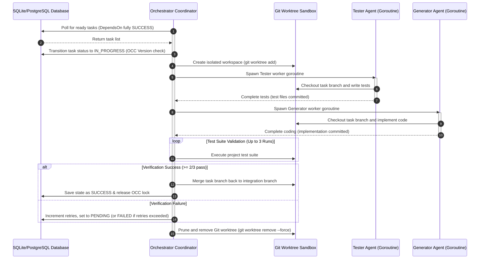

# SPEC.md: noctifab Project Specification

## 1. Executive Summary

`noctifab` is a Dark Factory Platform for GitHub and GitLab. A "Dark Factory" (in software engineering context) is an autonomous, long-running agentic harness that operates without human intervention to resolve issues, verify builds, run tests, and manage software project lifecycles.

`noctifab` is compiled as a single Go binary that functions as a Command Line Interface (CLI) tool. It runs as a single-node autonomous loop engine, replacing the manual developer execution bottleneck.

### 1.1. Autonomy Level Matrix

The platform classifies development automation into five distinct levels:

| Level | Name | Platform Behavior |
|---|---|---|
| **Level 1** | Autocomplete | AI suggests code inline. Human drives the editor and makes all decisions. |
| **Level 2** | Interactive Assistant | AI generates entire files/functions. Human reviews every single change in the editor. |
| **Level 3** | Spec-Driven (Gated) | AI generates code autonomously from specifications. Continuous test suites gate quality. Human clicks merge. |
| **Level 3.5** | Selective Auto-Merge | Same as Level 3, but low-risk modules merge automatically. Human can block. |
| **Level 4** | Full Dark Factory | Specs go in, tested code comes out fully merged. Human reviews only exceptions. |

`noctifab` is designed to run at **Level 3** and **Level 4** autonomy.

| Level | Key Config Settings | Behavior |
|---|---|---|
| **Level 3** | `pull_request.auto_create: true`<br>`pull_request.auto_merge: false` | PRs created automatically; human must click merge. |
| **Level 3.5** | `pull_request.auto_create: true`<br>`pull_request.auto_merge: true` (+ per-module profiles)<br>`ci.auto_fix: true` | Low-risk PRs merge automatically; human can block. CI auto-fix enabled. |
| **Level 4** | `pull_request.auto_create: true`<br>`pull_request.auto_merge: true`<br>`pull_request.auto_rebase: true`<br>`ci.auto_fix: true`<br>`ci.max_retries: 3` | Full dark factory — specs in, tested code out fully merged. Human reviews only exceptions. |

---

## 2. Core Architecture & Design Principles

To ensure maintainability, scalability, and clarity for both human developers and future AI coding agents, `noctifab` follows these strict architectural guidelines:

*   **Language:** Go (Golang).
*   **Dependency Injection (DI):** All components must receive their dependencies explicitly via constructors. Global state or hardcoded dependencies are strictly prohibited.
*   **SOLID Principles:** High cohesion and loose coupling. Abstractions (interfaces) must separate the system's logic from external API providers and storage.
*   **Domain-Driven Design (DDD):** Organize packages by domain boundaries rather than by technical layers (e.g., separate domain models/entities, use cases/services, and adapters/infrastructure).
*   **Code Length Constraint:** No Go source code file may exceed **500 lines** of code (defined strictly as **500 physical lines** including comments, blank lines, and imports to facilitate fast lint validation e.g. using simple line count checks). This ensures components remain focused, modular, and easy for LLMs to read and modify without losing context.
*   **Test-Driven Development Layout:** Every package must include unit tests alongside the files they test (e.g., `validator.go` and `validator_test.go`).
*   **Instructive Linter Mandate:** Static analysis checks used in the development loop must print *instructive actions* instead of mere descriptions. For example, instead of *"Service depends on Controller"*, the output must read *"Service class imports from Controller package. Move the shared types to domain/model package instead"*. This drastically increases the agent's first-try correction rate.
*   **Developer Documentation Guidelines:** A `.readthedocs.yaml` configuration file must be present at the root, and a `docs/` folder must contain Markdown documentation detailing project usage, setup instructions, and guides on how developers can extend the orchestration framework.
*   **Repository Standards and Documentation:** The repository must maintain a `VERSION` file at the root containing the current semver release, a `CHANGELOG.md` detailing change history conforming to the "Keep a Changelog" standard, and a comprehensive `README.md` at the root. The `README.md` must include project status badges, links to the Read the Docs page, a description of the project, basic CLI usage instructions, license information, and collaboration guidelines.
*   **Industry Coding Standards:** When modifying or writing code, AI agents must strictly follow the most popular and established standards of the target language and platform (e.g. Go Code Review Comments for Go, standard libraries, and standard formatting conventions), unless explicitly instructed otherwise. For Ruby projects, the generated code must pass all RuboCop styling, quality, and linting checks.
*   **Encapsulation & Package Boundaries:** Struct types are exported to allow type assertions and interface compliance, but their internal fields remain unexported to enforce encapsulation. All access goes through constructors and public methods. Tests use the public API (black-box testing) wherever possible.
*   **Context Propagation:** All functions performing I/O or calling external APIs accept `context.Context` as their first parameter. Context is never stored in structs — it is passed through the call chain from the orchestrator loop down to tool execution and LLM client calls. Timeouts, trace spans, and cancellation propagate strictly through context.
*   **Database Selection & Performance:** PostgreSQL is the recommended database for production use to guarantee maximum transaction throughput, concurrency, and connection stability. SQLite is supported strictly as a zero-setup local development database; its inherent write-locking and performance limitations are acceptable and expected in single-developer/testing environments.

### 2.1. Directory Layout & Go Package Structure

The repository must follow a standardized layout aligning with Go best practices and DDD packaging:

```
noctifab/
├── .github/                   # CI configurations
│   └── workflows/
│       └── ci.yml             # CI Workflow for linting and unit tests
├── docs/                      # Markdown documentation for developers (usage, extension guides)
├── cmd/
│   └── noctifab/
│       └── main.go            # Entrypoint and CLI subcommand setup (Cobra CLI)
├── pkg/
│   ├── domain/                # Enterprise & domain entities (100% pure Go, no external imports)
│   │   ├── state.go           # State structures & StateRepository interface
│   │   ├── task.go            # Task entities and behaviors
│   │   ├── action.go          # Action execution logs
│   │   └── error.go           # Domain error model and sentinel errors
│   ├── usecase/               # Orchestration, main loop, rules validation
│   │   ├── orchestrator.go    # Daemonized polling loop & worker handoff
│   │   ├── registry.go        # Tool Registry implementation
│   │   ├── validator.go       # Policy & safety rules checker
│   │   ├── scheduler.go       # Topological scheduling, worker goroutine pool & file locks
│   │   ├── dag.go             # cycle checks, title-to-UUID resolving maps
│   │   ├── test_validator.go  # Test validation suite execution, 3x runner & majority voter
│   │   ├── sandbox.go         # Host path jail, warm docker containers & CLI execution wrapper
│   │   ├── release.go         # Semver bump algorithm & CHANGELOG.md compiler
│   │   ├── command_channel.go # FIFO serial input mailbox & transaction loop
│   │   └── rebase_queue.go    # Asynchronous, serialized git rebase/merge worker
│   └── infrastructure/        # Frameworks, drivers, and external adapters
│       ├── llm/               # LLM client & custom parser (lenient parsing & validation)
│       ├── storage/           # State persistence
│       │   ├── sqlite_repository.go   # WAL mode, busy timeout, connection limiting
│       │   └── postgres_repository.go # Production PGX connection, SELECT FOR UPDATE row-locks
│       ├── vcs/               # Git & APIs (GitHub, GitLab adapters)
│       └── jira/              # Jira API Client (authentication & ADF parser)
├── tests/                     # Test suites
│   ├── e2e/                   # E2E integration test suite
│   │   ├── mock_llm/          # Mock LLM provider service
│   │   ├── mock_vcs/          # Mock VCS Git CGI server & API mock endpoints
│   │   └── scenarios/         # Directory for JSON rules and scenario inputs
├── .gitignore                 # Root level gitignore file to exclude build binaries, temp files, etc.
├── .noctifab/                 # Local daemon runtime configuration directory
│   ├── .gitignore             # Config gitignore file (ignores database and logs)
│   ├── config.yaml            # Main YAML configuration file
│   ├── data/
│   │   └── noctifab.db        # SQLite database file
│   └── profiles/              # Role authorization profiles (planner.yaml, generator.yaml, etc.)
├── .readthedocs.yaml          # Read the Docs configuration file
├── CHANGELOG.md               # Project changelog following Keep a Changelog
├── LICENSE
├── Makefile                   # Project build pipeline automation rules
├── README.md                  # Project README with badges, docs links, CLI usage, and collaboration guide
├── VERSION                    # Project version file (semver)
└── go.mod                     # Go module definitions
```

### 2.2. Go Dependency Management & Module Path

The codebase functions as a Go module with the canonical module path `github.com/diegojromerolopez/noctifab`. The system requires a minimum Go version of **Go 1.22** to utilize advanced library APIs (e.g. `slices.Sort`).

The required third-party dependencies are:
1.  `github.com/spf13/cobra` - The standard CLI framework for subcommand routing.
2.  `modernc.org/sqlite` - Pure Go SQLite driver for local state persistence.
3.  `github.com/jackc/pgx/v5` - Pure Go PostgreSQL driver and toolkit.
4.  `go.opentelemetry.io/otel` - OpenTelemetry instrumentation framework.
5.  `github.com/google/uuid` - Standard UUID generation library.
6.  `github.com/stretchr/testify` - Preferred library for assertion-rich unit tests.


---

## 3. Architecture & Components

`noctifab` consists of five primary core components coordinated by an orchestrator/main loop:

```
                 ┌──────────┐
                 │  State   │
                 └────┬─────┘
                      │
                      ▼
               ┌──────────┐
               │ Prompt   │
               └────┬─────┘
                      │
                      ▼
               ┌──────────┐
               │   LLM    │
               └────┬─────┘
                      │
                      ▼
               ┌──────────┐
               │Validator │
               └────┬─────┘
                      │
                      ▼
               ┌──────────┐
               │ Tool Reg │
               └────┬─────┘
                      │
                      ▼
               ┌──────────┐
               │ Execute  │
               └────┬─────┘
                      │
                      ▼
                 Update
                  State
```

### 3.1. State Struct (The World Model)
The State acts as the single source of truth for the entire system. The LLM is designed to be completely stateless; it has no memory of past runs, actions, or details other than what is explicitly contained inside the `State` provided during the loop cycle.

#### Struct Definition (`pkg/domain/state.go`)
Domain models are split across distinct files to remain clean and adhere to the 500-physical-line file constraint.

**State Model (`pkg/domain/state.go`):**
```go
package domain

import "time"

// ValidationType specifies the category of compliance check being run.
type ValidationType string

const (
	// ValidationCommand executes shell verification test suites (e.g. go test).
	ValidationCommand     ValidationType = "COMMAND"
	// ValidationFileExists checks for the existence of a target file.
	ValidationFileExists  ValidationType = "FILE_EXISTS"
	// ValidationFileContent executes regex checks over file contents.
	ValidationFileContent ValidationType = "FILE_CONTENT"
)

// ValidationCriterion defines a quality checklist item used to evaluate task goals.
type ValidationCriterion struct {
	ID          string         `json:"id"`
	Type        ValidationType `json:"type"`
	Expression  string         `json:"expression"` // Command line, filepath, or regex target
	Description string         `json:"description"`
	Passed      bool           `json:"passed"`
	ErrorLog    string         `json:"error_log,omitempty"`
}

// Clarification holds questions raised by agents and replies from human operators.
type Clarification struct {
	Question string    `json:"question"`
	Answer   string    `json:"answer,omitempty"`
	Resolved bool      `json:"resolved"`
	AskedAt  time.Time `json:"asked_at"`
}

// AgentRole defines the function an agent performs in the orchestration pipeline.
type AgentRole string

const (
	// AgentRolePlanner decomposes specifications into task DAGs.
	AgentRolePlanner   AgentRole = "PLANNER"
	// AgentRoleGenerator writes code and executes tool actions.
	AgentRoleGenerator AgentRole = "GENERATOR"
	// AgentRoleTester writes tests and validates output.
	AgentRoleTester   AgentRole = "TESTER"
)

// AgentStatus tracks the lifecycle state of a worker agent.
type AgentStatus string

const (
	// AgentIdle represents an agent available for task assignment.
	AgentIdle      AgentStatus = "IDLE"
	// AgentWorking represents an agent actively executing a task.
	AgentWorking   AgentStatus = "WORKING"
	// AgentCompleted represents an agent that has finished its task.
	AgentCompleted AgentStatus = "COMPLETED"
)

// Agent represents a processing worker in the execution environment.
type Agent struct {
	ID          string      `json:"id"`
	Name        string      `json:"name"`
	Role        AgentRole   `json:"role"`
	Status      AgentStatus `json:"status"`
	TaskID      string      `json:"task_id,omitempty"`
	StartedAt   time.Time   `json:"started_at,omitempty"`
	CompletedAt time.Time   `json:"completed_at,omitempty"`
	TokensUsed  int64       `json:"tokens_used"`
	LastError   string      `json:"last_error,omitempty"`
}

// FileInfo contains simple metadata about files inside the workspace.
type FileInfo struct {
	Path         string    `json:"path"`
	Size         int64     `json:"size"`
	LastModified time.Time `json:"last_modified"`
}

// BuildStatus tracks the overall health of the workspace build.
type BuildStatus string

const (
	// BuildPassing indicates that compilation, formatting, and all test validations passed.
	BuildPassing BuildStatus = "PASSING"
	// BuildFailing indicates that one or more checks failed.
	BuildFailing BuildStatus = "FAILING"
	// BuildUnknown indicates that verification checks have not been run.
	BuildUnknown BuildStatus = "UNKNOWN"
)

// StateMetadata holds structured session parameters and cost aggregations.
type StateMetadata struct {
	InputSource       string `json:"input_source"`                 // Source of the specification (e.g., "markdown", "jira", "github")
	InputPath         string `json:"input_path"`                   // Original path or URL of the specification
	IntegrationBranch string `json:"integration_branch"`           // Feature integration branch name (e.g., "feature/feature-auth")
	FeatureName       string `json:"feature_name"`                 // Human-readable name of the feature being built
	BaseBranch        string `json:"base_branch"`                  // Branch from which the integration branch was created (e.g., "main")
	ProjectVersion    string `json:"project_version"`              // Current project version from VERSION file (e.g., "0.0.1")
	TotalTokensUsed   int64  `json:"total_tokens_used"`            // Cumulative token count across all agents
	TotalCostUSD      string `json:"total_cost_usd,omitempty"`     // Estimated LLM API cost in USD
}

// State represents the complete system database state record.
type State struct {
	ID                 string                `json:"id"`
	ProjectPath        string                `json:"project_path"`
	Version            int                   `json:"version"` // Optimistic Concurrency version tag
	Clarifications     []Clarification       `json:"clarifications,omitempty"`
	ValidationCriteria []ValidationCriterion `json:"validation_criteria,omitempty"`
	Tasks              []Task                `json:"tasks"`
	ActiveAgents       []Agent               `json:"active_agents"`
	Files              []FileInfo            `json:"files"`
	BuildStatus        BuildStatus           `json:"build_status"`
	LastActions        []Action              `json:"last_actions"`
	Metadata           StateMetadata         `json:"metadata"`
}
```

**Task Model (`pkg/domain/task.go`):**
```go
package domain

import "time"

// TaskStatus classifies the topological execution state of a work plan item.
type TaskStatus string

const (
	// TaskPending represents a task awaiting execution or parent dependency resolution.
	TaskPending         TaskStatus = "PENDING"
	// TaskInProgress represents a task actively assigned to a generator agent goroutine.
	TaskInProgress      TaskStatus = "IN_PROGRESS"
	// TaskSuccess represents a task successfully validated, merged, and completed.
	TaskSuccess         TaskStatus = "SUCCESS"
	// TaskFailed represents a task failing build or tests beyond retry threshold.
	TaskFailed          TaskStatus = "FAILED"
	// TaskConflictBlocked represents a task temporarily halted due to Git conflicts.
	TaskConflictBlocked TaskStatus = "CONFLICT_BLOCKED"
	// TaskConflictFailed represents a task aborted due to continuous OCC conflicts.
	TaskConflictFailed  TaskStatus = "CONFLICT_FAILED"
	// TaskInterrupted represents a task suspended during graceful daemon shutdown.
	TaskInterrupted     TaskStatus = "INTERRUPTED"
)

// ChangeType classifies the scope of a task's adjustments for semver release bumping.
type ChangeType string

const (
	// ChangeTypeFeature triggers minor version upgrades (+0.1.0).
	ChangeTypeFeature  ChangeType = "FEATURE"
	// ChangeTypeFix triggers patch version upgrades (+0.0.1).
	ChangeTypeFix      ChangeType = "FIX"
	// ChangeTypeBreaking triggers major version upgrades (+1.0.0).
	ChangeTypeBreaking ChangeType = "BREAKING"
)

// Task represents a specific item in the scheduling graph.
type Task struct {
	ID               string     `json:"id"`
	Title            string     `json:"title"`
	Description      string     `json:"description"`
	Status           TaskStatus `json:"status"`
	ChangeType       ChangeType `json:"change_type"`
	AssignedTo       string     `json:"assigned_to"`
	DependsOn        []string   `json:"depends_on"` // Can store parent task IDs or matching titles
	TargetFiles      []string   `json:"target_files,omitempty"`
	PartialChangelog []string   `json:"partial_changelog,omitempty"`
	Retries          int        `json:"retries"`
	MaxRetries       int        `json:"max_retries"`
	CreatedAt        time.Time  `json:"created_at"`
	UpdatedAt        time.Time  `json:"updated_at"`
}
```

**Action Model (`pkg/domain/action.go`):**
```go
package domain

import "time"

// Action records execution history and outcomes of tools run by agents.
type Action struct {
	Timestamp time.Time      `json:"timestamp"`
	Tool      string         `json:"tool"`
	Args      map[string]any `json:"args"`
	Reasoning string         `json:"reasoning"`
	Result    string         `json:"result"`
	Success   bool           `json:"success"`
}
```

**Error Model (`pkg/domain/error.go`):**
```go
package domain

import "errors"

// ErrorKind determines the severity and category of a domain execution error.
type ErrorKind string

const (
	// ErrTransient represents temporary failures that can be retried.
	ErrTransient    ErrorKind = "TRANSIENT"
	// ErrPermanent represents fatal logic errors requiring configuration change.
	ErrPermanent    ErrorKind = "PERMANENT"
	// ErrSandboxBlock represents sandbox policy violations.
	ErrSandboxBlock ErrorKind = "SANDBOX_VIOLATION"
	// ErrValidation represents feature verification failures.
	ErrValidation   ErrorKind = "VALIDATION_FAILURE"
)

// Sentinel errors for standard failure classification.
var (
	ErrTaskNotFound      = errors.New("task not found")
	ErrVersionConflict   = errors.New("optimistic concurrency version conflict")
	ErrSandboxViolation  = errors.New("sandbox boundary violation")
	ErrBudgetExhausted   = errors.New("LLM token budget exhausted")
	ErrMaxRetriesReached = errors.New("maximum retries exceeded")
)

// DomainError groups errors for structured tracking and propagation.
type DomainError struct {
	Kind    ErrorKind `json:"kind"`
	Message string    `json:"message"`
	Cause   error     `json:"-"`
}

// Error formats the DomainError as a readable string representation.
func (e *DomainError) Error() string {
	if e.Cause != nil {
		return e.Message + ": " + e.Cause.Error()
	}
	return e.Message
}

// Unwrap exposes the underlying cause to enable errors.Is/As evaluations.
func (e *DomainError) Unwrap() error {
	return e.Cause
}
```

#### State Storage Interface (`pkg/domain/state_repository.go`)
```go
package domain

import "context"

// StateRepository defines the contract for loading and saving system state.
type StateRepository interface {
	Load(ctx context.Context) (*State, error)
	Save(ctx context.Context, state *State) error
}
```

#### 3.1.1. Storage Provider Implementations & Schema Normalization
To prevent CPU/memory serialization overhead and database locks under high concurrency, the domain `State` model is relationally normalized into separate database tables rather than stored as a monolithic JSON string. Both database providers reconstruct the domain model dynamically in the repository implementation using SQL joins and transactional saves.

##### Concurrency Control and Locking Policies
1.  **PostgreSQL Provider (Recommended for Production, `pkg/infrastructure/storage/postgres_repository.go`):**
    *   **Prioritization:** PostgreSQL is the recommended database for production environments to handle concurrent transactions at scale.
    *   **Concurrency:** Employs explicit row-level locking (`SELECT FOR UPDATE` on the target `state` row during read-for-write checks) and standard PostgreSQL transactions (`isolation level repeatable read`). This guarantees that concurrent database state modifications from multiple worker processes or goroutines are serialized safely.
    *   **Interface compliance check:**
        ```go
        var _ domain.StateRepository = (*PostgresRepository)(nil)
        ```

2.  **SQLite Provider (Development Only, `pkg/infrastructure/storage/sqlite_repository.go`):**
    *   **Prioritization:** Supported strictly as a zero-setup local developer database.
    *   **Connection Limits & Busy Timeout:** To prevent SQLite write blockages and `database is locked` errors, the repository initializes SQLite connection DSN with Write-Ahead Logging (WAL) enabled and busy timeout set to 5 seconds (`_busy_timeout=5000` and `_journal_mode=WAL`).
    *   **Serialized SQLite Write Mutex:** Because WAL mode allows concurrent readers but only a single active writer connection, the SQLite provider explicitly limits the write connection pool to `MaxOpenConns = 1` for writes, and wraps all write transaction blocks in a package-level package-global Mutex (`sync.Mutex`). This prevents in-process write contention.
    *   **Interface compliance check:**
        ```go
        var _ domain.StateRepository = (*SQLiteRepository)(nil)
        ```

##### Example of Optimistic Concurrency Control (OCC) save transaction logic in Go (SQLite repository):
```go
package storage

import (
	"context"
	"database/sql"
	"errors"
	"sync"
	"time"

	"github.com/diegojromerolopez/noctifab/pkg/domain"
)

type SQLiteRepository struct {
	db         *sql.DB
	writeMutex sync.Mutex
}

func (r *SQLiteRepository) Save(ctx context.Context, state *domain.State) error {
	r.writeMutex.Lock()
	defer r.writeMutex.Unlock()

	tx, err := r.db.BeginTx(ctx, nil)
	if err != nil {
		return err
	}
	defer tx.Rollback()

	// 1. Fetch current version to check for conflict
	var currentVersion int
	err = tx.QueryRowContext(ctx, "SELECT version FROM state WHERE id = ?", state.ID).Scan(&currentVersion)
	if err != nil {
		if errors.Is(err, sql.ErrNoRows) {
			// Handle initial creation if not exists
			currentVersion = 0
		} else {
			return err
		}
	}

	// 2. Perform optimistic concurrency version check
	if state.Version != currentVersion {
		return errors.New("ErrVersionConflict: state modified by another process")
	}

	// 3. Increment version and save state updates
	nextVersion := state.Version + 1
	_, err = tx.ExecContext(ctx, 
		"UPDATE state SET version = ?, updated_at = ? WHERE id = ?", 
		nextVersion, time.Now(), state.ID,
	)
	if err != nil {
		return err
	}

	// [Insert normalized task and action table saves inside the transaction here...]

	if err = tx.Commit(); err != nil {
		return err
	}

	state.Version = nextVersion
	return nil
}
```

Database transactions are short-lived. A connection handle is never held open during slow external network calls (such as LLM API completions) or tool execution runs.

##### Database Schema Migrations & Backward Compatibility
*   **Automatic Startup Migrations:** Embedded SQL migration files (e.g. `./sql/0001_init.sql`) are compiled into the binary via Go's `go:embed`. On daemon startup (`noctifab start`) or during maintenance (`noctifab maintenance`), the migrator executes migrations sequentially.
*   **Transactional Execution:** Each migration script executes inside a single transaction. If any query fails, the transaction is rolled back, the daemon startup aborts immediately with process exit code `3`, and the SQL exception trace is printed to `stderr`.
*   **Migration Tracking Table:** Migrations are tracked in a `schema_migrations` table containing the columns `version` and `applied_at`.
*   **Serialized Schema Evolution:** Go struct JSON/relational mapping logic includes a metadata schema version tag. The loader adapter parses this tag. If a legacy schema version is detected, it passes the data through an intermediate mapper pipeline that maps old JSON structures or missing columns to current Go struct models before returning, ensuring backward compatibility.

##### Schema DDL Specifications

**SQLite Schema:**
```sql
CREATE TABLE IF NOT EXISTS state (
    id TEXT PRIMARY KEY,
    project_path TEXT NOT NULL,
    version INTEGER NOT NULL,
    build_status TEXT NOT NULL,
    input_source TEXT,
    input_path TEXT,
    integration_branch TEXT,
    feature_name TEXT,
    base_branch TEXT,
    project_version TEXT,
    total_tokens_used INTEGER NOT NULL DEFAULT 0,
    total_cost_usd TEXT NOT NULL DEFAULT '0.00000'
);

CREATE TABLE IF NOT EXISTS tasks (
    id TEXT PRIMARY KEY,
    state_id TEXT NOT NULL,
    title TEXT NOT NULL,
    description TEXT NOT NULL,
    status TEXT NOT NULL,
    change_type TEXT NOT NULL,
    assigned_to TEXT NOT NULL DEFAULT '',
    depends_on TEXT NOT NULL, -- JSON array of parent task IDs or titles
    target_files TEXT, -- JSON array of paths
    partial_changelog TEXT, -- JSON array of changelog entries
    retries INTEGER NOT NULL DEFAULT 0,
    max_retries INTEGER NOT NULL DEFAULT 3,
    created_at DATETIME NOT NULL,
    updated_at DATETIME NOT NULL,
    FOREIGN KEY(state_id) REFERENCES state(id) ON DELETE CASCADE
);

CREATE TABLE IF NOT EXISTS clarifications (
    id TEXT PRIMARY KEY,
    state_id TEXT NOT NULL,
    question TEXT NOT NULL,
    answer TEXT DEFAULT '',
    resolved INTEGER NOT NULL DEFAULT 0,
    asked_at DATETIME NOT NULL,
    FOREIGN KEY(state_id) REFERENCES state(id) ON DELETE CASCADE
);

CREATE TABLE IF NOT EXISTS actions (
    id INTEGER PRIMARY KEY AUTOINCREMENT,
    state_id TEXT NOT NULL,
    task_id TEXT,
    timestamp DATETIME NOT NULL,
    tool TEXT NOT NULL,
    args TEXT NOT NULL, -- JSON formatted string
    reasoning TEXT NOT NULL,
    result TEXT NOT NULL,
    success INTEGER NOT NULL,
    FOREIGN KEY(state_id) REFERENCES state(id) ON DELETE CASCADE
);

CREATE TABLE IF NOT EXISTS workspace_files (
    path TEXT PRIMARY KEY,
    state_id TEXT NOT NULL,
    size INTEGER NOT NULL,
    last_modified DATETIME NOT NULL,
    FOREIGN KEY(state_id) REFERENCES state(id) ON DELETE CASCADE
);

CREATE TABLE IF NOT EXISTS token_usage (
    id INTEGER PRIMARY KEY AUTOINCREMENT,
    timestamp DATETIME DEFAULT CURRENT_TIMESTAMP,
    task_id TEXT,
    agent_id TEXT,
    prompt_tokens INTEGER NOT NULL,
    completion_tokens INTEGER NOT NULL,
    cost_usd REAL NOT NULL
);

CREATE TABLE IF NOT EXISTS schema_migrations (
    version INTEGER PRIMARY KEY,
    applied_at DATETIME DEFAULT CURRENT_TIMESTAMP
);
```

**PostgreSQL Schema:**
```sql
CREATE TABLE IF NOT EXISTS state (
    id VARCHAR(255) PRIMARY KEY,
    project_path TEXT NOT NULL,
    version INT NOT NULL,
    build_status VARCHAR(50) NOT NULL,
    input_source TEXT,
    input_path TEXT,
    integration_branch VARCHAR(255),
    feature_name VARCHAR(255),
    base_branch VARCHAR(255),
    project_version VARCHAR(50),
    total_tokens_used BIGINT NOT NULL DEFAULT 0,
    total_cost_usd NUMERIC(10, 5) NOT NULL DEFAULT 0.0
);

CREATE TABLE IF NOT EXISTS tasks (
    id VARCHAR(255) PRIMARY KEY,
    state_id VARCHAR(255) NOT NULL REFERENCES state(id) ON DELETE CASCADE,
    title TEXT NOT NULL,
    description TEXT NOT NULL,
    status VARCHAR(50) NOT NULL,
    change_type VARCHAR(50) NOT NULL,
    assigned_to VARCHAR(255) NOT NULL DEFAULT '',
    depends_on JSONB NOT NULL, -- JSON array of parent task IDs or titles
    target_files JSONB, -- JSON array of paths
    partial_changelog JSONB, -- JSON array of changelog entries
    retries INT NOT NULL DEFAULT 0,
    max_retries INT NOT NULL DEFAULT 3,
    created_at TIMESTAMP WITH TIME ZONE NOT NULL,
    updated_at TIMESTAMP WITH TIME ZONE NOT NULL
);

CREATE TABLE IF NOT EXISTS clarifications (
    id VARCHAR(255) PRIMARY KEY,
    state_id VARCHAR(255) NOT NULL REFERENCES state(id) ON DELETE CASCADE,
    question TEXT NOT NULL,
    answer TEXT DEFAULT '',
    resolved INT NOT NULL DEFAULT 0,
    asked_at TIMESTAMP WITH TIME ZONE NOT NULL
);

CREATE TABLE IF NOT EXISTS actions (
    id SERIAL PRIMARY KEY,
    state_id VARCHAR(255) NOT NULL REFERENCES state(id) ON DELETE CASCADE,
    task_id VARCHAR(255),
    timestamp TIMESTAMP WITH TIME ZONE NOT NULL,
    tool VARCHAR(100) NOT NULL,
    args JSONB NOT NULL,
    reasoning TEXT NOT NULL,
    result TEXT NOT NULL,
    success INT NOT NULL
);

CREATE TABLE IF NOT EXISTS workspace_files (
    path TEXT PRIMARY KEY,
    state_id VARCHAR(255) NOT NULL REFERENCES state(id) ON DELETE CASCADE,
    size BIGINT NOT NULL,
    last_modified TIMESTAMP WITH TIME ZONE NOT NULL
);

CREATE TABLE IF NOT EXISTS token_usage (
    id SERIAL PRIMARY KEY,
    timestamp TIMESTAMP WITH TIME ZONE DEFAULT CURRENT_TIMESTAMP,
    task_id VARCHAR(255),
    agent_id VARCHAR(255),
    prompt_tokens BIGINT NOT NULL,
    completion_tokens BIGINT NOT NULL,
    cost_usd NUMERIC(10, 5) NOT NULL
);

CREATE TABLE IF NOT EXISTS schema_migrations (
    version INT PRIMARY KEY,
    applied_at TIMESTAMP WITH TIME ZONE DEFAULT CURRENT_TIMESTAMP
);
```

#### 3.1.2. Workspace File System Metadata Sync & Prompt Optimization
To ensure that the orchestrator has an accurate representation of the sandbox filesystem, the `workspace_files` table is updated dynamically:
*   **Deterministic Scanning:** At the start of each execution loop cycle (Observe phase), the orchestrator automatically walks the local sandbox repository directory.
*   **FileInfo Mapping & Exclusion Filters:** In addition to ignoring the `.git/` folder, the scan filters out standard build and dependency directories by default (specifically: `node_modules/`, `vendor/`, `bin/`, `dist/`, and `.noctifab/`). The list of ignored patterns is configurable under the `exclude_paths` section in `.noctifab/config.yaml` or via the matching command-line interface parameters.
*   **Hard Scan Ceiling Guard:** To prevent database bloat and serialization delays in large codebases (e.g., those containing thousands of asset files), a hard ceiling is enforced at a maximum of **1,000 files**. If the walk detects more than 1,000 files, it truncates the list at 1,000, logs a warning message to `stderr`, and saves the truncated set, avoiding process crashes.
*   **Prompt Optimization:** To prevent context token bloat, the complete list of filesystem files (`FileInfo`) is NOT injected in full into the LLM system prompt. Instead, the orchestrator only includes a high-level summary of the workspace filesystem (or modified files) in the prompt, and the agent uses dynamic filesystem query tools (`list_directory`, `find_files`, `grep_search`) to query the environment as needed.
*   **Transaction Update:** The updated `FileInfo` slice is saved to the state database inside a short-lived transaction prior to LLM completion execution.

#### 3.1.3. Secret Management Policy
API keys (such as `NOCTIFAB_LLM_API_KEY`, `OPENAI_API_KEY`, `ANTHROPIC_API_KEY`, `GEMINI_API_KEY`) and version control system access tokens (such as `NOCTIFAB_VCS_TOKEN`) represent sensitive credentials. Under no circumstances may the orchestrator persist these secrets in the state database, local state files, log messages, or serialized traces. All secrets must be loaded dynamically into transient memory at application startup from environment variables or command-line flags.

---

### 3.2. Tool Registry
The Tool Registry defines the actions available to the agent. It dynamically registers tools and routes execute calls to the correct implementation.

#### Interfaces (`pkg/usecase/registry.go`)
```go
package usecase

import (
	"context"
	"slices"
	"sync"

	"github.com/diegojromerolopez/noctifab/pkg/domain"
)

// Tool represents a single action interface that can be executed by an agent.
type Tool interface {
	// Name returns the unique identifier string of the tool (e.g., "write_file").
	Name() string
	// Description returns the LLM-facing usage documentation of the tool.
	Description() string
	// Execute performs the tool action on the state and workspace with the given arguments.
	Execute(ctx context.Context, state *domain.State, args map[string]any) (string, error)
}

// Registry manages the set of available tools for LLM agent routing.
type Registry interface {
	// Register inserts a tool implementation into the registry.
	Register(t Tool)
	// Get retrieves a registered tool implementation by its unique name.
	Get(name string) (Tool, bool)
	// List returns all registered tools, sorted deterministically by name.
	List() []Tool
}

// ToolRegistry is the default concurrent-safe memory map implementation of Registry.
type ToolRegistry struct {
	mu    sync.RWMutex
	tools map[string]Tool
}

// Compile-time interface compliance check.
var _ Registry = (*ToolRegistry)(nil)

// NewToolRegistry instantiates an empty ToolRegistry.
func NewToolRegistry() *ToolRegistry {
	return &ToolRegistry{
		tools: make(map[string]Tool),
	}
}

// Register adds a tool to the registry. Panics if double registration occurs.
func (r *ToolRegistry) Register(t Tool) {
	r.mu.Lock()
	defer r.mu.Unlock()
	r.tools[t.Name()] = t
}

// Get finds a tool by name in the concurrent-safe registry.
func (r *ToolRegistry) Get(name string) (Tool, bool) {
	r.mu.RLock()
	defer r.mu.RUnlock()
	t, exists := r.tools[name]
	return t, exists
}

// List returns all registered tools sorted alphabetically by name to ensure
// deterministic LLM prompt compilation and test stability.
func (r *ToolRegistry) List() []Tool {
	r.mu.RLock()
	defer r.mu.RUnlock()

	names := make([]string, 0, len(r.tools))
	for name := range r.tools {
		names = append(names, name)
	}
	slices.Sort(names)

	list := make([]Tool, 0, len(r.tools))
	for _, name := range names {
		list = append(list, r.tools[name])
	}
	return list
}
```

#### Standard Tools List

##### A. Bootstrap Tools
1.  **`add_task`:** Arguments: `title` (string), `description` (string), `depends_on` ([]string), `max_retries` (int). Returns the newly created task ID string (e.g., `task-a1b2c3`).
2.  **`complete_task`:** Arguments: `id` (string). Updates task status in state to `SUCCESS`. Returns an error if the task ID is not found, or if the task is not in `IN_PROGRESS` status.
3.  **`log_message`:** Arguments: `message` (string). Appends message string to the execution state trace.
4.  **`noop`:** Arguments: none. No action, returns success.

##### B. Production Tools
1.  **`read_file`:** Arguments: `path` (string). Returns file content.
2.  **`write_file`:** Arguments: `path` (string), `content` (string). Creates or replaces file.
3.  **`edit_file`:** Arguments: `path` (string), `edits` (array of `ReplacementChunk` structures where each chunk specifies `start_line` (int), `end_line` (int), `target_content` (string), and `replacement_content` (string)). Performs safe targeted line-range edits. The `start_line` and `end_line` (1-indexed, inclusive) narrow the search scope. Within that range, the implementation locates and replaces the exact `target_content` substring. If `target_content` is not found in the specified line range, the tool returns a validation error.
4.  **`list_directory`:** Arguments: `path` (string). Returns listing of files and directories.
5.  **`find_files`:** Arguments: `pattern` (string). Returns paths of files matching regex/glob patterns.
6.  **`grep_search`:** Arguments: `query` (string), `path` (string). Returns line matches of a substring search.
7.  **`run_tests`:** Arguments: `package` (string), `command` (string, optional). Runs test suite for the package. If `command` is provided, it executes that custom command (e.g. `npm test`, `pytest`); otherwise, it defaults to the configured package test command (e.g. `go test -v ./...`). Returns console output.
8.  **`git_checkout`:** Arguments: `branch` (string). Checks out the target branch.
9.  **`git_commit`:** Arguments: `message` (string), `files` ([]string). Creates a commit for specified files.
10. **`git_push`:** Arguments: `branch` (string). Pushes branch to remote default origin.
11. **`git_create_pr`:** Arguments: `title` (string), `body` (string), `base` (string), `head` (string). Creates a pull request.
12. **`docker_action`:** Arguments: `command` (string). Executes command in container sandbox.

> **Tool Permission Policy:** By default, the Git operations (`git_checkout`, `git_commit`, `git_push`, `git_create_pr`) and container manipulation (`docker_action`) tools are strictly reserved for deterministic operations executed directly by the orchestrator core. They are not exposed to or executable by LLM agents. However, the orchestrator allows custom configurations where these tools can be enabled per-profile (see §3.5.5 and §3.9.3).

##### C. Tool Execution Error Feedback Loop
When `Tool.Execute()` returns an error, the orchestrator handles the failure safely to prevent daemon termination:
1. It captures the error message and registers the failure by setting `Action.Result` to the formatted error description (e.g., `Error executing write_file: permission denied`).
2. It flags the action as failed by setting `Action.Success = false`.
3. It appends the logged `Action` struct directly to the `State.LastActions` history slice.
4. It saves the modified `State` back to the state database.
5. In the next loop cycle, the updated `State` (containing the failed action details and logs) is re-injected into the LLM prompt. The agent reads the failure results and uses them to self-correct the code or parameter input.

---

### 3.3. LLM Client
The LLM Client translates the current `State` into a structured prompt, interacts with a configured language model provider, and parses the structured output.

#### LLM Client Port Interface & Resilient Client Wrapper (`pkg/domain/llm_client.go`)
```go
package domain

import (
	"context"
)

// LLMAction represents a specific tool call request produced by the LLM.
type LLMAction struct {
	Tool string         `json:"tool"`
	Args map[string]any `json:"args"`
}

// LLMResponse is the structured schema returned by the LLM client.
type LLMResponse struct {
	Reasoning string      `json:"reasoning"`
	Actions   []LLMAction `json:"actions"`
}

// LLMClient defines the interface for communicating with an external AI provider.
type LLMClient interface {
	// Complete generates a completion for the given system/user prompt.
	Complete(ctx context.Context, prompt string) (*LLMResponse, error)
}
```
Implementations of this interface reside under `pkg/infrastructure/llm/` and import `github.com/diegojromerolopez/noctifab/pkg/domain`.

##### LLM Resilient Retry & Failover Strategy
*   **Configurable HTTP Retries:** The client wraps all outbound HTTP API requests using a backoff retry logic. It retries up to `--http-max-retries` (default: 10) times using exponential backoff starting at `--http-retry-backoff` (default: 100ms) with a 2.0 multiplication factor and full jitter. This handles transient HTTP 429 (Rate Limit Exceeded) and HTTP 503 (Service Unavailable) errors.
*   **Dynamic Provider Failover:** To handle total outages or persistent rate limits on the primary LLM provider, alternative backup provider API keys, urls, and model identifiers are configured in `.noctifab/config.yaml`.
*   **Failover Cooldown Window:** If the primary provider client returns persistent HTTP 429 or 5xx failures after retries, the orchestrator marks the primary client as degraded and temporarily routes subsequent completions to the backup provider model for a configurable cooldown duration (e.g. 5 minutes) before attempting to resume primary client usage.

##### Lenient JSON Parsing & Struct Normalizer (`pkg/infrastructure/llm/parser.go`)
Lower-tier reasoning models (e.g. Gemini 3.5 Flash or GPT-3.5) often return JSON schemas with inconsistent field types that violate strict Go serialization. The parser under `pkg/infrastructure/llm/parser.go` implements a lenient unmarshalling and type normalization flow:
1.  **Lenient Intermediate Types:** Unmarshals the extracted JSON string into intermediate map interfaces (`map[string]any`) and lenient structs.
2.  **Type Coercion & Normalization:** Programmatically walks the parsed structure to clean types:
    *   Coerces single-string dependency values (e.g., `"depends_on": "task-a"`) into string slices (`["task-a"]`).
    *   Converts stringified booleans (e.g. `"resolved": "true"`) to boolean `true`.
    *   Translates empty arrays or null fields to clean struct defaults.
3.  **Domain Construction:** Returns a fully compliant and validated `LLMResponse` struct. If normalization fails, the parser returns a formatted syntax prompt warning back to the LLM.

#### Prompt Design & Injection Templates

The templates are loaded dynamically from `.noctifab/templates/` or embedded inside the Go binary. They use standard Go `text/template` syntax and receive specific variables injected by the orchestrator prior to invocation.

##### A. Base System Prompt Structure
```
You are a software factory automation agent operating in a restricted workspace sandbox.
You must respond ONLY with a single JSON block. Do not include conversational markdown text or code fences outside the JSON.

You may only use the following tools:
{JSON LIST OF REGISTERED TOOLS & DESCRIPTIONS}

Return format:
{
  "reasoning": "Detailed technical rationale explaining your next step",
  "actions": [
    {
      "tool": "tool_name",
      "args": {
         "arg_name": "value"
      }
    }
  ]
}
```

##### B. State Injection Prompt
```
Current state representation:
{JSON STATE CONFIG}

What is the next best action?
```

##### C. Role-Specific Templates

###### 1. Planner Template (`planner.tmpl`)
*   **Purpose:** Guides the Planner agent to decompose a specification into a DAG of small, testable tasks.
*   **Variables Injected:**
    *   `{{.State}}` - The current State struct serialized as JSON.
    *   `{{.InputSpecification}}` - The raw markdown text, issue details, or Jira body.
*   **Template Content:**
    ```
    {{template "base_system_prompt"}}
    Role: Planner Agent.
    Task: Decompose the following input specification into a series of tasks.
    
    Specification:
    {{.InputSpecification}}
    
    Guidelines:
    1. Define tasks using the 'add_task' tool.
    2. Keep each task focused on a single responsibility.
    3. Specify exact dependencies in the 'depends_on' field using parent task titles or IDs.
    4. Define target files in the 'target_files' parameter for each task.
    ```

###### 2. Generator Template (`generator.tmpl`)
*   **Purpose:** Guides the Generator agent to write correct code that meets specifications and passes tests.
*   **Variables Injected:**
    *   `{{.State}}` - The current State struct serialized as JSON.
    *   `{{.Task}}` - The current Task struct being executed.
    *   `{{.FileList}}` - Plain text list of files in the workspace.
*   **Template Content:**
    ```
    {{template "base_system_prompt"}}
    Role: Generator Agent.
    Task ID: {{.Task.ID}}
    Task Title: {{.Task.Title}}
    Task Description: {{.Task.Description}}
    Expected Target Files: {{.Task.TargetFiles}}
    
    Workspace Files list:
    {{.FileList}}
    
    Guidelines:
    1. Read relevant code files using 'read_file'.
    2. Write or modify logic using 'write_file' or 'edit_file'.
    3. Run test suites locally using 'run_tests' to verify compile status.
    4. When all logic is complete and local tests pass, invoke 'noop' and explain that the task is ready for validation checks.
    ```

###### 3. Tester Template (`tester.tmpl`)
*   **Purpose:** Guides the Tester agent to write tests that verify the requirements of the task.
*   **Variables Injected:**
    *   `{{.State}}` - The current State struct serialized as JSON.
    *   `{{.Task}}` - The Task model currently being worked on.
*   **Template Content:**
    ```
    {{template "base_system_prompt"}}
    Role: Tester Agent.
    Task ID: {{.Task.ID}}
    Task Title: {{.Task.Title}}
    Task Description: {{.Task.Description}}
    
    Guidelines:
    1. Write tests according to the following guidelines:
       - Happy paths must be verified using end-to-end (e2e) tests.
       - Input validations and simple edge cases must be verified using unit tests.
       - Complex internal validation flows and multi-component interactions must be verified using integration tests.
    2. Create test files using 'write_file'.
    3. Run test suites locally using 'run_tests' to verify compile/failure status.
    4. When all tests are written, invoke 'noop' and explain that the test suite is ready.
    ```


### 3.3.1. Conversation History & Context Management
To enable multi-turn reasoning and efficient error correction loops (e.g., debugging compile errors), the orchestrator maintains an ephemeral conversation history list within the active execution cycle. This history is not persisted across different orchestrator polling runs (preserving the "stateless daemon" architecture) but guides the agent during its immediate multi-step task execution.

The orchestrator supports two modes of context management:
1.  **Sliding Window Mode:** Retains only the last `N` messages exchanged in the loop, where `N` is configured via `--max-history-messages`.
2.  **Compaction Mode:** When the message count reaches a configured threshold (defined by `--compaction-threshold`), the history is compacted by requesting the LLM to summarize/compact the interaction history so far, replacing the history list with a single condensed summary message.

These modes are configured via the following CLI settings:
*   `--conversation-mode`: The history tracking mode (`sliding-window` or `compaction`). Default: `sliding-window`.
*   `--max-history-messages`: The size of the sliding window (number of messages). Default: `10`.
*   `--compaction-threshold`: The threshold of messages that triggers compaction when in compaction mode. Default: `15`.
*   `--max-history-tokens`: Token budget limit for conversation history. Default: `4096`.

#### Pinned Context Blocks & Incremental Log Diffing
*   **Pinned Context Blocks:** To prevent crucial guidelines and system instructions from being truncated during sliding window drops or compaction summary iterations, the prompt builder partitions the LLM request payload. Static blocks (Base System Prompt, Role Instructions, Task Specification, and Original Source Files) are designated as **pinned blocks** and are never truncated or summarized. Dynamic blocks (recent agent edits, action outcomes, and compilation error traces) populate a **scratchpad partition** that is subject to sliding-window truncation or compaction.
*   **Incremental Log Diffing:** During iterative test-fix diagnostic loops, appending the entire stdout/stderr compiler/test logs to successive history turns quickly exhausts token limits. The orchestrator computes a text diff comparing the current compiler/test error logs with the errors returned in the immediate previous execution turn. Only the **incremental log diff** is appended to the next history prompt turn, drastically reducing context window bloat.

#### Iterative Multi-Step Planning (Planning Token Boundaries)
*   Decomposing a large, complex feature specification into a massive single-turn JSON task DAG often exceeds the model's maximum output token limit (e.g. 4096 tokens), resulting in JSON truncations and unmarshalling errors.
*   To bypass this constraint, the Planner Agent implements an **Iterative Multi-Step Planning** pattern:
    1.  **High-Level Milestone Stage:** The Planner Agent first decomposes the input specification strictly into high-level milestones or modules (e.g. "Module 1: Config", "Module 2: Storage").
    2.  **Topological Module Processing:** The orchestrator schedules separate sub-planning execution tasks for each milestone.
    3.  **Sub-task DAG Splitting:** A sub-planner agent decomposes each milestone module into detailed task DAGs (e.g. `add_task` tools specific to that module), keeping each LLM completion output small and well within output token boundaries.

#### Configurable Model Pricing Schema
*   To prevent budget tracking evasion caused by provider price updates or model replacements, LLM token pricing is not hardcoded inside the Go source code.
*   Model pricing configuration parameters (`input_cost_per_million_tokens` and `output_cost_per_million_tokens`) are declared under the `llm` model settings block inside `.noctifab/config.yaml`.
*   **Online Pricing Fallback:** If the YAML pricing parameters are omitted or set to `auto`, the client attempts to fetch current pricing indices from a trusted public model pricing endpoint during client initialization, falling back to built-in pricing index defaults if the endpoint is offline.

### 3.3.2. Example LLM Request & Response Payloads
To aid implementation, this section provides examples of structured JSON payloads exchanged between the coordinator and the agents.

##### A. Generator Action Request (Tool: `edit_file`)
An example of a Generator Agent requesting targeted file edits to resolve an issue:
```json
{
  "reasoning": "Adding a transactional check to the Save method in the database repository to ensure we rollback on state serialization failure.",
  "actions": [
    {
      "tool": "edit_file",
      "args": {
        "path": "pkg/infrastructure/storage/sqlite_repository.go",
        "edits": [
          {
            "start_line": 42,
            "end_line": 55,
            "target_content": "func (r *SQLiteRepository) Save(ctx context.Context, state *domain.State) error {\n\treturn r.db.Save(state).Error\n}",
            "replacement_content": "func (r *SQLiteRepository) Save(ctx context.Context, state *domain.State) error {\n\ttx := r.db.Begin()\n\tdefer func() {\n\t\tif r := recover(); r != nil {\n\t\t\ttx.Rollback()\n\t\t}\n\t}()\n\tif err := tx.Save(state).Error; err != nil {\n\t\ttx.Rollback()\n\t\treturn err\n\t}\n\treturn tx.Commit().Error\n}"
          }
        ]
      }
    }
  ]
}
```

##### B. Planner Action Request (Tool: `add_task`)
An example of a Planner Agent decomposing a specification into two dependent tasks:
```json
{
  "reasoning": "Decomposing the oauth2 integration spec into two dependent implementation tasks: one for the middleware handler and one for the configuration loading logic.",
  "actions": [
    {
      "tool": "add_task",
      "args": {
        "title": "Implement oauth2 client configurations",
        "description": "Create struct and loading methods under pkg/domain/config.go and parse YAML parameters.",
        "depends_on": [],
        "max_retries": 3
      }
    },
    {
      "tool": "add_task",
      "args": {
        "title": "Write oauth2 authorization middleware",
        "description": "Implement request header token validation middleware under pkg/usecase/middleware.go.",
        "depends_on": ["Implement oauth2 client configurations"],
        "max_retries": 3
      }
    }
  ]
}
```

##### C. Agent Action Request (Tool: `run_tests`)
An example of an agent requesting the execution of test suites to verify code compliance:
```json
{
  "reasoning": "Running the user authentication test suite to verify token middleware behavior.",
  "actions": [
    {
      "tool": "run_tests",
      "args": {
        "package": "pkg/usecase/middleware",
        "command": "go test -v ./pkg/services/middleware"
      }
    }
  ]
}
```

---

### 3.3.3. LLM Budget Safeguarding & Local Billing Engine

Since AI providers (Google Gemini, Anthropic Claude, OpenAI) do not expose real-time programmatic billing or balance check APIs during runtime completions, `noctifab` implements a deterministic local safeguarding mechanism to strictly enforce the daily budget limit (`--max-budget-usd`).

#### Core Safeguarding Protocol:
1. **Pre-Flight Cost Estimation**:
   * Prior to launching any completions API request, the Orchestrator calculates the size of the outgoing prompt in tokens using a local tokenizer (e.g., standard `tiktoken` for OpenAI/Claude, or native character/byte approximations for Gemini).
   * It estimates the expected request cost using:
     $$\text{Estimated Request Cost} = (\text{Prompt Tokens} \times \text{Input Cost per Token}) + (\text{Max Output Tokens} \times \text{Output Cost per Token})$$
   * The pricing rates are read from the `input_cost_per_million_tokens` and `output_cost_per_million_tokens` configuration parameters.
2. **Database Reservation Lock**:
   * The Orchestrator queries the state database for the current day's cumulative consumption (sum of all recorded completed costs).
   * If $\text{Cumulative Daily Cost} + \text{Estimated Request Cost} > \text{max\_budget\_usd}$, the Orchestrator immediately blocks the execution, cancels the pending completions API request, pauses the task runner, and writes an alert message to stdout/logs prompting developer intervention. This guarantees that the budget is never overrun.
3. **Post-Completion Reconciliation**:
   * Upon receiving the HTTP response, the Orchestrator parses the exact usage headers (`prompt_tokens` and `completion_tokens`) returned by the AI provider.
   * It calculates the exact cost:
     $$\text{Exact Cost} = (\text{Prompt Tokens} \times \text{Input Cost per Token}) + (\text{Completion Tokens} \times \text{Output Cost per Token})$$
   * It updates the database reservation record with the exact cost value, releasing any unused budget margin back to the session pool.

---

### 3.4. Validator & Test-Driven Quality Gates

The Validator serves as the safety policy enforcement layer and determines goal accomplishment. It implements a strict split between the test writing execution context, the code generation execution context, and the project test validation checks.

#### Interface (`pkg/usecase/validator.go`)
```go
package usecase

import (
	"context"

	"github.com/diegojromerolopez/noctifab/pkg/domain"
)

// ValidationResult records the outcome of a security check or target validation check.
type ValidationResult struct {
	Allowed  bool     `json:"allowed"`
	Warnings []string `json:"warnings,omitempty"`
	Reason   string   `json:"reason,omitempty"` // If blocked
}

// Validator defines security filters and holds the gate checking overall project goals.
type Validator interface {
	// Validate verifies that a specific agent action complies with sandbox policies.
	Validate(ctx context.Context, action domain.Action, state *domain.State) (*ValidationResult, error)

	// EvaluateGoals checks if all tasks and acceptance criteria in the state pass.
	EvaluateGoals(ctx context.Context, state *domain.State) (bool, error)
}
```

#### Test-Driven Development (TDD) Agent Architecture
To ensure correct software implementation, `noctifab` utilizes a sequential Test-Driven Development (TDD) loop employing dedicated test-writing and code-generation agents:

```
┌─────────────────────────────────┐
│       Tester Agent              │
└────────────────┬────────────────┘
                 │ (Writes)
                 ▼
          [Test Suite]
                 │
                 ▼ (Implemented by)
┌─────────────────────────────────┐
│     Generator Agent             │
└────────────────┬────────────────┘
                 │ (Verifies via)
                 ▼
          [Test Validator]
```

1.  **Tester Agent:** Dedicated test-writing agent that runs before the Generator Agent. It reads the feature specification and task details to write the tests. It follows the test classification rules:
    - **Happy paths** must be verified using end-to-end (e2e) tests.
    - **Input validations and simple edge cases** must be verified using unit tests.
    - **Complex internal validation flows and multi-component interactions** must be verified using integration tests.
2.  **Generator Agent:** Sandbox-restricted worker executing in a task-specific Git branch. It reads the written tests and implements the functionality to make them pass.
3.  **Deterministic Test Runs & Majority Voting:** The Test Validator runs the project's test suite up to 3 times as independent processes in the workspace root:
    *   **Majority Vote:** If at least 2 out of 3 runs succeed (exit code `0`), the scenario is approved and marked as `TaskSuccess`.
    *   **Flaky Warning Quarantine:** If a test suite passes with exactly a 2 out of 3 vote (non-unanimous success), the orchestrator flags the task with a `Warning: Potentially Flaky Build` in the database state to alert the operator.
    *   **Enforced Strict Mode:** The CLI provides a `--strict-validation` flag. When enabled, the Validator rejects non-unanimous runs and requires a unanimous 3 out of 3 success rate before code can be auto-merged.
4.  **Failure Feedback Filter:** When the tests fail, the Generator Agent receives the sanitized stderr/stdout execution log output of the failing test run, providing sufficient context for programmatic debugging.
5.  **Merge Gate:** 100% of all written tests (as determined by majority vote) must pass before the Validator approves a pull request for merge.

#### Static Policy Safeguards (Default Rules)
In addition to dynamic validation, the Validator blocks actions violating:
1.  **VCS Branch Protection:** Direct push to protected branches (e.g. `main`) is blocked.
2.  **Path Traversal Protection:** Reading/writing files outside the workspace root is blocked.
3.  **Command Execution Whitelist:** Only running commands matching a strict whitelist is allowed.

#### 3.4.3. Harness Sandbox Boundaries (Configurable Isolation Modes)
To guarantee safe operation and prevent irreversible actions (such as unauthorized commands or data deletion), the execution engine executes all tools and commands inside a restricted, configurable agent harness sandbox. The isolation model is configured via the `--sandbox-mode` CLI flag or `NOCTIFAB_SANDBOX_MODE` environment variable.

The sandbox supports two modes of isolation:

##### 1. Host Mode (`--sandbox-mode host`, Default)
In host isolation mode, the orchestrator runs tools natively on the host machine using standard Go OS operations, secured by lightweight path validation rules:
*   **File System Jail & Prefix Limiting:** The directory paths passed to any tool (like `read_file` or `write_file`) must be resolved to their absolute canonical form, cleaned (using Go's `filepath.Clean`), and verified to be strictly prefixed by the configured workspace directory prefix. Any attempt to read, write, or target files outside this workspace prefix triggers a sandbox validation error and blocks execution.
*   **Configuration Directory Blacklisting:** Operations targeting the configuration folder (e.g., `.noctifab/` or `.noctifact/`) are explicitly blacklisted and blocked, even though they reside within the workspace root.
*   **Command Whitelisting:** Execution of external shell commands is restricted. The runner only executes a predefined list of safe utility binaries (e.g., `go`, `git`). Arbitrary command strings, docker execution commands, or unverified scripts are rejected before execution.
*   **Disabled Tools:** The `docker_action` tool is disabled in host mode. Any attempt by the agent to execute it will return a sandbox validation error.

##### Sandbox Path Block Violation Example:
```json
{
  "tool": "read_file",
  "args": { "path": "/etc/hosts" }
}
→ Blocked: "Sandbox violation: path '/etc/hosts' resolves outside the workspace boundary '/Users/diegoj/repos/noctifab'"
```

##### 2. Docker Mode (`--sandbox-mode docker`)
In Docker isolation mode, the orchestrator routes command executions and tools to run inside an isolated Docker container:
*   **Active `docker_action` Tool:** The `docker_action` tool is enabled and allows the agent to run commands inside a sandbox container, dynamically isolating the work environment.
*   **Filesystem Mounting & macOS Named Volumes Caching:** The workspace directory is mounted as a read/write volume inside the container. To prevent virtual filesystem performance degradation under macOS Docker virtualization (e.g., slow compilation via VirtioFS/gRPC FUSE), compiler build caches (such as `GOCACHE` or `node_modules` cache) are mounted inside Docker **named volumes** instead of host bind mounts, keeping build I/O speeds native.
*   **Dynamic Port Mapping & Internal Networks:** To prevent static port binding collisions when executing concurrent sandboxes, the runner maps container service ports dynamically to random free host interfaces, or executes test suites entirely within isolated internal bridge networks utilizing container-to-container DNS resolution.
*   **Host POSIX ID Matching:** To avoid file permission lockouts on the host after container execution, the orchestrator introspects the host process User ID (UID) and Group ID (GID) using Go's `os.Getuid()` and `os.Getgid()` on Linux. It programmatically injects these matching credentials (`User: "uid:gid"`) into the Docker container configurations. On macOS, this injection is omitted to allow native virtualized synchronization.
*   **Persistent Warm Containers & Exec Routing:** To eliminate container cold-start delays (1-3 seconds per run) during iterative code generation, the orchestrator maintains a **persistent warm sandbox container** for each active Generator worker thread. Command executions (`run_tests`) are routed to the warm container using the Docker Exec API (`docker exec`) rather than restarting new container instances.
*   **Docker Container Leakage Prevention:** The orchestrator assigns a unique session label (`noctifab-session=<session-id>`) to all containers, bridge networks, and volumes it spawns. On daemon startup (`noctifab start`), the pre-flight routine queries the Docker API for any legacy resources matching the `noctifab` labels and prunes them. Go `defer` functions are registered on startup to call `ContainerRemove` and prune active networks during unexpected daemon panics or SIGINT/SIGTERM exits.
*   **Budget Reservation Engine:** Before initiating an LLM completion API call, the worker goroutine locks the budget and reserves an estimated token/cost usage in the database. Post-execution, the worker updates the transaction to reflect actual tokens consumed, preventing concurrent workers from running parallel requests that exceed daily token budgets or maximum USD constraints (`--max-budget-usd`). If budget limit checks fail, the daemon suspends operations cleanly.

##### What Host Sandbox Isolation Is Not:
*   **It is not an OS-level virtualization or kernel jail:** Host isolation mode does not use virtual machines, Docker containers, chroot namespaces, cgroups, or kernel jails. It relies strictly on path validation logic in the Go runtime.
*   **It does not block system read access inside whitelisted processes:** While the `read_file` tool blocks reading `/etc/passwd`, a whitelisted binary executable (like `go`) executed via `run_tests` might read system files (e.g., standard library header files or configuration paths in `/etc/`) or query environment variables. The sandbox restricts the files the *agent* can directly view/edit, not the low-level resources whitelisted binaries require to function.

---

### 3.5. Multi-Agent Concurrency & Dependency Orchestrator

`noctifab` supports concurrent execution of multiple autonomous agents mapping to a Directed Acyclic Graph (DAG) of tasks compiled from an input specification, with lifecycle termination controlled by the validation criteria.

#### Orchestrator Loop Implementation (`pkg/usecase/orchestrator.go`)
```go
package usecase

import (
	"context"
	"time"

	"github.com/diegojromerolopez/noctifab/pkg/domain"
)

#### Orchestrator Loop Implementation (`pkg/usecase/orchestrator.go`)
```go
package usecase

import (
	"context"
	"time"

	"github.com/diegojromerolopez/noctifab/pkg/domain"
)

// OrchestratorConfig holds configuration parameters for the orchestrator polling loop.
type OrchestratorConfig struct {
	PollInterval time.Duration // Interval between polling iterations
	MaxRetries   int           // Maximum outer LLM response retries per task cycle
}

// Orchestrator coordinates the daemonized loop, agent scheduling, and execution state.
type Orchestrator struct {
	repo         domain.StateRepository
	registry     Registry
	llmClient    domain.LLMClient
	validator    Validator
	cfg          OrchestratorConfig
}

// NewOrchestrator initializes and returns an Orchestrator instance.
func NewOrchestrator(
	repo domain.StateRepository,
	reg Registry,
	client domain.LLMClient,
	val Validator,
	cfg OrchestratorConfig,
) *Orchestrator {
	return &Orchestrator{
		repo:      repo,
		registry:  reg,
		llmClient: client,
		validator: val,
		cfg:       cfg,
	}
}
```

#### 3.5.1. Planner-Tester-Generator Loop & Agentic Roles
`noctifab` utilizes a structured loop that partitions agent cognitive tasks into distinct roles.

The following Role Configuration Matrix defines the operation, privileges, and boundaries of each role:

| Role | System Prompt | Available Tools | Execution Context & Isolation | LLM Config Override |
| :--- | :--- | :--- | :--- | :--- |
| **Planner** | `planner.tmpl` | `add_task`, `log_message`, `noop` | Main orchestrator process context (runs inside workspace). | Configured to use a reasoning-focused model (e.g., Claude 3.5 Sonnet / GPT-4o) with higher temperature (0.5) for creative task planning and decomposition. |
| **Tester** | `tester.tmpl` | `read_file`, `write_file`, `edit_file`, `list_directory`, `find_files`, `grep_search`, `run_tests`, `noop` | Spawns as a sandboxed goroutine worker operating in an isolated git worktree / branch sandbox directory. Writes unit, integration, and end-to-end tests based on specifications. | Tester model with zero temperature (0.0) for objective test coverage creation. |
| **Generator** | `generator.tmpl` | `read_file`, `write_file`, `edit_file`, `list_directory`, `find_files`, `grep_search`, `run_tests`, `noop` | Spawns as a sandboxed goroutine worker operating in an isolated git worktree / branch sandbox directory. Path traversal is restricted to the specific task worktree. Configuration folder `.noctifab/` is blacklisted. Writes code to satisfy pre-written tests. | Primary code generation model with low temperature (0.0) for deterministic and precise coding. |

The tester agent writes the test cases, and then the generator agent writes the implementation code to satisfy them.

##### A. Concurrency & Orchestrator-Worker Handoff Sequence
The following sequence diagram illustrates the lifecycle of a task and the interactions between the orchestrator coordinator, SQLite/PostgreSQL state database, isolated worktrees, and concurrent Planner, Tester, and Generator agent goroutines:



#### 3.5.2. Hybrid Execution Model: Agentic vs. Deterministic Nodes
To optimize execution speed and cost, the orchestrator divides the execution loop into agentic nodes (which require LLM reasoning) and deterministic nodes (which run programmatically in Go):

| Node Type | Execution Mode | Example Operations |
|---|---|---|
| **Agentic** | LLM-driven | Task planning, coding implementation, diagnostic error analysis, clarification questions. |
| **Deterministic** | Local Go Runner | Running tests/linters, code formatting (`go fmt`), compiling/building, branching, git commits/merges. |

By offloading formatting, compilation checks, and merge logic to deterministic Go code, the system minimizes LLM token consumption and increases execution robustness.

#### 3.5.3. DB-backed State Coordination & Command Channel Event Loop
The orchestrator operates in a multi-agent environment where multiple worker threads (agents) execute tasks and modify the workspace concurrently. To coordinate these tasks safely:
*   **Centralized Database Repository:** PostgreSQL (recommended) or SQLite serves as the shared storage and transactional source of truth.
*   **Command Channel Event Loop (`pkg/usecase/command_channel.go`):** To completely eliminate database OCC lock contentions, worker goroutines do not execute write operations directly to the database. Instead, they write mutation command payloads (e.g., `UpdateTaskStatusCmd`, `SaveActionCmd`, `ReserveTokensCmd`) to a thread-safe Go FIFO channel. The orchestrator runs a single-threaded transaction writer goroutine that processes incoming command payloads from this channel sequentially, executing writes inside isolated, serial transactions.
*   **Optimistic Concurrency Control (OCC) Fallback:** The system retains a monotonic `Version` field on the `State` entity as a secondary guard. If a manual CLI operation or external process updates the state directly, the event loop detects the version conflict, aborts the write, and triggers a reload-modify-retry cycle. The retry cycle follows an exponential backoff strategy:
    *   `--occ-max-retries`: Maximum number of retry attempts (default: `5`).
    *   `--occ-backoff-base`: Base delay time duration (default: `50ms`).
    *   `--occ-backoff-factor`: Multiplication factor for successive retries (default: `2.0`).
    If conflicts persist after the maximum retries, the task status is marked as `CONFLICT_FAILED` in the database.
*   **Short-Lived Transactions:** All database writes are executed inside short-lived database transactions that immediately release connection handles. Database connections are never held open during slow external network calls (such as LLM API completions) or execution runs.

##### OCC Conflict & Command Channel Sequence Example:
```
Time  | Worker Goroutines (Parallel)          | Command Channel Queue (FIFO)          | Single Writer Event Loop (Serial)
------|--------------------------------------|---------------------------------------|----------------------------------
T0    | Read State (Ver: 5)                  | -                                     | -
T1    | Gen A: Finish task, queue status cmd | [UpdateStatusCmd{Task:1, Status:SUCC}]| -
T2    | Gen B: Finish task, queue status cmd | [..., UpdateStatusCmd{T:2, S:SUCC}]   | Drains Gen A cmd, starts DB Tx
T3    | -                                    | [UpdateStatusCmd{Task:2, Status:SUCC}]| Commit A Success (Ver: 6)
T4    | -                                    | -                                     | Drains Gen B cmd, starts DB Tx
T5    | -                                    | -                                     | Commit B Success (Ver: 7)
```

#### 3.5.4. DAG Task Splitting, Dependency Computation, & Concurrency Scheduler
To achieve true multi-agent autonomy without collision, `noctifab` implements a formal DAG scheduling and worker dispatching loop:

1.  **Task Splitting (Decomposition):**
    *   The **Planner Agent** parses the raw Markdown input spec (file, Jira, or issue).
    *   It decomposes the feature request into discrete, isolated, and small logical units of work (e.g., "Implement database schema migrator", "Implement storage adapter interface", "Write HTTP controller endpoints").
    *   Each logical unit is converted into a `Task` struct populated with a unique ID, description, and target files.

2.  **Dependency Computation (DAG Construction):**
    *   The Planner Agent computes execution dependencies by determining which tasks are prerequisite for others.
    *   It populates the `DependsOn` array of each `Task`. In the Planner output payload, dependencies can be defined using parent task **Titles** or parent task **IDs**.
    *   **Pre-computation Title Map:** Prior to cycle validation, the orchestrator builds a map of task titles to unique task IDs. If duplicate task titles are detected in the DAG, it fails validation immediately and returns a lint error to the Planner.
    *   **Strict ID Resolution:** The orchestrator resolves all `DependsOn` references. If a title or ID reference cannot be mapped to any task, it transitions the planning phase to failed.
    *   The orchestrator validates that the resulting task list forms a valid, cycle-free Directed Acyclic Graph (DAG) using a standard depth-first search (DFS) cycle-detection algorithm. Any cycle detected halts planning.

##### DAG Cycle Detection Failure Example:
```
DAG Validation Error:
Prerequisites create a circular reference cycle:
  Task-1 ("Middleware") depends_on: Task-2 ("DB Migrator")
  Task-2 ("DB Migrator") depends_on: Task-3 ("Config Validation")
  Task-3 ("Config Validation") depends_on: Task-1 ("Middleware")
→ Halt: "Cycle detected in task DAG: Task-1 → Task-2 → Task-3 → Task-1"
```

3.  **Topological Scheduling, File Locks & Parallel Worker Assignment:**
    *   During the execution loop (`noctifab start`), the scheduler continuously polls the task DAG.
    *   It identifies **ready tasks** — tasks that are currently `TaskPending` and whose prerequisite tasks listed in `DependsOn` all have a status of `TaskSuccess`.
    *   **File-Level Lock Registry:** To prevent parallel workers from editing the same codebase files in isolation, the scheduler implements an in-memory lock registry. Before dispatching a task, the scheduler locks all paths declared in `TargetFiles`. If a ready task's target files overlap with a currently active task's files, the scheduler defers dispatching that task until the active task completes and releases its file locks.
    *   For each ready task that is not blocked by file locks, if the number of currently active worker threads is less than `--agents`, the orchestrator:
        1. Transitions the task status to `TaskInProgress`.
        2. Spawns an independent Go goroutine running a **Generator Agent** instance.
        3. Assigns the `Task` to this instance.
    *   **Isolated Git Worktrees:** Each worker goroutine operates in a dedicated, isolated Git worktree workspace created dynamically via `git worktree add` located at `.noctifab/worktrees/task-<id>-agent-<agent_id>`. The worker checks out the task-specific branch (e.g. `noctifab/task-<id>-agent-<agent_id>`) inside this worktree directory.
    *   **Shared Cache & Sparse Checkouts:** The executor configures sandbox environments to share cache mounts (e.g. `GOCACHE`, `node_modules` cache) and utilizes Git's sparse checkout features to checkout only the directories containing target files and their direct dependencies, optimizing host storage and execution I/O.
    *   **Serialized Package Installation Lock:** To prevent parallel package installations (`npm install`, `go mod download`) from thumping disk write heads and hitting registry rate-limits, the orchestrator serializes all package installations using an in-memory lock, executing only one installation globally at any time.

4.  **Feedback, Integration, and Validation Loop:**
    *   Once a Generator worker completes its task, the orchestrator triggers local linter, compiler, and test checks.
    *   **Two-Phase State Commit:** To prevent database-VCS drift (where database update succeeds but VCS merge fails), the orchestrator treats VCS branch integration as a prerequisite *within* the final state transition transaction. If the Git merge/push fails, the transaction rolls back, and the task status resets to `PENDING` (or incremented retry).
    *   **Lazy Synchronization & Sequential Rebase Queue:** Rather than triggering cascading waves of rebases on all parallel branches reactively on every merge, the orchestrator uses **Lazy Synchronization**: active worker branches are only rebased when they start a new task. All Git rebase/merge write actions are routed to a **Sequential Rebase Queue** (`pkg/usecase/rebase_queue.go`) running in a serialized channel, preventing concurrent git repository metadata write locks.
    *   **Centralized Git Mutex:** To prevent concurrent Git lock errors (`fatal: Unable to create '.git/index.lock'`), all Git execution commands in the codebase are wrapped in a centralized read/write mutex (`sync.RWMutex`). Write-intensive git operations (commit, branch, merge, push) acquire a write lock; read-only git operations acquire a read lock.
    *   **Stash-and-Sync & Verification:** The rebase wrapper automatically runs `git stash`, executes the rebase, and performs `git stash pop`. Post-rebase, the runner re-runs compilation and validation tests in the worker's branch before resuming.
    *   **Conflict & Failure Escalation:** If an automatic rebase/merge encounters unresolvable conflicts, the task is marked as `CONFLICT_BLOCKED`, its branch quarantined, and execution continues on other independent DAG branches. If a task exceeds `MaxRetries`, it becomes `TaskFailed` and halts downstream dependency tasks.

#### 3.5.6. Centralized Git Mutex & Concurrency Controls

To support robust multi-agent parallel execution without corrupting repository metadata or triggering Git lock contentions (such as `fatal: Unable to create '.git/index.lock'`), `noctifab` utilizes a centralized concurrency orchestration design combining in-memory file locks, thread limits, and a global read/write mutex.

##### A. Concurrency Limits (`concurrency`)
* **Worker Thread Bounds**: The `concurrency` property (equivalent to CLI `--agents`) sets the maximum number of Generator agent worker goroutines that can execute tasks concurrently.
* **Ready Task Dispatching**: The scheduler evaluates the task DAG and flags tasks whose dependencies are met as `Ready`. If the number of active workers is less than the configured `concurrency` limit, the scheduler attempts to dispatch these tasks.
* **Scheduler File Locking**: To prevent parallel workers from editing overlapping files, the scheduler maintains an in-memory lock map of target file paths. If a `Ready` task's target files are currently being modified by an active worker, that task is deferred until the active task releases its file locks.

##### B. Centralized Git Mutex (`sync.RWMutex`)
All Git commands executed by the daemon or worker sandbox environments are forced to route through a centralized repository wrapper protected by a global Read/Write Mutex (`sync.RWMutex`). This prevents git processes from executing concurrently on the same git database metadata directories:
1. **Read-Only Operations (Acquiring Read Lock `RLock`)**:
   * Operations that do not modify git metadata (e.g. `git status`, `git log`, checking if a branch exists, listing branches, `git show`) acquire the read lock.
   * Multiple read-only operations can execute concurrently.
2. **Write-Intensive Operations (Acquiring Write Lock `Lock`)**:
   * Operations that modify git metadata (e.g. `git worktree add`, `git worktree remove`, `git commit`, `git checkout`, `git merge`, `git rebase`, `git push`) acquire the write lock.
   * A write operation blocks all other read and write operations.
3. **Lock Timeout and Fallback**:
   * To prevent execution threads from hanging indefinitely during heavy lock contention, all lock acquisition requests are context-aware and enforce the configured `git_mutex_timeout` (default `30s`).
   * If a thread fails to acquire the lock within the timeout duration, the operation fails with a transient error, triggering a reload-modify-retry sequence backed by the configured `git_operation_retries` and `git_retry_backoff` backoff.

#### 3.5.5. Agent Permission Profiles & Security Sandbox
To ensure secure and controlled operations, the orchestrator divides tool execution and network routing configurations using a profile-based permission system defined under the `.noctifab/` configuration directory.

*   **Orchestrator Mode (Unrestricted):** The orchestrator runs in a fully-privileged context. It is the only component allowed to invoke Git tools (`git_checkout`, `git_commit`, `git_push`, `git_create_pr`) and run deterministic container commands (`docker_action`) directly on the host or inside sandbox orchestrations.
*   **LLM Agent Mode (Restricted by Profile):** LLM agents executing planning, code generation, or evaluation are strictly restricted to the tool permissions and network policy specified in their active profile configuration file located at `.noctifab/profiles/<profile_name>.yaml`.
    *   **Default Restrictive Behavior:** By default, LLM agents do not have access to Git tools, Docker daemon actions, or unrestricted outbound network requests.
    *   **Allowed Operations:** The default profile limits LLM agents strictly to:
        1. Workspace file operations (`read_file`, `write_file`, `edit_file`, `list_directory`, `find_files`, `grep_search`).
        2. Test verification tasks (`run_tests`).
        3. Simple orchestration metadata tools (`add_task`, `log_message`, `noop`).
        4. Outbound network requests strictly restricted to the configured LLM API provider endpoint (to fetch completions). All other external internet connections (e.g. databases, HTTP downloads) are blocked.

### 3.6. Execution Engine & Parser

This component handles parsing LLM response payloads, extracting structured tool call lists, and executing sandbox commands safely.

#### 3.6.1. Execution Flow
The orchestrator parses the JSON block returned by the LLM, validates tool permissions, executes the actions sequentially via the Tool Registry, and feeds results back to the agent's context.

#### 3.6.2. Safe JSON Extraction Algorithm
Low-reasoning LLMs sometimes surround JSON structures with conversational text or Markdown formatting (e.g., ` ```json `). Rather than using regular expressions which fail on nested braces or trailing inputs, the orchestrator parser implements a deterministic brace-counting JSON extractor:
1.  **Scanning:** The parser scans the LLM output character-by-character from left to right to find the first occurrence of `{` (signifying the start of the JSON object).
2.  **Brace Tracking:** Once `{` is located, a counter starts at 1. The scanner reads each subsequent character, incrementing the counter for every `{` encountered, and decrementing the counter for every `}`.
3.  **Boundary Extraction:** When the counter returns to 0, the scanner captures the substring from the initial `{` to that closing `}`.
4.  **Verification:** The extracted substring is passed directly to Go's standard library `json.Unmarshal`. If unmarshalling succeeds, the parsed actions are queued. If it fails, or if no matching outer braces were found, the error is fed back to the LLM as a warning prompt (incrementing the task retry counter).

##### Safe JSON Extraction Examples:

###### Example A: Markdown code fences wrapper
*   *LLM Output:*
    ```markdown
    Certainly! I will add a task to implement configuration loading.
    ```json
    {
      "reasoning": "Adding configuration task",
      "actions": [{"tool": "add_task", "args": {"title": "Load Config"}}]
    }
    ```
    I hope this helps!
    ```
*   *Extracted JSON Substring:*
    ```json
    {
      "reasoning": "Adding configuration task",
      "actions": [{"tool": "add_task", "args": {"title": "Load Config"}}]
    }
    ```

###### Example B: Conversational prefix and suffix
*   *LLM Output:*
    ```text
    Here is the requested tool call action:
    {"reasoning": "No-op task run", "actions": [{"tool": "noop", "args": {}}]}
    Let me know if you need anything else.
    ```
*   *Extracted JSON Substring:*
    ```json
    {"reasoning": "No-op task run", "actions": [{"tool": "noop", "args": {}}]}
    ```

###### Example C: Completely invalid output (error fed back to LLM)
*   *LLM Output:*
    ```text
    I am sorry, but I cannot execute this action because I don't see any files in the workspace.
    ```
*   *Orchestrator Feedback Prompt:*
    ```text
    Error parsing response: No valid JSON object detected (brace counter did not resolve). Please return only the structured JSON block matching the schema.
    ```

### 3.6.3. Git Sandbox Branch Conflicts & Pruning
*   **Sandbox Isolation:** Parallel worker agents checkout task-specific sandboxes formatted as:
    `noctifab/task-<id>-agent-<agent_id>`
*   **Branch Collision Recovery:** If a branch name already exists locally or remotely, the agent fetches the latest commits, pulls from target branch, or appends a random execution suffix to ensure a clean commit sequence.
*   **Pruning on Failures:** If a task fails terminal validation checks, the branch is discarded or pushed to a quarantine tracking prefix `noctifab-quarantine/task-<id>` to keep the clean feature branches unpolluted.

### 3.6.4. Non-Blocking Interactive Stdin, REST API & Clarification Loop
To support manual intervention and steering during autonomous operations, the orchestrator exposes two concurrent control channels:

#### A. Serial Command Mailbox (`pkg/usecase/command_channel.go`)
*   **Stdin & API Synchronization:** Throughout the execution loop, the orchestrator keeps `stdin` open for interactive CLI inputs. Simultaneously, the daemon listens for REST API inputs.
*   **Race Prevention:** To prevent memory race conditions and inconsistent database updates (e.g. if the user resolves a clarification while a task worker completes), all state-modifying operator directions are routed to a thread-safe Go channel acting as a **Serial Command Mailbox**.
*   **Loop-Synchronized Processing:** The main orchestrator thread drains and processes commands from this channel serially at a specific designated step of its polling cycle rather than spawning concurrent handler goroutines, guaranteeing single-threaded execution safety.
*   **Stdin Command Structure:** Stdin allows structured directions: `answer <clarification-id> <response>`, `add-task <title> <description> [dependencies]`, and `override-merge <task-id>`.

#### B. Local Daemon REST API Interface
When running in background daemon mode, the orchestrator binds a local HTTP server strictly to loopback interface `127.0.0.1:18080`. To prevent unauthorized remote access, bindings to external interfaces (like `0.0.0.0`) are rejected.
The REST API exposes the following endpoints:
*   `POST /api/v1/clarifications/{id}/resolve` (payload: `{"answer": "string"}`): Resolves an active clarification, pushing the response to the Command Mailbox.
*   `POST /api/v1/tasks` (payload: `{"title": "string", "description": "string", "depends_on": []}`): Dynamically registers a new task node into the database.
*   `POST /api/v1/tasks/{id}/override-merge`: Forces a manual merge approval of a failing or blocked branch.
*   `GET /healthz` (liveness probe): Returns HTTP 200 `{"status": "ok"}` to indicate the process is active.
*   `GET /readyz` (readiness probe): Returns HTTP 200 `{"status": "ready"}` if the daemon is actively loop-polling, and HTTP 503 during daemon shutdown.
*   `GET /statusz` (diagnostic status probe): Returns a structured JSON payload dumping active task DAGs, running workers, and cost statistics.

#### C. Clarification Timeout & LLM Auto-Decision
For each clarification waiting for user input, a configurable response deadline is enforced (configured via `--clarification-timeout`, defaulting to `30m` or 30 minutes). If the user does not respond within this window, the orchestrator triggers an LLM completion. It prompts the LLM as a Staff Software Engineer to make a robust, production-grade design decision that follows SOLID design and Go idioms. The resulting recommendation is automatically written to the clarification's `Answer` field, the clarification is marked as resolved, and the orchestrator resumes execution of the dependent tasks.

##### Clarification Timeout Auto-Decision Example:
*   *Open Clarification in State:*
    ```json
    {
      "question": "Should we use JWT or session-based cookies for authentication?",
      "resolved": false,
      "asked_at": "2026-06-19T10:00:00Z"
    }
    ```
*   *Timeout Event:* 30 minutes pass without operator input.
*   *LLM Auto-Answer Output:*
    ```text
    Use JWT (JSON Web Tokens) with HS256 algorithm stored in secure HttpOnly cookies. This enforces stateless validation across concurrent nodes while safeguarding against XSS.
    ```
*   *Resolved Clarification in State:*
    ```json
    {
      "question": "Should we use JWT or session-based cookies for authentication?",
      "answer": "Use JWT (JSON Web Tokens) with HS256 algorithm stored in secure HttpOnly cookies. This enforces stateless validation across concurrent nodes while safeguarding against XSS.",
      "resolved": true,
      "asked_at": "2026-06-19T10:00:00Z"
    }
    ```

### 3.6.5. Digital Twins (API Mocks)
*   To avoid test flakiness and billing costs during scenario evaluation, the system registry integrates mock adapters ("Digital Twins") simulating external dependencies (e.g., payment portals, third-party databases), guaranteeing reliable, deterministic test feedback.

### 3.6.6. Auto-Rollback Policies
To prevent unstable builds or broken endpoints from being committed to the target branch:
1.  **Verification Failure Trigger:** If a merged pull request or a deployment trigger fails the test validation checks, the validator signals a rollback event.
2.  **Git Rollback Actions:** The VCS manager automatically executes Git rollback procedures:
    *   Reverting the specific merge commit on the target release branch (`git revert -m 1 <commit-hash>`).
    *   Restoring the last-known-good tag/commit reference.
    *   Pushing a standard revert commit back to the remote VCS provider, thereby respecting branch protection policies and avoiding force-pushes.
3.  **State Synchronization:** The rollback event updates the state database, resetting the failed tasks back to `TaskPending` or `TaskFailed` (depending on remaining retries) and moving the faulty branch into a quarantined namespace (`noctifab-quarantine/`) for diagnostic inspection.

##### What Auto-Rollback Is Not:
*   **It is not a git force-push (`git push --force`):** The orchestrator never force-pushes or rewrites the git history of the target integration branch (e.g. `main` or `master`), which would trigger security policy rejections in standard environments. It constructs a clean git revert commit (`git revert -m 1 <commit-hash>`) and appends it to the branch.
*   **It does not delete the failed code history:** The failed work remains preserved in the quarantine branch (`noctifab-quarantine/feature/auth-failed-a1b2`) for diagnostic investigation by developers.

##### Auto-Rollback Sequence Example:
1. Feature integration branch `feature/auth` is merged into target branch `main` at commit `a1b2c3d4`.
2. Post-merge integration tests fail under Test Validator evaluation.
3. Revert event triggers. The orchestrator executes:
   ```bash
   git checkout main
   git revert -m 1 a1b2c3d4 --no-edit
   git push origin main
   ```
4. The failed task branch is quarantined:
   ```bash
   git branch -m feature/auth noctifab-quarantine/feature/auth-failed-a1b2
   git push origin :feature/auth
   git push origin noctifab-quarantine/feature/auth-failed-a1b2
   ```
5. Task database state is updated (setting state version to next digit, reset task status to `PENDING` if retries remain).

### 3.6.7. Graceful Shutdown Protocol & Subprocess PGID Terminations
When the daemon receives an interruption signal (`SIGINT` or `SIGTERM`), it executes the following shutdown sequence to prevent repository or state corruption:
1.  **Stop Dispatching:** The coordinator halts the concurrency scheduler, ensuring no new ready tasks are transitioned to `IN_PROGRESS` or worker goroutines spawned.
2.  **Subprocess process group killing:** In host isolation mode, active workers run test suites via shell subprocesses. To prevent child processes from remaining orphaned after daemon termination, the command executor assigns a unique Process Group ID (PGID) to all commands by setting `SysProcAttr: &syscall.SysProcAttr{Setpgid: true}` in Go.
3.  **Context Cancellation & Recursive Kill:** The global context is cancelled. Upon cancellation, the command wrapper executes a system call targeting the negative PGID (e.g. `syscall.Kill(-pgid, syscall.SIGKILL)`) to recursively terminate the process group and all of its spawned child processes.
4.  **Active Worker Grace Period:** The daemon blocks and waits for a configurable period (via `--shutdown-grace-period`, default `30s`) for running tools to complete cleanups or file saves.
5.  **Save Interrupted State:** Any workers that do not complete within the grace period are terminated. The orchestrator marks their respective tasks as `INTERRUPTED` in the state, releases their git worktree locks, and saves the final consolidated `State` back to the database.

##### Graceful Shutdown State Snapshot Example:
The database stores the following task states after a shutdown event halts execution:
```json
{
  "id": "session-xyz",
  "project_path": "/Users/diegoj/repos/noctifab",
  "version": 12,
  "tasks": [
    {
      "id": "task-001",
      "title": "Migrate DB Schema",
      "status": "SUCCESS"
    },
    {
      "id": "task-002",
      "title": "Write Controller API",
      "status": "INTERRUPTED",
      "assigned_to": "agent-04"
    },
    {
      "id": "task-003",
      "title": "Build UI View",
      "status": "PENDING"
    }
  ]
}
```

> **Note:** The remaining subsections of §3 (§3.7 through §3.9) describe supporting workflows, integration pipelines, and configuration layout that build on top of the five core components defined above (State, Tool Registry, LLM Client, Validator, and Multi-Agent Orchestrator).

---

### 3.6.8. Dependency Auto-Install

To reduce human intervention when required toolchains are missing, the sandbox can automatically detect and install missing dependencies.

#### Detection & Installation Flow
1. Before executing a command, the sandbox checks if required tools are installed on the system PATH using `exec.LookPath`.
2. If a tool is missing and `sandbox.auto_install_deps` is `true`, the sandbox attempts to install it using the configured package managers (e.g., `brew`, `apt`, `pip`, `go install`).
3. The list of supported package managers is configured via `sandbox.package_managers`.
4. If the tool cannot be installed, the task is marked as failed with `ErrMissingDependency`.

#### Configuration
```yaml
sandbox:
  auto_install_deps: true   # Enable automatic dependency installation
  package_managers:          # Ordered list of package manager commands
    - "brew"
    - "apt"
    - "pip"
    - "go"
```

| Setting | Default | Description |
|---------|---------|-------------|
| `auto_install_deps` | `false` | Enable automatic installation of missing tools |
| `package_managers` | `["pip", "go", "brew", "curl", "npm"]` | Ordered list of package managers to attempt |

#### Error Handling
- If `auto_install_deps` is `false` and a required tool is missing, the sandbox returns `ErrMissingDependency` immediately.
- If installation fails (binary not found, network error, permission denied), the error is propagated and the task is retried.
- Package manager commands are subject to the same sandbox `allowed_commands` whitelist.

### 3.6.9. Watchdog Liveness Monitor & Repair Integration

The Watchdog Liveness Monitor wraps all sandbox command execution with two safeguards to prevent hangs and runaway processes. When a command fails, the orchestrator's repair handler categorizes the failure and attempts automatic remediation.

#### Watchdog Safeguards
1. **MaxDuration (Absolute Timeout):** The process group is killed via SIGKILL if execution exceeds the configured timeout (default: 5 minutes).
2. **IdleTimeout (Sliding Window):** Resets on every byte of stdout/stderr output. If no output is produced for the configured duration (default: 30s), the process is killed and `ErrWatchdogIdleTimeout` is returned. This prevents silent hangs from deadlocked threads or infinite loops producing no output.
3. **Process Group Termination:** Both timeouts use `syscall.SysProcAttr{Setpgid: true}` to kill the entire process group, ensuring child processes and background threads are terminated.

#### Failure Categorization
When a command is killed or exits with an error, the `WatchdogRepair` categorizes the failure into one of these types:
- `FailureTimeout`: Command exceeded MaxDuration or IdleTimeout
- `FailureSandbox`: Sandbox policy violation (path traversal, disallowed command)
- `FailureCompile`: Build/compilation error detected in output
- `FailureTestLogic`: Test logic failure (non-compile test failure)
- `FailureUnknown`: Unclassifiable failure

#### Repair Loop
The orchestrator integrates `WatchdogRepair` into its task execution loop:
1. **Diagnose:** The failure log is analyzed and categorized using `CategorizeFailureLog`.
2. **Prompt Construction:** A diagnostic prompt is built containing the failure category, log excerpts, and retry count. The prompt is tailored dynamically to the failure category (Timeout, Compile, or TestLogic).
3. **LLM Repair Attempt:** The LLM receives the diagnostic prompt and suggests a fix (code patch, config change, or retry).
4. **Validation:** For all failure categories except `FailureSandbox` (which is blocked immediately for security), the repair handler invokes the sandbox to execute the repairs.
5. **Retry:** Up to 3 attempts are made. After each failure, the repair handler feeds the previous attempt's outcome back into the next prompt.
6. **Escalation:** If all retries are exhausted, the task is marked `TaskFailed`.

#### Multi-Turn Agent Loop
To resolve syntax, lint, and test execution errors immediately without triggering an orchestrator retry, Generator and Tester agents operate in a multi-turn feedback loop of up to 5 turns per task:
- **Intra-Turn Verification:** If `run_tests` or `run_linter` fails during an agent's turn, the orchestrator appends the error output directly back into the LLM context.
- **Self-Healing Prompt Mandate:** Agents must prioritize fixing verification errors in subsequent turns before calling `noop`.

#### Safety Circuit Breakers
- **`max_actions`**: Specifies a global limit on the number of task execution cycles. If the total number of actions across all tasks reaches this ceiling, the story is aborted to prevent infinite repair loops and LLM budget exhaustion.
- **`max_duration`**: Specifies a story-level wall-clock timeout.
- **`timeout_seconds`**: Specifies a configurable command execution timeout for individual test and linter runs, preventing premature timeouts on large project test suites.

#### Wiring
The `WatchdogRepair` is injected into the `Orchestrator` via constructor (DI). If no repair handler is provided (nil), the orchestrator skips the repair step and marks the task as failed immediately — preserving backward compatibility.

### 3.6.10. SAST Security Gates

Static Application Security Testing (SAST) scanners run against generated code before a pull request is created or merged. This prevents the agent from introducing security vulnerabilities such as SQL injection, hardcoded credentials, or unsafe file operations.

#### Scanner Configuration
```yaml
sast:
  enabled: true               # Enable SAST scanning
  scanners: ["gosec"]         # List of scanners: "gosec" (Go), "bandit" (Python)
  fail_on_severity: "high"    # Block on: "high", "medium", or "low"
```

| Setting | Default | Description |
|---------|---------|-------------|
| `enabled` | `false` | Enable SAST scanning before PR creation |
| `scanners` | `["gosec"]` | SAST tools to execute |
| `fail_on_severity` | `"high"` | Minimum severity that blocks the PR |

#### Supported Scanners
- **gosec** (Go): Inspects Go source code for security problems. Run as `gosec -fmt json ./...`.
- **bandit** (Python): Finds common security issues in Python code. Run as `bandit -r -f json .`.

#### Execution Flow
1. After the Test Validator passes but before PR creation, the orchestrator runs configured SAST scanners on the workspace.
2. Scanner JSON output is parsed into structured `SecurityIssue` records (scanner, severity, file, line, description).
3. Each issue is compared against the `fail_on_severity` threshold. Issues at or above the threshold block the PR.
4. Blocking issues are recorded as failed `ValidationCriterion` items in state, and the task is sent back to the agent for remediation.
5. Non-blocking issues (below the threshold) are recorded as warnings but do not block execution.
6. If a scanner binary is not installed on the system PATH, a warning is logged and execution continues without error.
7. If SAST is disabled (`enabled: false`), the scan is skipped entirely with no effect on execution.

### 3.6.11. Intent Disambiguation

When the agent encounters an ambiguous design decision, it normally pauses execution and asks a clarification question to the human operator. Intent disambiguation extends this flow by enabling the orchestrator to automatically infer the answer from project context before blocking on human input.

#### Disambiguation Context
The disambiguator gathers the following context to make an informed inference:
1. **Recent git history:** Last 30 commits (`git log --oneline -30`).
2. **Workspace files:** List of all tracked files in the current state.
3. **Feature metadata:** Base branch name and feature name from the state.
4. **Project context:** The original clarification question and its related task.

#### Inference Flow
### 3.6.12. Unblocker Agent

The **Unblocker Agent** (`pkg/services/unblocker.go`) is an autonomous background daemon goroutine that periodically scans the shared system state for stalled or blocked tasks and agents, diagnoses the root cause using the LLM (or deterministic heuristics), and injects corrective interventions via the `CommandMailbox`.

#### Architecture & Lifecycle
1. **Independent Goroutine:** Spawned alongside the main orchestrator polling loop inside `Orchestrator.Start(ctx)`. Runs on an independent ticker (`unblocker.poll_interval`, default `30s`).
2. **Read-Only Snapshot:** Loads a read-only copy of `*domain.State` from `StateRepository`.
3. **Stall Detection (`detectStalledTasks`):** Evaluates four stall conditions:
   - `frozen_progress`: Task `IN_PROGRESS` with no progress/update for > `stall_threshold` (default `5m`).
   - `orphaned_task`: Task `IN_PROGRESS` with no active `WORKING` agent assigned for > `stall_threshold / 2`.
   - `conflict_blocked`: Task `CONFLICT_BLOCKED` for > `conflict_threshold` (default `15m`).
   - `agent_inconsistency`: Agent `WORKING` but assigned task is not `IN_PROGRESS`.
4. **LLM Assessment vs Heuristic Fallback:** When `llm_assessment: true` (default), constructs a diagnostic prompt (`buildUnblockerPrompt`) and requests a JSON action response. If disabled or LLM fails, applies deterministic recovery rules.
5. **Mailbox Dispatch:** Corrective commands (`ResetTaskCmd`, `FailTaskCmd`, `LogUnblockerActionCmd`, `ClearInconsistentAgentCmd`) are sent to `CommandMailbox` to maintain OCC state safety and trigger immediate orchestrator wakeup.

---

### 3.7. Specification Ingestion & External Clients
To support dynamic task generation from multiple workflow sources, `noctifab` abstracts the feature specification retrieval through an ingestion layer. The `--input` flag (available on `noctifab start`) parses `<source>` to determine the appropriate adapter to execute:

```
                  ┌──────────────────────────────┐
                  │ noctifab start-one --input   │
                  └──────────────┬───────────────┘
                             │
            ┌────────────────┼────────────────┐
            ▼ (Jira URL)     ▼ (VCS URL)      ▼ (Local Path)
     ┌─────────────┐  ┌─────────────┐  ┌─────────────┐
     │ Jira Client │  │ VCS Client  │  │ File Reader │
     └──────┬──────┘  └──────┬──────┘  └──────┬──────┘
            │                │                │
            └────────────────┼────────────────┘
                             ▼
                    [Parsed Markdown]
                             │
                             ▼
                     [Task DAG Plan]
```

#### 3.7.1. Local Markdown File Path
*   **Behavior:** Direct path reading from local disk (e.g., `--input ./docs/features/feature-auth.md`).
*   **Format:** Standard Markdown text matching Section 1 and Section 3 validation criteria.

#### 3.7.2. GitHub / GitLab Issue Ingestion
*   **Behavior:** If the input matches a GitHub/GitLab issue URL or reference (e.g., `https://github.com/owner/repo/issues/42`), the VCS client makes authenticated API calls to fetch the issue details.
*   **Payload Construction:** The system extracts the issue title, body description, and relevant discussion comments, consolidating them into a unified Markdown payload for parsing and DAG planning.
*   **Authentication:** Uses the standard `NOCTIFAB_VCS_TOKEN` environment variable or the VCS token configuration setting.

#### 3.7.3. Jira Issue Ingestion
*   **Behavior:** If the input matches a Jira issue URL (e.g., `https://company.atlassian.net/browse/KEY-101`), the Jira client is initialized.
*   **Jira Client Implementation:** Under `pkg/infrastructure/jira/client.go`, a REST client connects to Atlassian's issue API.
*   **Authentication:** Authenticates using basic authentication headers via the developer email (`--jira-user` / `NOCTIFAB_JIRA_USER`) and API token (`NOCTIFAB_JIRA_TOKEN` environment variable or config setting).
*   **ADF AST Document Walker:** To prevent data loss when parsing complex Atlassian Document Format (ADF) descriptions, the client implements a recursive AST document walker in Go. It walks the ADF JSON node tree structure, mapping standard nodes (`heading`, `paragraph`, `bulletList`, `orderedList`, `table`, `tableRow`, `tableCell`, `codeBlock`, `panel`) and text marks (`strong`, `em`, `strike`, `code`) directly into GitHub Flavored Markdown (GFM).
*   **Lossless Fallback Placeholders:** If the ADF walker encounters unsupported node types (such as custom macros, third-party plug-ins, or rich media attachments like `mediaSingle`), it does not drop them silently. It inserts a visible warning fallback placeholder block into the Markdown output (e.g. `[Warning: Unsupported Media Attachment - View Issue URL]` or `[Unsupported block node: mediaSingle]`), alerting the Planner Agent to refer to the original Jira issue URL if required.

### 3.8. Automatic Commits, Centralized Versioning, & Pull Requests
When the automated commit setting is enabled (via CLI flag `--auto-commit` or environment variable `NOCTIFAB_AUTO_COMMIT=true`), the orchestrator automatically manages the integration pipeline: branch creation, centralized version bumping, changelog updates, and pull request creation.

*   **Command Interaction Policy:** The `--auto-commit` option only applies to execution-related commands (`noctifab start`). These commands manage the integration pipeline: branch creation, conventional commits, version bumping, and PR creation. The `--auto-commit` flag has no effect on read-only commands such as `noctifab validate` or `noctifab maintenance`.

#### 3.8.1. Branch Naming Policy
The branch created by the worker agent is dynamically named using the configured `branch_prefix` (configured under `vcs:` in `.noctifab/config.yaml`):
*   **Configured Prefix Behavior**: The branch is named `[branch_prefix]task-[task_id]-agent-[agent_id]`.
*   **Fallback Suffix Resolution**: If no explicit prefix is configured, it defaults to `noctifab/` and is resolved based on the specification source:
    *   **Markdown File**: Suffix of the filename (e.g., `noctifab/feature-auth` from `feature-auth.md`).
    *   **Jira Issue**: Suffix of the Jira key (e.g., `noctifab/KEY-123`).
    *   **GitHub/GitLab Issue**: Suffix of the issue ID (e.g., `noctifab/gh-45`).

#### 3.8.2. Centralized Release Pipeline & Version Bumping
To prevent git merge conflicts and version stagnation in a multi-agent environment, **individual worker agents do not modify the `VERSION` file or `CHANGELOG.md`**. Instead, the release pipeline is managed centrally:
1.  **Initial Version:** The `VERSION` file is initialized to `0.0.1` when the workspace is first created via `noctifab init`. This is the baseline version before any agent work.
2.  **Raw Semver Format and Validation:** The `VERSION` file must strictly contain a raw semantic version string (e.g., `MAJOR.MINOR.PATCH` with no leading `v` or formatting, and a single trailing newline). The version reader and writer strip leading/trailing whitespaces and validate the parsed version against a strict semver regex. If the parsed string is invalid, the orchestrator aborts execution and logs a validation error.
3.  **VCS Credential Helper & Expiration:** To support rotating tokens or short-lived enterprise credentials, the orchestrator accepts a `--vcs-credential-helper` path flag pointing to a local script. Prior to executing VCS API requests, the orchestrator runs the helper to retrieve a fresh auth token. Any VCS API request that returns an HTTP 401/403 status is mapped to a permanent error classification that immediately suspends worker dispatching and alerts the operator, rather than retrying and risking IP bans.
4.  **Partial Changelog Collection:** As each worker agent successfully completes its assigned task, it records a list of specific change description items (a partial changelog list, e.g. `["Added token authorization controller", "Fixed memory leak in connection pool"]`) to its `PartialChangelog` field in the task record.
5.  **Aggregation:** Once all tasks in the DAG are successfully completed (`TaskSuccess`), the orchestrator coordinator gathers all partial changelog items.
6.  **Bumping Logic:** The orchestrator reads the current version from the `VERSION` file at the workspace root and determines the combined upgrade scope based on the `ChangeType` field of all completed tasks:
    *   **Major Bump (`+1.0.0`):** Triggered if any task has `ChangeType = ChangeTypeBreaking`.
    *   **Minor Bump (`+0.1.0`):** Triggered if any task has `ChangeType = ChangeTypeFeature` and no task has `ChangeTypeBreaking`.
    *   **Patch Bump (`+0.0.1`):** Triggered if all tasks have `ChangeType = ChangeTypeFix`.
7.  **Version Update:** The orchestrator writes the final bumped version string back to the `VERSION` file at the root.

##### What Centralized Version Bumping Is Not:
*   **It is not executed by individual Generator agents:** Generator agents running in isolated Git worktrees do not have write access to the main `VERSION` file or `CHANGELOG.md` inside their task branches. Bumping is deferred and managed strictly by the orchestrator loop after all tasks have reached a successful validation state.
*   **It is not a git-tag-based versioning replacement:** Bumping the `VERSION` file acts as the repository's single source of truth version state. The orchestrator may also generate corresponding Git tags (e.g. `v1.2.0`) matching the bumped version string during merge events, but the tag is derived *from* the `VERSION` file rather than replacing it.

#### 3.8.3. CHANGELOG.md Management (Keep a Changelog Standard)
Once all tasks are done, the orchestrator updates the `CHANGELOG.md` file located at the workspace root, adhering strictly to the **Keep a Changelog** standard. It prepends the unified release section at the top of the file under the `# Changelog` heading, compiling all gathered partial changelog items into categorized lists:
*   Version header (e.g., `## [1.2.0] - YYYY-MM-DD`).
*   Categorized lists of changes under subheadings: `### Added`, `### Changed`, `### Deprecated`, `### Removed`, `### Fixed`, `### Security`.

#### 3.8.4. Pull Request Creation
*   **Remote Push:** The Git wrapper pushes the branch to the remote repository.
*   **Pull Request Creation & GitHub CLI (`gh`) Fallback:** The VCS client makes a REST API call to the remote provider (GitHub/GitLab) to create a Pull Request targeting the configured `base_branch` (which defaults to `master`), providing a detailed description outlining:
    *   The feature/fix goal.
    *   List of files modified.
    *   A summary of test suite verification outcomes.
    If `GITHUB_TOKEN` is absent, empty, or encounters API authentication errors, the VCS client automatically falls back to fetching credentials via `gh auth token` or executing `gh pr create` / `gh pr merge` directly using host CLI credentials. If both API calls and host `gh` CLI fail (or if `git push` fails), `noctifab` logs a non-fatal warning and preserves all generated code locally in the workspace.

#### 3.8.5. Workspace Cleanup & Completion Notification
Once the VCS pull request has been successfully created and the final verification validation criteria pass:
1.  **Git Branch Cleanup:** The orchestrator prunes and deletes the local Git task branches (`noctifab/task-<id>-agent-<agent_id>`) from the workspace repository.
2.  **State Archival:** The daemon archives the completed task entries in the database and cleans up transient execution records.
3.  **Operator Notification:** The daemon prints a structured completion message to `stdout` (or outputs to the daemon control socket) informing the user that the PR process is complete, outputting the generated remote Pull Request URL (e.g. `https://github.com/owner/repo/pull/42`).

### 3.9. Workspace Directory & Configuration Layout
The daemon initializes and operates inside a dedicated `.noctifab/` directory at the root of the target workspace.

#### 3.9.1. Directory Structure
```
.noctifab/
├── config.yaml              # Core YAML configuration file
├── data/
│   └── noctifab.db          # SQLite state database
├── logs/                    # Execution/audit logs folder
├── profiles/                # Agent permission profiles (default.yaml, etc.)
└── .gitignore               # Local VCS ignore file to prevent pushing database/logs
```

#### 3.9.2. YAML Configuration Schema (`.noctifab/config.yaml`)
```yaml
config_version: "2.0"

runtime:
  spec_source: ""               # Default path or URL for target feature specification
  max_actions: 100              # Maximum LLM tool loop action turns per task execution
  max_duration: "45m"           # Maximum wall-clock execution time limit

logging:
  level: "info"                 # Logging level: debug, info, warn, error
  file: ""                      # Log output file (empty prints to stderr)

orchestrator:
  concurrency: 3                # Max concurrent worker agents running parallel tasks
  poll_interval: "5m"           # Interval between task scanning iterations
  max_clarification_wait: "30m" # Max wait time waiting for user clarifications (user requested: 30 minutes)
  clarification_timeout_action: "abort" # Action on clarification timeout: abort, continue, fail

storage:
  provider: "sqlite"            # Options: sqlite, postgres, mysql, json
  conn_string: "./data/noctifab.db" # Database connection string or sqlite filepath
  json_file_path: "./data/state.json" # File path used strictly if provider is "json"
  occ:
    max_retries: 5              # Max database retry attempts on OCC transaction failure
    backoff_base: "50ms"        # Baseline delay before OCC retry
    backoff_factor: 2.0         # Exponential multiplier for OCC backoff delay

llm:
  token_usage_limit: 0          # Total model token limit boundary for the session (0 = unlimited)
  provider: "gemini"            # Options: gemini (Gemini), anthropic (Claude), openai (ChatGPT/GPT-4o), ollama
  model: "gemini-1.5-pro"       # Target LLM model identifier
  temperature: 0.0              # Default temperature for completions
  api_keys: "GEMINI_API_KEY" # Environment variable containing the secret API token/credentials
  max_retries: 10               # Max retries for outbound HTTP requests
  retry_backoff: "100ms"        # Base delay time duration for exponential backoff (e.g. retry_backoff * 2^retry)
  retry_backoff_factor: 2.0     # Multiplier factor for exponential backoff retry logic
  failover:
    enabled: false
    cooldown: "5m"               # Cooldown duration before retrying a failed primary provider
    max_call_limit: 0             # Maximum calls before forced failover (0 = unlimited)
    backends:
      - provider: "gemini"
        model: "gemini-2.5-flash"
        api_keys: "GEMINI_API_KEY"

vcs:
  provider: "github"            # Options: github, gitlab
  repository: "owner/repo"
  base_branch: "master"         # Base target integration branch for PRs (default: master)
  branch_prefix: "noctifab/"    # Branch prefix for worker branches (e.g., noctifab/task-)
  token_env: "GITHUB_TOKEN"     # Environment variable for VCS authentication API token
  pull_request:
    auto_create: false           # Automatically create a PR from the task branch
    auto_merge: false            # Automatically merge the PR when CI checks pass
    auto_rebase: false           # Automatically rebase the PR branch on base updates
    draft: false                 # Create the PR as a draft (GitHub-only)
    assignees: []                # GitHub usernames to auto-assign as reviewers
    labels: []                   # Labels to auto-apply to the PR

sandbox:
  mode: "host"                  # Options: host, docker
  timeout_seconds: 300
  test_command: "go test -v ./..." # Default command used by run_tests if none is supplied
  # --- Formatters and Linters Settings ---
  # Common linters & formatters for reference across supported languages:
  # - Go: Linter="golangci-lint run", Formatter="go fmt ./..." (or "goimports -w")
  # - Python: Linter="ruff check", Formatter="ruff format" (or "black")
  # - Ruby: Linter="rubocop", Formatter="rubocop -A"
  # - Java: Linter="checkstyle", Formatter="google-java-format"
  # - JavaScript/TypeScript: Linter="eslint .", Formatter="prettier --write ."
  linter_command: "golangci-lint run" # Default deterministic linter tool command
  formatter_command: "go fmt ./..." # Default deterministic code formatter tool command (executed as pre-step before linter checks)
  max_linter_retries: 3         # Max linter retry turns per task (default: 3)
  exclude_paths:                # Scanned path exclusions
    - "node_modules/"
    - "vendor/"
    - "bin/"
    - "dist/"
    - ".noctifab/"
  allowed_commands:              # Whitelisted utility binaries allowed to run in host sandbox
    - "go"
    - "git"
    - "npm"
    - "python"
    - "make"
  auto_install_deps: false       # Automatically install missing toolchain dependencies
  package_managers:              # Ordered list of package managers for auto-install
    - "pip"
    - "go"
    - "brew"
    - "curl"
    - "npm"

roles:
  orchestrator:
    profile: "orchestrator"      # References .noctifab/profiles/orchestrator.yaml
  planner:
    model: "claude-3-5-sonnet"
    temperature: 0.5
    profile: "planner"          # References .noctifab/profiles/planner.yaml
  generator:
    model: "gemini-1.5-pro"
    temperature: 0.0
    profile: "generator"        # References .noctifab/profiles/generator.yaml
  tester:
    model: "gemini-1.5-pro"
    temperature: 0.0
    profile: "tester"           # References .noctifab/profiles/tester.yaml

telemetry:
  enabled: false                 # Enable OpenTelemetry tracing
  exporter: "otlp"              # Trace exporter: "otlp" or "stdout"
  endpoint: "localhost:4318"     # OTLP collector endpoint
  service_name: "noctifab"       # Service name for trace identification

sast:
  enabled: false                 # Enable SAST security scanning
  scanners: ["gosec"]            # SAST scanners: "gosec" (Go), "bandit" (Python)
  fail_on_severity: "high"       # Block PR on: "high", "medium", "low"

unblocker:
  enabled: true                  # Enable background unblocker goroutine (default: true)
  poll_interval: "30s"           # Unblocker waking frequency (default: 30s)
  max_retries: 3                 # Max unblock/reset attempts per task (default: 3)
  stall_threshold: "5m"          # Frozen IN_PROGRESS task trigger threshold (default: 5m)
  conflict_threshold: "15m"      # CONFLICT_BLOCKED task trigger threshold (default: 15m)
  llm_assessment: true           # Use LLM for stall diagnosis (false = heuristic-only)

context:
  mode: "full"                   # Options: full, diff_window, tree_sitter
  diff_window_lines: 15          # Diff window context line limit
  compaction: "none"             # Options: none (default), simple_english, caveman (caveman_compaction: true supported as legacy alias)
```

#### 3.9.3. Profile Configuration Schema (`.noctifab/profiles/<profile_name>.yaml`)
Each profile defines a set of tool execution permissions and network routing rules to enforce the security sandbox. 

If a role in `.noctifab/config.yaml` specifies a `profile`, the orchestrator loads the configuration from `.noctifab/profiles/<profile>.yaml`. If no profile property is specified, the orchestrator automatically searches for a profile matching the role name (e.g. `generator.yaml`), and if not found, falls back to `default.yaml`.

##### Orchestrator Profile (`.noctifab/profiles/orchestrator.yaml`)
By default, the Orchestrator runs in a privileged/unrestricted context. It is the only component allowed to invoke Git tools (`git_checkout`, `git_commit`, `git_push`, `git_create_pr`) and run container commands (`docker_action`) on the host system or inside docker networks.

```yaml
permissions:
  allowed_tools:
    - "*"  # Wildcard allowing all registered core and agentic tools
  network:
    allow_ai_provider: true  # Allow connection to the configured LLM API endpoints
    allow_external: true     # Allow outgoing database connection, VCS push/pull, and API integration
```

##### Default Profile (`.noctifab/profiles/default.yaml`)
By default, the LLM agents only have permissions to edit workspace files, run package tests, and communicate with the configured AI provider. No other tools or outbound network calls are allowed.

```yaml
permissions:
  allowed_tools:
    - "read_file"
    - "write_file"
    - "edit_file"
    - "list_directory"
    - "find_files"
    - "grep_search"
    - "run_tests"
    - "add_task"
    - "log_message"
    - "noop"
  # Note: Git tools (git_checkout, git_commit, git_push, git_create_pr) and docker_action
  # are strictly excluded from the default agent profile.
  network:
    allow_ai_provider: true  # Allow connection to the configured LLM API endpoints
    allow_external: false    # Block all other external outbound internet traffic
```

##### Planner Profile (`.noctifab/profiles/planner.yaml`)
Enforces constraints specific to the Planner role:

```yaml
permissions:
  allowed_tools:
    - "add_task"
    - "log_message"
    - "noop"
  network:
    allow_ai_provider: true
    allow_external: false
```

##### Generator Profile (`.noctifab/profiles/generator.yaml`)
Enforces constraints specific to the Generator role, enabling files query and code modification:

```yaml
permissions:
  allowed_tools:
    - "read_file"
    - "write_file"
    - "edit_file"
    - "list_directory"
    - "find_files"
    - "grep_search"
    - "run_tests"
    - "noop"
  network:
    allow_ai_provider: true
    allow_external: false
```

##### Tester Profile (`.noctifab/profiles/tester.yaml`)
Enforces constraints specific to the Tester role:

```yaml
permissions:
  allowed_tools:
    - "run_tests"
    - "read_file"
    - "write_file"
    - "edit_file"
    - "list_directory"
    - "find_files"
    - "grep_search"
    - "noop"
  network:
    allow_ai_provider: true
    allow_external: false
```

---

### 3.10. Graceful Stateful Hot-Reload

The `HotReloadManager` performs a zero-downtime handoff from the old binary to the new one during deployment.

##### Handoff Protocol
1. **Spawn:** The parent process starts the new binary as a child process with `--port 18081` (current port + 1).
2. **Handoff File:** The parent writes a `handoff.json` file with `status: handing_off` and the new PID.
3. **Health Check:** The parent polls `http://127.0.0.1:18081/healthz` for up to 30 seconds.
4. **Activation:** The new binary reads `handoff.json`, loads the state from the database, begins orchestrating on its port, and writes `status: active` to `handoff.json`.
5. **Confirmation:** The parent reads the `status: active` confirmation, prints a completion message, and exits with code 0.
6. **Rollback:** If the new binary fails the health check within 30 seconds, the parent kills the new process, marks `handoff.json` as `status: failed`, and continues running.

##### Configuration
The hot-reload feature uses the following runtime paths:
- `handoff.json`: Written to `.noctifab/hot_reload.json`
- `PID file`: Read from `.noctifab/noctifab.pid`
- `New binary`: Path provided externally

---

## 4. Command Line Interface (CLI)

`noctifab` exposes a structured Command Line Interface built using the `github.com/spf13/cobra` framework.

### 4.0. CLI Design Rule: Secret and Token Isolation
To prevent credential leaks, `noctifab` CLI commands must never accept secrets or tokens as command-line arguments or flags. All sensitive credentials (such as LLM API keys, VCS access tokens, and Jira API tokens) must be read from `config.yaml` (directly or resolved via env vars specified in `config.yaml`). If a credential reference in `config.yaml` starts with `secret:`, it will be resolved from `.noctifab/secrets.yaml`.

### 4.1. Cobra CLI Configuration and Error SILENCE
To prevent console log clutter and improve developer user experience, the Cobra framework settings are modified:
1.  **Usage and Error Silencing:** All commands and subcommands are initialized with `SilenceUsage: true` and `SilenceErrors: true`. This prevents Cobra from printing the standard CLI usage instruction manual whenever a runtime command error is returned.
2.  **Centralized Error Handling:** Main execution logic in `cmd/noctifab/main.go` catches all errors returned by subcommand execution handlers. The main wrapper formats the error using the configured logger, writes the message clearly to `stderr`, and terminates the process with the corresponding exit code.

### 4.1. CLI Commands

*   `noctifab init`
    Clones the target VCS repository directly into the Current Working Directory (CWD) and initializes the workspace config directory and database. This command is strictly idempotent:
    *   **Clone Protocol CLI Flag:** Adds a `--vcs-clone-protocol` flag (values: `https`, `ssh`, default: `https`). The command constructs the clone URL dynamically using the VCS provider API (e.g. `https://github.com/owner/repo.git`).
    *   **1-Click Profile Flag:** Accepts `--profile <preset>` (`ollama-qwen`, `ollama-deepseek`, `vllm-local`, `openai-compat`) to pre-tune endpoints, token contexts, and stripping parameters.
    *   **Directory Cleanliness Guard:** Prior to execution, the command walks the current directory. If the directory contains files or folders other than `.noctifab` layout assets, the command aborts immediately with process exit code `4` and logs a security warning to `stderr` to prevent accidental codebase overwrites.
    *   If run in a clean directory, it clones the repository, creates the `.noctifab/` configuration directory structure, generates a default `.noctifab/config.yaml` file, and initializes the local SQLite database.
    *   If run in a directory where a repository or `.noctifab` directory already exists, it verifies remote origin configurations and database schemas, preserving existing configuration values or task state without overwriting or corrupting them.
*   `noctifab demo`
    Runs an instant 2-minute zero-config autonomous sandbox using deterministic mock replay (`MockDemoLLMClient`). Unpacks embedded project templates into an ephemeral `/tmp/noctifab-demo-*` directory, coordinates the Planner, Generator, and Tester stages with 100% offline consensus passes, and cleans up the sandbox on termination. Supports `--project`, `--offline`, `--speed`, and `--no-cleanup`.
*   `noctifab dashboard`
    Launches the real-time progress dashboard. By default, opens the interactive Terminal User Interface (TUI). When passed `-w` / `--web`, launches the embedded real-time visual web dashboard in the browser (`--port`, `--host`, `--readonly`) with live topological task DAG rendering, syntax-highlighted code diffs, real-time Server-Sent Events (SSE) telemetry feed, prompt order input bar, and flow pause/resume controls.
*   `noctifab steer`
    Injects a mid-flight human-in-the-loop steering directive into the active worker goroutine via the daemon Command Mailbox without interrupting the loop (`noctifab steer "Use PostgreSQL instead of SQLite"`).
*   `noctifab order`
    Enqueues an ad-hoc user story specification prompt order into the autonomous dark factory execution queue.
*   `noctifab start`
    Starts the daemonized execution loop, continuously polling and executing actions. Pass `-w` / `--web` to simultaneously spawn the concurrent embedded live visual web dashboard (`http://127.0.0.1:8080`), `-i` for interactive TUI, and `--resume` to skip already completed stories.
    
    ##### Startup Pre-Flight Health & Maintenance Checks:
    Prior to starting the loop, `noctifab start` executes the following checks sequentially:
    1. **Git CLI Availability:** Runs `git --version` to ensure git is installed and executable on the host system PATH.
    2. **Orphaned Worktree Cleanup:** Triggers a non-destructive version of the maintenance routine, scanning `.noctifab/worktrees/` and Git registries to prune and remove orphaned worktree directories left over from previous unclean terminations.
    3. **Database Connectivity:** Opens connection to SQLite/PostgreSQL database and executes a write-test and applies pending schema migrations.
    4. **LLM API Reachability:** Calls a minimal verification ping request to the configured LLM API provider.
    5. **Sandbox Integrity:** If `--sandbox-mode docker` is set, verifies that the local Docker daemon is reachable and can run containers.
    If any check fails, the command aborts immediately with a non-zero exit status and logs the specific dependency failure to `stderr`.
    
    ##### Daemon Lock & PID File:
    At start, `noctifab start` attempts to acquire a file lock (`flock`) on `.noctifab/noctifab.pid` and writes its process PID inside. If another process holds the lock, the command exits with `"noctifab daemon is already running in this workspace."`
*   `noctifab create`
    Plans and executes the feature specification end-to-end. It first runs the Planner phase to decompose the specification into a task DAG (if not already planned), then runs the execution loop continuously, calling the Tester/Generator to implement and validate tasks, and retrying/fixing any failures until the build is passing. Once complete, it pushes the branch, creates a single Pull Request, and exits cleanly.
*   `noctifab validate`
    Runs a dry-run check of the current local state file, project directory constraints, and linter commands without polling the LLM or running actions.
*   `noctifab maintenance`
    Runs a deterministic quality maintenance cycle. It:
    1. Prunes dangling task branches whose tasks are already resolved as `SUCCESS` or `FAILED` in the repository.
    2. Cleans up orphaned Git worktrees in `.noctifab/worktrees/`.
    3. Executes pending database schema migrations. Migrations are tracked in a `schema_migrations` table inside the database. The migrations read embedded SQL scripts using standard `go:embed` inside the binary and run within a single transaction.
    4. Validates the `.noctifab/config.yaml` schema against environment variables and configuration properties.
    This command runs entirely deterministically and does not invoke the LLM, avoiding execution costs.
*   `noctifab version`
    Outputs the semantic release version, Git commit hash, and commit date. Supports `--short` (raw semver string), `--verbose` (detailed metadata including compiler and platform), and `--json` (machine-readable JSON format). The root command also responds to `--version` and `-v`.

### 4.2. CLI Flags & Environment Mappings

The CLI configuration can be provided via flags or matching environment variables. Flags always take precedence over environment variables:

| Flag Name | Short | Environment Variable | Default Value | Description |
|---|---|---|---|---|
| `--config` | `-c` | `NOCTIFAB_CONFIG` | `cwd/.noctifab/config.yaml` | Path to the YAML configuration file |
| `--db-path` | | `NOCTIFAB_DB_PATH` | `cwd/.noctifab/data/noctifab.db` | Path to the local SQLite database file (SQLite provider only) |
| `--storage-provider` | | `NOCTIFAB_STORAGE_PROVIDER` | `sqlite` | Storage backend provider: `sqlite`, `postgres`, `mysql`, `json` |
| `--storage-conn` | | `NOCTIFAB_STORAGE_CONN` | | Connection string or filepath for the storage database |
| `--input` | `-i` | `NOCTIFAB_INPUT` | | Path, GitHub/GitLab issue URL, or Jira URL to fetch the feature specification |
| `--auto-commit` | | `NOCTIFAB_AUTO_COMMIT` | `false` | Enable automatic branch creation, conventional commit, version bump, and PR creation |
| `--agents` | `-a` | `NOCTIFAB_AGENTS_COUNT` | `3` | Maximum number of parallel workers/agents to spawn |
| `--interval` | `-t` | `NOCTIFAB_INTERVAL` | `5m` | Cycle loop polling duration interval |
| `--vcs-provider` | `-p` | `NOCTIFAB_VCS_PROVIDER` | `github` | Version Control System (VCS) target: `github`, `gitlab` |
| `--vcs-repo` | `-r` | `NOCTIFAB_VCS_REPO` | (Required) | Repository identifier format: `owner/repo` |
| `--llm-provider` | `-l` | `NOCTIFAB_LLM_PROVIDER` | `openai` | LLM client API provider: `openai`, `anthropic`, `gemini`, `ollama` |
| `--llm-model` | `-m` | `NOCTIFAB_LLM_MODEL` | `gpt-4o` | LLM Model Identifier (e.g., `gpt-4o`, `claude-3-5-sonnet`) |
| `--llm-url` | `-u` | `NOCTIFAB_LLM_URL` | | Custom endpoint URL (useful for local Ollama instances) |
| `--llm-planner-model` | | `NOCTIFAB_LLM_PLANNER_MODEL` | | Model override for the Planner agent (default: same as `--llm-model`) |
| `--llm-generator-model` | | `NOCTIFAB_LLM_GENERATOR_MODEL` | | Model override for the Generator agent (default: same as `--llm-model`) |
| `--llm-tester-model` | | `NOCTIFAB_LLM_TESTER_MODEL` | | Model override for the Tester agent (default: same as `--llm-model`) |
| `--jira-user` | | `NOCTIFAB_JIRA_USER` | | User email for Jira REST API authentication |
| `--jira-url` | | `NOCTIFAB_JIRA_URL` | | Base URL of the Jira cloud instance (e.g., https://company.atlassian.net) |
| `--http-max-retries` | | `NOCTIFAB_HTTP_MAX_RETRIES` | `10` | Maximum HTTP request retries for API clients |
| `--http-retry-backoff` | | `NOCTIFAB_HTTP_RETRY_BACKOFF` | `100ms` | Base delay time duration for exponential backoff retry logic |
| `--max-tools-per-response`|| `NOCTIFAB_MAX_TOOLS_PER_RESPONSE`| `5` | Maximum number of parallel tool calls/actions allowed in a single LLM response |
| `--max-actions` | | `NOCTIFAB_MAX_ACTIONS` | `100` | Global action count ceiling per run session |
| `--max-duration` | | `NOCTIFAB_MAX_DURATION` | `0` | Elapsed duration run ceiling (e.g. `2h`, `30m`). 0 disables limit. |
| `--conversation-mode` | | `NOCTIFAB_CONVERSATION_MODE` | `sliding-window` | Conversation history tracking mode: `sliding-window` or `compaction` |
| `--max-history-messages` | | `NOCTIFAB_MAX_HISTORY_MESSAGES` | `10` | Maximum number of messages kept in history for sliding-window mode |
| `--compaction-threshold` | | `NOCTIFAB_COMPACTION_THRESHOLD` | `15` | Message count threshold before triggering conversation compaction |
| `--max-history-tokens` | | `NOCTIFAB_MAX_HISTORY_TOKENS` | `4096` | Token limit for conversation history context |
| `--sandbox-mode` | | `NOCTIFAB_SANDBOX_MODE` | `host` | Sandbox isolation mode: `host` (directory jail) or `docker` (containerized runner) |
| `--shutdown-grace-period` | | `NOCTIFAB_SHUTDOWN_GRACE_PERIOD` | `30s` | Delay period to wait for in-flight tasks during graceful shutdown |
| `--occ-max-retries` | | `NOCTIFAB_OCC_MAX_RETRIES` | `5` | Maximum number of reload-modify-retry iterations on version conflicts |
| `--occ-backoff-base` | | `NOCTIFAB_OCC_BACKOFF_BASE` | `50ms` | Base delay time duration for OCC lock retry backoff |
| `--occ-backoff-factor` | | `NOCTIFAB_OCC_BACKOFF_FACTOR` | `2.0` | Exponential backoff factor on OCC conflicts |
| `--max-budget-usd` | | `NOCTIFAB_MAX_BUDGET_USD` | `10.00` | Daily LLM credit budget boundary in USD |
| `--token-usage-limit` | | `NOCTIFAB_TOKEN_USAGE_LIMIT` | `0` | Daily token limit boundary (0 disables limit) |
| `--log-level` | | `NOCTIFAB_LOG_LEVEL` | `info` | Logging verbosity: `debug`, `info`, `warn`, `error` |
| `--log-file` | | `NOCTIFAB_LOG_FILE` | | Path to target log file (default writes to stdout) |
| `--clarification-timeout` | | `NOCTIFAB_CLARIFICATION_TIMEOUT` | `30m` | Time limit before auto-answering open clarification questions |
| `--otel-exporter-otlp-endpoint` | | `OTEL_EXPORTER_OTLP_ENDPOINT` | `http://localhost:4317` | Target endpoint for OTLP gRPC/HTTP trace collector |
| `--otel-service-name` | | `OTEL_SERVICE_NAME` | `noctifab-daemon` | Service name identifier exported in OpenTelemetry traces |
| `--llm-planner-temperature` | | `NOCTIFAB_LLM_PLANNER_TEMPERATURE` | `0.5` | LLM temperature override for the Planner role |
| `--llm-generator-temperature` | | `NOCTIFAB_LLM_GENERATOR_TEMPERATURE` | `0.0` | LLM temperature override for the Generator role |
| `--llm-tester-temperature` | | `NOCTIFAB_LLM_TESTER_TEMPERATURE` | `0.0` | LLM temperature override for the Tester role |
| `--pr-auto-create` | | `NOCTIFAB_PR_AUTO_CREATE` | `false` | Automatically create a PR from the task branch |
| `--pr-auto-merge` | | `NOCTIFAB_PR_AUTO_MERGE` | `false` | Automatically merge the PR when CI checks pass |
| `--pr-auto-rebase` | | `NOCTIFAB_PR_AUTO_REBASE` | `false` | Automatically rebase the PR branch on base updates |
| `--pr-draft` | | `NOCTIFAB_PR_DRAFT` | `false` | Create the PR as a draft |
| `--pr-assignees` | | `NOCTIFAB_PR_ASSIGNEES` | | Comma-separated list of GitHub usernames to assign |
| `--pr-labels` | | `NOCTIFAB_PR_LABELS` | | Comma-separated list of labels to apply to the PR |
| `--ci-auto-fix` | | `NOCTIFAB_CI_AUTO_FIX` | `false` | Automatically attempt to fix CI pipeline failures |
| `--ci-max-retries` | | `NOCTIFAB_CI_MAX_RETRIES` | `3` | Max attempts to fix CI before giving up |

##### Stdin Interactive Command Grammar

When running in non-blocking interactive mode, operators can send the following structured text commands via `stdin` or UNIX domain sockets to steer execution:

| Command Pattern | Arguments | Example | Description |
|---|---|---|---|
| `answer <id> <text>` | `id` (string), `text` (string) | `answer clar-12 JWT` | Submits response to an open clarification request. |
| `add-task <title> <desc> [deps]` | `title`, `desc`, `deps` (comma list) | `add-task "Doc API" "Write docs"### 5.1. OpenTelemetry Specifications
For distributed tracing and instrumentation, `noctifab` integrates with OpenTelemetry (OTel). Traces are exported in OTLP format to a configured OpenTelemetry collector.

#### 5.1.1. Trace Span Hierarchy
Each execution cycle and worker action is wrapped inside a trace span:
1.  **Orchestrator Cycle Span (`noctifab.cycle`):** Wraps the top-level loop run.
2.  **Task Executor Worker Span (`noctifab.task_worker`):** Spanned when a Generator goroutine starts working on a topological DAG task. Contains attribute `noctifab.task_id`.
3.  **Action Execution Span (`noctifab.action`):** Wrapped around every standard production tool call.
4.  **LLM Request Span (`noctifab.llm_completion`):** Wrapped around LLM client network calls.

#### 5.1.2. Span Correlation ID
To trace actions across concurrent routines back to their scheduling source, every span initiated under a task worker thread must propagate a correlation attribute:
*   **Correlation ID:** The attribute `noctifab.task_id` must match the unique ID of the target `Task` from the database.

#### 5.1.3. Standard Semantic Attributes
All trace spans must record the following standard OpenTelemetry attributes where applicable:
*   `service.name`: Configured name of the service (default: `noctifab-daemon`).
*   `llm.provider`: `openai`, `anthropic`, `gemini`, `ollama`.
*   `llm.model`: Model identifier string (e.g. `gpt-4o`).
*   `action.tool`: Name of the executed tool (e.g. `read_file`, `git_checkout`).
*   `action.success`: Boolean flag indicating tool command success.
*   `error.type`: Classification of failure kind (`ErrTransient`, `ErrPermanent`, etc.).

#### 5.1.4. OTel SDK Setup, Async Processor, and Noop Fallback
The system imports standard Go OTel packages (`go.opentelemetry.io/otel`, `go.opentelemetry.io/otel/sdk/trace`, and `go.opentelemetry.io/otel/exporters/otlp/otlptrace/otlptracegrpc`).
To prevent trace transmission latency from blocking orchestrator cycles:
*   **Asynchronous Batch Span Processor:** The SDK is configured using an asynchronous Batch Span Processor (`sdktrace.NewBatchSpanProcessor`) with a bounded queue size and strict export timeout (default: 5 seconds max).
*   **Non-Blocking Startup:** If the OTel collector at `--otel-exporter-otlp-endpoint` is offline or unreachable on boot, the initialization routine logs a non-blocking warning to `stderr` and automatically registers a noop tracer provider, avoiding process crashes or execution delays.

#### 5.1.5. Context Propagation across Process & Network Boundaries
Standard Go contexts do not cross operating system process boundaries natively. To link execution traces across sandboxes, subprocesses, and HTTP APIs:
*   **Subprocess Environment Injection:** Before starting any command tool execution (`run_tests`, `docker_action` or shell subprocesses), the runner extracts the active span's W3C trace context details using the OTel text map propagator. It injects these attributes as environment variables (`TRACEPARENT` and `TRACESTATE`) into the target execution process or container environment.
*   **Outbound API HTTP Headers:** For all external HTTP request integrations (e.g. LLM providers, Jira REST API, VCS API requests), the http client uses the standard W3C Trace Context propagator to inject span context headers (`traceparent`, `tracestate`) into the outbound HTTP headers, ensuring trace continuity.

---

## 6. Testing Strategy

Stability is paramount. `noctifab` requires a two-tiered testing approach: Unit and End-to-End.

### 6.1. Unit Testing
*   **Location:** All unit tests must be defined alongside the source files in files matching `*_test.go`.
*   **Command:** Run unit tests via `go test -v ./...`
*   **Testing Conventions:**
    1. **Table-Driven Tests:** All unit tests verifying multiple input/output scenarios must use table-driven layout.
    2. **Test helper validation (`t.Helper()`):** Any test assertions grouped inside custom helper functions must call `t.Helper()` as the first statement to preserve line trace failures.
    3. **Concurreny execution (`t.Parallel()`):** Tests that do not share state must call `t.Parallel()` to optimize build times.
    4. **Assertion Library:** Use `github.com/stretchr/testify/assert` and `github.com/stretchr/testify/require` for clean assertions.

##### Table-Driven Unit Test Example:
```go
func TestDAGCycleDetection(t *testing.T) {
	t.Parallel()
	tests := []struct {
		name    string
		tasks   []domain.Task
		wantErr bool
	}{
		{
			name: "valid acyclic graph",
			tasks: []domain.Task{
				{ID: "1", DependsOn: []string{}},
				{ID: "2", DependsOn: []string{"1"}},
			},
			wantErr: false,
		},
		{
			name: "simple cyclic dependency",
			tasks: []domain.Task{
				{ID: "1", DependsOn: []string{"2"}},
				{ID: "2", DependsOn: []string{"1"}},
			},
			wantErr: true,
		},
	}

	for _, tt := range tests {
		t.Run(tt.name, func(t *testing.T) {
			t.Parallel()
			err := checkCycles(tt.tasks)
			if tt.wantErr {
				assert.Error(t, err)
			} else {
				assert.NoError(t, err)
			}
		})
	}
}
```

### 6.2. E2E Docker Integration Testing
To test the complete orchestrator without making real API calls, we implement a multi-container E2E framework managed by Docker Compose. Real services are run wherever computationally feasible (e.g. Git and Databases), whereas mock services are strictly limited to the LLM/AI provider to avoid the massive resource overhead of running actual LLM models locally.

```
       ┌────────────────────────┐
       │     Docker Network     │
       └───────────┬────────────┘
                   │
         ┌─────────┼─────────┬─────────┐
         │         │         │         │
         ▼         ▼         ▼         ▼
    ┌─────────┐┌─────────┐┌─────────┐┌─────────┐
    │llm      ││github   ││git-srv  ││sqlite/  │
    │(mock)   ││api(mock)││(real)   ││postgres │
    └────┬────┘└────┬────┘└────┬────┘└────┬────┘
         │          │          │          │
         └──────────┼──────────┼──────────┘
                    │
                    ▼
              ┌───────────┐
              │harness    │
              │(noctifab) │
              └─────┬─────┘
                    │
                    ▼
              ┌───────────┐
              │mock-proj  │
              │(workspace)│
              └───────────┘
```

The testing suite creates a network consisting of:
1.  **`harness`:** The `noctifab` binary container built from local source. It accepts environmental parameters to connect to database and mock endpoints.
2.  **`llm` (Mock LLM Provider):** A lightweight service mimicking the OpenAI or Ollama JSON protocols. It is the only fully mocked service in the E2E framework. Because running actual LLM models locally is computationally expensive, this mock service executes a deterministic matching engine that matches incoming prompts against defined rules.
3.  **`git-srv` (Real Git Server):** A standard Git Server container (e.g. standard Git HTTP daemon or SSH container, running a real Git daemon) hosting authentic repositories. All git operations (cloning, branch checkouts, staging, commits, pushes, rebases, merges) executed by the orchestrator run directly against this real service.
4.  **`github-api` (Mock VCS API):** A lightweight HTTP service that mocks REST API endpoints for the GitHub API (allowing issue reading, PR creation, and merges), keeping its database in memory.
5.  **`sqlite` / `postgres`:** Real database instances configured to check state preservation, migration compatibility, and schema parity.
6.  **`mock-project`:** A target directory mounted into the harness containing intentional issues, broken code, and failing unit tests to act as the test subject for the autonomous agent.

#### 6.2.1. VCS Integration Architecture
*   **Git Server Access:** The orchestrator clones, pulls, and pushes code directly using standard Git commands targeting the `git-srv` container over the network.
*   **REST API Handlers:** The mock `github-api` service exposes matching HTTP endpoints for VCS interactions:
    *   `GET /api/v3/repos/{owner}/{repo}/issues/{number}` - Returns the issue body/specification for ingestion.
    *   `POST /api/v3/repos/{owner}/{repo}/pulls` - Creates a PR, returning status information and storing it in an in-memory database.
    *   `GET /api/v3/repos/{owner}/{repo}/pulls/{number}` - Queries mergeability and status.
    *   `PUT /api/v3/repos/{owner}/{repo}/pulls/{number}/merge` - Merges the branch and updates the default branch on `git-srv`.

#### 6.2.1.1. E2E Testing as Development Leverage
E2E integration tests are not just validation gates for releases; they are a critical tool for local development leverage:
*   **Rapid Feedback Loop:** Running the E2E suite locally allows developers to test the entire application loop from end to end (Observe -> Decide -> Validate -> Execute -> Save) in seconds rather than waiting for CI pipelines.
*   **Regressions & Race Protection:** Running the E2E tests validates multi-agent scheduling, database connection limits, file lock registry delays, rebase queues, and subprocess cancellations under simulated concurrent loads, ensuring that new features do not introduce race conditions or lockouts.
*   **Continuous Improvement Loop:** The E2E test suite acts as immediate feedback during development. Developers should run the E2E suite continuously when refactoring or adding new features to ensure the application works correctly.

#### 6.2.2. Mock LLM Rule Engine Architecture
The mock LLM client serves requests dynamically based on rules written for specific test scenarios, allowing verification of both happy and unhappy paths (such as retries and guardrail blocks) deterministically:
*   **Request-Dependent Matching:** The server accepts `/v1/chat/completions` (OpenAI style) or `/api/generate` (Ollama style) requests. It matches the prompt content and the serialized state (injected in the prompt) against a list of rule definitions:
    *   `match.prompt_contains`: Substring/regex matching on the text prompt instructions.
    *   `match.state_contains`: JSON path or substring matching on the current state.
*   **Response Generation & JSON schema:** Upon a successful match, the server returns the associated structured JSON object:
    ```json
    {
      "reasoning": "Explanation of the decision",
      "actions": [
        {
          "tool": "tool_name",
          "args": {
            "arg_name": "value"
          }
        }
      ]
    }
    ```
    
    ##### Mock LLM Scenario Rules JSON Schema:
    E2E scenarios are loaded from a JSON rule mapping file containing array definitions:
    ```json
    {
      "rules": [
        {
          "id": "scenario-init-plan",
          "match": {
            "prompt_contains": "Decompose the following input specification",
            "state_contains": "PENDING"
          },
          "response": {
            "reasoning": "Splitting features",
            "actions": [
              {
                "tool": "add_task",
                "args": {
                  "title": "Task 1",
                  "description": "Write code",
                  "depends_on": []
                }
              }
            ]
          }
        }
      ]
    }
    ```

*   **Fallback:** If no rule matches the incoming prompt/state, the mock server returns an HTTP 400 error detailing the unmatched prompt to simplify debugging.

#### 6.2.3. Host-Side E2E Test Runner
E2E scenarios are orchestrated by an automated runner on the host system:
1.  **Workspace Isolation:** The runner copies target scenarios from `tests/e2e/scenarios/` (containing target markdown specifications, seed repository templates, and LLM rule JSONs) to isolated temporary directories.
2.  **Environment Provisioning:** It launches the Docker Compose network, configuring the mock LLM with the rule JSON for the specific scenario.
3.  **Process Monitoring & Verification:** The runner starts the `noctifab` harness, polls the state, and asserts post-conditions once the execution terminates:
    *   Ensures version tags are correctly bumped (e.g. `VERSION`).
    *   Ensures conventional commit conventions were strictly followed in the git log.
    *   Ensures `CHANGELOG.md` changes were prepended adhering to Keep a Changelog.
    *   Ensures files match expected implementations and all sandbox boundaries (like path traversal prevention) correctly blocked unauthorized executions.

### 6.3. Continuous Integration Workflows (Required, To Be Implemented)
To support autonomous verification in the VCS pipeline, the repository must incorporate GitHub Actions CI workflows:
*   **Workflow Targets:** A workflow under `.github/workflows/ci.yml` is required.
*   **Pipeline Checks:** The workflow must execute:
    *   **Linting:** A static analysis step running the configured `golangci-lint` runner.
    *   **Unit Tests:** An automated test step running `go test -v -race ./...` on the codebase.
*   **Implementation Status:** These workflows must be defined in the specification as required, but they are currently omitted from the repository implementation and must not be created or committed until specifically instructed.

---

## 7. Implementation Roadmap (Phases)

To ensure high cohesion, low coupling, and compliance with the 500-line source code file limit, the development of `noctifab` must be partitioned into the following sequential implementation phases:

> [!IMPORTANT]
> **MVP Scope and Prioritization Note:**
> To guarantee a functional MVP, the absolute mandatory core of this roadmap is the **loop-validation cycle** (Observe -> Decide -> Validate -> Execute -> Save) and its offline validation via the E2E Docker Compose network (Phase 6). Other supporting structures, such as fine-grained agent permission profiles, telemetry (OTel) context propagation, budget ceiling calculations, and external Jira ADF AST walkers are secondary and may be stubbed or simplified in the initial MVP release to ensure focus on the core cycle validation.

### 7.1. Phase 1: Domain & Core Storage Infrastructure
*   **Objective:** Establish the primary domain models, state persistence, concurrency locking, and basic CLI entrypoints.
    *   `pkg/domain/state.go` - The [State](/SPEC.md#L194-L203) structures, metadata models, and interfaces.
    *   `pkg/domain/task.go` - Task entities, status types, and lifecycle behaviors.
    *   `pkg/domain/action.go` - Action execution logs.
    *   `pkg/domain/state_repository.go` - [StateRepository](/SPEC.md#L206-L216) interface.
    *   `pkg/infrastructure/storage/sqlite_repository.go` - SQLite database implementation of state storage.
    *   `pkg/infrastructure/storage/postgres_repository.go` - PostgreSQL database implementation of state storage.
    *   `cmd/noctifab/main.go` - Main CLI bootstrap routing commands (`noctifab init`, `noctifab validate`).
*   **Verification:** Unit tests for SQLite and PostgreSQL loading/saving, connection management, and transaction OCC safety.

### 7.2. Phase 2: Task DAG & Concurrency Scheduler
*   **Objective:** Implement task plan parsing, Directed Acyclic Graph (DAG) validation, and parallel goroutine task dispatching.
*   **Key Deliverables:**
    *   `pkg/usecase/scheduler.go` - Core task execution schedule scheduler logic.
    *   `pkg/usecase/dag.go` - Depth-First Search (DFS) validation for cycle detection in task dependencies.
*   **Verification:** Unit tests validating cyclic dependencies, topological sorting, and concurrent task executor worker queues.

### 7.3. Phase 3: LLM Client & Tool Registry
*   **Objective:** Build standard agent tool implementations and establish structured model chat interfaces.
*   **Key Deliverables:**
    *   `pkg/usecase/registry.go` - The [Registry](/SPEC.md#L235-L239) and tool routing.
    *   `pkg/infrastructure/llm/client.go` - The [Client](/SPEC.md#L289-L302) interface and OpenAI/Anthropic/Gemini/Ollama implementations.
    *   `pkg/infrastructure/llm/parser.go` - The Safe JSON Extraction logic parser.
    *   Standard tools definitions in `pkg/usecase/tools/`: bootstrap (`add_task`, `complete_task`, `log_message`) and production (`read_file`, `write_file`, `run_tests`).
*   **Verification:** Unit tests for JSON extraction edge-cases (conversational wrappers, malformed JSON regex fallback) and mock API responses.

### 7.4. Phase 4: Validator, Sandbox Boundaries & Test Validator
*   **Objective:** Define security sandbox filters and test validation gates to ensure code quality and system safety.
*   **Key Deliverables:**
    *   `pkg/usecase/validator.go` - Code quality [Validator](/SPEC.md#L344-L351) engine.
    *   `pkg/usecase/sandbox.go` - Path traversal filtering ([filepath.Clean](/SPEC.md#L387)) and command execution whitelist checks.
    *   `pkg/usecase/test_validator.go` - Test validation logic (running project tests 3 times, checking majority vote).
*   **Verification:** Unit tests confirming sandbox boundary violations are correctly blocked, and majority voting returns expected boolean values.

### 7.5. Phase 5: VCS API, Versioning & Ingestion Adapters
*   **Objective:** Implement Git commands, release version tags, Keep a Changelog management, and remote issue fetching.
*   **Key Deliverables:**
    *   `pkg/infrastructure/vcs/git.go` - Git operations wrapper (checkout, branch, commit, push, merge).
    *   `pkg/infrastructure/vcs/github.go` - GitHub REST API adapter for PR creation.
    *   `pkg/infrastructure/vcs/gitlab.go` - GitLab REST API adapter.
    *   `pkg/infrastructure/jira/client.go` - Jira REST API client.
    *   `pkg/usecase/release.go` - Version tag bumping algorithm and `CHANGELOG.md` manager.
*   **Verification:** Unit tests mocking issue fetching APIs, GFM conversions, semver bumping rules, and changelog prepending.

### 7.6. Phase 6: E2E Integration Suite & Docker Compose Network
*   **Objective:** Construct a localized containerized testing system allowing real end-to-end runs of the CLI against mock servers.
*   **Key Deliverables:**
    *   `tests/e2e/mock_llm/` - A local HTTP engine mapping prompts to deterministic response templates.
    *   `tests/e2e/mock_vcs/` - Local Git CGI server (`git-http-backend`) and API mock endpoints.
    *   `docker-compose.yml` - Complete testing topology definition.
*   **Verification:** Execute integration suite checking version bumps, conventional commit formats, and sandbox violations on test branches.

---

## 8. Technical Challenges & Resolution Strategies

To guarantee stable and autonomous execution without human intervention, `noctifab` addresses potential technical failures through these robust architectural mechanisms:

### 8.1. Probabilistic and Conversational LLM Outputs
*   **Challenge:** Large Language Models (LLMs) are probabilistic and often return conversational text, markdown formatting (such as ` ```json ` tags), or explanations alongside the JSON payload.
*   **Resolution:** 
    1.  **Deterministic Brace-Counting Scanner:** The parser walks the response stream to find the first `{`, tracks nesting depth by incrementing on `{` and decrementing on `}`, and extracts the precise boundary substring.
    2.  **Schema Unmarshalling:** The extracted substring is unmarshalled using Go standard library's `json.Unmarshal`.
    3.  **Instructional Feedback Loops:** If unmarshalling fails or schema validation fails, the orchestrator does not crash. It formats the error as a lint-like prompt (e.g., `"Error parsing response: missing 'actions' field. Please return only the structured JSON"`), incrementing the loop retry counter.

### 8.2. Go File Line Limit Compliance (Max 500 Lines)
*   **Challenge:** Large infrastructure adapters, orchestrators, or CLI flag setups can easily grow past 500 lines of code, violating the strict `AGENTS.md` limit.
*   **Resolution:**
    1.  **Granular Separation of Packages:** Implement interfaces to decouple layers. For example, VCS integrations are split into smaller domain models, interface abstractions, and distinct, smaller adapter files (e.g. `github_client.go`, `gitlab_client.go`, `git_command.go` under `vcs/`).
    2.  **Shared Helpers:** Extract formatting, validation, and serialization routines into dedicated helper files (e.g., `pkg/usecase/dag_cycle.go` separate from `pkg/usecase/scheduler.go`).

### 8.3. Flaky, Slow, and Costly VCS Integration Tests
*   **Challenge:** Running integration tests that perform Git cloning, branches checking, and pull request generation against public GitHub/GitLab servers is slow, subject to network rate-limiting, and requires external developer tokens.
*   **Resolution:** 
    1.  **Local CGI Git Backend:** The E2E environment launches a mock VCS service wrapping `git-http-backend` via Go's `net/http/cgi`. This allows authentic git cloning, pushing, and pulling entirely offline.
    2.  **Local API Handlers:** The mock VCS server exposes REST HTTP mock endpoints for PR creation, queries, and merges, maintaining state in a fast in-memory database to simulate external Git APIs deterministically.

### 8.4. Runaway Loops and LLM Token Credit Depletion
*   **Challenge:** Autonomous agent loops can enter infinite recursion or loop cycles (e.g. fix test -> test fails -> try to fix again in the same way), quickly consuming model credits and API budgets.
*   **Resolution:**
    1.  **Task Retry Boundary:** Each task maintains a `Retries` count. If it fails to execute cleanly (compilation or tests fail) more than `MaxRetries` times, the task state transitions to `TaskFailed`, stopping downstream work.
    2.  **Orchestrator Execution Ceiling:** The CLI enforces a hard limit of max actions per execution run (e.g. 100 actions) and a total loop duration ceiling.
    3.  **Command Context Timeouts:** Every external command execution is wrapped with Go's `context.WithTimeout` (e.g., maximum 5 minutes), terminating hanging build scripts.
    4.  **Shared Token Quota & Graceful Suspension:** The system manages API costs using a shared token bucket record in the database. Workers request token reservations before each LLM call. If daily token quotas or budgets are exhausted:
        *   The orchestrator saves the current state of all active tasks and workers back to the database.
        *   Execution is cleanly suspended without leaving uncommitted files or corrupt branches.
        *   The system notifies the user (via stdout/socket/logs) that the agent runs are paused until the token quota resets or more tokens are allocated by the provider.
    5.  **Configurable Resilient HTTP Retries:** External API clients (LLMs, Jira, VCS) execute all requests through a resilient retry wrapper. It performs up to `--http-max-retries` (default: 10) retries using exponential backoff (starting at `--http-retry-backoff`, e.g., 100ms) with full jitter to transparently handle temporary rate limits (HTTP 429) and network outages.

### 8.5. Multi-Agent Concurrency and Repository Conflicts
*   **Challenge:** Concurrent developer agents processing parallel DAG tasks might cause git conflicts, branch collisions, or corrupt the state.
*   **Resolution:**
    1.  **Optimistic Concurrency Control (OCC):** Access is synchronized through a monotonic versioning system on the database record. Simultaneous writes are rejected at the database transaction level if a conflict is detected, triggering a safe reload-retry loop in the worker.
    2.  **Sandboxed Branch isolation:** Parallel agents checkout tasks to unique branches named `noctifab/task-<id>-agent-<agent_id>`. Direct pushes to protected branches are blocked at the validator sandbox level.

### 8.6. Test-Driven Development & Flakiness Gates
*   **Challenge:** Generator agents might write mocked or hardcoded return values to satisfy tests, or write code that introduces flaky test behaviors.
*   **Resolution:**
    1.  **Tester Agent Role Partition:** The task execution partitioning decouples test writing from implementation. The Tester agent writes unit, integration, and e2e tests based strictly on the task specifications.
    2.  **Test Validator Gate:** The Test Validator executes the project's test suite 3 times sequentially. A majority vote (2/3 passing runs) determines if the task succeeds, with warnings generated if any individual run fails (indicating flakiness quarantine).

### 8.7. Jira ADF Formatting and Rich Text Parsing Issues
*   **Challenge:** Jira API returns descriptions using the complex Atlassian Document Format (ADF) JSON structure rather than Markdown. Directly feeding raw ADF JSON to planning prompts increases token size and causes parser errors.
*   **Resolution:**
    1.  **AST-based ADF Transformer:** The Jira integration client contains a document transformer that recursively walks the ADF node tree (e.g. `heading`, `paragraph`, `bulletList`, `codeBlock`) and maps them directly to standard GitHub Flavored Markdown (GFM) strings.
    2.  **Parser Fallbacks:** If the ADF payload is malformed, the parser falls back to fetching plaintext representation from the Jira API description.

### 8.8. Glossary & Distributed Concepts Reference
The following glossary defines key software engineering, version control, and distributed systems concepts used throughout the `noctifab` specification:

| Concept / Term | Definition | Context / Usage in noctifab |
| :--- | :--- | :--- |
| **Optimistic Concurrency Control (OCC)** | A non-blocking concurrency control method that checks for version conflicts before committing transactions, aborting and retrying if a conflict is detected. | Used in §3.5.3 (DB-backed State Coordination & Optimistic Concurrency Engine) to coordinate concurrent updates to the single shared state database from parallel agent goroutines. |
| **Git Worktree** | A Git feature allowing a single repository to have multiple checkouts in separate directories concurrently, each on a different branch. | Used in §3.5.4 (DAG Task Splitting, Dependency Computation, & Concurrency Scheduler) to provide complete isolation for parallel worker agents executing in concurrent branches. |
| **Directed Acyclic Graph (DAG)** | A finite directed graph with no directed cycles, representing topological hierarchies where nodes flow in a single direction. | Used in §3.5.4 (DAG Task Splitting, Dependency Computation, & Concurrency Scheduler) to compute task scheduling sequences and topological execution steps. |
| **Test-Driven Development (TDD)** | A development workflow where tests are written before the production logic, guiding the implementation and ensuring high quality. | Used in §3.5.1 (Planner-Tester-Generator Loop & Agentic Roles) for the Tester-Generator agent loop. |
| **Test Validator** | A verification component that executes the project's test suite multiple times to determine correctness and identify flaky test patterns. | Detailed in §3.4 (Validator & Test-Driven Quality Gates) as the quality gate preventing flaky code. |
| **Quarantine Branch** | A temporary Git branch prefix (e.g. `noctifab-quarantine/`) where failing or conflicting tasks are isolated for manual developer investigation. | Specified in §3.6.6 (Auto-Rollback Policies) to avoid polluting clean release branches. |
| **Compaction** | A context management technique that summarizes preceding conversation turns to fit within context limits instead of hard truncation. | Described in §3.3.1 (Conversation History & Context Management) to optimize token costs for long-running debugging iterations. |
| **OCC Livelock** | A failure state where concurrent update threads repeatedly conflict, abort, and retry in lockstep, blocking overall progress. | Prevented in §3.5.3 (DB-backed State Coordination & Optimistic Concurrency Engine) using exponential backoff with full jitter and retry bounds. |
