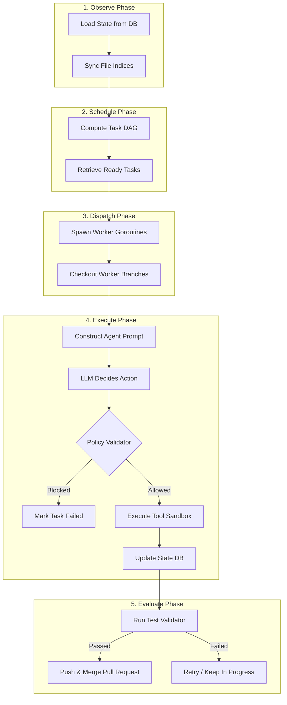

# Architecture Overview

`noctifab` is designed around a decoupled, state-centric architecture designed to optimize context windows and guarantee predictable execution cycles.

---

## The Stateless Agent / Stateful Orchestrator Design

A core architectural principle of `noctifab` is the strict separation between the **Stateless LLM Agent** and the **Stateful Orchestrator Loop**:

- **Stateless LLM Agent**: The LLM agent has no persistent memory of previous loop cycles, actions, or terminal outputs. In each step, the orchestrator compiles the absolute latest system state, file indexes, and history logs into a structured prompt context.
- **Stateful Orchestrator**: The Go orchestrator manages state loading, updates, database transactions, lock acquisitions, policy checks, sandbox isolation, and VCS merges.

This pattern prevents context drift, keeps context usage highly token-efficient, and ensures that the system's runtime remains deterministic.

---

## Core Component Pipeline

The orchestrator operates in a continuous loop comprising five distinct phases:



---

## Major Architecture Modules

### 1. The World Model (`pkg/domain/state.go`)
The `State` struct represents the entire system state, including tasks, files, clarification mailboxes, and action logs. It serves as the single source of truth and is stored in a relational database (SQLite for local setups, PostgreSQL for concurrent Level 4 production loops).

### 2. Topological Task Scheduler (`pkg/services/scheduler.go`) & Story DAG Scheduler (`pkg/services/story_dag_scheduler.go`)
- **Task DAG Scheduling (`scheduler.go`)**: Within a single user story, tasks can define dependencies on other tasks (e.g., Task B depends on Task A). The Scheduler performs a topological sort using Directed Acyclic Graphs (DAG) to find ready tasks and schedule them concurrently in a worker pool.
- **Story DAG Scheduler (`story_dag_scheduler.go`)**: Across user stories, `StoryDAGScheduler` parses `depends_on` dependencies declared in User Story YAML frontmatter. It concurrently dispatches all unblocked user stories across worker slots, dynamically unblocking dependent child stories as parent stories reach completion.
- **Structured Roadmap Layout & Task Serialization**: User stories are discovered strictly in `roadmap/user-stories/`, formatted as `US-XXX-title-slug.md`. Task domain models are automatically serialized into markdown files in `roadmap/tasks/` (`US-XXX-TASK-YYY-slug.md`) during planning and tool additions.

### 3. Policy Validator (`pkg/services/validator.go`)
Acts as a security checkpoint before any LLM-proposed tool is executed. It matches tools and command patterns against role profiles defined in `.noctifab/profiles/` to prevent directory traversal attacks, illegal network requests, or host command escapes.

#### Tool Sandboxing & Hermetic Package Resolution
Noctifab restricts agent capabilities to guarantee deterministic execution and security:
- **No Direct Terminal Execution (`exec` Disabled)**: Neither `generator` nor `tester` agents are granted access to terminal execution tools (`exec`). Agents cannot directly invoke shell installation commands such as `pip install`, `npm install`, `cargo add`, or `go get`.
- **Manifest File Declarations**: Generator agents **can** modify project manifest files (`package.json`, `pyproject.toml`, `Cargo.toml`, `go.mod`) using `write_file` or `edit_file`. If a package is pre-cached or listed in `SPEC.md`, `run_tests` will link it cleanly.
- **Hermetic Offline Failures & Standard Library Preference**: In containerized, offline, or dark-factory validation environments, introducing un-cached third-party dependencies causes `run_tests` to fail with module import errors (e.g. `ModuleNotFoundError`). All agent prompts enforce a **Standard Library First Mandate**: if `run_tests` fails on an uninstalled package, the agent is instructed to immediately refactor the implementation to use built-in standard library primitives (e.g. `asyncio`, `net/http`, `node:fs`, `socket`) rather than burning retries on un-fetchable imports.

### 4. Sandboxed Runner (`pkg/services/sandbox.go`)
Executes shell commands and test suites. It supports two modes:
- **Host Sandbox**: Executes commands directly on the host using jail-like path boundary validations.
- **Docker Sandbox**: Spawns ephemeral, warm Docker containers to execute commands in complete isolation, preventing host resource pollution.

The **Watchdog Liveness Monitor** (`pkg/services/watchdog.go`) wraps command execution with two safeguards:
- **MaxDuration**: Absolute wall-clock timeout (default 5 min). The process group is killed via `SIGKILL` if execution exceeds this limit.
- **IdleTimeout**: Sliding window that resets on every byte of stdout/stderr output. If no output is produced for the configured duration, the process is killed, and `ErrWatchdogIdleTimeout` is returned. This prevents silent hangs from deadlocked threads or infinite loops without output.
- **`killProcessGroup`**: Both timeouts use `syscall.SysProcAttr{Setpgid: true}` to kill the entire process group, ensuring child processes and background threads are terminated.

Configured via `sandbox.idle_timeout_seconds` in `config.yaml` (default: 30s).

### 5. Rebase Queue (`pkg/services/rebase_queue.go`)
A thread-safe channel queue that manages Git rebases and branch merges. When multiple tasks complete in parallel, the rebase queue serializes merges into the target branch to avoid merge conflicts and race conditions.

### 6. Command Mailbox (`pkg/services/command_channel.go`)
Runs a lightweight REST API server binding loopback commands on `127.0.0.1:18080`. The REST API exposes endpoints to manage stories, pause/resume/cancel cycles, resolve clarifications, and inject manual tasks. See [docs/api.md](api.md) for the complete endpoint reference.

The mailbox exposes a **Wakeup channel** that fires whenever a command is enqueued. The orchestrator's OCC backoff loop (`updateStateWithRetry`) selects on this channel via `SleepWithInterrupt`, allowing operator commands (abort, model switch) to interrupt exponential backoff immediately instead of blocking for the full duration.

---

## Multi-Agent Roles & Team Pipeline

Noctifab exposes the following implemented roles and retained experimental capability:

| Role Key | Agent Name | Domain Scope & Responsibility |
| :--- | :--- | :--- |
| **`orchestrator`** | Orchestrator Agent | Coordinates state persistence, VCS branch rebasing, task assignment, and PR creation. |
| **`product_manager`** | Product Manager Agent | Analyzes `SPEC.md` and existing user stories in `roadmap/user-stories/`. Generates new User Stories or audits and enriches existing ones with explicit Definitions of Done (DoD), language-agnostic interface contracts, I/O formatting invariants, error prefixes, exit codes, and comprehensive edge-case scenario matrices before task planning starts. |
| **`planner`** | Task Planner Agent | Decomposes User Stories into a Directed Acyclic Graph (DAG) of executable technical tasks, automatically serializing task entities into `roadmap/tasks/`. |
| **`generators`** | Generator Agent | Writes production source code and initial feature logic in task branches. |
| **`testers`** | Tester Agent | Independently writes black-box test suites (unit, integration, e2e) against public contracts. |
| **`qa`** | Experimental QA capability | Retained but disabled in Phase 0; no QA runtime executes. |
| **`unblocker`** | Unblocker Daemon Agent | Continuously monitors execution pipelines for stalls, deadlocks, and task re-queueing. |

Architecture, security, performance, documentation, and infrastructure work is represented by explicit planner tasks and deterministic validators, not specialist agents.

---

## Specification-Based Complexity Units ($CU$)

To prevent micro-tasks and oversized monolithic user stories during spec decomposition, `noctifab` uses a **Unified Composite Complexity Unit ($CU$)** metric.

The $CU$ metric synthesizes three specification-driven dimensions directly from natural language text (`SPEC.md`):

$$\text{CU} = \underbrace{\text{Data Movements}}_{\text{COSMIC (Entry, Exit, Read, Write)}} + \underbrace{\text{Domain Concepts}}_{\text{DDD (Structs, Entities, State)}} + \underbrace{\text{Contract Invariants}}_{\text{RPA (Flags, Exit Codes, Output Rules)}}$$

### Theoretical Foundations & Academic References

The Unified Composite $CU$ Metric synthesizes three established specification-driven standards:

1. **COSMIC Function Points (ISO/IEC 19761:2011):**
   - Measures **Data Movements** directly from natural language text: **Entry (E)** (arguments, stdin, requests), **Exit (X)** (stdout, status codes, responses), **Read (R)** (filesystem/db reads), and **Write (W)** (file/db writes).
   - *Reference:* [ISO/IEC 19761:2011 — COSMIC Measurement Method](https://www.iso.org/standard/55222.html) and [COSMIC Measurement Manual v5.0](https://cosmic-sizing.org/publications/measurement-manual-v5-0/).

2. **Domain & Object Model Complexity (DDD & Chidamber-Kemerer):**
   - Evaluates domain structural complexity from requirement prose: core **Entities**, **Value Objects**, **Domain Services**, and **State Machines**.
   - *Reference:* [Chidamber & Kemerer (IEEE TSE, 1994) — A Metrics Suite for Object Oriented Design](https://doi.org/10.1109/32.295895) and [MIT Sloan Working Paper 3233-90](https://dspace.mit.edu/handle/1721.1/48493).

3. **Requirement Invariants & Imperatives (NASA ARM & RFC 2119):**
   - Measures contract invariants and interface surface area: CLI options, error conditions, exit code specifications, and imperative rules (`MUST`, `SHALL`).
   - *Reference:* [NASA Technical Memorandum 104640 (ARM Tool)](https://ntrs.nasa.gov/citations/19970024095) and [IETF RFC 2119 Requirement Levels](https://datatracker.ietf.org/doc/html/rfc2119).

### Sizing Boundaries & Decomposition Rules
1. **Product Manager Sizing (`generate.tmpl`):**
   - For concise specifications ($CU_{\text{total}} < 25$, such as `wc`, `echo`, `calculator`), the Product Manager Agent is mandated to create **exactly 1 User Story**.
   - For larger specifications, User Stories are sized to target windows ($15 \le CU_{\text{story}} \le 30$).
2. **Planner Task Sizing (`decompose.tmpl`):**
   - User stories are decomposed into tasks bounded by $CU_{\text{task}} \in [4, 8]$.
3. **Task Cohesion Validation (`pkg/services/task_cohesion.go`):**
   - Programmatically enforces task cohesion: rejecting micro-tasks ($CU < 4$) and splitting oversized tasks ($CU > 8$).

---

## Self-Healing & Anti-Stalling Resiliency

To prevent execution stalls and guarantee progress under validation failures, `noctifab` implements self-healing at two distinct layers:

### 1. Multi-Turn Agent Loop (Intra-Turn Healing)
During the **Execute Phase**, Generator and Tester agents are not restricted to a single-turn completion. If they execute verification tools like `run_tests` or `run_linter` and encounter failures (compilation errors, test assertion failures, or policy violations), the orchestrator automatically captures the error output, appends it to the prompt context, and completes the LLM again in a loop of up to **5 turns**. This allows agents to fix formatting, syntax, and logic bugs immediately within a single run.

### 2. General Watchdog Repair (Inter-Turn Healing)
If a task completes its execution phase but fails the final test suite evaluation, the orchestrator intercepts the failure logs and invokes the `WatchdogRepair` handler. It supports three failure categories:
- **Timeout**: Triggered when a test run hangs and is terminated by the liveness watchdog. The prompt focuses on resolving infinite loops, unjoined threads, and deadlocks.
- **Compile**: Triggered when compilation fails. The prompt focuses on resolving syntax errors, type mismatches, and import problems.
- **Test Logic**: Triggered when assertions fail. The prompt focuses on resolving incorrect test expectations or fixing logic implementations.

The repair handler makes up to **3 repair attempts** autonomously to self-heal the codebase.

### 3. Dynamic Model Fallback Engine (Provider-Specific Capacity Ranking)
When an LLM call fails due to rate limits (HTTP 429), quota limits (HTTP 401/402), or server errors (HTTP 5xx), the orchestrator triggers the dynamic fallback pipeline (`getNextLowerModel`):

1. **Live Endpoint Model Discovery**: Queries `GET /models` or `/v1/models` live from the provider API to fetch all currently active models. No static model lists are used.
2. **Provider Capacity Ranking**: Invokes the provider's `ParseModelFunc` (registered in `ProviderSpec`) to compute a numerical `Rank` for each model, combining tier keywords, version numbers, and parameter size suffixes.
3. **Descending Sort**: All models are sorted by `Rank` descending (highest capacity first).
4. **Transparent Model Switch**: The model immediately below the failing one in the sorted list is selected and `Client.Model` is updated in-place. The task resumes without losing context.

If the failing model is already the lowest-ranked model available, no fallback is selected and the error is surfaced to the caller.

#### Fallback Chain Examples

Each provider has its own capacity ranking formula. The following chains are verified by `TestModelFallbackChains` in [fallback_test.go](file:///Users/diegoj/repos/noctifab/pkg/infrastructure/llm/fallback_test.go).

**Anthropic (claude-* via `parseAnthropicModel` — tier keyword ranking: opus > sonnet > haiku)**

```
claude-3-opus-20240229   [Rank: 430]  ← primary
    ↓ fails
claude-3-5-sonnet-latest [Rank: 335]  ← fallback 1
    ↓ fails
claude-3-5-haiku-latest  [Rank: 235]  ← fallback 2
    ↓ fails
(no fallback — surface error)
```

**OpenAI (gpt-* via `parseOpenAIModel` — tier keyword + version multiplier ranking)**

```
gpt-4o        [Rank: flagship tier + version×5]  ← primary
    ↓ fails
gpt-4o-mini   [Rank: compact tier + version×5]   ← fallback 1
    ↓ fails
gpt-3.5-turbo [Rank: lite tier + version×5]      ← fallback 2
    ↓ fails
(no fallback — surface error)
```

**Mistral (via `parseMistralModel` — large/codestral > medium > small)**

```
mistral-large-latest  [Rank: 40]  ← primary
    ↓ fails
mistral-small-latest  [Rank: 20]  ← fallback 1
    ↓ fails
(no fallback — surface error)
```

**Meta Llama / Together AI (via `parseLlamaModel` — parameter size ranking using `StandardSizeWeights`)**

```
Llama-3.1-405B-Instruct  [Rank: 531]  ← primary
    ↓ fails
Llama-3.3-70B-Instruct   [Rank: 433]  ← fallback 1
    ↓ fails
Llama-3.1-8B-Instruct    [Rank: 231]  ← fallback 2
    ↓ fails
(no fallback — surface error)
```

**DeepSeek (via `parseDeepSeekModel` — r1/v3/coder > chat)**

```
deepseek-coder  [Rank: 30]  ← primary
    ↓ fails
deepseek-chat   [Rank: 20]  ← fallback 1
    ↓ fails
(no fallback — surface error)
```

**xAI / Grok (via `parseXAIModel` — grok-3 > grok-2 > grok-3-mini > mini)**

```
grok-3       [Rank: 75]  ← primary
    ↓ fails
grok-2       [Rank: 50]  ← fallback 1
    ↓ fails
grok-3-mini  [Rank: 45]  ← fallback 2 (if available)
    ↓ fails
(no fallback — surface error)
```

**Perplexity (via `parsePerplexityModel` — deep-research > reasoning-pro > reasoning > pro)**

```
sonar-deep-research  [Rank: 50]  ← primary
    ↓ fails
sonar-reasoning-pro  [Rank: 40]  ← fallback 1
    ↓ fails
sonar-reasoning      [Rank: 30]  ← fallback 2
    ↓ fails
sonar-pro            [Rank: 20]  ← fallback 3
    ↓ fails
(no fallback — surface error)
```

**Cohere (via `parseCohereModel` — command-r-plus > command-r > command-light)**

```
command-r-plus  [Rank: 40]  ← primary
    ↓ fails
command-r       [Rank: 30]  ← fallback 1
    ↓ fails
command-light   [Rank: 20]  ← fallback 2
    ↓ fails
(no fallback — surface error)
```

**Kimi / Moonshot (via `parseKimiModel` — k3 > k2.7 > k2.6 > k2.5 > k2)**

```
kimi-k3    [Rank: 50]  ← primary
    ↓ fails
kimi-k2.7  [Rank: 40]  ← fallback 1
    ↓ fails
kimi-k2.5  [Rank: 20]  ← fallback 2
    ↓ fails
(no fallback — surface error)
```

**Qwen / DashScope (via `parseQwenModel` — max > plus > turbo)**

```
qwen-max    [Rank: 65]  ← primary
    ↓ fails
qwen-plus   [Rank: 55]  ← fallback 1
    ↓ fails
qwen-turbo  [Rank: 45]  ← fallback 2
    ↓ fails
(no fallback — surface error)
```

**Ollama / HuggingFace (via `parseOllamaModel` / `parseHuggingFaceModel` — parameter size using `StandardSizeWeights`)**

```
llama3.1:70b  [Rank: 431]  ← primary
    ↓ fails
llama3.1:8b   [Rank: 231]  ← fallback 1
    ↓ fails
(no fallback — surface error)
```

> **Implementation**: The complete `TestModelFallbackChains` test in [fallback_test.go](file:///Users/diegoj/repos/noctifab/pkg/infrastructure/llm/fallback_test.go) verifies all the above chains end-to-end, using real `ParseModelFunc` parsers and `selectLowerModelFromParsed` to simulate exactly what `getNextLowerModel` in [client.go](file:///Users/diegoj/repos/noctifab/pkg/infrastructure/llm/client.go) does at runtime.

#### Fault Tolerance: New Model Resilience

The fallback engine is designed to remain operational even when a provider releases models whose names are not yet recognised by the capacity parser. Three edge cases are explicitly handled and verified by `TestFallbackFaultTolerance` in [fallback_test.go](file:///Users/diegoj/repos/noctifab/pkg/infrastructure/llm/fallback_test.go):

| Scenario | Behaviour |
|---|---|
| **Current model unrecognised by parser** (e.g. new tier keyword like `"claude-4-nova"`) | Safety valve selects the **lowest-ranked** known model from the provider's live `/models` list instead of failing |
| **Current model fails `RequiredPrefix` filter** (e.g. provider renames a model family) | Same safety valve — falls back to the lowest-ranked successfully parsed model |
| **Current model is the only available model** | Returns `""` — error is surfaced correctly; no infinite retry |
| **Current model is already the lowest-ranked** | Returns `""` — error is surfaced correctly; no infinite retry |
| **No models available from provider** | Returns `""` — emits a warning to stderr and surfaces error |

The core guarantee is: **as long as the provider's `/models` endpoint returns at least one model that the parser recognises, the fallback engine will never fail with an empty candidate list due to an unrecognised current model name.**

When a provider adopts a completely new naming convention (e.g., changing from `"claude-3-*"` to a scheme without the `"claude"` prefix), the `RequiredPrefix` in the parser should be updated or removed in the corresponding provider file (e.g. [anthropic.go](file:///Users/diegoj/repos/noctifab/pkg/infrastructure/llm/anthropic.go)). No other files need to be changed.

### 4. Safety Circuit Breakers
- **`runtime.max_actions`**: Specifies a limit on the number of task execution cycles. If the total number of actions across all tasks reaches this ceiling, the story is aborted to prevent infinite repair loops and LLM budget exhaustion.
- **`runtime.max_duration`**: Specifies a story-level wall-clock timeout.
- **`sandbox.timeout_seconds`**: Specifies a configurable command execution timeout for individual test and linter runs, preventing premature truncation on large test suites.

### 5. Self-Correcting & Dynamic Prompts Framework

Noctifab employs a dynamic, context-aware prompt adaptation and self-correcting engine across all agent roles:

#### A. Unblocker Dynamic Prompt Injection & Fast-Path Engine (`pkg/services/unblocker.go`)
The **Unblocker Agent** runs as an autonomous background goroutine on an independent timer (default `30s` poll interval). When a pipeline stall is detected (`frozen_progress`, `orphaned_task`, `agent_inconsistency`, `conflict_blocked`):
1. **Live Log Tailing & Secret Scrubbing (`log_tailer.go`)**: Tails standard output logs of stalled tasks and passes snippets through `SanitizeLog` to scrub sensitive API keys and tokens before prompt injection.
2. **0-Token Fast-Path Regex Classifier (`unblocker_fastpath.go`)**: Matches log snippets against static regex patterns for routine CLI hangs (stdin interactive `y/n` prompts, port binding collisions, test watch mode spinners), unblocking tasks in **< 5ms** with **0 LLM token overhead**.
3. **10x Progressive Log Window Escalation**: Scales diagnostic log depth based on `task.StallCount` (Level 1: 50 lines $\rightarrow$ Level 2: 500 lines $\rightarrow$ Level 3: 5,000 lines).
4. **Task Stall Recovery Directives (`[STALL RECOVERY DIRECTIVE]`)**: Attaches `RecoveryDirective` to task state upon reset, injecting instructions into Generator and Tester worker prompts on re-queued attempts to prevent repeating stalling actions.

See [docs/unblocker_agent.md](unblocker_agent.md) for full developer reference.

#### B. Legacy Codebase Scanning & Characterization Mandate (`pkg/usecase/roadmap_generator.go`)
When initialized in a project directory containing existing source code:
1. **Workspace Legacy Scanning (`scanLegacyFiles`)**: Detects pre-existing source files while ignoring build outputs, vendor paths, and `.noctifab` metadata.
2. **Product Manager Legacy Directive (`prompt_templates.go`)**: Injects `LEGACY CODEBASE STABILIZATION & REFACTORING MANDATE` into the PM prompt. The PM automatically generates `roadmap/user-stories/US-001.md` titled `"Legacy Codebase Characterization & Stabilization"`, requiring unit/integration characterization tests before refactoring or new feature work.
3. **Dynamic Role Prompt Adaptation**: Planner, Generator, and Tester prompts dynamically adapt with characterization testing requirements and surgical refactoring directives (`edit_file`, `apply_patch`).

#### C. Pre-Flight LLM Provider Capability Caching (`openai_adapt.go` & `openai.go`)
1. **Parameter Rejection Detection**: Tracks provider parameter rejections (e.g. `temperature`, `max_tokens`, `response_format` for reasoning models) upon receiving an initial HTTP 400 error.
2. **Thread-Safe Capability Cache (`providerCapabilityCache`)**: Records model parameter limitations in RAM across worker goroutines.
3. **Self-Correcting API Payloads**: Automatically omits unsupported parameters on subsequent API requests without requiring failing roundtrips.

#### D. Parallel Context Compaction Engine (`pkg/usecase/prompt_templates.go`)
For context payloads $> 20$ KB (`20,000` bytes):
1. **Parallel Worker Compaction**: Parallelizes line block compaction across worker goroutines in `CompactSimpleEnglish` and `CompactCaveman` modes (`context.compaction`).
2. **Invariant Preservation**: Cuts token volume by 25%+ while strictly preserving code blocks, JSON schemas, file paths, and technical invariants.

---

## Dark Factory Acceleration Engine (5x–10x Speedup)

To support near-instantaneous development feedback loops, `noctifab` implements an end-to-end pipelined acceleration engine:

1. **Parallel DAG Task Worker Pools**: Executes independent tasks concurrently (`scheduler.max_parallel_workers > 1`), allocating an isolated Git worktree (`.noctifab/worktrees/task-<id>`) to each worker and merging completed branches asynchronously via a serialized rebase queue (`pkg/usecase/rebase_queue.go`).
2. **Tiered LLM Provider Routing**: Routes deep reasoning models to PM/Planner agents while directing Generator/Tester implementation workers to high-throughput coding models.
3. **Parallel 3x Majority-Vote Test Validation**: Dispatches 3 test validation runs concurrently using Go goroutines, reducing verification latency from ~15s to ~3s.
4. **Unified Diff Multi-File Patching (`apply_patch`)**: Enables agents to apply multi-file unified diff patches (`diff -u` / Git format) in a single turn with fuzzy line matching and security validation (`pkg/services/apply_patch_tool.go`).
5. **Spec-Level Deterministic Mock Clocks**: Enforces mock clock patterns at the spec layer (`US-xxx.md`) to guarantee zero assertion flakiness on time-dependent code.
6. **Aggressive Prompt History Pruning**: Suffix-only pruning preserves LLM KV cache prefixes on retry turns.
7. **Warm Compiler & Sandbox Caching**: Mounts host package caches (`/go/pkg/mod`, `~/.cache/go-build`, `.cargo/registry`) directly into validation containers for rapid incremental builds.
8. **Zero-Delay Task Handoff**: Whenever a scheduler loop run makes progress (i.e., a task completes or state is updated), the orchestrator immediately invokes the next schedule check without sleeping for `poll_interval`. Tasks are chained sequentially with no idle latency.
9. **In-Memory Diagnostic Result Caching (`TaskDiagnosticCache`)**: During intra-turn multi-turn agent loops (`RunTesterAgent` and `RunGeneratorAgent`), the orchestrator instantiates an in-memory `TaskDiagnosticCache` that caches the execution results of read-only verification tools (`run_tests` and `run_linter`). Whenever an agent executes file-mutating actions (`write_file`, `edit_file`, `multi_replace_file_content`, `delete_file`), an internal `isDirty` boolean flag stored in RAM inside the cache struct is set to `true`, invalidating the cache. If an agent calls `run_tests` or `run_linter` again without modifying workspace files (`isDirty == false`), the orchestrator returns the cached result instantly (`0ms`), eliminating redundant subprocess executions.

---

## Orchestrator Execution Architecture Modes

The orchestrator supports three distinct execution architecture modes configured via `agents.architecture` in `.noctifab/config.yaml`:

### 1. `code_first` (Default, legacy alias `code_first_verification_loop`)
The **Code-First Verification Loop** separates implementation from test verification:
1. **Minimal Implementation Pass (Generator Agent)**: Scaffolds core types, function signatures, and minimal implementation logic first.
2. **Test Characterization Pass (Tester Agent)**: Inspects the created code signatures and writes comprehensive unit and integration tests against them.
3. **Refactor & Fulfill Pass (Generator Agent)**: Refactors and expands the implementation to satisfy all tests.

### 2. `single_pass` (Legacy alias `single_pass_execution`)
The **Single-Pass Execution** mode optimizes for maximum generation speed and minimum token latency:
* A single Generator agent pass creates both the source code implementation and corresponding tests together in one turn.
* Eliminates multi-pass turn delays for straightforward user stories and micro-specifications.

### 3. `breadth_first` (Legacy alias `breadth_first_generation`, `bfg`)
The **Breadth-First Generation** mode optimizes for rapid end-to-end prototype delivery across all user stories:
* **Pass 1 (Broad Foundation / ~80% Feature Coverage)**: Generator and Tester implement core happy-path functionality across all tasks first, explicitly deferring cosmetic formatting, linter nitpicks, and obscure corner cases.
* **Deterministic Validation**: Evaluates candidates based on functional happy paths and enforces the non-negotiable **Zero Regressions** rule.
* **Iterative Refinement (Passes 2..N)**: Progressive passes expand edge-case coverage, error handling, linter compliance, and performance hardening.

### 4. Task Execution Ordering (`agents.task_execution_order`)

Configured via `agents.task_execution_order` in `.noctifab/config.yaml`:
* **`generator_first` (Default)**: Generator Agent implements feature code on Turn 1; Tester Agent writes QA tests on Turn 2. Prevents Turn 1 compilation errors and guarantees 0 wasted turns.
* **`tester_first` (TDD Mode)**: Tester Agent writes tests on Turn 1; Generator Agent implements feature code on Turn 2. When `tester_first` is enabled, Noctifab automatically pre-seeds minimal compilation stub files (`ensureTargetStubFilesExist`) for missing target files so Turn 1 `run_tests` compiles cleanly.

```yaml
agents:
  architecture: code_first
  task_execution_order: generator_first # "generator_first" (default) or "tester_first"
  product_manager:
    passes: 2 # 1 = Fast, 2 = Standard 2-Pass Refinement (default), 3 = Deep Contract Audit
```

### 5. Multi-Pass Product Manager Architecture (`agents.product_manager.passes`)
The Product Manager Agent executes a multi-pass specification decomposition and audit loop:
* **Pass 1 (Decomposition & Drafting)**: Renders `generate` prompt, creating initial user stories in `roadmap/user-stories/US-XXX-slug.md`.
* **Pass 2+ (Cross-Story Audit & Contract Alignment)**: Renders `audit` prompt with existing generated stories as context, verifying cross-story dependencies, contract IDs, and `SPEC.md` requirement coverage.

### 6. Black-Box Contract Scenario Prompt Injection
Machine-readable contract expectations parsed from story `noctifab-contract` JSON blocks (`AllowedExecutables`, `ExitCodes`, `StderrPrefixes`, `StdoutContains`) are formatted into a prominent `### BLACK-BOX CONTRACT EXPECTATIONS (NON-NEGOTIABLE)` prompt context section and injected directly into Generator and Tester agent prompts.

### 8. Interactive Command Mailbox & Steering Architecture (`pkg/services/command_channel.go`, `command_channel_steer.go`)
Noctifab implements an asynchronous `CommandMailbox` channel allowing operators to dynamically steer in-flight agent workers and queue prompt orders while the orchestrator runs:
- **Thread-Safe Mutation Queueing**: Incoming commands (`SteerCmd`, `OrderCmd`, `PauseCmd`, `ResumeCmd`) from CLI or Web UI are queued and processed sequentially within the daemon's state loop, eliminating SQLite/PostgreSQL write lock contention.
- **Human-in-the-Loop Directive Injections**: Steering directives are attached directly to target task models (`task.UserDirectives`) and injected into Generator and Tester prompt templates under `[USER HUMAN-IN-THE-LOOP STEERING DIRECTIVES]`.
- **Zero-Latency Story Enqueueing**: Ad-hoc prompt orders (`noctifab order "..."`) dynamically create markdown specifications in `.noctifab/stories/` and forward them to the story dispatcher channel.

### 9. Embedded Real-Time Web Server & SSE Telemetry (`pkg/interfaces/web/`)
- **Self-Contained Single Binary**: Embedded web assets (`//go:embed static/*`) compile directly into the single binary with zero external CDN or npm dependencies.
- **Ring-Buffered Event Replay (`SSEBroadcaster`)**: Keeps a 100-event circular memory buffer to replay missed events upon browser reconnects, accompanied by 15-second keepalive frames.
- **Mission Control Observability**: Exposes state snapshots (`GET /api/v1/state`), event streams (`GET /api/v1/events`), steering injection (`POST /api/v1/steer`), order creation (`POST /api/v1/orders`), and flow controls (`POST /api/v1/pause`, `POST /api/v1/resume`).

Architecture, security, performance, documentation, and infrastructure concerns are explicit planner tasks implemented by generators and checked by deterministic validators. They are not independently routed agent phases.


