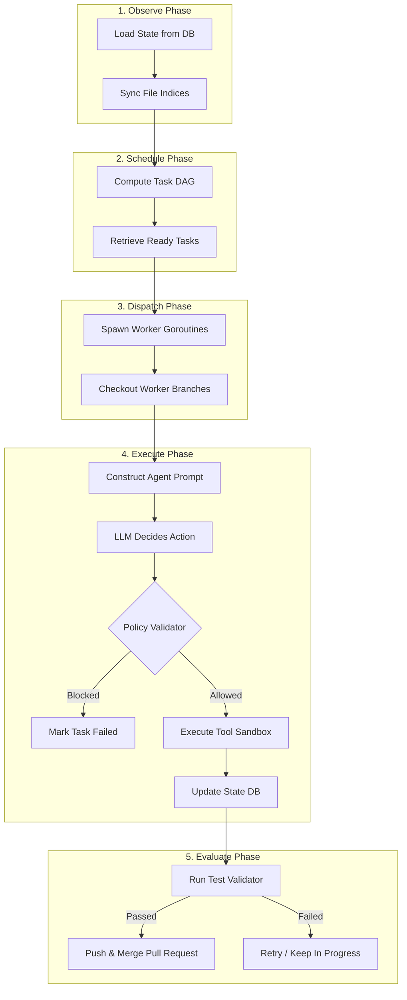

# Architecture Overview

`noctifab` is designed around a decoupled, state-centric architecture designed to optimize context windows and guarantee predictable execution cycles.

---

## The Stateless Agent / Stateful Orchestrator Design

A core architectural principle of `noctifab` is the strict separation between the **Stateless LLM Agent** and the **Stateful Orchestrator Loop**:

- **Stateless LLM Agent**: The LLM agent has no persistent memory of previous loop cycles, actions, or terminal outputs. In each step, the orchestrator compiles the absolute latest system state, file indexes, and history logs into a structured prompt context.
- **Stateful Orchestrator**: The Go orchestrator manages state loading, updates, database transactions, lock acquisitions, policy checks, sandbox isolation, and VCS merges.

This pattern prevents context drift, keeps context usage highly token-efficient, and ensures that the system's runtime remains deterministic.

---

## Core Component Pipeline

The orchestrator operates in a continuous loop comprising five distinct phases:

---

## Major Architecture Modules

### 1. The World Model (`pkg/domain/state.go`)
The `State` struct represents the entire system state, including tasks, files, clarification mailboxes, and action logs. It serves as the single source of truth and is stored in a relational database (SQLite for local setups, PostgreSQL for concurrent Level 4 production loops).

### 2. Topological Scheduler (`pkg/services/scheduler.go`)
Tasks can define dependencies on other tasks (e.g., Task B depends on Task A). The Scheduler performs a topological sort using Directed Acyclic Graphs (DAG) to find tasks that are ready to run, scheduling them to run concurrently in a worker pool.

### 3. Policy Validator (`pkg/services/validator.go`)
Acts as a security checkpoint before any LLM-proposed tool is executed. It matches tools and command patterns against role profiles defined in `.noctifab/profiles/` to prevent directory traversal attacks, illegal network requests, or host command escapes.

### 4. Sandboxed Runner (`pkg/services/sandbox.go`)
Executes shell commands and test suites. It supports two modes:
- **Host Sandbox**: Executes commands directly on the host using jail-like path boundary validations.
- **Docker Sandbox**: Spawns ephemeral, warm Docker containers to execute commands in complete isolation, preventing host resource pollution.

The **Watchdog Liveness Monitor** (`pkg/services/watchdog.go`) wraps command execution with two safeguards:
- **MaxDuration**: Absolute wall-clock timeout (default 5 min). The process group is killed via `SIGKILL` if execution exceeds this limit.
- **IdleTimeout**: Sliding window that resets on every byte of stdout/stderr output. If no output is produced for the configured duration, the process is killed, and `ErrWatchdogIdleTimeout` is returned. This prevents silent hangs from deadlocked threads or infinite loops without output.
- **`killProcessGroup`**: Both timeouts use `syscall.SysProcAttr{Setpgid: true}` to kill the entire process group, ensuring child processes and background threads are terminated.

Configured via `sandbox.idle_timeout_seconds` in `config.yaml` (default: 30s).

### 5. Rebase Queue (`pkg/services/rebase_queue.go`)
A thread-safe channel queue that manages Git rebases and branch merges. When multiple tasks complete in parallel, the rebase queue serializes merges into the target branch to avoid merge conflicts and race conditions.

### 6. Command Mailbox (`pkg/services/command_channel.go`)
Runs a lightweight REST API server binding loopback commands. If an agent raises a clarification question, a human operator or external CI/CD runner can POST answers directly to `/api/v1/clarifications/:id/resolve` to safely unblock execution.

The mailbox exposes a **Wakeup channel** that fires whenever a command is enqueued. The orchestrator's OCC backoff loop (`updateStateWithRetry`) selects on this channel via `SleepWithInterrupt`, allowing operator commands (abort, model switch) to interrupt exponential backoff immediately instead of blocking for the full duration.
