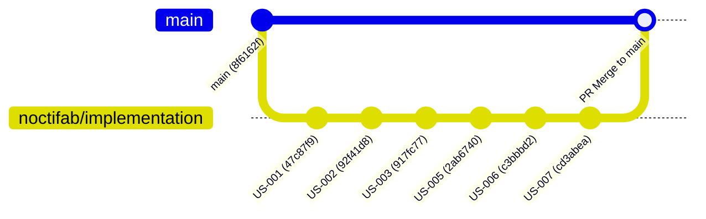

# Noctifab Architecture Report: The Cumulative Branching Bug in Multi-Story Autonomous Execution

**Date**: August 20, 2026  
**Target System**: Noctifab Orchestrator (`noctifab start`)  
**Case Study**: `sqlarm` autonomous multi-story execution (`US-001` through `US-007`)

---

## 1. Executive Summary

When running `noctifab start` across a multi-story roadmap (e.g., `US-001` through `US-007`), Noctifab autonomously plans, executes, and passes all tasks for each user story sequentially. However, at the end of the full execution run, **only the artifacts and commits from the final user story (`US-007`) are present on the active integration branch**. The work generated in earlier user stories (`US-001` through `US-006`) is orphaned in the local Git object store and reflog.

This issue is designated the **Cumulative Branching Bug**.

---

## 2. Bug Anatomy & Root Cause Analysis

### 2.1 The Observed Lifecycle

During execution of `sqlarm`, the following timeline occurred (verified via Git reflog analysis):

| Time | User Story | Worker Commits Produced | Subsystems Created |
| :--- | :--- | :--- | :--- |
| **22:13 - 22:19** | **US-001** | `5e7f40b`, `1160366`, `47c87f9` | Baseline test harness & build validation |
| **22:19 - 22:29** | **US-002** | `92f41d8` | ARM64 primitives & storage scaffold |
| **22:29 - 22:37** | **US-003** | `7f76c80`, `917fc77` | SQL Tokenizer, Recursive-Descent Parser (`src/parser.s`), `include/sqlarm.h` |
| **22:37 - 22:44** | **US-004** | *(stalled on row locking)* | Row locking and bytecode VM tasks |
| **22:44 - 22:52** | **US-005** | `63b4be7`, `aaec85d`, `2ab6740` | C ABI (`src/api_c.c`, `libsqlarm.so`), static/shared libraries, CLI |
| **22:52 - 23:03** | **US-006** | `ee836f1`, `0963705`, `c3bbbd2` | Python PEP 249 driver, Django engine backend (`python/sqlarm/`) |
| **23:03 - 23:10** | **US-007** | `733f27a`, `d4f40ac`, `e2376bb`, `cd3abea` | SQL Matrix normalizer & compatibility tests (`tests/test_sql_matrix.py`) |

### 2.2 The Branching Mechanism Failure

The sequence of Git operations executed by the orchestrator daemon was:

```
                      [main: 8f6162f]
                       /     |     \     \
                      /      |      \     \
            (US-003) / (US-005) \ (US-006) \ (US-007)
           917fc77     2ab6740    c3bbbd2    cd3abea
              |           |          |          |
           [reset]     [reset]    [reset]    [ACTIVE TIP on noctifab/implementation]
```

1. **Static Base Branch Anchor**:
   The worker generator logic always anchored worker branch creation (`noctifab/task-<id>-worker`) off `config.vcs.base_branch` (`main` @ `8f6162f`).
2. **Missing Inter-Story Merge/Accumulator**:
   When a user story completed, its worker branch was merged (fast-forwarded) into `noctifab/implementation`. However, before starting the *next* user story, the orchestrator checked out `main` again (`8f6162f`).
3. **Destructive Reset**:
   When the next user story began, a new worker was branched off `main` rather than off the tip of `noctifab/implementation`. When that worker finished, `noctifab/implementation` was forced or fast-forwarded to point to the new worker commit, effectively **abandoning all previous commits**.

---

## 3. Impact Assessment

- **Silent Code Loss in Active Working Tree**: Developers inspecting the project see only the files generated by the last executed story.
- **Broken Downstream Dependencies**: User stories requiring artifacts from earlier stories (e.g., US-006 Python driver needing US-005 C header and shared library) fail or generate mock fallbacks because earlier source files are absent in their worktree.
- **Storage Waste**: Orphaned Git commits accumulate in `.git/objects` and are vulnerable to `git gc` / prune.

---

## 4. Architectural Proposals to Fix

### Proposal 1: Sequential Branch Accumulator (Recommended)

**Concept**: Maintain a persistent integration branch (`noctifab/implementation` or `state.integration_branch`) as the cumulative base for all sequential stories.

- **Mechanism**:
  1. For Story 1 ($S_1$): Branch from `base_branch` (`main`).
  2. For Story $N+1$ ($S_{N+1}$): Branch worker worktree from the **current HEAD of `state.integration_branch`**, which contains the merged commits of $S_1 \dots S_N$.
  3. When $S_{N+1}$ completes and passes evaluation, merge $S_{N+1}$ into `state.integration_branch`.
  4. Only when all stories in the backlog complete (or an explicit milestone PR is triggered), create the final PR from `state.integration_branch` targeting `main`.



---

### Proposal 2: Automated Local Merge into Base Branch per Completed Story

**Concept**: If the workflow assumes each story is a discrete deliverable, automatically commit/merge each completed and validated story into local `main` before picking up the next story from the backlog.

- **Mechanism**:
  1. Story completes validation and review gates.
  2. Orchestrator executes `git checkout main && git merge --no-ff noctifab/feature-<story_id>`.
  3. Next story naturally branches off the updated `main`.
  4. Optionally push intermediate PRs or commits to the remote VCS.

---

### Proposal 3: Dynamic Worktree Rebase Chain

**Concept**: When running in parallel or asynchronous multi-worker mode (`--agents > 1`), maintain dependency awareness across user stories.

- **Mechanism**:
  1. Each worker operates in an isolated Git worktree (`.noctifab/worktrees/worker-<id>`).
  2. When an upstream story ($S_A$) is validated and merged into the integration branch, the orchestrator triggers an automatic rebase of all in-flight downstream workers ($S_B$, $S_C$) on top of the updated integration tip.
  3. If merge conflicts occur during rebase, the `unblocker` agent is automatically assigned to resolve syntax and build conflicts.

---

### Proposal 4: Configurable VCS Orchestration Strategy in `config.yaml`

**Concept**: Expose the branching strategy explicitly in `.noctifab/config.yaml` to allow both cumulative and isolated feature development.

```yaml
vcs:
  provider: github
  repository: owner/repo
  base_branch: main
  branch_strategy: cumulative # Options: cumulative | per_story_isolated | auto_merge_local
  integration_branch: noctifab/implementation
  auto_rebase_workers: true
  pull_request:
    mode: on_milestone_complete # Options: per_story | on_milestone_complete
    auto_create: true
```

---

## 5. Verification Checklist for the Fix

- [ ] Run `noctifab start` on a repository with 3+ sequential user stories.
- [ ] Verify that `git log --oneline` on the integration branch shows a linear/merged chain containing commits from Story 1, Story 2, and Story 3.
- [ ] Verify that files created in Story 1 remain accessible and editable by workers executing Story 2 and Story 3.
- [ ] Verify no dangling worker branches or orphaned HEADs remain in `git reflog`.
