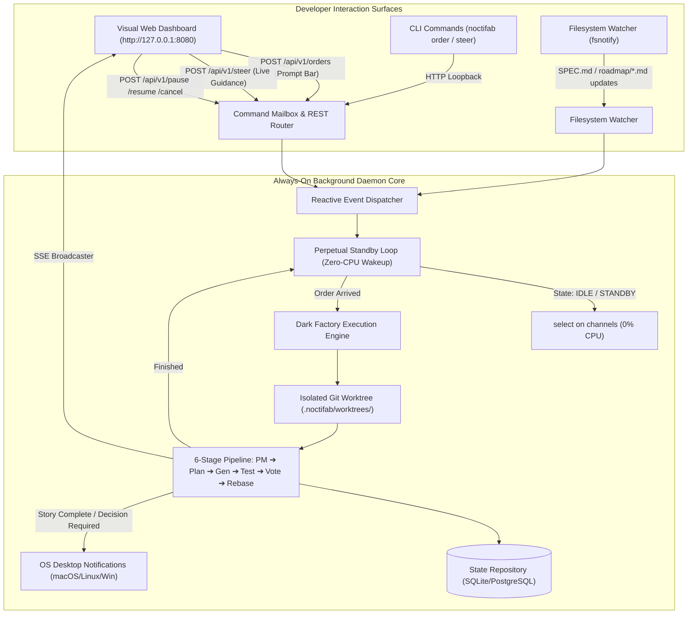
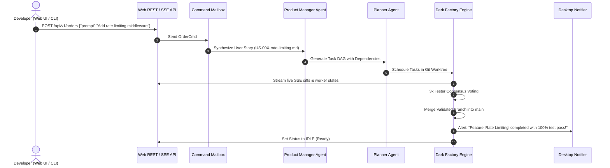

# Noctifab Always-On Background Daemon: Technical Architecture & Implementation Blueprint

> **Status**: Approved Proposal  
> **Target Version**: `0.38.0`  
> **Role**: Staff Systems Architect & Principal Software Engineer  
> **Objective**: Transform Noctifab from a batch story runner into an **always-on, zero-idle-CPU background development companion** that developers can interact with in real time via the Web Dashboard, CLI orders, file system watchers, and REST APIs.

---

## 1. Executive Summary & Vision

The core vision of the **Dark Factory** is a software engineering engine that stays alive in the background on your machine or development server. You do not re-launch it every time you have an idea; it is **always ready**, listening for natural language prompt orders, mid-flight steering directives, and specification updates.



---

## 2. Architectural Deficiencies in Current Implementation

| Current Limitation | Impact on Developer Experience | Required Solution in Always-On Architecture |
|---|---|---|
| **Batch Exit**: `noctifab start` finishes and exits the process once `storyFiles` reach `StorySuccess`. | Developer must re-run `noctifab start` every time they want to add a feature. | Replace termination with a **Perpetual Standby Loop** that keeps the process and web server alive. |
| **Channel Starvation in Server Mode**: `serveCmd` requires manual initialization and lacks an automatic wakeup trigger when prompt orders arrive. | Submitting orders via REST API does not reliably wake up the execution pipeline if no stories were pre-queued. | Implement a unified **`ReactiveEventBus`** where `OrderCmd` immediately signals the executor loop. |
| **No Desktop / System Alerts**: When a feature completes or asks a clarification question, the developer only knows if they look at the browser. | High friction; developer has to constantly check the tab. | Add native **OS Notifications** (`osascript` on macOS, `notify-send` on Linux, webhooks). |
| **Filesystem Disconnect**: Editing `SPEC.md` or dropping a new markdown file into `roadmap/` while the daemon is idle requires manual commands. | Misses low-friction local editor workflows. | Integrated **`fsnotify` File Watcher** with debounce timer to auto-enqueue modified specifications. |

---

## 3. Core Component Design

### 3.1. Perpetual Standby Loop (`pkg/services/standby_loop.go`)

The daemon execution loop will no longer be a finite `for _, story := range storyFiles` loop. Instead, it is governed by an **Event-Driven Standby Engine**:

```go
package services

import (
	"context"
	"time"

	"github.com/diegojromerolopez/noctifab/pkg/domain"
)

// DaemonState represents the operational status of the background daemon.
type DaemonState string

const (
	DaemonStateIdle       DaemonState = "IDLE"       // Waiting for orders or file changes
	DaemonStatePlanning   DaemonState = "PLANNING"   // Decomposing order/spec into task DAG
	DaemonStateExecuting  DaemonState = "EXECUTING"  // Running generator/tester workers
	DaemonStatePaused     DaemonState = "PAUSED"     // User paused execution
	DaemonStateBlocked    DaemonState = "BLOCKED"    // Waiting for clarification
)

// StandbyEngine manages the continuous lifecycle of the background dark factory.
type StandbyEngine struct {
	orchestrator *Orchestrator
	repo         domain.StateRepository
	mailbox      *CommandMailbox
	orderCh      chan StoryWorkItem
	controlCh    chan ControlSignal
	notifier     DesktopNotifier
	broadcaster  EventBroadcaster
}

func (s *StandbyEngine) Run(ctx context.Context) error {
	s.setDaemonState(DaemonStateIdle, "Ready for orders")

	for {
		select {
		case <-ctx.Done():
			return ctx.Err()

		case item := <-s.orderCh:
			s.executeStoryWorkItem(ctx, item)
			s.setDaemonState(DaemonStateIdle, "Story completed — Ready for next order")

		case sig := <-s.controlCh:
			s.handleControlSignal(ctx, sig)
		}
	}
}
```

### 3.2. Order Ingestion & Dynamic Story Synthesis

When a developer types an order in the Web Dashboard (`POST /api/v1/orders`) or runs `noctifab order "<prompt>"`:



### 3.3. Desktop & Audio Notification Subsystem (`pkg/infrastructure/notifier/`)

To allow developers to code or browse other tasks without watching the browser:

```go
package notifier

// NotificationKind specifies the alert urgency.
type NotificationKind string

const (
	NotifyStoryCompleted    NotificationKind = "STORY_COMPLETED"
	NotifyClarificationNeed NotificationKind = "CLARIFICATION_REQUIRED"
	NotifyBuildFailed       NotificationKind = "BUILD_FAILED"
)

// DesktopNotifier sends cross-platform native alerts.
type DesktopNotifier interface {
	Notify(kind NotificationKind, title string, message string) error
}
```

* **macOS**: `osascript -e 'display notification "..." with title "Noctifab Dark Factory"'`
* **Linux**: `notify-send "Noctifab" "..."`
* **Webhook**: Optional Slack/Discord webhook URL in `.noctifab/config.yaml`.

### 3.4. Integrated Filesystem Watcher (`pkg/services/fs_watcher.go`)

An integrated file watcher monitors:
1. `SPEC.md`
2. `roadmap/user-stories/*.md`

* **Debounce Window**: 1.5 seconds (avoids triggers on intermediate editor saves).
* **Automatic Ingestion**: When a new markdown story is added to `roadmap/user-stories/`, the daemon automatically wakes up, validates frontmatter, and enqueues it.

---

## 4. Web UI Enhancements for Always-On Workflow

1. **Persistent Global Status Ribbon**:
   * `🟢 IDLE (Ready for orders)`
   * `⚡ GENERATING: Task 2/4 (pkg/auth/jwt.go)`
   * `🧪 TESTING: 3/3 Consensus Pass`
   * `🛑 PAUSED (Click Resume or press P)`
2. **Interactive Natural Language Prompt Console**:
   * Fixed footer bar with auto-resizing multi-line input.
   * Auto-suggests common commands: `Refactor ...`, `Add tests for ...`, `Implement endpoint ...`.
   * Live execution feedback directly under the prompt bar.
3. **Clarification Quick-Response Dialog**:
   * Pops up an unobtrusive modal when an agent needs disambiguation (e.g. *"Should session TTL be 15m or 1h?"*).
   * Developer can click predefined option buttons or type custom text, instantly unblocking the worker.

---

## 5. Implementation Roadmap & Phased Delivery

### Phase 1: Core Standby Loop & Order Wakeup (Sprint 1)
- [ ] Implement `StandbyEngine` in `pkg/services/standby_loop.go`.
- [ ] Wire `noctifab start --standby` (and make it the default when running with `-w` or `--daemon`).
- [ ] Connect `OrderCmd` directly to the `StandbyEngine` work item channel so orders immediately trigger execution without polling delays.
- [ ] Add unit tests verifying transition between `IDLE` ➔ `EXECUTING` ➔ `IDLE`.

### Phase 2: Web UI Prompt Console & Clarification Dialog (Sprint 1)
- [ ] Update `pkg/interfaces/web/static/` with live status ribbon (`IDLE`, `PLANNING`, `EXECUTING`, `PAUSED`).
- [ ] Add interactive Clarification Quick-Response Modal in the Web UI.
- [ ] Add SSE events for daemon state transitions (`daemon_idle`, `daemon_busy`, `clarification_requested`).

### Phase 3: Desktop Notifications & FS Watcher (Sprint 2)
- [ ] Implement cross-platform desktop notifications (`pkg/infrastructure/notifier/`).
- [ ] Implement debounced `fsnotify` file watcher for `SPEC.md` and `roadmap/` in `pkg/services/fs_watcher.go`.
- [ ] Add configuration block in `.noctifab/config.yaml`:
  ```yaml
  daemon:
    standby: true
    notifications:
      enabled: true
      sound: true
    watcher:
      enabled: true
      debounce: "1.5s"
  ```

### Phase 4: Verification & Validation (Sprint 2)
- [ ] 100% Unit test coverage across all new packages.
- [ ] End-to-End integration test simulating:
  1. Launching daemon in standby.
  2. Submitting prompt order via REST API.
  3. Verifying task completion and state return to `IDLE`.
  4. Submitting a second order without daemon restart.
- [ ] Documentation update in `README.md`, `SPEC.md`, `docs/cli_usage.md`, and `CHANGELOG.md`.

---

## 6. Definition of Done (DoD)

1. `noctifab start -w` does **not** exit when all initial stories complete; it transitions to `IDLE` standby.
2. Typing a prompt order in the Web UI or via `noctifab order` immediately starts execution from `IDLE`.
3. CPU utilization in `IDLE` state is $< 0.1\%$ (zero busy looping).
4. Desktop notification fires when a story passes 3/3 test consensus.
5. All `.go` files remain strictly $< 500$ lines.
6. Test suite passes with 100% coverage and `golangci-lint` reports 0 issues.
