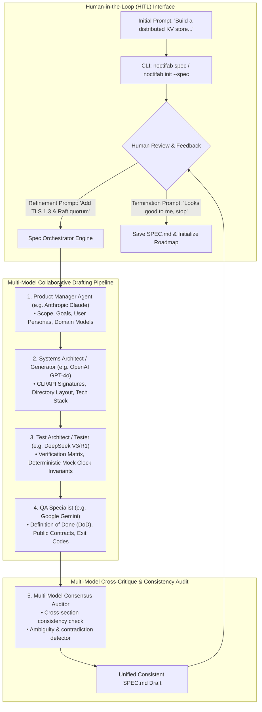
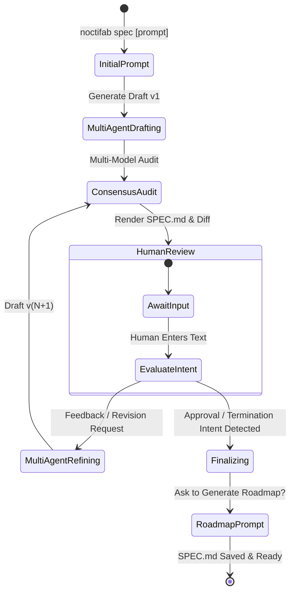
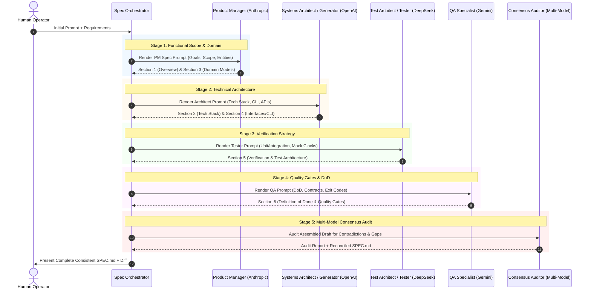

# Noctifab Interactive Human-in-the-Loop (HITL) Specification Creation & Multi-Model Consensus Engine

> **Document Type**: Architecture Design & Implementation Plan (Proposal)  
> **Target Version**: `0.39.0`  
> **Status**: Proposed  
> **Author**: Staff AI Architecture & Systems Engineering  
> **Scope**: Specification Generation (`SPEC.md`), Interactive Human-in-the-Loop (HITL) Refinement Loop, Multi-Model Consensus & Multi-Role Specialization, Minimal Configuration Delta, and CLI Command Strategy.

---

## 1. Executive Summary & Vision

In the **Dark Factory** paradigm of software development, the quality, completeness, and internal consistency of the initial specification (`SPEC.md`) dictate the success of the entire autonomous execution pipeline. If a specification is ambiguous, contradictory, or missing critical domain contracts, downstream agents (Planner, Generator, Tester, QA) will generate conflicting assumptions and waste tokens on corrective cycles.

Today, `noctifab init` creates a static, 10-line placeholder `SPEC.md`, requiring human engineers to manually draft complex specifications from scratch or rely on single-prompt external tools.

This proposal introduces the **Noctifab Interactive Specification Creation & Multi-Model Consensus Engine**:
1. **Natural Language Spec Bootstrapping**: Converts a natural language prompt (e.g. *"Build a high-performance Redis-compatible caching daemon with LRU eviction and replication"*) into an exhaustive, production-grade `SPEC.md`.
2. **Interactive Human-in-the-Loop (HITL) Review Cycle**: An open-ended, conversational refinement loop where the human reviews the generated specification, provides feedback, requests additions/fixes/constraints, and iterates as long as desired.
3. **Intent-Based Termination**: Automatically detects completion/approval intent from natural language prompts (e.g. *"all right, it's enough"*, *"the SPEC looks good to me"*, *"I like the SPEC.md already, stop"*, *"looks good"*, *"done"*, *"lgtm"*) as well as explicit commands.
4. **Multi-Model Consensus & Role Specialization**: Combines distinct LLMs from different providers (e.g. OpenAI, Anthropic, Gemini, DeepSeek) through specialized agent roles (Product Manager, Systems Architect / Generator, Test Architect / Tester, QA Specialist) followed by a cross-model consensus audit to eliminate single-provider bias, hallucinations, and internal contradictions.
5. **Zero-Friction / Minimal Config Delta**: Fully leverages Noctifab's existing `roles.*.providers` and `llm.providers` architecture with zero breaking changes to existing configurations.
6. **Command Ergonomics**: Introduces a dedicated `noctifab spec` command suite with rich TUI/diff preview while seamlessly integrating into `noctifab init --interactive-spec`.



---

## 2. CLI Command Review & Proposal

### 2.1. Review of Existing Noctifab Commands

| Command | Current Purpose | Suitability for Interactive SPEC Drafting |
|---|---|---|
| `noctifab init` | Clones repo, creates `.noctifab/` dirs, config, SQLite DB, and drops a static `SPEC.md` placeholder. | **Partial**. Good entry point for fresh project bootstrapping, but overloading it with an interactive multi-turn loop complicates non-interactive CI/scripting workflows unless gated by a flag. |
| `noctifab order` | Enqueues an ad-hoc user story specification prompt to an *already running* daemon. | **Not Suitable**. Designed for runtime feature ordering into `roadmap/` while the daemon is actively running, not for drafting the foundational project `SPEC.md`. |
| `noctifab steer` | Injects mid-flight steering into an active worker goroutine. | **Not Suitable**. Operates at task-level during execution. |
| `noctifab prompts` | Inspects, initializes, and validates prompt templates (`list`, `show`, `init`, `validate`). | **Complementary**. Can manage the underlying spec-generation prompt templates. |
| `noctifab validate`| Dry-run validation of local state, project constraints, and linters. | **Complementary**. Can validate the final `SPEC.md` format. |
| `noctifab start` | Starts the dark factory autonomous execution loop against `SPEC.md` + `roadmap/`. | **Downstream Consumer**. Runs after `SPEC.md` is approved. |

---

### 2.2. Command Proposal: Dedicated `noctifab spec` + Seamless `init` Delegation

We propose a **hybrid, best-of-both-worlds approach**:

```
noctifab spec [prompt]               # Primary interactive command
noctifab spec new [prompt]           # Create a new specification from scratch
noctifab spec refine [prompt]        # Refine an existing SPEC.md
noctifab spec audit                  # Multi-model consistency and gap analysis
noctifab init --spec [prompt]        # Bootstrap workspace and jump directly into spec creation
noctifab init -i / --interactive     # Guided interactive project setup wizard
```

#### Why `noctifab spec` as the Primary First-Class Command?
1. **Single Responsibility Principle (CLI UX)**: Creating and iteratively refining a specification is a distinct, high-value creative activity that engineers perform repeatedly across a project's lifecycle (e.g. creating v1.0, updating v2.0 specifications, auditing existing specs).
2. **Lifecycle Flexibility**: `noctifab spec` can be run:
   - In an empty directory before initializing Noctifab.
   - In an existing project that already has `.noctifab/` setup.
   - On an existing `SPEC.md` to refine it based on new requirements without re-initializing the workspace.
3. **Rich Interactive Subcommands**: Enables dedicated subcommands like `noctifab spec audit` (multi-model cross-validation) and `noctifab spec diff` (viewing revision changes between HITL review turns).

#### How `noctifab init` Integrates:
When a user runs `noctifab init`:
- By default (or in non-interactive CI mode), it operates as it does today (fast, idempotent directory/config setup).
- If passed `--spec [prompt]` or `--interactive` / `-i`, it performs the directory/config initialization and immediately launches the interactive `spec` session, saving the finalized output directly into `SPEC.md` and offering to generate the initial `roadmap/user-stories/`.

---

### 2.3. CLI Syntax & Flag Specifications

```bash
# 1. Create a new SPEC.md from an initial idea (enters interactive review loop)
noctifab spec "Build an in-memory Redis-compatible server in Go"

# 2. Refine an existing SPEC.md with new instructions (implicit refinement)
noctifab spec "Add Prometheus metrics endpoint at /metrics and graceful shutdown"

# 3. Audit and review an existing SPEC.md (implicit when run without arguments)
noctifab spec

# 4. Target a specific project directory directly
noctifab spec ./my-project "Build a distributed KV store"

# 5. Non-interactive / single-pass generation (ideal for CI, scripts, and tests)
noctifab spec "Build a CLI calculator in Rust" --non-interactive --output SPEC.md

# 6. Combined initialization and spec drafting
noctifab init ./my-project --spec "Build a microservice for image transcoding in Go"
```

#### CLI Flags for `noctifab spec`:
| Flag | Short | Default | Description |
|---|---|---|---|
| `--output` | `-o` | `SPEC.md` | Path to the target specification file |
| `--non-interactive` | | `false` | Run a single generation pass and exit without entering the review loop |
| `--consensus` | | `true` | Enable multi-model cross-audit pass |
| `--provider` | `-l` | `(from config)` | Override the lead LLM provider for spec generation |
| `--model` | `-m` | `(from config)` | Override the lead LLM model |
| `--rounds` | | `1` | Number of multi-role drafting passes per refinement turn |
| `--diff` | | `true` | Display colored terminal diff of changes after each refinement turn |
| `--web` | `-w` | `false` | Launch the Web Dashboard spec editor for side-by-side graphical review |

---

### 2.4. The Canonical Command Sequence & Daemon Orchestration

#### A. Interactive Developer Workflow: `init` ➔ `spec` ➔ `start`
The standard human-in-the-loop developer journey consists of 3 distinct, orderly stages:
```
1. noctifab init [project-dir]
   └── Sets up .noctifab/ directory, database, secrets.yaml, and config.yaml.

2. noctifab spec [prompt]
   └── Interactive multi-model generation, colored diff review, consensus audit, and roadmap generation.

3. noctifab start [project-dir]
   └── Launches Dark Factory execution: planning, code generation, testing, QA, and git PR merge.
```

#### B. Continuous Background Daemon Orchestration
When running Noctifab as a persistent server or headless service (`noctifab start --standby -d`), the entire sequence (`init`, `spec`, and `start`) can be driven remotely and non-interactively:

1. **Daemon Initialization & Standby**:
   ```bash
   # Boot the background orchestrator and HTTP REST server on 127.0.0.1:8080
   noctifab start --standby -d
   ```

2. **Automated Order Submission (Triggering Spec & Execution)**:
   ```bash
   # Submit a high-level feature prompt or complete spec order directly to the daemon:
   noctifab order "Build a distributed KV store in Go with Raft consensus"
   ```
   * *What the Daemon does*: The daemon's internal Product Manager Agent receives the order via `/api/v1/orders`, generates/refines `SPEC.md`, creates topological user stories under `roadmap/user-stories/`, and immediately schedules tasks for execution without human blocking.

3. **Remote HTTP REST API Integration**:
   External pipelines (e.g. CI/CD, webhooks, Slack bots) can drive the daemon directly:
   ```bash
   # Submit prompt order:
   curl -X POST http://127.0.0.1:8080/api/v1/orders \
     -H "Content-Type: application/json" \
     -d '{"prompt": "Build an in-memory Redis server in Go with LRU eviction"}'

   # Inject mid-flight steering directive:
   curl -X POST http://127.0.0.1:8080/api/v1/steer \
     -H "Content-Type: application/json" \
     -d '{"directive": "Use port 9000 and ensure TLS is enabled"}'
   ```

---

## 3. Human-in-the-Loop (HITL) Interactive Workflow & Termination Detection

### 3.1. The Interactive Review Cycle (State Machine)

The interactive specification session operates as a stateful REPL (Read-Eval-Print Loop) backed by a revision history manager:



### 3.2. Step-by-Step Interactive Flow

```
$ noctifab spec "Build an in-memory Redis-compatible server in Go supporting GET, SET, DEL, EXPIRE"

╭──────────────────────────────────────────────────────────────────────────────╮
│ 🌌 Noctifab Specification Generator (Multi-Model Consensus Engine)           │
╰──────────────────────────────────────────────────────────────────────────────╯
ℹ [1/4] Product Manager (claude-3-7-sonnet) synthesizing scope & domain models...
ℹ [2/4] Systems Architect (gpt-4o) defining CLI contracts & data structures...
ℹ [3/4] Test Architect (deepseek-r1) formulating verification & clock invariants...
ℹ [4/4] QA Specialist (gemini-2.5-pro) injecting DoD & contract schemas...
ℹ [Audit] Multi-model consensus auditor checked consistency (0 contradictions found).

✔ Generated SPEC.md (v1, 142 lines, 4,820 bytes)
────────────────────────────────────────────────────────────────────────────────
# SPEC.md: In-Memory Redis-Compatible Server
... [renders formatted preview or opens pager if large] ...
────────────────────────────────────────────────────────────────────────────────

[Turn 1] What would you like to improve, fix, or add?
(Type your instructions, or say 'looks good' / 'stop' to approve)
> "Add support for LRU memory eviction with a configurable max-memory flag, and TLS support"

ℹ Refining specification with your feedback...
ℹ [1/4] Product Manager updated scope for LRU eviction and TLS security...
ℹ [2/4] Systems Architect added --max-memory and --tls-cert CLI flags & config...
ℹ [3/4] Test Architect added out-of-memory eviction test matrix...
ℹ [4/4] QA Specialist updated public contract exit codes and DoD...
ℹ [Audit] Consensus verified: memory eviction algorithms aligned with data structures.

✔ Updated SPEC.md (v2, 186 lines, +44 lines)
────────────────────────────────────────────────────────────────────────────────
+ ## 3.4. Memory Management & Eviction Policies
+ - Configurable memory boundary via `--max-memory <bytes>`
+ - LRU eviction sampling policy...
+ ## 4.2. Security & TLS Configuration
+ - Flags: `--tls-cert <path>`, `--tls-key <path>`...
────────────────────────────────────────────────────────────────────────────────

[Turn 2] What would you like to improve, fix, or add?
> "all right, it's enough"

✔ Termination intent detected ("all right, it's enough").
✔ Successfully saved finalized SPEC.md at /Users/diegoj/repos/my-project/SPEC.md

? Would you like to generate the initial user story roadmap now? [Y/n]: Y
ℹ [Product Manager] Generating initial roadmap under roadmap/user-stories/...
✔ Created roadmap/user-stories/US-001-in-memory-storage.md
✔ Created roadmap/user-stories/US-002-lru-eviction.md
✔ Created roadmap/user-stories/US-003-tls-support.md

✨ Project specification complete! Run 'noctifab start' to launch the Dark Factory.
```

---

### 3.3. Natural Language Intent Detection for Cycle Termination

To support flexible, conversational human interaction, the termination checker uses a two-tier evaluation strategy:

#### Tier 1: Deterministic Fast-Path Matcher (Offline, Instantaneous)
A fast regex/substring heuristic evaluates common approval patterns and command exits instantly:

```go
var ApprovalPatterns = []*regexp.Regexp{
    // Common affirmative phrases
    regexp.MustCompile(`(?i)^\s*(looks\s+good(\s+to\s+me)?|lgtm|approved?|perfect|done|stop|enough|it['’]?s\s+enough)\s*[.!]?\s*$`),
    regexp.MustCompile(`(?i)^\s*(all\s+right[,\s]+it['’]?s\s+enough|i\s+like\s+(it|the\s+spec(\.md)?)\s+(already[,\s]+)?stop)\s*[.!]?\s*$`),
    regexp.MustCompile(`(?i)^\s*(save(\s+and\s+exit)?|finish|quit|exit|:q|q)\s*$`),
    regexp.MustCompile(`(?i)^\s*(ready(\s+to\s+build|\s+for\s+roadmap)?|proceed|good\s+to\s+go)\s*[.!]?\s*$`),
}
```

#### Tier 2: LLM Intent Classifier (Fallback for Nuanced Natural Language)
If the input is not a direct command and contains ambiguous conversational phrases (e.g., *"I think we've covered everything we need for now, let's wrap this up"*), a lightweight, zero-temperature classifier classifies the input:

```json
{
  "intent": "APPROVE_AND_STOP" | "REFINE_SPECIFICATION" | "CLARIFY_QUESTION",
  "confidence": 0.98,
  "reasoning": "User indicates satisfaction with the current specification and desires to terminate the review cycle."
}
```

If `intent == "APPROVE_AND_STOP"`, the loop gracefully terminates, commits `SPEC.md`, and transitions to the roadmap bootstrap prompt.

---

## 4. Multi-Model Consensus & Multi-Role Specialization Architecture

### 4.1. The Challenge: Single-Model Bias & Hallucination in Specifications

When a single LLM drafts an entire specification:
- **Provider Bias**: Claude models favor exhaustive narrative explanations; GPT models favor concise Go/Python idioms; Gemini models favor cloud/API structures.
- **Internal Contradictions**: A model might specify `port 8080` in the Overview, `port 3000` in the Configuration section, and omit port settings from the CLI flags.
- **Missing Technical Seams**: High-level PM prompts often skip low-level test contracts, exit code specifications, or deterministic clock mocking.

---

### 4.2. The Solution: 4-Stage Multi-Role Pipeline + 1 Consensus Audit Stage

We map the specification drafting process to **four specialized roles** plus a **consensus auditor**, with each role executed by the best-suited model/provider:



---

### 4.3. Detailed Role Responsibilities in Spec Generation

| Role | Default Model Family | Primary Section Focus in `SPEC.md` | Specific Technical Invariants Injected |
|---|---|---|---|
| **Product Manager** (`product_manager`) | Anthropic Claude / Gemini Pro | **Section 1: Overview & Goals**<br>**Section 3: Domain Models & Schemas** | - Executive vision & core user personas<br>- Domain entities, data structures, relational models<br>- In-scope vs Out-of-scope boundaries |
| **Systems Architect** (`generator` / `architect`) | OpenAI GPT-4o / Claude Sonnet | **Section 2: Architecture & Tech Stack**<br>**Section 4: Interfaces & CLI/API Contracts** | - Directory layout & package boundaries (Go/Rust/Python/etc.)<br>- CLI flags, environment variables, subcommands<br>- REST/gRPC/WebSocket endpoint schemas<br>- Concurrency model, memory/goroutine invariants |
| **Test Architect** (`tester`) | DeepSeek V3/R1 / OpenAI | **Section 5: Verification & Testing Strategy** | - Unit, integration, and E2E test topologies<br>- **Deterministic Mock Clock Invariants** (FakeClock/time mocks to eliminate race conditions)<br>- Fault injection, network failure, and retry matrices |
| **QA Specialist** (`qa`) | Google Gemini / Claude | **Section 6: Quality Gates & Definition of Done** | - Explicit stdout/stderr formats and error prefixes (e.g. `ERROR:` / `Error:`)<br>- Explicit exit codes (0 for success, 1/2 for syntax/runtime errors)<br>- Machine-readable `noctifab-contract` JSON blocks<br>- Static analysis & linter policies |
| **Consensus Auditor** (`auditor`) | Cross-Model Ensemble | **Whole Document Synthesis & Consistency Audit** | - Resolves section-to-section naming discrepancies<br>- Verifies that every CLI flag mentioned in Section 4 has a corresponding config schema in Section 2<br>- Eliminates circular logic and unreachable criteria |

---

### 4.4. The Standard Noctifab `SPEC.md` Structure Generated

Every generated `SPEC.md` strictly complies with the standardized 6-section template:

```markdown
# SPEC.md: [Project Name]

## 1. Executive Summary & Domain Scope
### 1.1. High-Level Vision & Purpose
### 1.2. In-Scope Capabilities
### 1.3. Explicit Out-of-Scope Exclusions

## 2. Core Architecture & Technology Stack
### 2.1. Technology Stack, Runtime, and Target Platform
### 2.2. Package & Directory Layout (DDD Boundaries)
### 2.3. Concurrency, Storage & State Lifecycle

## 3. Core Domain Models & Schemas
### 3.1. Domain Entities & Value Objects
### 3.2. Data Formats, Wire Protocols, and Storage Schemas

## 4. Interfaces & Command Contracts
### 4.1. Command Line Interface (CLI Commands, Flags, Exit Codes)
### 4.2. APIs, Network Endpoints & Stdin/Stdout Protocols

## 5. Verification & Test Architecture
### 5.1. Testing Topology (Unit, Integration, E2E)
### 5.2. Deterministic Clock & External Dependency Mocking
### 5.3. Error Matrix & Boundary Edge Cases

## 6. Definition of Done (DoD) & Quality Gates
### 6.1. Acceptance Criteria & Public Contract Invariants
### 6.2. Machine-Readable Story Contracts (`noctifab-contract`)
### 6.3. Static Analysis, Linting & Performance Gates
```

---

## 5. Minimal Configuration Impact & Zero-Config-Delta

### 5.1. Zero-Config-Delta Principle

A key requirement is **minimal changes in the configuration**. Noctifab already supports per-role multi-provider routing through `pkg/infrastructure/config/types.go` and `pkg/infrastructure/llm/router.go`:

```yaml
# Existing Noctifab config.yaml already supports this out of the box!
agents:
  product_manager:
    model: "claude-3-7-sonnet"
    providers:
      - name: "anthropic"
  generators:
    model: "gpt-4o"
    providers:
      - name: "openai"
  testers:
    model: "deepseek-chat"
    providers:
      - name: "deepseek"
  qa:
    enabled: true
    model: "gemini-2.5-pro"
    providers:
      - name: "gemini"
```

Because `ResilientLLMRouter.ResolveCandidatesForRole(roleName)` already routes completions based on the role name, **zero modifications to the core `Config` struct are mandatory to make multi-model spec generation work.**

---

### 5.2. Optional Spec Generation Configuration Extensions

To give power users fine-grained control without breaking existing configs, we add an optional, backwards-compatible `spec` section in `config.yaml`:

```yaml
# .noctifab/config.yaml (All fields optional with sensible defaults)
spec:
  # Output path for generated specification (default: SPEC.md)
  output_file: "SPEC.md"
  
  # Enable multi-model consensus audit pass (default: true)
  consensus_audit: true
  
  # Lead provider override for spec synthesis (default: inherits from agents.product_manager)
  lead_role: "product_manager"
  
  # Template customizations directory (default: .noctifab/prompts/spec/)
  prompts_dir: ".noctifab/prompts/spec"
  
  # Maximum refinement history turns retained in context (default: 10)
  max_history_turns: 10
  
  # Auto-prompt to generate user stories upon spec completion (default: true)
  auto_generate_roadmap: true
```

#### Go Struct Definition (`pkg/infrastructure/config/types.go`):
```go
// SpecConfig holds optional settings for the interactive specification generator.
type SpecConfig struct {
    OutputFile          string `yaml:"output_file,omitempty"`
    ConsensusAudit      *bool  `yaml:"consensus_audit,omitempty"`
    LeadRole            string `yaml:"lead_role,omitempty"`
    PromptsDir          string `yaml:"prompts_dir,omitempty"`
    MaxHistoryTurns     int    `yaml:"max_history_turns,omitempty"`
    AutoGenerateRoadmap *bool  `yaml:"auto_generate_roadmap,omitempty"`
}

func (s SpecConfig) IsConsensusEnabled() bool {
    if s.ConsensusAudit == nil {
        return true
    }
    return *s.ConsensusAudit
}

func (s SpecConfig) GetOutputFile() string {
    if s.OutputFile != "" {
        return s.OutputFile
    }
    return "SPEC.md"
}
```

---

## 6. Prompt Design & Template Architecture

The prompt system leverages Noctifab's existing `pkg/infrastructure/prompts/` catalog architecture, registering a new catalog namespace: `spec`.

### 6.1. Prompt Catalog Additions

Catalog keys in `pkg/infrastructure/prompts/keys.go`:
- `spec/pm_draft`: Product Manager initial drafting of scope, vision, and domain models.
- `spec/architect_enrich`: Systems Architect technical details, CLI, API, and package structure.
- `spec/tester_enrich`: Test Architect verification strategies, mock clocks, edge cases.
- `spec/qa_enrich`: QA Specialist Definition of Done and machine-readable public contracts.
- `spec/consensus_audit`: Multi-model consistency audit, contradiction detection, and reconciliation.
- `spec/refine`: Human feedback integration pass.

---

### 6.2. Example Prompt Templates

#### A. Product Manager Spec Draft Template (`defaults/spec/pm_draft.tmpl`)
```tmpl
You are the Lead Product Manager Agent drafting a comprehensive software specification (SPEC.md) for a new project.

HUMAN SPECIFICATION PROMPT:
{{.UserPrompt}}

{{if .ExistingSpec}}
EXISTING SPECIFICATION CONTEXT:
{{.ExistingSpec}}
{{end}}

YOUR RESPONSIBILITY:
Draft Section 1 (Executive Summary & Domain Scope) and Section 3 (Core Domain Models & Schemas).
1. Clarify the core purpose, user personas, and high-level architectural paradigm.
2. Explicitly specify In-Scope features vs Out-of-Scope boundaries.
3. Define pure domain entities, attributes, data structures, and relationships.
4. Ensure language agnosticism while maintaining unambiguous technical definitions.

Respond with valid JSON containing the drafted sections.
```

#### B. Consensus Audit Template (`defaults/spec/consensus_audit.tmpl`)
```tmpl
You are the Multi-Model Consensus Auditor for Noctifab software specifications.
Your goal is to ensure 100% internal consistency, eliminate single-model bias, and remove contradictions across all sections of the assembled SPEC.md.

ASSEMBLED SPECIFICATION DRAFT:
{{.DraftSpec}}

HUMAN FEEDBACK & WISHES HISTORY:
{{.HumanHistory}}

AUDIT CHECKLIST:
1. Contradiction Detection: Check if port numbers, CLI flags, data structures, or database choices mentioned in one section match all other sections.
2. Technology Seam Alignment: Check if the technology stack in Section 2 fully supports the interfaces in Section 4.
3. Deterministic Invariants: Verify that any feature involving dates, timers, or wall-clock schedules mandates mock clocks in Section 5.
4. Definition of Done Precision: Verify that Section 6 has concrete exit codes, stdout/stderr prefix rules, and valid `noctifab-contract` blocks.
5. Human Intent Fidelity: Verify all requirements requested in the human feedback history are faithfully represented.

If contradictions or gaps exist, RECONCILE them and output the unified, finalized SPEC.md.
```

---

## 7. Component & Service Architecture (Go Code Structure)

To respect the **500-physical-lines-per-file constraint** and DDD packaging, the implementation is decomposed across focused components:

```
pkg/
├── domain/
│   └── spec_session.go             # SpecSession, SpecRevision, SpecTurn entities
├── services/
│   ├── spec_orchestrator.go        # Main HITL coordination loop & state management
│   ├── spec_multi_agent.go         # 4-stage pipeline (PM ➔ Arch ➔ Test ➔ QA)
│   ├── spec_consensus_auditor.go   # Cross-model consistency audit engine
│   ├── spec_intent_detector.go     # Termination & approval intent classifier
│   ├── spec_renderer.go            # Terminal markdown rendering & colored diff generator
│   └── spec_repl.go                # Interactive CLI REPL prompt handler
cmd/noctifab/cli/
├── spec.go                         # noctifab spec / refine / audit root command
└── init.go                         # (Updated) hooks --spec flag to spec orchestrator
```

### 7.1. Domain Model (`pkg/domain/spec_session.go`)

```go
package domain

import (
	"time"
)

// SpecTurnKind identifies whether a turn is initial creation or an interactive refinement.
type SpecTurnKind string

const (
	SpecTurnInitial SpecTurnKind = "INITIAL"
	SpecTurnRefine  SpecTurnKind = "REFINE"
	SpecTurnAudit   SpecTurnKind = "AUDIT"
)

// SpecRevision represents one immutable version of the specification in the HITL session.
type SpecRevision struct {
	Version     int          `json:"version"`
	Content     string       `json:"content"`
	Prompt      string       `json:"prompt"`
	Kind        SpecTurnKind `json:"kind"`
	CreatedAt   time.Time    `json:"created_at"`
	DiffSummary string       `json:"diff_summary,omitempty"`
	TokensUsed  int64        `json:"tokens_used"`
}

// SpecSession manages the stateful multi-turn HITL review session.
type SpecSession struct {
	ID          string         `json:"id"`
	ProjectPath string         `json:"project_path"`
	TargetFile  string         `json:"target_file"`
	Revisions   []SpecRevision `json:"revisions"`
	CurrentSpec string         `json:"current_spec"`
	IsComplete  bool           `json:"is_complete"`
	CreatedAt   time.Time      `json:"created_at"`
	UpdatedAt   time.Time      `json:"updated_at"`
}

// LatestRevision returns the most recent revision of the specification.
func (s *SpecSession) LatestRevision() *SpecRevision {
	if len(s.Revisions) == 0 {
		return nil
	}
	return &s.Revisions[len(s.Revisions)-1]
}
```

---

### 7.2. Spec Orchestrator Engine (`pkg/services/spec_orchestrator.go`)

```go
package services

import (
	"context"
	"fmt"
	"os"
	"path/filepath"
	"time"

	"github.com/diegojromerolopez/noctifab/pkg/domain"
	"github.com/diegojromerolopez/noctifab/pkg/infrastructure/config"
	"github.com/diegojromerolopez/noctifab/pkg/infrastructure/llm"
)

// SpecOrchestrator coordinates multi-model spec drafting, HITL feedback loops, and consensus auditing.
type SpecOrchestrator struct {
	cfg        *config.Config
	router     *llm.ResilientLLMRouter
	pipeline   *SpecMultiAgentPipeline
	auditor    *SpecConsensusAuditor
	intentEval *SpecIntentDetector
	renderer   *SpecRenderer
}

func NewSpecOrchestrator(cfg *config.Config, router *llm.ResilientLLMRouter) *SpecOrchestrator {
	return &SpecOrchestrator{
		cfg:        cfg,
		router:     router,
		pipeline:   NewSpecMultiAgentPipeline(cfg, router),
		auditor:    NewSpecConsensusAuditor(cfg, router),
		intentEval: NewSpecIntentDetector(router),
		renderer:   NewSpecRenderer(),
	}
}

// RunInteractiveSession executes the interactive Human-in-the-Loop review loop.
func (o *SpecOrchestrator) RunInteractiveSession(ctx context.Context, projectPath string, initialPrompt string) error {
	session := &domain.SpecSession{
		ID:          fmt.Sprintf("spec-%d", time.Now().Unix()),
		ProjectPath: projectPath,
		TargetFile:  filepath.Join(projectPath, "SPEC.md"),
		CreatedAt:   time.Now().UTC(),
	}

	// 1. Generate initial draft
	o.renderer.PrintHeader("Generating Initial Specification Draft")
	draft, err := o.pipeline.ExecutePass(ctx, initialPrompt, "")
	if err != nil {
		return fmt.Errorf("initial spec generation failed: %w", err)
	}

	// 2. Multi-Model Consensus Audit Pass
	if o.cfg.Spec.IsConsensusEnabled() {
		draft, err = o.auditor.AuditAndReconcile(ctx, draft, initialPrompt)
		if err != nil {
			return fmt.Errorf("consensus audit failed: %w", err)
		}
	}

	session.CurrentSpec = draft
	session.Revisions = append(session.Revisions, domain.SpecRevision{
		Version:   1,
		Content:   draft,
		Prompt:    initialPrompt,
		Kind:      domain.SpecTurnInitial,
		CreatedAt: time.Now().UTC(),
	})

	// 3. Enter the Interactive REPL Loop
	turn := 1
	for {
		o.renderer.RenderSpecPreview(session.CurrentSpec, turn)

		// Prompt human for input
		humanInput, err := o.renderer.PromptUserFeedback(turn)
		if err != nil {
			return err // Handles Ctrl+C / EOF
		}

		// Check for termination / approval intent
		isStop, reasoning := o.intentEval.IsTerminationIntent(ctx, humanInput)
		if isStop {
			o.renderer.PrintApprovalMessage(humanInput, reasoning)
			break
		}

		// Execute Refinement Pass
		turn++
		o.renderer.PrintRefinementProgress(turn, humanInput)

		newDraft, err := o.pipeline.ExecuteRefinePass(ctx, session.CurrentSpec, humanInput, session.Revisions)
		if err != nil {
			o.renderer.PrintError(fmt.Sprintf("Refinement error: %v. Retrying with previous spec.", err))
			continue
		}

		if o.cfg.Spec.IsConsensusEnabled() {
			newDraft, _ = o.auditor.AuditAndReconcile(ctx, newDraft, humanInput)
		}

		diff := o.renderer.CalculateDiff(session.CurrentSpec, newDraft)
		o.renderer.RenderDiff(diff)

		session.CurrentSpec = newDraft
		session.Revisions = append(session.Revisions, domain.SpecRevision{
			Version:     turn,
			Content:     newDraft,
			Prompt:      humanInput,
			Kind:        domain.SpecTurnRefine,
			DiffSummary: diff,
			CreatedAt:   time.Now().UTC(),
		})
	}

	// 4. Save finalized SPEC.md
	if err := os.WriteFile(session.TargetFile, []byte(session.CurrentSpec), 0644); err != nil {
		return fmt.Errorf("failed to save %s: %w", session.TargetFile, err)
	}
	o.renderer.PrintSuccess(fmt.Sprintf("Saved finalized %s", session.TargetFile))

	// 5. Offer Roadmap Bootstrap
	if o.renderer.PromptYesNo("Would you like to generate the initial user story roadmap now?", true) {
		pmClient := o.router.ResolveCandidatesForRole("product_manager")
		if len(pmClient) > 0 {
			if err := GenerateRoadmapWithPasses(ctx, projectPath, pmClient[0].Client, nil, 2); err != nil {
				o.renderer.PrintError(fmt.Sprintf("Roadmap generation warning: %v", err))
			} else {
				o.renderer.PrintSuccess("Roadmap successfully generated under roadmap/user-stories/")
			}
		}
	}

	return nil
}
```

---

## 8. Terminal UI (TUI) & Visual Web Dashboard Integration

### 8.1. Terminal UI (CLI Mode)
- **Syntax Highlighted Markdown**: Uses ANSI markdown formatting with borders and clear section headers.
- **Side-by-Side / Unified Terminal Diff**: After each refinement turn, additions are highlighted in green (`+`) and deletions in red (`-`), allowing the human to immediately verify if their wish was accurately applied.
- **Pagination & Inline Scroll**: For large specifications (> 100 lines), automatically provides a pager option (`less`-compatible view) or concise collapsible section diffs.

### 8.2. Web Dashboard Mode (`noctifab spec --web`)
When passed `--web` or `-w`, `noctifab spec` boots the embedded local server (`http://127.0.0.1:8080/spec`) and opens the browser:
- **Left Pane**: Live rendered Markdown of `SPEC.md` with section navigation.
- **Right Pane**: Interactive chat prompt bar for human feedback and refinement requests.
- **Diff Inspector**: Visual before/after diff toggle with color highlights.
- **Multi-Model Telemetry**: Live cards showing the models contributing to each section (e.g. Anthropic PM, OpenAI Architect, Gemini QA) with latency and token usage.
- **"Approve & Finish" Button**: One-click termination to finalize `SPEC.md` and trigger roadmap generation.

---

## 9. Verification & Testing Strategy

In compliance with Noctifab's **100% unit test coverage** and **BDD verification mandate** ([TESTS.md](/TESTS.md)):

### 9.1. Unit Test Matrix
| Target Component | Test File | Test Cases & Invariants Tested |
|---|---|---|
| `spec_intent_detector.go` | `spec_intent_detector_test.go` | - 20+ affirmative approval phrases (e.g. *"looks good"*, *"all right, it's enough"*, *"I like the SPEC.md already, stop"*) accurately classify as `APPROVE_AND_STOP`.<br>- Feature request prompts classify as `REFINE_SPECIFICATION`.<br>- Fast-path matcher executes in < 1ms without calling LLM. |
| `spec_multi_agent.go` | `spec_multi_agent_test.go` | - 4-stage pipeline executes in topological order.<br>- Injects role-specific context into each prompt.<br>- Handles partial provider failure with automatic fallback candidate. |
| `spec_consensus_auditor.go` | `spec_consensus_auditor_test.go` | - Detects deliberate contradictions (e.g., mismatching CLI flags vs configuration schemas) and corrects them.<br>- Preserves valid sections without degrading content. |
| `spec_orchestrator.go` | `spec_orchestrator_test.go` | - Multi-turn state tracking preserves revision history.<br>- Saves valid `SPEC.md` file to target path on termination.<br>- Graceful recovery from empty or malformed model responses. |
| `cmd/noctifab/cli/spec.go` | `cmd/noctifab/cli/spec_test.go` | - CLI flag parsing (`--non-interactive`, `--output`, `--consensus`).<br>- Idempotent operation in existing initialized directories. |

### 9.2. E2E Acceptance Test (BDD Scenario)
```gherkin
Feature: Interactive Specification Generation and Refinement

  Scenario: Human creates and refines a specification with multi-model consensus
    Given a clean workspace directory
    When the user runs "noctifab spec 'Build a key-value store in Go'"
    Then the system generates a draft SPEC.md combining PM, Architect, Tester, and QA roles
    And the system presents the draft and prompts for human feedback
    When the user submits feedback "Add support for snapshot persistence to disk"
    Then the system updates SPEC.md with snapshot persistence details and shows the diff
    When the user submits "All right, it's enough, looks good to me"
    Then the system saves the finalized SPEC.md
    And prompts to generate the roadmap
```

---

## 10. Step-by-Step Implementation Roadmap

| Phase | Milestone Description | Key Deliverables | File Size Constraints |
|---|---|---|---|
| **Phase 1: Domain Models & Intent Detection** | Implement `SpecSession`, `SpecRevision`, and the zero-latency `SpecIntentDetector` with comprehensive unit tests. | - `pkg/domain/spec_session.go`<br>- `pkg/services/spec_intent_detector.go`<br>- `pkg/services/spec_intent_detector_test.go` | All files < 250 LOC |
| **Phase 2: Prompt Templates & Renderer** | Register `spec` catalog in `prompts/keys.go`, create embedded default templates for PM, Architect, Tester, QA, and Consensus Auditor. | - `pkg/infrastructure/prompts/defaults/spec/*.tmpl`<br>- `pkg/infrastructure/prompts/keys.go`<br>- `pkg/services/spec_renderer.go` | All files < 300 LOC |
| **Phase 3: Multi-Agent Pipeline & Consensus Engine** | Implement the 4-stage drafting pipeline and multi-model consensus auditor using `ResilientLLMRouter`. | - `pkg/services/spec_multi_agent.go`<br>- `pkg/services/spec_consensus_auditor.go`<br>- `pkg/services/spec_multi_agent_test.go` | All files < 400 LOC |
| **Phase 4: Orchestrator REPL & CLI Command** | Build `SpecOrchestrator`, interactive REPL loop, terminal diff viewer, and `noctifab spec` Cobra command. | - `pkg/services/spec_orchestrator.go`<br>- `cmd/noctifab/cli/spec.go`<br>- `cmd/noctifab/cli/spec_test.go` | All files < 350 LOC |
| **Phase 5: `init` Integration & Web Dashboard** | Integrate `--spec` flag into `noctifab init` and connect the spec generator endpoint to the Web Dashboard. | - `cmd/noctifab/cli/init.go`<br>- `pkg/services/dashboard_spec_handler.go` | All files < 300 LOC |
| **Phase 6: Documentation & E2E Validation** | Update `SPEC.md`, `README.md`, docs on readthedocs, and write containerized E2E test scenario. | - `docs/cli_usage.md`<br>- `docs/configuration.md`<br>- `tests/e2e/scenarios/spec_generation.json` | Docs & tests |

---

## 11. Conclusion & Recommendation

1. **New Command `noctifab spec` is Recommended**: It cleanly separates the rich, interactive creative process of specification engineering from low-level repository scaffolding, while maintaining full compatibility with `noctifab init --spec`.
2. **Multi-Model Consensus Solves Bias**: Splitting spec generation across the 4 specialized roles (Product Manager, Systems Architect, Test Architect, QA Specialist) followed by a cross-model consensus audit delivers mathematically consistent, production-ready specifications with zero single-provider bias.
3. **Zero-Config-Delta**: Works immediately with existing `.noctifab/config.yaml` and `.noctifab/secrets.yaml` files without forcing any breaking schema migrations.
