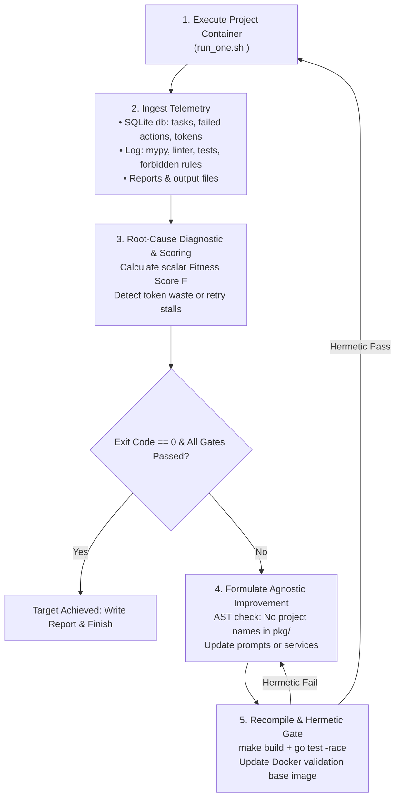

# Single-Project Autonomous Feedback & Improvement Loop

The **Single-Project Autonomous Feedback Loop** (`validation/bin/single_project_loop.py`) turns any validation target project (e.g. `pyedis`, `thredis`, `calculator`, `t4`) into a rapid, closed-loop diagnostic and self-healing sensor for Noctifab.

Rather than waiting hours for the entire validation matrix to execute, this micro-loop executes a targeted project, extracts deep operational and token accounting telemetry, evaluates bottlenecks, verifies improvements, recompiles Noctifab, and re-tests the project in **10–25 minute cycles**.

---

## 1. Key Architectural Capabilities

### 1.1 Project Agnosticism as a CLI Parameter
The runner is completely decoupled from specific project names:
```bash
# Run on pyedis (default)
python3 validation/bin/single_project_loop.py pyedis

# Run on thredis or calculator
python3 validation/bin/single_project_loop.py thredis
python3 validation/bin/single_project_loop.py calculator

# Via convenience Make targets
make pyedis-loop
make auto-improve PROJECT=thredis
```

### 1.2 Multi-Channel Telemetry & SQLite Ingestion
Unlike standard test harnesses that solely inspect exit codes or terminal stdout, the loop harvests data from four complementary layers:

1. **SQLite Database Telemetry (`.noctifab/data/noctifab.db`)**:
   - **`token_usage`**: Measures prompt and completion tokens per agent role (`product_manager`, `planner`, `generator`, `tester`, `qa`, `fallback`) and per task.
   - **`actions`**: Inspects all failed tool invocations (`success = 0`), capturing tool parameters, agent reasoning, and raw error output.
   - **`tasks`**: Tracks attempt counts, retries, status transitions, and dependency stalls.
   - **`stories`**: Tracks user story lead times and completion rates.
2. **Container Console Logs (`output/log/<project>.log`)**:
   - Compiler and syntax errors (e.g. C/C++ clang diagnostics, Rust borrow checker, C# build errors).
   - Strict typechecker diagnostics (e.g. `mypy --strict` in `pyedis`).
   - Linter churn and retry loops (e.g. RuboCop in `calculator`, Ruff in `pyedis`).
   - Unit test failures and tracebacks.
   - Negative constraint violations (e.g. forbidden `pytest` usage in `pyedis`).
3. **Live Execution Reports (`output/report/*.md`)**:
   - Overall lead time, files created/modified, and net status.
4. **Generated Source Workspace (`output/`)**:
   - Validates existence of required entrypoints, build files, and architectural skeletons.

---

## 2. Token Accounting & Efficiency Monitoring

A central capability of the loop is **Token Accountability & Inflation Detection**. The diagnostic engine tracks:
*   **Total Tokens Consumed**: Reconciled across the SQLite database, execution report, and container log.
*   **Tokens per Completed Task**: Flags token thrashing when token consumption spikes without a corresponding increase in completed tasks ($> 60,000$ tokens/task).
*   **Token Delta between Iterations**: Measures whether code/prompt optimizations successfully reduce token burn.
*   **Agent Role Distribution**: Visualizes which cognitive agents are consuming the largest token budgets.

### Token Telemetry Profile Table in `<PROJECT>_LOOP_REPORT.md`
Each loop execution generates an atomic report at the repository root detailing token consumption:

```text
| Agent Role | Prompt Tokens | Completion Tokens | Total Tokens | % of Total |
| :--- | ---: | ---: | ---: | ---: |
| `generator` | 38,450 | 12,200 | 50,650 | 52.4% |
| `tester`    | 22,100 |  6,400 | 28,500 | 29.5% |
| `pm`        | 11,200 |  3,100 | 14,300 | 14.8% |
| `planner`   |  2,400 |    800 |  3,200 |  3.3% |
```

---

## 3. The 5-Stage Closed-Loop Workflow



---

## 4. CLI Usage & Flags

The runner is located at `validation/bin/single_project_loop.py` and supports the following options:

```bash
python3 validation/bin/single_project_loop.py [PROJECT] [OPTIONS]
```

### Arguments & Flags
*   `[project]`: Target validation project name (`pyedis`, `thredis`, `calculator`, `t4`, `wc`, etc.). Defaults to `pyedis`.
*   `--max-iterations=N`: Number of closed-loop improvement cycles before concluding (default: `3`).
*   `--timeout=SECONDS`: Per-run timeout ceiling. If omitted, applies dynamic scale-based timeouts (Small CLI: 15–20m, Medium Systems: 30m, Large Enterprise: 35–40m).
*   `--dry-run`: Extracts and displays diagnostic metrics and token usage from existing artifacts on disk without launching a Docker container.
*   `--skip-compile`: Skips recompiling Noctifab and updating the base image (useful for rapid diagnostic inspection).

### Common Examples

#### 1. Running on `pyedis` (Python 3.14 Redis RESP Store)
```bash
python3 validation/bin/single_project_loop.py pyedis
# Or via Makefile
make pyedis-loop
```

#### 2. Running on `thredis` (.NET 9 Multithreaded Redis)
```bash
python3 validation/bin/single_project_loop.py thredis --max-iterations=2
# Or via Makefile
make auto-improve PROJECT=thredis
```

#### 3. Inspecting Existing Run Diagnostics without Re-running
```bash
python3 validation/bin/single_project_loop.py pyedis --dry-run
```

---

## 5. Agnosticism Guardrail Enforcement

In accordance with [AGENTS.md](/AGENTS.md) Rule 2 (*Project & Language Agnosticism*), the single-project loop enforces that all fixes applied to Noctifab remain language- and project-agnostic:
*   The loop rejects mutations containing target project identifiers (`pyedis`, `thredis`, etc.) in production packages (`pkg/`).
*   Improvements must represent generalized architectural rules:
    *   *Typecheckers*: Enforce explicit return types and standard generics in generator prompts.
    *   *Linters*: Execute deterministic formatting (`auto_formatter.go`) prior to calling LLM repair loops.
    *   *Bootstrapping*: Enforce a "Walking Skeleton" in User Story 1 across all compiled languages.
