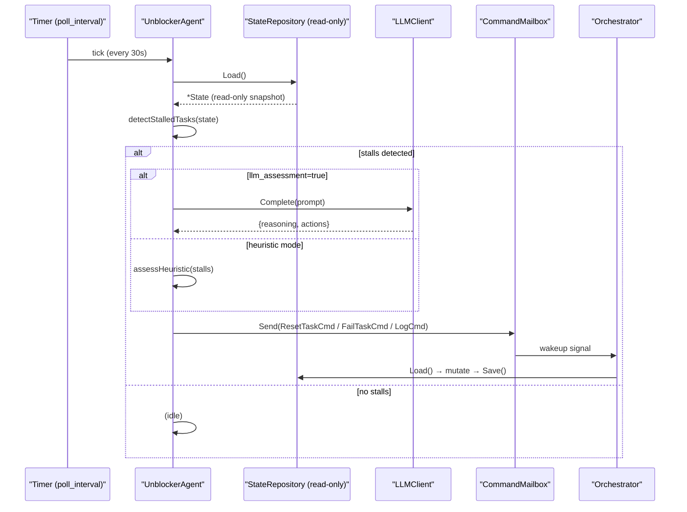

# Unblocker Agent

The **Unblocker Agent** is an autonomous daemon goroutine in `noctifab` that periodically wakes up, scans the shared pipeline state for stalled or blocked tasks and agents, diagnoses the root cause, and injects corrective interventions to restore forward progress.

It is designed as a **separate, independent goroutine** — orthogonal to the orchestrator's main task-dispatch loop — and follows the same architectural pattern as the `ClarificationPoller`.

---

## Motivation

In a multi-agent dark factory pipeline, individual command-level hangs are handled by the **Watchdog** and **WatchdogRepair** services. However, stalls can also occur at a higher level:

- An agent process crashes silently, leaving its task `IN_PROGRESS` forever.
- A Git merge conflict is never resolved, blocking a task in `CONFLICT_BLOCKED` state indefinitely.
- A race condition leaves an agent marked `WORKING` on a task that has already succeeded.
- All pending tasks depend on a blocked task, creating a pipeline deadlock.

Without intervention, these situations exhaust the story's `max_duration` budget and cause silent failures. The Unblocker detects and fixes them proactively, well before the hard deadline.

---

## Stall Detection

The Unblocker classifies stalls into four categories:

| Stall Reason | Signal | Threshold |
|---|---|---|
| `frozen_progress` | Task `IN_PROGRESS` with no `UpdatedAt` change | > `stall_threshold` (default: 5m) |
| `orphaned_task` | Task `IN_PROGRESS` but no `WORKING` agent is assigned | > `stall_threshold / 2` |
| `agent_inconsistency` | Agent `WORKING` but its task is not `IN_PROGRESS` | Any age (immediate) |
| `conflict_blocked` | Task `CONFLICT_BLOCKED` unresolved for too long | > `conflict_threshold` (default: 15m) |

Detection is implemented in `detectStalledTasks()` in [`pkg/services/unblocker.go`](../pkg/services/unblocker.go). It is a pure function — it never modifies state, only reads it.

---

## Dynamic Prompt Enhancement & Fast-Path Engine

When a task stall is detected, the Unblocker Agent does not rely solely on static state metadata. It uses a **runtime context-aware dynamic prompt engine**:

### 1. Live Log Tailing & Credential Scrubbing (`log_tailer.go`)
- The Unblocker tails the task's live standard output/error streaming logs (`.noctifab/logs/tasks/<task_id>.log`).
- Before injecting log snippets into LLM prompts, all logs pass through `SanitizeLog()` to scrub sensitive credentials (API keys, bearer tokens, passwords) per Noctifab's security mandates.

### 2. Fast-Path Deterministic Regex Pre-Filter (`unblocker_fastpath.go`)
- Before invoking the Unblocker LLM, log tails pass through a 0-token static regex engine:
  - **Stdin Prompts**: `(?i)(\\?.*do you want to|overwrite\\? \\[y/n\\])` $\rightarrow$ Resets task with non-interactive directive (`-y`, `--non-interactive`).
  - **Port Binding Collisions**: `(?i)(bind: address already in use)` $\rightarrow$ Directs worker to use ephemeral ports or kill occupying processes.
  - **Interactive Test Watchers**: `(?i)(watch usage: press f to run)` $\rightarrow$ Directs worker to pass `--watchAll=false` or `--ci`.
- **Benefit**: Resolves ~80% of routine CLI hangs in **< 5ms** with **0 LLM token overhead**.

### 3. Progressive 10x Log Window Escalation
To balance token budget with diagnostic depth, log tail windowing scales dynamically based on `task.StallCount`:

| Attempt Level | Log Window Size | Target Diagnostic Scope |
| :---: | :---: | :--- |
| **Level 1 (1st Stall)** | **50 lines** (~60s) | 90% of routine CLI hangs (stdin waits, port collisions, spinners). |
| **Level 2 (2nd Stall)** | **500 lines** (10x) | Stack trace roots, missing environment variables, build compilation errors. |
| **Level 3 (3rd Stall)** | **5,000 lines** (100x / Cap) | Systemic process lifecycle & initialization history. |
| **Level 4 (4th Stall)** | **Full Workspace** | **Last-Resort Agent Escalation**: Orchestrator summons the sovereign Last-Resort Agent to refactor code, tests, and specs. |
| **Level 5 (5th Stall)** | — | **Hard Stop**: Task permanently failed if Last-Resort sovereign repair fails. |

### 4. Task Stall Recovery Directives
Upon task reset, the Unblocker attaches a `RecoveryDirective` to the task state. When the Generator Agent picks up the re-queued task, `[STALL RECOVERY DIRECTIVE]` is injected into its prompt context so the worker avoids repeating the hanging command. When a task reaches 4 stalls, a sovereign escalation directive is injected.

---

## Recovery Modes

### LLM Assessment (default: enabled)

When `unblocker.llm_assessment: true`, the Unblocker:

1. Evaluates the Fast-Path Regex Classifier (`unblocker_fastpath.go`). If matched, applies instant 0-token unblocking.
2. If no fast-path match exists, builds a structured diagnostic prompt via `buildUnblockerPrompt()` (see [`pkg/services/unblocker_prompt.go`](../pkg/services/unblocker_prompt.go)), attaching the tail-escalated log snippet.
3. Calls the LLM with the prompt.
4. Parses the returned JSON action list.
5. Dispatches each action to the `CommandMailbox`.

The LLM response schema:

```json
{
  "reasoning": "Task t-abc has been IN_PROGRESS for 8 minutes with no progress update...",
  "actions": [
    { "tool": "reset_task", "args": { "task_id": "t-abc", "reason": "frozen for 8m, retries not exhausted" } },
    { "tool": "log_message", "args": { "message": "Agent agent-42 inconsistency noted" } }
  ]
}
```

Available action tools:

| Tool | Effect |
|---|---|
| `reset_task` | Resets task to `PENDING` (dispatches `ResetTaskCmd`) |
| `fail_task` | Permanently fails the task (dispatches `FailTaskCmd`) |
| `log_message` | Appends audit entry to `LastActions` (dispatches `LogUnblockerActionCmd`) |
| `noop` | Takes no action (stall appears transient) |

### Heuristic Fallback (LLM disabled or LLM call fails)

When `unblocker.llm_assessment: false` or the LLM call fails, deterministic heuristics are applied:

- `frozen_progress` / `orphaned_task`:
  - If `task.Retries < task.MaxRetries` → `ResetTaskCmd` (reset to `PENDING`)
  - Otherwise → `FailTaskCmd` (retries exhausted)
- `conflict_blocked` → `ResetTaskCmd` (requeue for re-merge attempt)
- `agent_inconsistency` → `LogUnblockerActionCmd` (log the anomaly for traceability)

---

## Integration with CommandMailbox

All corrective actions are dispatched through the existing `CommandMailbox`, the same mechanism used by the REST API for operator commands. This guarantees:

- **OCC safety**: No direct state mutations — all changes go through `repo.Load` → mutate → `repo.Save` with the versioned state.
- **Traceability**: All actions are appended to `State.LastActions` with a `Tool` field prefixed `unblocker_*`.
- **Backpressure**: The orchestrator's wakeup channel is signalled when a command is enqueued, causing it to poll immediately.

### New Command Types

Defined in [`pkg/services/unblocker_commands.go`](../pkg/services/unblocker_commands.go):

| Command | Effect |
|---|---|
| `ResetTaskCmd{TaskID, Reason}` | Sets task `Status = PENDING`, `Progress = 0`, appends `unblocker_reset` action |
| `FailTaskCmd{TaskID, Reason}` | Sets task `Status = FAILED`, writes `[Unblocker] …` into `FailureLog`, sets `BuildStatus = FAILING`, appends `unblocker_fail` action |
| `LogUnblockerActionCmd{Message}` | Appends `unblocker_log` entry to `LastActions` without changing any task |

---

## Sequence Diagram



---

## Configuration

The Unblocker is configured under the `unblocker:` block in `.noctifab/config.yaml`:

```yaml
unblocker:
  enabled: true               # Enable the unblocker goroutine (default: true)
  poll_interval: "30s"        # How often the unblocker wakes up to scan (default: 30s)
  max_retries: 3              # Max unblock/reset attempts before failing task (default: 3)
  stall_threshold: "5m"       # Frozen IN_PROGRESS trigger (default: 5m)
  conflict_threshold: "15m"   # CONFLICT_BLOCKED trigger (default: 15m)
  llm_assessment: true        # Use LLM for diagnosis (false = heuristic-only) (default: true)
```

All fields can also be overridden via CLI flags or environment variables:

| Field | CLI Flag | Environment Variable |
|---|---|---|
| `enabled` | `--unblocker-enabled` | `NOCTIFAB_UNBLOCKER_ENABLED` |
| `poll_interval` | `--unblocker-poll-interval` | `NOCTIFAB_UNBLOCKER_POLL_INTERVAL` |
| `max_retries` | `--unblocker-max-retries` | `NOCTIFAB_UNBLOCKER_MAX_RETRIES` |
| `stall_threshold` | `--unblocker-stall-threshold` | `NOCTIFAB_UNBLOCKER_STALL_THRESHOLD` |
| `conflict_threshold` | `--unblocker-conflict-threshold` | `NOCTIFAB_UNBLOCKER_CONFLICT_THRESHOLD` |
| `llm_assessment` | `--unblocker-llm-assessment` | `NOCTIFAB_UNBLOCKER_LLM_ASSESSMENT` |

Duration values follow Go's `time.ParseDuration` format (e.g., `"30s"`, `"1m"`, `"2m30s"`).

### Tuning Guidelines

| Situation | Recommended adjustment |
|---|---|
| Fast-moving pipeline (many short tasks) | Lower `stall_threshold` to `"2m"` |
| Long-running compilation tasks | Raise `stall_threshold` to `"10m"` |
| Budget-sensitive runs | Set `llm_assessment: false` |
| Slow conflict resolution | Raise `conflict_threshold` to `"30m"` |
| Disable entirely | Set `enabled: false` |

---

## Relationship with the Last-Resort Agent

The Unblocker and the Last-Resort Agent form a collaborative two-tier defense against pipeline deadlocks:

* **Unblocker Agent (Monitor / Sentry)**: Continuously observes the workspace state in the background, applies 0-token fast-path regex fixes, and resets stalled tasks with diagnostic guidance. It never edits source code or test suites directly.
* **Last-Resort Agent (Chief Surgeon / Solver)**: Summoned ephemerally when a task exceeds stall or retry thresholds (`StallCount >= 4` or retries exhausted). It has sovereign authority to modify production code, rewrite test assertions, substitute standard-library fallbacks, and adapt User Stories to guarantee a working build.

For full architectural details, compromise hierarchies, and configuration schemas, see [Last-Resort Agent](last_resort_agent.md).

---

## Agent Role

The Unblocker registers as `AgentRole = "UNBLOCKER"` (`domain.AgentRoleUnblocker`) in the shared domain model. This constant is available in [`pkg/domain/state.go`](../pkg/domain/state.go) alongside `PLANNER`, `GENERATOR`, `TESTER`, `RESOLVER`, and `LAST_RESORT`.

---

## File Reference

| File | Purpose |
|---|---|
| [`pkg/services/unblocker.go`](../pkg/services/unblocker.go) | Core struct, polling loop, stall detection, assessment dispatch |
| [`pkg/services/unblocker_prompt.go`](../pkg/services/unblocker_prompt.go) | `StallReason` types, `StalledTask` struct, LLM prompt builder |
| [`pkg/services/unblocker_commands.go`](../pkg/services/unblocker_commands.go) | `ResetTaskCmd`, `FailTaskCmd`, `LogUnblockerActionCmd` |
| [`pkg/services/unblocker_test.go`](../pkg/services/unblocker_test.go) | Unit tests for stall detection and constructor |
| [`pkg/services/unblocker_prompt_test.go`](../pkg/services/unblocker_prompt_test.go) | Unit tests for prompt builder and stall summaries |
| [`pkg/services/unblocker_commands_test.go`](../pkg/services/unblocker_commands_test.go) | Unit tests for all three command Execute() methods |
| [`pkg/infrastructure/config/types.go`](../pkg/infrastructure/config/types.go) | `UnblockerConfig` struct |
| [`pkg/infrastructure/config/defaults.go`](../pkg/infrastructure/config/defaults.go) | Default values for all unblocker fields |
| [`pkg/infrastructure/config/overrides.go`](../pkg/infrastructure/config/overrides.go) | CLI flag and env variable overrides |
| [`pkg/domain/state.go`](../pkg/domain/state.go) | `AgentRoleUnblocker` constant |
