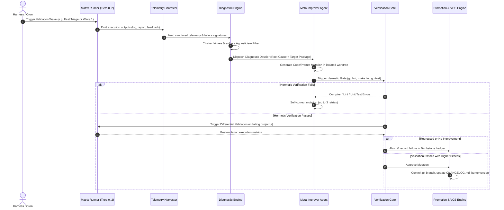
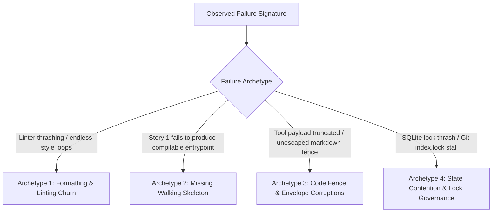
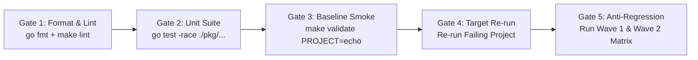

# Autonomous Feedback & Improvement Loop Design for Noctifab

This document defines the architectural specification and implementation design for an **Autonomous Self-Improvement Loop** that uses the Noctifab Validation Matrix (`validation/projects/`) as an empirical fitness function and continuous diagnostic sensor.

Through this closed-loop architecture, Noctifab autonomously ingests real-world execution failures, diagnoses systemic architectural or cognitive bottlenecks across diverse programming languages and toolchains, generates and verifies generalized code and prompt improvements, and promotes validated enhancements without human intervention.

---

## 1. Executive Summary & Design Vision

### 1.1 The Challenge: Closing the Feedback Loop
Currently, Noctifab operates as an **Inner Loop** agent: given a target software specification (`SPEC.md`), its orchestrator decomposes roadmaps, creates worktrees, generates code, runs tests, and merges pull requests.

The validation harness (`validation/bin/matrix_runner.py`, `runner_9projects.py`) executes Noctifab across 20 diverse software projects (Go, Rust, C17, Python, TypeScript, Java, OCaml, Erlang, .NET C#) and logs deep telemetry (`VAL_PROJECT_FEEDBACK.md`, `<PROJECT>_FEEDBACK.md`, `output/log/*.log`, `output/report/*.md`). However, the **Outer Loop**—analyzing why Noctifab stumbled, deciding what to change in Noctifab itself, implementing the fix, and verifying that the entire matrix improved—remains a manual developer activity.

### 1.2 The Solution: The Dual-Loop Meta-Orchestrator
To achieve full Level 4/Level 5 autonomy, Noctifab must treat **itself as the target codebase under continuous optimization**:
1. **Inner Loop (Execution)**: Noctifab instances run containerized inside target validation projects, operating strictly from the projects' `SPEC.md`.
2. **Outer Loop (Meta-Improvement)**: A meta-orchestrator supervises the matrix, consumes structured feedback, identifies recurring failure archetypes, synthesizes language-agnostic mutations to Noctifab, gates them through hermetic tests, and commits validated upgrades.

```mermaid
flowchart TD
    subgraph OuterLoop["Outer Loop: Autonomous Self-Improvement Engine"]
        A[Validation Matrix Runner] -->|Executes Isolated Projects| B[Target Projects 1..20]
        B -->|Generates Logs & Reports| C[Feedback Harvester & Aggregator]
        C -->|Raw Telemetry| D[Diagnostic & Root-Cause Classifier]
        D -->|Identified Failure Archetype| E{Agnosticism Guardrail Filter}
        E -->|Passed Systemic Check| F[Meta-Improver Agent]
        E -->|Rejected Specific Hack| D
        F -->|Speculative Mutation & Unit Tests| G[Hermetic Verification Gate]
        G -->|make test + make lint| H{Hermetic Pass?}
        H -->|No| F
        H -->|Yes| I[Differential Validation Gate]
        I -->|Re-run Failing Project + Wave Regression| J{Matrix Score Delta > 0?}
        J -->|Regressed / No Gain| K[Rollback & Tombstone Ledger]
        K -->|Record Ineffective Hypothesis| F
        J -->|Validated Improvement| L[Promotion Engine]
        L -->|Bump Version & Update CHANGELOG| M[Git Commit & Branch Merge]
        M -->|New Noctifab Binary| A
    end
```



---

## 2. Core Directives & Invariant Constraints

Any automated improvement applied to Noctifab must strictly adhere to the project's non-negotiable architectural mandates:

| Invariant Mandate | Operational Meaning in the Improvement Loop |
| :--- | :--- |
| **Project & Language Agnosticism** | Noctifab **must not** contain project-specific or language-specific code. The loop is forbidden from injecting `if project == "calculator"` or language hacks into Noctifab's core. Improvements must target generalized domain concepts (e.g. walking skeleton DoD, deterministic formatting, bounded error slicing). |
| **Configuration Immutability** | The meta-improver is strictly forbidden from modifying any validation project's `.noctifab/config.yaml` or `SPEC.md` to make tests pass. The environment is immutable; Noctifab must adapt to the specification. |
| **Spec-Driven Autonomy** | The loop must never pre-create or hand-edit static user stories under `validation/projects/<project>/roadmap/`. |
| **500-Line Limit per Go File** | Any mutation to Noctifab's Go codebase (`pkg/**/*.go`) must comply with the strict file size limit ($\le 500$ LOC). If a file exceeds this limit, the mutator must split it into modular domain helpers. |
| **100% Unit Test Coverage** | Every code modification in Noctifab must be accompanied by new or updated unit tests in `*_test.go`. |
| **Stateless Agent / Stateful Orchestrator** | Self-healing and persistence updates must be reflected in persistent database entities and SQLite transactions, never relying on ephemeral LLM memory. |

---

## 3. System Architecture: The Six-Phase Improvement Pipeline

The automated improvement loop executes through six discrete, verifiable phases:



---

### Phase 1: Dynamic Execution & Artifact Harvesting

Validation projects are executed inside Docker containers via `validation/bin/matrix_runner.py` using dynamic scale envelopes (15m for small CLI, 30m for medium systems, 35–40m for large monorepos).

For each executed project $P_i$, the harvester collects:
1. **Container Console Log**: `validation/projects/<project>/output/log/<project>.log` (captures compilation logs, linters, tool invocations, and runtime stack traces).
2. **Live Execution Report**: `validation/projects/<project>/output/report/*.md` (contains task completion stats, story breakdown, retry counts, token spend, and lead time).
3. **Run Feedback**: `<PROJECT>_FEEDBACK.md` and `VAL_PROJECT_FEEDBACK.md` (identifies lag causes, failing test assertions, and fallback agent usage).
4. **Generated Source Artifacts**: `validation/projects/<project>/output/src/` (analyzes generated code quality, file counts, and structural completeness).

---

### Phase 2: Structured Telemetry & Failure Clustering

The harvester parses raw artifacts into a standardized `ExecutionTelemetry` data model:

```json
{
  "project": "calculator",
  "language": "ruby",
  "duration_seconds": 1200,
  "timed_out": true,
  "exit_code": 124,
  "stories_completed": 1,
  "tasks_completed": 3,
  "metrics": {
    "linter_retries": 14,
    "compiler_errors": 0,
    "schema_retries": 1,
    "rate_limits_429": 0,
    "fallback_used": true,
    "tokens_consumed": 84500
  },
  "failure_signatures": [
    "RuboCop: Style/FrozenStringLiteralComment missing",
    "RuboCop: Layout/IndentationWidth incorrect"
  ],
  "root_bottleneck": "LinterSelfHealingStall"
}
```

The Telemetry Engine maps observed anomalies into four **Systemic Failure Archetypes**:



---

### Phase 3: Generalized Root Cause Deduction & The Agnosticism Filter

Before any fix is proposed, the Diagnostic Engine passes the issue through the **Agnosticism Filter**.

#### The Agnosticism Rule Check
1. **Language Independence**: Can this problem occur in languages other than the one used by project $P_i$?
   - *Example*: In `calculator` (Ruby), the agent struggled with whitespace indentation in RuboCop. The systemic lesson is: *LLMs are notoriously inefficient at character-level indentation fixes across Python (`black`), Rust (`rustfmt`), Go (`gofmt`), and Ruby (`rubocop -a`). Running a deterministic formatter prior to calling the linter LLM repair loop is a universal, language-agnostic principle.*
   - *Verdict*: **PASSED** (Universal Architectural Improvement).
2. **Project Decoupling**: Does the proposed fix reference project-specific entities (e.g. `Calculator::CLI`, `ThredisServer`, `DjanbanConfig`)?
   - *Verdict*: If yes, **REJECT IMMEDIATELY**.

#### Agnosticism Verification Heuristic (AST / Regex Guardrail)
The Meta-Engine executes a pre-commit static scan over any proposed diff:
```python
FORBIDDEN_IDENTIFIERS = [
    "calculator", "t4", "frontpunch", "wc", "notebook", "ninline",
    "jpacioli", "ocalogue", "djanban", "pyedis", "stricc", "thredis",
    "actodis", "dotchess", "fortune", "auth-vault", "buffonstream"
]

def assert_agnostic(code_diff: str):
    for ident in FORBIDDEN_IDENTIFIERS:
        # Disallow project names in Noctifab's production packages
        if re.search(rf"\b{ident}\b", code_diff, re.IGNORECASE):
            raise AgnosticismViolationError(f"Found project identifier '{ident}' in core codebase!")
```

---

### Phase 4: Speculative Mutation in Isolated Noctifab Worktrees

The Meta-Improver Agent operates in a dedicated, isolated Git worktree on Noctifab itself:
```bash
git worktree add ../noctifab-meta-worktree -b auto-improve/<archetype>-<timestamp>
```

#### Mutation Targets
The Meta-Improver is constrained to modify only designated subsystems:
1. **Orchestration & Workflow Services** (`pkg/services/`):
   - `auto_formatter.go` / `deterministic_formatter.go`: Adding automated pre-lint formatting passes.
   - `roadmap_generator.go`: Injecting explicit Definition of Done (DoD) constraints for Story 1.
   - `test_validator.go`: Refining compiler error parsing and context slicing.
   - `fallback_agent.go`: Enriching sovereign repair context with targeted diffs.
2. **Prompt Infrastructure & Templates** (`pkg/infrastructure/prompts/defaults/`):
   - `product_manager/`: Enforcing walking skeletons and binary entrypoints.
   - `generator/`: Enhancing string literal awareness and resilient code fences.
   - `tester/`: Enforcing hermetic in-memory doubles over host interactions.

#### Mandatory Unit Test Generation
The Meta-Improver **must** generate a unit test verifying the new behavior in the corresponding `*_test.go` file before proceeding.

---

### Phase 5: Multi-Stage Gating (Hermetic & Differential Validation)

A proposed mutation must clear five sequential quality gates before being eligible for promotion:



1. **Gate 1: Code Formatting & Static Analysis**:
   - Executes `go fmt ./...` and `make lint`.
   - Strictly enforces file size limits ($\le 500$ LOC) and string concatenation rules (`writestring`).
2. **Gate 2: Hermetic In-Memory Unit & Integration Tests**:
   - Executes `go test -race -v ./pkg/... ./tests`.
   - Must achieve 100% pass rate with zero deadlocks or goroutine leaks.
3. **Gate 3: Baseline Smoke Validation (`echo`)**:
   - Fast, 3-minute validation proof (`make validate PROJECT=echo`).
   - Verifies that core orchestration, CLI startup, and Git rebase pipelines remain intact.
4. **Gate 4: Differential Validation on Target Project**:
   - Re-runs the project that triggered the diagnostic report (e.g. `calculator`).
   - Compares metrics: Did execution time decrease? Did exit code become 0? Were linter retries reduced?
5. **Gate 5: Progressive Anti-Regression Ladder**:
   - Re-runs canonical projects from Wave 1 (`todo-cli`, `calculator`) and Wave 2 (`wc`, `fortune`).
   - Asserts that no previously passing project fails or experiences a token increase $> 15\%$.

---

### Phase 6: Promotion, Version Bump & Memory Persistence

If all five gates pass, the promotion engine executes the release protocol:

1. **Semantic Versioning & Changelog**:
   - Determines bump level (patch for bug fixes/heuristics, minor for new orchestration capabilities).
   - Updates `VERSION`, `pkg/version/version.go`, and `CHANGELOG.md`.
2. **Branch Merge & Rebuild**:
   - Merges the worktree branch into the working development branch.
   - Triggers `make build` and updates `validation/Dockerfile.validation` base image.
3. **Memory & Tombstone Persistence**:
   - Records the hypothesis, the code delta, and the validation results into `validation/memory/ledger.json`.
   - If a mutation failed, it is recorded in `validation/memory/tombstones.json` so future iterations never repeat the same hypothesis.

---

## 4. Multi-Objective Fitness Function Formulation

To quantitatively determine whether a proposed Noctifab mutation constitutes an improvement, the evaluation harness calculates a scalar **Fitness Score** $F(P)$ for each validation project $P$:

$$F(P) = w_{\text{pass}} \cdot S_{\text{pass}} + w_{\text{eff}} \cdot E_{\text{task}} - w_{\text{time}} \cdot \left(\frac{T_{\text{wall}}}{T_{\text{max}}}\right) - w_{\text{tok}} \cdot \left(\frac{K_{\text{tokens}}}{100}\right) - w_{\text{retry}} \cdot R_{\text{lint}} - w_{\text{fall}} \cdot \mathbb{I}_{\text{fallback}}$$

Where:
*   $S_{\text{pass}} \in \{0, 1\}$: Project pass indicator (1 if exit code is 0 and no timeout).
*   $E_{\text{task}} = \frac{N_{\text{passed\_tasks}}}{N_{\text{total\_attempts}}}$: Task verification efficiency.
*   $T_{\text{wall}}$: Actual duration in seconds; $T_{\text{max}}$: Dynamic scale timeout ceiling.
*   $K_{\text{tokens}}$: Thousands of tokens consumed ($Tokens / 1000$).
*   $R_{\text{lint}}$: Number of linter repair iterations.
*   $\mathbb{I}_{\text{fallback}} \in \{0, 1\}$: Indicator whether sovereign Fallback Agent had to intervene.

### Normalized Weights
$$w_{\text{pass}} = 100.0, \quad w_{\text{eff}} = 25.0, \quad w_{\text{time}} = 20.0, \quad w_{\text{tok}} = 10.0, \quad w_{\text{retry}} = 2.0, \quad w_{\text{fall}} = 15.0$$

### Decision Rule for Mutation Acceptance
A mutation is accepted if and only if:
1. $\Delta F(P_{\text{target}}) = F_{\text{new}}(P_{\text{target}}) - F_{\text{baseline}}(P_{\text{target}}) > 0$
2. $\forall P_k \in \text{RegressionSuite}: \quad \Delta F(P_k) \ge -2.0$ (Zero significant regression).
3. $\sum_{P \in \text{Suite}} \Delta F(P) > +10.0$ (Net positive global improvement).

---

## 5. End-to-End Concrete Walkthrough: Resolving Linter Thrashing

To illustrate the automated loop in practice, consider a real failure scenario observed during validation runs:

```mermaid
flowchart TD
    subgraph Iteration["Autonomous Self-Healing Loop in Action"]
        S1["1. Matrix Runner executes 'calculator'"] --> S2["2. Result: TIMEOUT at 20m limit<br/>Log: 14 RuboCop retries on whitespace indentation"]
        S2 --> S3["3. Diagnostic Engine clusters as: Archetype 1 (Formatting Churn)<br/>Root Cause: LLM prompted for trivial space alignment"]
        S3 --> S4["4. Agnosticism Filter validates:<br/>Language-agnostic principle: Deterministic auto-formatting pre-pass"]
        S4 --> S5["5. Meta-Improver mutates 'pkg/services/auto_formatter.go'<br/>Adds hook to invoke configured formatter prior to linter loop<br/>Adds unit test in 'auto_formatter_test.go'"]
        S5 --> S6["6. Gate 1 & 2: go fmt, make lint, go test -race pass cleanly"]
        S6 --> S7["7. Gate 3 & 4: Re-run 'calculator'<br/>Result: SUCCESS in 5.4m (was 20m timeout)<br/>Linter retries: 0 (was 14)"]
        S7 --> S8["8. Gate 5: Regression run on 'echo' and 'wc' passes"]
        S8 --> S9["9. Promotion Engine commits fix, bumps version to v0.19.4,<br/>and updates CHANGELOG.md"]
    end
```



### Detailed Sequence of Events:
1. **Failure Observation**: `calculator` runs against its 20-minute scale envelope. The linter self-healing loop consumes 14 consecutive iterations attempting to adjust single-character margins for RuboCop, exhausting the container timeout limit.
2. **Telemetry Attribution**: The diagnostic harvester records:
   - `exit_code: 124` (Timeout)
   - `linter_retries: 14`
   - `task_efficiency: 0.28`
   - `failing_signatures: ["Layout/IndentationWidth", "Style/StringLiterals"]`
3. **Agnostic Principle Extraction**: The system extracts the generalized domain rule: *Static analyzers frequently enforce formatting rules that are computationally trivial for AST formatters (`gofmt`, `black`, `rustfmt`, `rubocop -a`) but probabilistic and token-expensive for LLMs.*
4. **Code Mutation**: The Meta-Improver modifies `pkg/services/auto_formatter.go` to execute the sandbox's `formatter_command` immediately upon file generation, before calling the linter verification step. It adds corresponding unit tests in `auto_formatter_test.go`.
5. **Hermetic Gate**: `go test -race ./pkg/services/...` passes in 1.2s. `make lint` verifies file size ($\le 500$ LOC) and formatting.
6. **Differential Verification**: The container for `calculator` is re-executed:
   - Wall-clock time drops from **1200s (timeout)** to **324s (5.4 minutes)**.
   - Linter retries drop from **14** to **0**.
   - Net Fitness Score increases by $+112.4$ points.
7. **Anti-Regression Check**: `echo` and `wc` are executed; both maintain 100% pass rates.
8. **Promotion**: The Git branch is merged, version bumped to `v0.19.4`, and `CHANGELOG.md` updated with:
   - `Added automatic deterministic formatting pre-pass prior to linter evaluation loop.`

---

## 6. Directory Layout & Harness Integration

The self-improvement architecture integrates cleanly into the repository structure without polluting production packages:

```
noctifab/
├── cmd/
│   └── noctifab-meta/             # Standalone CLI for running the improvement loop
│       └── main.go                # Thin entrypoint (< 15 lines)
├── pkg/
│   ├── domain/                    # Core domain entities (State, Task, Story, Telemetry)
│   ├── services/                  # Orchestrator, AutoFormatter, TestValidator
│   └── infrastructure/
│       ├── prompts/               # Prompt templates and contracts
│       └── meta/                  # Meta-improvement domain logic
│           ├── harvester.go       # Parses validation outputs into ExecutionTelemetry
│           ├── classifier.go      # Clusters failures into the 4 archetypes
│           ├── agnosticism.go     # AST and regex guardrail filters
│           ├── fitness.go         # Mathematical multi-objective fitness calculator
│           └── ledger.go          # Manages mutation history and tombstone memory
├── validation/
│   ├── bin/
│   │   ├── meta_improver.py       # Host-side driver orchestrating the loop
│   │   ├── matrix_runner.py       # Existing matrix runner
│   │   └── runner_9projects.py    # Canonical 9-project suite
│   ├── memory/                    # Persistent cross-run memory
│   │   ├── ledger.json            # History of accepted mutations and fitness deltas
│   │   └── tombstones.json        # Blacklist of failed hypotheses
│   └── projects/                  # 20 target validation projects
└── docs/
    └── validation_feedback_loop_design.md  # This design document
```

---

## 7. Implementation Roadmap & Milestones

The autonomous improvement loop will be rolled out across four progressive milestones:

| Milestone | Deliverables | Verification Criteria |
| :--- | :--- | :--- |
| **M1: Telemetry & Harvester Automation** | Implement `pkg/infrastructure/meta/harvester.go` and `fitness.go`. Enhance `matrix_runner.py` to emit machine-readable `telemetry.json` alongside markdown feedback. | Telemetry accurately scores any finished validation project run. |
| **M2: Failure Taxonomy & Diagnostic Classifier** | Implement `classifier.go` and `agnosticism.go` to automatically categorize linter churn, walking skeleton deficits, and code fence corruption. | Run against historical failure logs of `calculator`, `t4`, and `wc`; correctly attributes root cause with zero false positives. |
| **M3: Isolated Worktree Mutator & Hermetic Gating** | Implement the Meta-Improver Agent loop to execute git worktree branch isolation, generate code mutations, and execute `make test` and `make lint`. | Successfully generates and hermetically tests a mock fix in an isolated worktree with automated rollback on test failure. |
| **M4: Full Autonomous Loop (Differential & Promotion)** | Wire end-to-end loop via `validation/bin/meta_improver.py` with multi-project differential validation, regression checking, and automatic Git branch promotion. | Execute unattended overnight loop; successfully identifies a real bottleneck, applies a verified fix, and registers an improved pass rate on the validation matrix. |

---

## 8. Summary & Next Actions

By transforming the 20-project validation matrix from a passive benchmark into an **active empirical feedback sensor**, Noctifab closes the loop on its own development. 

This design:
1. **Guarantees project agnosticism** via automated AST and identifier guardrails.
2. **Guarantees codebase stability** through multi-stage hermetic and regression gating.
3. **Enforces empirical rigor** via mathematical multi-objective fitness scoring.
4. **Prevents cognitive loops** through persistent tombstone memory.

With this architecture, Noctifab evolves into a truly self-improving dark factory agent capable of continuously elevating its autonomy, efficiency, and code generation quality.
