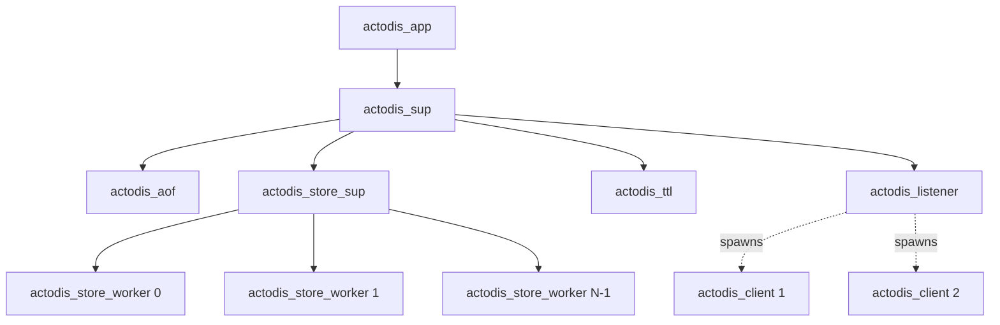

# actodis Specification: Actor-Based Redis RESP Key-Value Store in Erlang/OTP 27

## 1. Overview

`actodis` is an in-memory key-value store with a **native Redis wire-protocol (RESP2/RESP3) API exposed over TCP** (default port `6379`), written in idiomatic **Erlang/OTP 27** using the actor model and OTP design principles (`gen_server`, `supervisor`, `application`). It mirrors core Redis command semantics (`PING`, `ECHO`, `QUIT`, `SET`, `GET`, `DEL`, `EXISTS`, `INCR`, `DECR`, `EXPIRE`, `TTL`, `KEYS`, `FLUSHALL`) with deterministic RESP reply/error envelopes, and persists state to an append-only file (AOF) using absolute expiration timestamps so data and TTLs survive process restarts and `SIGKILL`. Standard Redis client utilities (`redis-cli`, `redis-py`, `StackExchange.Redis`) MUST be fully compatible with `actodis`.

The project exercises the actor model and functional concurrency seam:
- **Actor-based concurrency:** Zero global locks. Each TCP client connection is an isolated Erlang process (`actodis_client`). The keyspace is partitioned across supervised `actodis_store_worker` `gen_server` actors.
- **OTP Supervision Tree:** Robust error recovery where client or parser failures crash only that worker process and leave the rest of the node unaffected.
- **Binary Pattern Matching:** High-performance zero-copy RESP stream parsing using Erlang's native binary syntax (`<<"+", ...>>`, `<<"$", ...>>`).
- **Deterministic Time Injection:** Injected clock function (`clock_fun`) for deterministic TTL and time travel testing.
- **Absolute Timestamp Durability:** AOF engine tracking absolute unix timestamps for surviving restarts.

---

## 2. Pinned Directory Layout

```
actodis/
├── rebar.config              # Rebar3 configuration (pinned Erlang compiler options & profiles)
├── Makefile                  # install/run/test/lint/format targets (REQUIRED)
├── README.md                 # Usage, command API, persistence format, architecture
├── .gitignore                # Ignore _build/, data/, *.beam, .rebar3/
├── src/
│   ├── actodis.app.src       # OTP Application resource specification
│   ├── actodis_app.erl       # Application behavior callback (start/stop)
│   ├── actodis_sup.erl       # Root supervisor tree
│   ├── actodis_listener.erl  # gen_tcp non-blocking socket listener and connection acceptor
│   ├── actodis_client.erl    # gen_server per active TCP socket connection
│   ├── actodis_resp.erl      # Binary pattern-matching RESP2/3 encoder & streaming decoder
│   ├── actodis_commands.erl  # Command dispatcher, arity & syntax validation, error envelopes
│   ├── actodis_store.erl     # Store facade, shard router (erlang:phash2) & transaction coordinator
│   ├── actodis_store_worker.erl # gen_server shard actor managing in-memory key/value/TTL state
│   ├── actodis_ttl.erl       # Background expiration timer actor for active eviction sweeps
│   └── actodis_aof.erl       # Append-Only File (AOF) logger actor with absolute expire_at replay
├── test/
│   ├── actodis_resp_tests.erl      # EUnit tests for RESP framing, chunking, and pipelining
│   ├── actodis_store_tests.erl     # EUnit tests for store workers with mock injected clock
│   ├── actodis_commands_tests.erl  # EUnit tests for command parsing, arity, NX/XX flags
│   ├── actodis_aof_tests.erl       # EUnit tests for AOF round-trip, replay, and recovery
│   └── actodis_integration_tests.erl # Live TCP socket tests via gen_tcp client assertions
└── data/                     # Runtime AOF storage directory (created on start)
```

---

## 3. Toolchain, Invocation, Exit Codes, and Configuration

### 3.1 Runtime / Dev Toolchain (pinned)
- **Runtime:** Erlang/OTP 27 runtime system (`erts`), standard OTP libraries (`kernel`, `stdlib`).
- **Build & Test Tool:** `rebar3` (version $\ge 3.23$).
- **Compiler Flags (`rebar.config`):**
  ```erlang
  {erl_opts, [debug_info, warnings_as_errors]}.
  {eunit_opts, [verbose]}.
  ```

### 3.2 Makefile Targets (all REQUIRED)
- `make build` → `rebar3 compile`
- `make run` → `rebar3 shell --apps actodis` (or `erl -pa _build/default/lib/actodis/ebin -s actodis_app`)
- `make test` → `rebar3 eunit` (executes all unit and integration test suites; zero failures allowed)
- `make lint` → `rebar3 dialyzer` (or `rebar3 compile` with `warnings_as_errors` enforced)
- `make clean` → `rebar3 clean && rm -rf _build/`

### 3.3 Configuration (environment variables, pinned)
- `PORT` (default `6379`) — TCP listen port.
- `ACTODIS_DATA_DIR` (default `./data`) — directory holding `dump.aof`.
- `ACTODIS_SHARDS` (default `8`) — number of partitioned store worker actors.
- `ACTODIS_AOF_FSYNC` (`true` default) — call `file:sync/1` on the AOF file after every mutation.

### 3.4 Exit Codes and Logging
- Clean shutdown → graceful socket close, flush AOF buffer, exit code `0`.
- Fatal startup error (e.g. port bind collision, unwritable data directory) → print `actodis: <reason>` to stderr, exit code `1`.
- All operational diagnostic logs on stdout/stderr MUST use the prefix `actodis: `.

---

## 4. RESP Wire Protocol & Framing Engine

`actodis` communicates exclusively via standard REdis Serialization Protocol (RESP2/RESP3) over TCP.

### 4.1 RESP Frame Types & Envelopes

| Frame Type | Byte Prefix | Wire Format | Example |
| :--- | :---: | :--- | :--- |
| **Simple String** | `+` | `+<string>\r\n` | `+OK\r\n`, `+PONG\r\n` |
| **Error** | `-` | `-<TYPE> <message>\r\n` | `-ERR syntax error\r\n`, `-ERR unknown command 'FOO'\r\n` |
| **Integer** | `:` | `:<signed_number>\r\n` | `:1\r\n`, `:0\r\n`, `:-1\r\n`, `:-2\r\n` |
| **Bulk String** | `$` | `$<length>\r\n<data>\r\n` | `$5\r\nhello\r\n`, `$0\r\n\r\n` |
| **Null Bulk String** | `$` | `$-1\r\n` | `$-1\r\n` (key absent / nil reply in RESP2) |
| **Array** | `*` | `*<count>\r\n<element_1>...` | `*2\r\n$3\r\nfoo\r\n$3\r\nbar\r\n` |
| **Empty Array** | `*` | `*0\r\n` | `*0\r\n` (no matching keys) |
| **Null Array** | `*` | `*-1\r\n` | `*-1\r\n` (nil array) |

### 4.2 Erlang Binary Pattern Matching & Stream Parsing
1. **TCP Stream Buffering:** In Erlang, `gen_tcp` sockets with `{active, once}` or `{active, true}` deliver byte chunks as binary messages `{tcp, Socket, Binary}`. `actodis_resp` accumulates residual bytes into a state binary buffer and uses recursive binary pattern matching:
   ```erlang
   decode(<<"+", Rest/binary>>) -> parse_simple_string(Rest);
   decode(<<"$", Rest/binary>>) -> parse_bulk_string(Rest);
   decode(<<"*", Rest/binary>>) -> parse_array(Rest);
   ...
   ```
2. **Pipelining Support:** If a binary contains multiple concatenated commands, `actodis_resp:decode_all/1` extracts all frames into a list of parsed commands, which are executed in strict FIFO order, with replies buffered and transmitted in the same sequence.
3. **Inline Commands:** Plain text commands (e.g. `PING\r\n` or `SET k v\r\n`) not starting with `*` or `$` are split on whitespace and handled transparently.
4. **Binary Safety:** All Bulk Strings are handled as raw Erlang binaries (`binary()`), preserving arbitrary bytes, UTF-8, and null characters (`<<0>>`).
5. **Case-Insensitivity:** Command names are normalized to lowercase or uppercase binaries (`string:uppercase/1`) prior to routing.

---

## 5. Supported Commands & Parity Semantics

| Command | Signature & Description | Success RESP Reply | Error RESP Reply |
| :--- | :--- | :--- | :--- |
| `PING` | `PING [message]`<br>Tests connection liveness. | With 0 args: `+PONG\r\n`<br>With 1 arg: `$<len>\r\n<message>\r\n` | `>1` args: `-ERR wrong number of arguments for 'ping' command\r\n` |
| `ECHO` | `ECHO message`<br>Echoes the given message. | `$<len>\r\n<message>\r\n` | `!=1` arg: `-ERR wrong number of arguments for 'echo' command\r\n` |
| `QUIT` | `QUIT`<br>Asks server to close connection. | `+OK\r\n` (closes socket after reply) | `!=0` args: `-ERR wrong number of arguments for 'quit' command\r\n` |
| `SET` | `SET key value [EX s] [PX ms] [NX\|XX]`<br>Sets string value with optional expiration and existence guards. | `+OK\r\n` (if set)<br>`$-1\r\n` (if condition `NX`/`XX` not met) | `<2` args: `-ERR wrong number of arguments for 'set' command\r\n`<br>Both `NX` & `XX`: `-ERR syntax error\r\n`<br>Invalid TTL: `-ERR value is not an integer or out of range\r\n` |
| `GET` | `GET key`<br>Gets string value of a key. | `$<len>\r\n<val>\r\n`<br>`$-1\r\n` (if missing or expired) | `!=1` arg: `-ERR wrong number of arguments for 'get' command\r\n` |
| `DEL` | `DEL key [key ...]`<br>Removes specified key(s). | `:<count>\r\n` (count of keys removed) | `<1` arg: `-ERR wrong number of arguments for 'del' command\r\n` |
| `EXISTS` | `EXISTS key [key ...]`<br>Returns count of existing keys. | `:<count>\r\n` (duplicates counted per Redis 3.0+) | `<1` arg: `-ERR wrong number of arguments for 'exists' command\r\n` |
| `INCR` | `INCR key`<br>Increments integer value by 1. | `:<new_int>\r\n` | `!=1` arg: `-ERR wrong number of arguments for 'incr' command\r\n`<br>Non-integer: `-ERR value is not an integer or out of range\r\n` |
| `DECR` | `DECR key`<br>Decrements integer value by 1. | `:<new_int>\r\n` | `!=1` arg: `-ERR wrong number of arguments for 'decr' command\r\n`<br>Non-integer: `-ERR value is not an integer or out of range\r\n` |
| `EXPIRE` | `EXPIRE key seconds`<br>Sets timeout on key in seconds. | `:1\r\n` (timeout set)<br>`:0\r\n` (key missing or expired) | `!=2` args: `-ERR wrong number of arguments for 'expire' command\r\n`<br>Non-integer: `-ERR value is not an integer or out of range\r\n` |
| `TTL` | `TTL key`<br>Returns remaining TTL in seconds. | `:-2\r\n` (missing or expired)<br>`:-1\r\n` (no expiry)<br>`:<seconds>\r\n` (remaining TTL) | `!=1` arg: `-ERR wrong number of arguments for 'ttl' command\r\n` |
| `KEYS` | `KEYS pattern`<br>Returns keys matching glob pattern (`*`, `?`). | `*<count>\r\n$<len>\r\n<key1>...` (`*0\r\n` if none) | `!=1` arg: `-ERR wrong number of arguments for 'keys' command\r\n` |
| `FLUSHALL` | `FLUSHALL`<br>Purges all keys and truncates AOF. | `+OK\r\n` | None |
| *Unknown* | Any unrecognized command `<NAME>` | None | `-ERR unknown command '<NAME>'\r\n` |

---

## 6. Actor Concurrency & Store Partitioning

1. **Partitioned Store Actors (`actodis_store_worker`):**
   * The keyspace is divided into $N$ shards (default `8`, configurable).
   * For a given key `Key` (`binary()`), the owning worker is resolved by:
     ```erlang
     ShardId = erlang:phash2(Key, NumShards)
     ```
   * All mutations and reads for that key are routed to `ShardId`'s `gen_server` actor via `gen_server:call/2`.
   * Since each shard actor handles messages sequentially from its mailbox, per-key operations are completely thread-safe with zero mutexes or spinlocks.
2. **Dual Expiration Strategy:**
   * **Lazy Eviction:** When a key is requested, `actodis_store_worker` compares current time with the key's absolute expiration timestamp. If expired, the key is pruned and `nil` / `0` is returned.
   * **Active Sweep:** An `actodis_ttl` actor periodically triggers active sweeps across all shard actors to reclaim expired memory.
3. **Deterministic Clock Dependency Injection:**
   * Shard workers accept an injected `ClockFun` (`fun() -> integer() end`, default `erlang:system_time(second)`).
   * Unit tests can inject deterministic mock clocks to freeze or step through time deterministically.

---

## 7. Append-Only File (AOF) Durability Engine

1. **AOF Writer Actor (`actodis_aof`):**
   * Dedicated `gen_server` holding the open file descriptor to `dump.aof`.
   * State mutations (`SET`, `DEL`, `INCR`, `DECR`, `EXPIRE`, `FLUSHALL`) send a message to `actodis_aof`.
   * Expired keys are logged with their **absolute epoch expiration timestamp** (`EXPIREAT key <timestamp>`), guaranteeing that remaining TTL is preserved accurately across node restarts.
   * When `ACTODIS_AOF_FSYNC` is `true`, `file:sync/1` is called before confirming write.
2. **Crash Recovery / Startup Replay:**
   * During application startup (`actodis_app:start/2`), `actodis_aof:replay/1` reads `dump.aof` sequentially before opening the TCP listener socket.
   * Expired keys encountered during replay (where `expire_at <= CurrentTime`) are discarded immediately.
   * If the last line of the AOF is truncated (due to unexpected process termination or `SIGKILL`), the replayer safely discards the partial line and logs `actodis: recovered truncated AOF`.

---

## 8. Supervision Tree Architecture



- If an `actodis_client` crashes on invalid input or network disconnect, only that client process terminates; all other clients and the store remain active.
- If a shard worker crashes, the supervisor restarts it according to OTP restart strategies (`one_for_one`).

---

## 9. Comprehensive Test Strategy & Verification Specifications

All verification test suites must be executable via `make test` (`rebar3 eunit`).

### 9.1 RESP Framing & Protocol Suite (`test/actodis_resp_tests.erl`)
- **Encoding:** Verifies byte-level wire formatting for all RESP types: Simple Strings (`+OK\r\n`), Errors (`-ERR ...\r\n`), Integers (`:100\r\n`), Bulk Strings (`$5\r\nhello\r\n`), Null Bulk (`$-1\r\n`), Arrays (`*2\r\n...`), and Null Arrays (`*-1\r\n`).
- **Binary Safety:** Encodes and decodes binary payloads with embedded `\r\n`, null bytes (`<<0>>`), and non-ASCII UTF-8 sequences.
- **Chunked Stream Reassembly:** Simulates fragmented TCP packets. Feeds byte slices into the decoder one byte at a time and asserts the complete frame is returned only after the final `\n` arrives.
- **Command Pipelining:** Concatenates multiple RESP commands (`*1\r\n$4\r\nPING\r\n*2\r\n$4\r\nECHO\r\n$2\r\nhi\r\n`) into a single binary; asserts `actodis_resp:decode_all/1` returns all frames in FIFO order.
- **Inline Parsing:** Verifies plain text commands (`PING\r\n`, `PING hello\r\n`, `SET k v\r\n`) decode correctly.

### 9.2 In-Memory Store & Expiration Suite (`test/actodis_store_tests.erl`)
- **Deterministic Mock Clock:** Tests initialize `actodis_store_worker` with an injected mock clock function (`fun() -> get(mock_time) end`).
- **Basic CRUD:** Sets, gets, deletes, and checks existence of string keys.
- **TTL Expiration Life Cycle:**
  - Sets key with 5-second TTL at $T_0$.
  - Advances mock clock to $T_0 + 3s$; asserts `TTL` returns `2`.
  - Advances mock clock to $T_0 + 5.1s$; asserts `GET` returns `nil` and `TTL` returns `-2` (lazy eviction).
- **TTL Overwrite:** Setting an existing expiring key with a plain `SET` clears expiration; `TTL` returns `-1`.
- **Active Sweep before `KEYS`:** Expired keys are purged and not returned by `KEYS *`.

### 9.3 Command Semantics & Dispatch Suite (`test/actodis_commands_tests.erl`)
- **Arity Errors:** Verifies exact error string `-ERR wrong number of arguments for '<cmd>' command\r\n` when commands are invoked with too few or too many arguments (`PING`, `GET`, `SET`, `DEL`, `EXISTS`, `INCR`, `DECR`, `EXPIRE`, `TTL`, `KEYS`, `QUIT`).
- **Case-Insensitivity:** Verifies `set`, `SET`, `Set`, `sEt` execute identically.
- **`SET` Flag Permutations:**
  - `SET k v NX`: returns `+OK\r\n` on first call; returns `$-1\r\n` on second call.
  - `SET k v XX`: returns `$-1\r\n` when key is absent; returns `+OK\r\n` after key is created.
  - `SET k v NX XX`: returns `-ERR syntax error\r\n`.
  - `SET k v EX 10`: sets expiration to 10 seconds.
  - `SET k v EX 0` / `SET k v EX -5`: returns `-ERR value is not an integer or out of range\r\n`.
- **`INCR`/`DECR` Operations:**
  - Missing key initialized to `0` and incremented to `1` / decremented to `-1`.
  - String representing an integer `"100"` incremented to `101`.
  - Non-integer string `"hello"` returns `-ERR value is not an integer or out of range\r\n`.
  - Preserves existing TTL on the key after increment.
- **`EXISTS` Multi-Key Count:** `EXISTS k1 k2 k3` returns integer count of existing keys. Supplying the same existing key twice (`EXISTS k1 k1`) returns `:2\r\n`.
- **`DEL` Multi-Key Count:** `DEL k1 k2 missing_k` returns count of deleted keys (`:2\r\n`).
- **`KEYS` Glob Patterns:** Tests glob matching against `h*llo`, `h?llo`, `h[ae]llo`, `*`, and `test\*key`.
- **Unknown Command:** `FOOBAR` returns `-ERR unknown command 'FOOBAR'\r\n`.

### 9.4 AOF Persistence & Recovery Suite (`test/actodis_aof_tests.erl`)
- **Mutation Logging:** Verifies every mutation writes a valid line with command, key, and absolute `expire_at`.
- **Replay Accuracy:** Appends records to a temporary AOF file, re-initializes store from the file, and asserts full state equality.
- **Time-Travel Resilience:** Writes a key expiring at $T_0 + 10s$. Sets clock to $T_0 + 20s$ and replays AOF into fresh store; asserts the key is expired and absent.
- **Truncated Last Line Recovery:** Simulates crash by writing a partial line at the end of `dump.aof`. Replay successfully restores all valid preceding entries.
- **`FLUSHALL` Truncation:** Asserts `FLUSHALL` truncates `dump.aof` to zero bytes on disk.

### 9.5 Socket & Protocol Integration Suite (`test/actodis_integration_tests.erl`)
- Runs a live `actodis` TCP server on `127.0.0.1` with an ephemeral port.
- **Raw Socket Verification:** Tests raw TCP socket connections sending inline strings and multi-bulk arrays.
- **Client Interop (via `redis-cli` or Erlang Redis client):**
  - Executes full command suite (`ping`, `set`, `get`, `del`, `exists`, `incr`, `decr`, `expire`, `ttl`, `keys`, `flushall`).
  - Executes command pipelines; asserts replies return in strict matching sequence.
- **Concurrent Client Load:** 50 concurrent Erlang worker processes hammering `INCR counter` simultaneously. Asserts final value is exactly `50` with zero lost updates.
- **Server Restart Durability:** Writes data, terminates server, restarts new server on same data directory, asserts data persists.

### 9.6 Black-Box E2E Conformance Suite (`tests/e2e/run_tests.sh`)
- Executed inside the `e2e` container against `${REDIS_URL}` using official `redis-cli`:
  1. `redis-cli ping` → `PONG`
  2. `redis-cli ping "hello world"` → `"hello world"`
  3. `redis-cli set k1 v1` → `OK`, `redis-cli get k1` → `v1`
  4. `redis-cli set k2 v2 NX` → `OK`, `redis-cli set k2 v2 NX` → `(nil)`
  5. `redis-cli set k3 v3 EX 1` → `OK`, `sleep 2`, `redis-cli get k3` → `(nil)`, `redis-cli ttl k3` → `-2`
  6. `redis-cli exists k1 k2 missing` → `2`
  7. `redis-cli incr counter` → `1`, `redis-cli incr counter` → `2`, `redis-cli decr counter` → `1`
  8. `redis-cli keys "*"` → list of keys
  9. `redis-cli del k1 k2 counter` → `3`
  10. `redis-cli flushall` → `OK`
- Exits code `0` only if all assertions pass.

### 9.7 Differential Conformance Oracle
The integration test suite and E2E script MUST yield the exact same test outputs and return code `0` whether executed against `actodis` or standard `redis:7-alpine`.

---

## 10. E2E Black-Box Harness (docker-compose)

`docker-compose.yml` MUST define two services, runnable from the host with `make e2e`:

```yaml
services:
  api:
    build: .
    command: ["rebar3", "shell", "--apps", "actodis"]
    environment:
      ACTODIS_DATA_DIR: "/data"
      PORT: "6379"
      ACTODIS_AOF_FSYNC: "true"
    volumes:
      - data:/data
    ports:
      - "6379:6379"
  e2e:
    build: ./tests/e2e
    depends_on:
      - api
    environment:
      REDIS_URL: "redis://api:6379"
volumes:
  data:
```

- `tests/e2e/Dockerfile`: `FROM alpine:3.21`, installs `redis` (`redis-cli` tool), bash, copies `run_tests.sh`, `CMD ["/tests/run_tests.sh"]`.
- `tests/e2e/run_tests.sh`: Black-box `redis-cli` assertions against `${REDIS_URL}`. Exits nonzero on the first failure.

---

## 11. Documentation Requirements (README & Architecture Guide)

1. **`README.md`**: Must exist at root level documenting: installation, running the server, the full command API table, RESP wire format envelopes, AOF format, `make test`/`lint`/`e2e`, and `redis-cli` usage examples.
2. **`docs/` Folder**: Must contain markdown documentation covering OTP Supervision Architecture, Sharding Mechanics, RESP Protocol Engine, and AOF Persistence.

---

## 12. Definition of Done (DoD)

To consider `actodis` fully implemented, the project must satisfy:
1. **Public RESP API & CLI Compatibility:** Native Redis RESP2/RESP3 wire-protocol TCP server operating on port 6379, passing all command assertions via official `redis-cli`.
2. **Persistence & Durability Invariant:** AOF persistence engine logs mutations with absolute `expire_at` timestamps, tolerates corrupt trailing lines, and successfully restores state on restart.
3. **Compiler Invariant:** Clean compilation with zero compiler warnings under `warnings_as_errors`.
4. **Verification Criteria:** 100% test pass rate on `make test` (`rebar3 eunit`) and `make e2e`.
